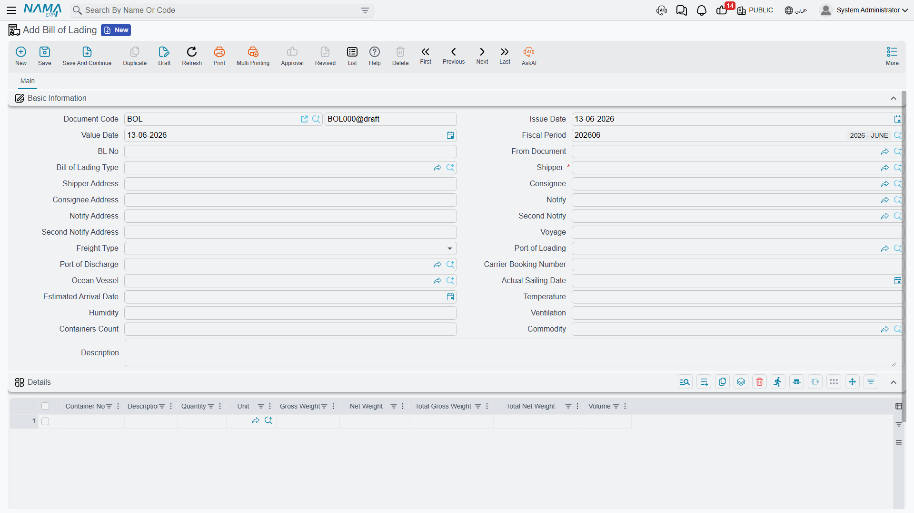

# Bills of Lading

The bill of lading is the official shipping document that proves the carrier's receipt of the goods and the terms of their carriage and delivery. In Nama ERP it's usually created from the [operation order](./operation-orders.md) with the **Create Bill of Lading** button, inheriting its data — and it can also be created directly from **Freight Management System → Documents → Bill of Lading**.

## Bill header

The bill header carries the data printed on the shipping document:

- **Bill of Lading Number** and its type (Master / House…).
- **Shipper** — a required field — plus the **Consignee** and the two **Notify** parties, each with the address printed on the bill.
- **Freight Type** — prepaid or collect.
- **Ocean Vessel and Voyage**, plus the carrier booking number.
- **Loading and discharge ports**, the **estimated arrival date**, and the **actual sailing date**.
- Reefer-container data: **temperature, humidity, and ventilation**, and the **container count**.
- **Commodity** and attachments.

## Bill lines

In the bill's details you list the shipped goods line by line:

- **Container number** and **quantity**.
- **Description and remarks** as printed on the document.
- **Net and gross weight** per line, plus total net and gross weight.
- **CBM volume**.
- Per-line attachments when needed.

::: info The bill is a shipping document, not a financial one
The bill of lading creates no accounting effect by itself — the shipment's financial effect comes from the [sales and purchase invoices](./freight-invoicing.md). The bill's role is to document the shipment for carriage and to print the official document for the customer and carrier.
:::

## Relationship to the operation order and invoices

At invoicing time, the sales invoice links the invoiced bills of lading, so bill numbers and container numbers are gathered automatically into the invoice — making it easy for the customer to reconcile the invoice against shipments. This ties the three together: **operation order** (planning and services) → **bill of lading** (shipping documentation) → **invoice** (financial collection).
