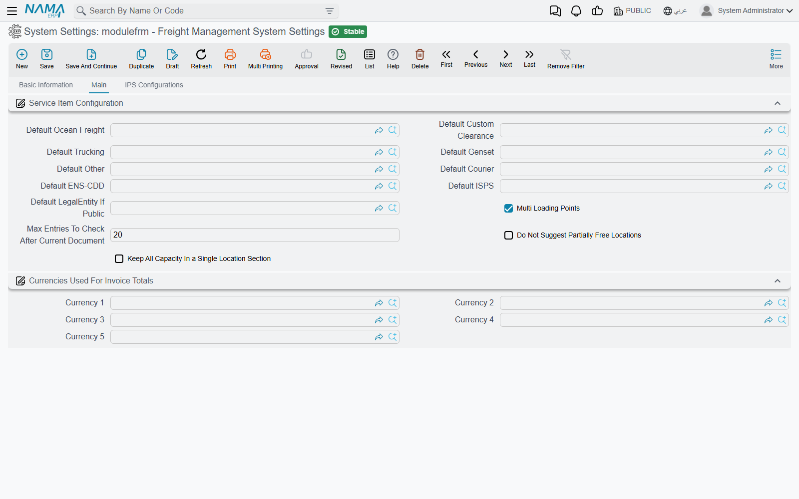
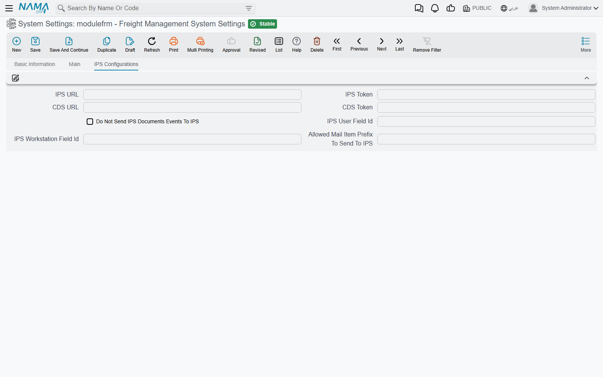

# Freight Configuration

The freight module keeps a short list of module-wide settings in one screen: which service item to
fall back on when a price-list line carries none, how storage locations are suggested and checked,
which currencies the freight invoices total separately, and how the postal half talks to the
external IPS server. They are set once per database and apply to every legal entity.

Open **Freight Management System → Settings → Freight Management System Settings**. The screen has
two tabs: **Main** and **IPS Configurations**.

## Main tab

### Service Item Configuration

**Default Ocean Freight**, **Default Custom Clearance**, **Default Trucking**, **Default Genset**,
**Default Other** and **Default Courier** name one [service item](./freight-master-files.md) for
each service section of the [operation order](./operation-orders.md).

A service line on the operation order needs a service item — it is what the line is invoiced and
costed under. Price lists do not always carry one, so when the **Update Data** and **Update All
Services** buttons pull a line in without a service item, the line takes the default of its
section. Saving the operation order does the same for any ocean-freight, custom-clearance,
trucking, genset or courier line that is still empty.

**Default ENS-CDD** and **Default ISPS** serve a different purpose. An ocean-freight line on the
operation order can carry two extra charges, **ENS-CDD** and **ISPS**. When an operation order's
lines are brought into a freight sales or purchase invoice, each of these amounts becomes a
separate invoice line under the service item named here — so the customer sees, for example, the
security surcharge as its own line rather than folded into the freight.

::: tip Set the ENS-CDD and ISPS defaults before you use the charges
If an ocean-freight line carries an ENS-CDD or ISPS amount and the matching default is empty, the
extra invoice line is created without a service item.
:::

**Default LegalEntity If Public** is read by the **Sales Price List** when it is marked
**All-In**. The All-In rate needs a legal entity to work in; when the price list sits on the public
legal entity, this one is used instead. Without it the list is refused — see
[Price Lists & Markups](./freight-pricing.md#Messages-you-may-see).

**Multi Loading Points** (ticked by default) decides how trucking and genset prices are looked up:

- **Ticked** — the operation order works with its **Loading Points** grid, and the **Update Data**
  buttons of the Trucking and Genset tabs price each loading point.
- **Not ticked** — the operation order header shows three extra fields, **Gate In Port**, **Gate
  Out Port** and **Loading Point**, and the same buttons look prices up by those three. All three
  must be filled, or the button stops with `gateInPort,gateOutPort,loadingPoint is required`.

The last three settings drive the storage side of the module — locations, and the documents that
move operation orders and mail items in and out of them. They are explained in context on
[Storage Locations](./freight-storage-locations.md):

| Setting | What it does |
|---|---|
| **Max Entries To Check After Current Document** (default 20) | When a storage document is saved on a date that has later movements in the same location, the system replays that many of the later movements to make sure the location never goes over capacity. Empty or zero means 1,000. |
| **Do Not Suggest Partially Free Locations** | **Distribute Operation Order** on the operation-order receipt only proposes locations that are completely free, skipping those already partly used. |
| **Keep All Capacity In a Single Location Section** | **Distribute Operation Order** must place the whole capacity inside one location section; it tries the sections one by one and refuses if none is big enough. |

### Currencies Used For Invoice Totals

**Currency 1** to **Currency 5**. A freight invoice often mixes currencies — ocean freight in US
dollars, clearance in local currency. For each currency named here, the freight sales and
purchase invoices, their returns and the sales order show a **Total Of Currency 1** … **Total Of
Currency 5** field: the net value of the lines priced in that currency. Next to them, **Total Of
Invoice In Local Currency** converts every line at its own rate.

Leave a slot empty and its total stays empty.

## IPS Configurations tab

This tab connects the postal half of the module (IPS) to the external IPS server:

- **IPS URL** and **IPS Token** — the address of the IPS service and the token sent with every
  call.
- **Do Not Send IPS Documents Events To IPS** — switches off all event sending.
- **IPS User Field Id** and **IPS Workstation Field Id** — fields on the user record whose values
  are sent as the user and workstation of each event.
- **Allowed Mail Item Prefix To Send To IPS** — a comma-separated list of prefixes; only mail items
  starting with one of them are reported.

What each of these does, and how to follow up events that fail, is on
[IPS Integration](./ips-integration.md).

