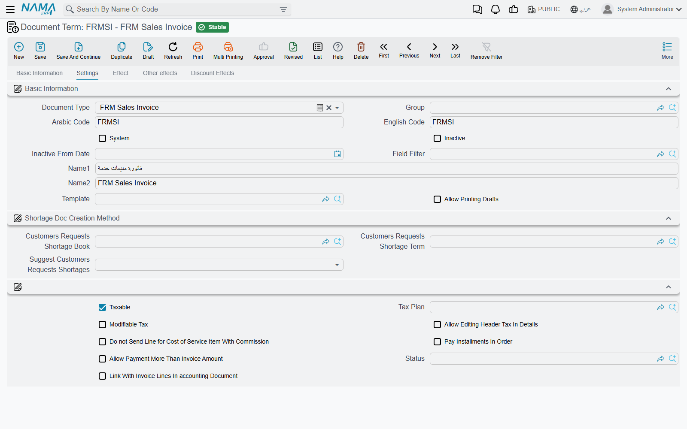
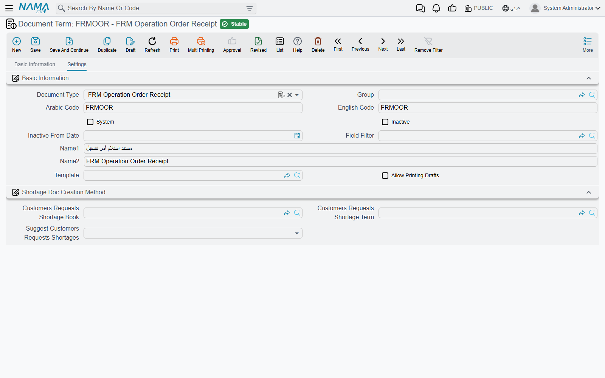
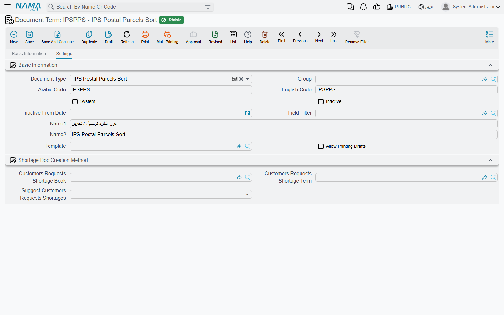

# Freight Document Terms

Every freight and postal document is saved under a **document term**, and the term is where the
document's behaviour is decided: which accounts it books to, which status it stamps on the
operation order, which postal event it reports, whether it fills or empties a storage location.
Two users can type the same invoice and get different results because they picked different terms.

Terms are opened from **Basic → Settings → Document Term**; pick the freight document type and the
term-specific settings appear on the term's own tabs. The freight module has eight term shapes,
shared by twenty document types. The **Bill of Lading** and the **Edit Purchase Price List**
have no freight settings on their terms.

::: warning A term with empty accounting sides books nothing
A freight invoice, return, operation order or delivery document whose term has no debit and credit
sides is still saved normally, and its business request is still processed — but it produces no
journal lines. Terms created by the setup wizard for the freight module are often in that state. If
a freight invoice shows no accounting effect, open its term before anything else.
:::

## The invoice terms

**Sales Invoice**, **Sales Return** and **Sales Order** share one term shape; **Purchase Invoice**
and **Purchase Return** share a second; the **Operation Order** has a third. On screen the three
look alike — the same tabs in the same order — and differ in a handful of fields.

### Settings tab

After the usual book-and-term information, the tax group:

| Option | Field | What it does |
|---|---|---|
| **Taxable** | `termConfig.taxable` | Ticked by default. Copied to the document header; untick it for a term that never carries tax. |
| **Tax Plan** | `termConfig.taxPlan` | The header tax plan of documents on this term. |
| **Modifiable Tax** | `termConfig.modifiableTax` | Lets the user override the computed tax on the document. |
| **Allow Editing Header Tax In Details** | `termConfig.allowEditingHdrTaxInDetails` | Lets a line carry a different tax from the header. Off by default. |
| **Pay Installments In Order** | `termConfig.payInstallmentsInOrder` | The document's instalments must be paid in their sequence, earliest first. |
| **Allow Payment More Than Invoice Amount** | `termConfig.allowPaymentMoreThanInvoiceAmount` | Accepts payment lines that add up to more than the document total. |

Three more options matter to the sales family — Sales Invoice, Sales Return and Sales Order. The first is shown on every invoice term but only the sales family uses it; the other two appear on the sales terms only:

- **Do not Send Line for Cost of Service Item With Commission**
  `termConfig.doNotSendLineForCostOfItemsWithCommission` — the agent-model switch for e-invoicing.
  With it ticked, only the commission part of a service that has a commission item is sent to the
  tax authority. See [E-Invoicing](./freight-einvoicing.md).
- **Status** `termConfig.status` — an **FRM Operation Order Status**. When a document on this term
  is saved, it records this status against its operation order, and the operation order shows the
  most recent status recorded for it. A term for final invoices can carry "Invoiced", so the
  operation-order list tells you at a glance which shipments are billed.
- **Link With Invoice Lines In accounting Document** `termConfig.linkWithInvoiceLinesInAccountingDocument`
  — the invoice is linked line by line in the invoices grid of the receipt and payment vouchers
  that settle it.

### Effect tab

**Is Sales Not Purchase** `termConfig.isSalesNotPurchase` appears on every invoice term but only
the **Purchase Invoice** reads it. A purchase invoice on such a term is processed the way a sales
invoice is: the debit side becomes the party's side and the credit side the company's, and it is
settled by receipt vouchers instead of payment vouchers. Use it for the rare purchase document that
is really an amount you collect.

Below it, the **Debit** and **Credit** groups — the main accounting sides of the document — and
**Shorten Ledger** under the credit side.

### Other effects and Discount Effects tabs

**Cash**, **Tax 1** to **Tax 4**, **Discount 1** to **Discount 8**, **Invoice Discount** and the
**External Effects** grid work exactly as they do on the supply-chain invoice terms. How an account
side is built, what the tax "other side" is and how discounts are booked is explained once, on
[Accounting Effects Configuration](/modules/supplychain/document-terms/doc-term-accounting-effects).

### The operation order term

The **Operation Order** term carries the same tabs, without the sales-only fields. Note what it
means: the operation order is processed through the same accounting engine as an outgoing invoice,
using the sides on its own term. If you want the money to be booked by the invoices only — which
is the normal freight cycle — leave the operation-order term's debit and credit sides empty;
otherwise the same revenue is booked once by the order and again by its sales invoice.

## The operation-order processing terms

**FRM Operation Order Receipt**, **FRM Operation Order Transfer** and **FRM Operation Order
Delivery** — the three documents that move a shipment in and out of
[storage locations](./freight-storage-locations.md) — share a term with one setting on its
**Settings** tab:

**Status** `termConfig.status`. Each document saved on the term records this status against the
operation order it handles (a transfer records it against every operation order on its lines). So
a receipt term can say "In Warehouse" and a delivery term "Delivered", and the operation order's
status follows the shipment through the yard without anybody typing it.

## The postal delivery terms

**Delivery Request** and **Delivery Invoice** share one term. Its **Effect** tab begins with the
usual invoice options — **Expand Payment Method Effect** `termConfig.expandPaymentMethodEffect`
(payment-method fee entries are not shortened), **Taxable**, **Modifiable Tax**, **Tax Plan**,
**Allow Editing Header Tax In Details**, **Pay Installments In Order**, **Allow Payment More Than
Invoice Amount** and **Link With Invoice Lines In accounting Document** — then **Debit** and
**Credit**.

The **Delivery Request** term adds a group that turns the request into an invoice by itself:

| Option | Field | What it does |
|---|---|---|
| **Auto Generate Delivery Invoice** | `termConfig.autoGenDeliveryInvoice` | When a delivery document reports the outcome of the request's items, the system creates — or updates — a Delivery Invoice from the request. |
| **Generated Invoice Book** / **Generated Invoice Term** | `termConfig.generatedInvoiceBook`, `termConfig.generatedInvoiceTerm` | The book and term the generated invoice is saved under. |
| **Delivery Invoice Payment Method** | `termConfig.deliveryInvoicePaymentMethod` | The payment method of the single payment line put on the generated invoice, carrying the amount the delivery document collected. |

The **Serivce Fees** group (the label is misspelt on screen) handles the fees a payment method
charges: **Service Fees 1 Deduction** to **Service Fees 4 Deduction** treat a fee as a deduction
rather than an added charge, the **Service Fees N Debit / Credit** sides book it, and **Do Not Add
Service Fees Effect Without Account Side** skips a fee whose sides are empty instead of booking it
to the main sides. The **Other effects** and **Discount Effects** tabs are the same as on the
invoice terms.

The whole delivery cycle is on [Delivery Service](./ips-delivery.md).

## The postal movement terms

The remaining ten postal documents have small terms, and most of what they do is reported to the
external IPS server.

**Event** `termConfig.event` is required on all of them. It names an **IPS Event** — a master file
under **Freight Management System → Master Files** whose **code** is the postal event code the
IPS server expects. When a document on the term is saved, every mail item (or receptacle) on it is
queued to be reported to IPS with that event. The Arabic screen shows this field's label as
"event". How the reporting works, and how to resend, is on [IPS Integration](./ips-integration.md).

::: tip Receptacle events need a numeric code
The **Receptacles Receipt** and **Transfer Receptacles** report the receptacle's event using the
event's code as a number, so the IPS Events used on their terms must have purely numeric codes.
:::

What else each term carries:

| Documents | Settings on the term |
|---|---|
| **Receptacles Receipt**, **Transfer Receptacles** | **Event** only. |
| **Manifest for Custody**, **Mail Retention Document** | **Event** only. |
| **Mail Item Manifest**, **Mail Item Transfer**, **Mail Item Stock Taking**, **Mail Item Adjustment** | **Event** and **Component Effect Type**. |
| **IPS Postal Parcels Sort** | **Event**, **Component Effect Type**, **Delivery Request Book** and **Delivery Request Term**, and a **Details** grid. |

**Component Effect Type** `termConfig.effectType` decides what the document does to the
[storage locations](./freight-storage-locations.md) named on its lines:

- **In** — each mail item occupies one unit of its line's location. An empty field behaves as In.
- **Out** — each mail item frees one unit.
- **None** — the document does not touch storage at all.

So a manifest term set to In shelves the arriving items, a transfer term set to Out takes them off
the shelf, and a stock-taking term set to None only counts.

**Delivery Request Book** and **Delivery Request Term** on the **Postal Parcels Sort** term make
the sort create delivery requests by itself. When the sort is saved, its lines whose **Receiver
Response** is still **Initial** are grouped by the receiver's mobile number, and one Delivery
Request is created for each number, under this book and term. Fill at least one of the two to
switch it on. The pricing of those requests is described on [Delivery Service](./ips-delivery.md).

