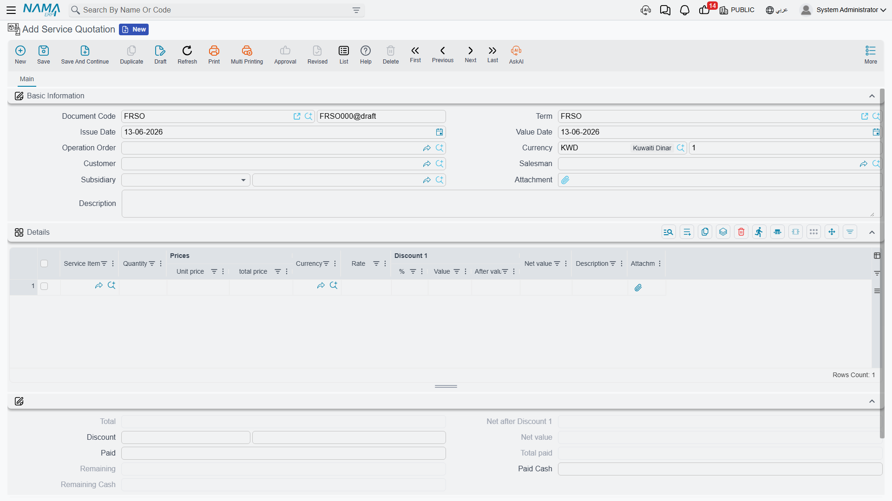
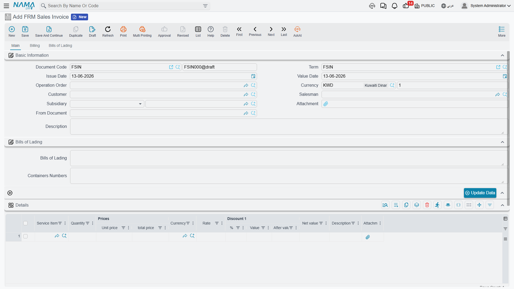
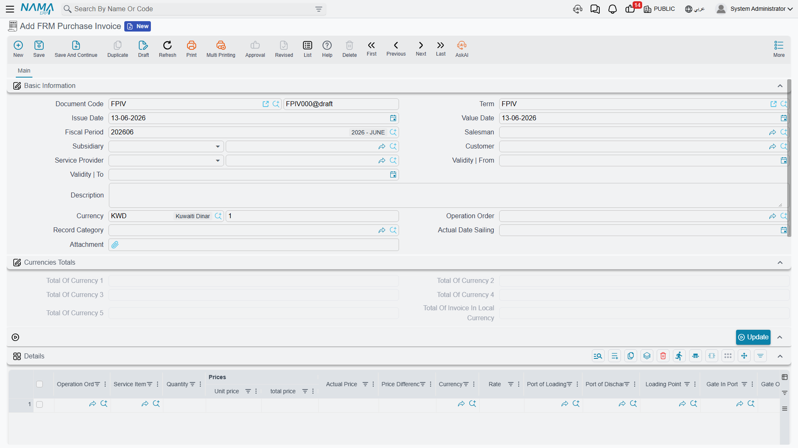

# Invoices & Returns

This is where operational work turns into financial effect: you sell services to the customer, buy them from suppliers, and track the difference between the two. Every document in this section is found under **Freight Management System → Documents**, and all are usually linked to an [operation order](./operation-orders.md).

## The sales cycle

### Sales Order

The optional starting point: you offer the customer the services and their prices before executing the shipment. The sales order carries the same structure as the invoice (customer, sales man, operation order, service lines with prices and taxes) but creates no financial effect — it's a promise of service, later converted into an invoice.

### Sales Invoice

The invoice is the document that records the sale in accounting and bills the customer for the service value. It consists of:

- **Customer, sales man, and operation order**, plus the service provider.
- **Service lines (Details)** — each line with its service item, quantity, price, currency, and tax, plus the **Cost** and **Diff** computed automatically.
- **Invoiced Bills of Lading** — links bills to the invoice, so bill and container numbers are gathered into the invoice header.
- **E-Invoice Details** — a consolidated version of the lines sent to the tax authority (see [E-Invoicing](./freight-einvoicing.md)).
- **Payment Lines / External Payments** — to record cash collection or collection via payment methods.

::: info Linking cost to sale automatically
When the sales invoice is posted, the system looks for the matching purchase lines in the same operation order and links them to the sale lines, computing each service's cost and marking the purchase lines as "used" in this invoice. This way you know your net profit on each service, and cost is never counted twice.
:::

### Sales Return

To reverse a sales invoice fully or partially (a service that wasn't performed, or an invoicing correction), recording the reverse effect on the customer and revenue accounts.

## The purchase cycle

### Purchase Invoice

Records what you buy from suppliers (shipping line, clearance agent, transport company…). It's usually created from the [operation order](./operation-orders.md) with the **Create Purchase Invoice** button, inheriting the purchased service lines. Its lines are the source of the **cost** that is later matched against the sale lines.

### Purchase Return

To reverse a purchase invoice fully or partially when cancelling a service you bought from a supplier or correcting its value.

## Term Config and accounting effect

The document's **Term Config** controls how each invoice is posted to accounting: revenue/cost accounts, tax accounts (Tax / Tax 2 / addition and discount taxes), the various discount accounts, and cash. The sales invoice term config also carries two freight-specific settings:

- **Status** — the operation-order status that is recorded automatically when the invoice is posted, so you track which shipment has been invoiced.
- **Do not send a cost line for commission items** — an option for the agent model in [E-Invoicing](./freight-einvoicing.md).

::: warning Repeated items not allowed
The system won't accept the same service item with the same currency and same quantity twice in one invoice, to keep cost matching accurate. If you need two identical lines, merge them into one line with a combined quantity.
:::
