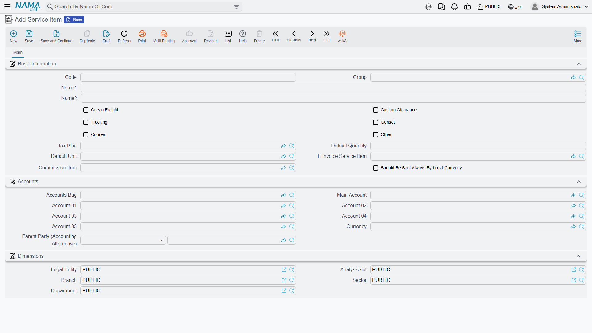
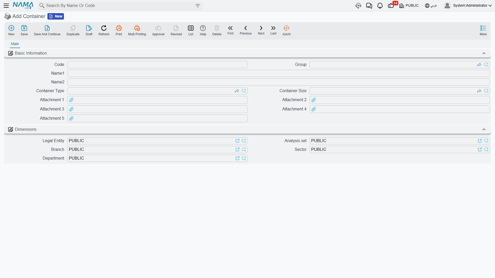
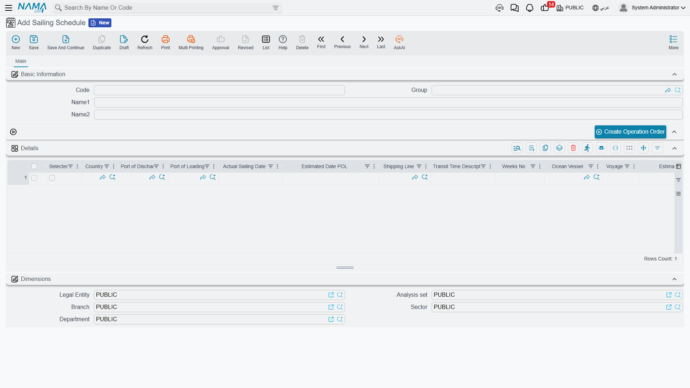

# Freight Master Files

Before you create your first operation order, you need to define the building blocks every shipment is made of: which services you offer, in which containers, on which vessels, and to and from which ports. You'll find all of these master files under **Freight Management System → Master Files**, defined once and then reused across every document.

## Service Items

Service items are the "items" of the freight module — but they're services, not goods. Each one represents a service you sell or buy: ocean freight, customs clearance, trucking, a refrigeration genset, courier, or another service.

When you define a service item you set its nature through a set of flags:

- **Ocean Freight / Custom Clearance / Trucking / Genset / Courier / Other** — classify the item under the right service type, so it appears in the correct section inside the operation order and price lists.
- **Tax Plan** — how tax is calculated on this service.
- **Subsidiary Accounts** — the revenue/cost accounts the item posts to.
- **Default quantity and unit** — to speed up line entry.

::: info Fields related to e-invoicing
A service item carries three fields for e-invoicing: a **Tax Authority Code** to classify the service for the authority, an **E-Invoice Item** to send a substitute/consolidated item instead of the operational one, and a **Commission Item** to separate commission from cost in the agent model. Details are in the [E-Invoicing](./freight-einvoicing.md) page.
:::

## Containers, Types, and Sizes

A **Container** is defined by its type and size:

- **Container Type** — dry, reefer, open-top, tank, etc.
- **Container Size** — 20ft, 40ft, 40ft High Cube (HC), etc.

The container is later selected on the operation order, bill of lading, and service lines, and is used as one of the keys when matching sales lines to purchase lines for cost calculation.

## Vessels, Ports, and Sailing Schedules

- **Ocean Vessel** — a simple file with a code and name for each ship you deal with.
- **Shipping Port** — loading, discharge, and final-destination ports, used on the operation order, bill of lading, and service lines.
- **Sailing Schedule** — a reference table whose lines gather the available sailings: country, loading and discharge ports, shipping line, vessel and voyage, estimated sailing and arrival dates, and transit time in weeks. It helps the sales team pick the fastest, most suitable sailing for the customer.

## Commodities, Countries, and Locations

- **Commodity** — a description of the shipped goods (electronics, chilled foods, dangerous goods…); used on the operation order, bill of lading, and as one of the pricing keys.
- **Country** — origin and destination countries, appearing on sailing schedules and mail items.
- **Locations** (with sections, classes, and types) — spatial organization used mainly in the postal system to record where items are stored.

## Bill of Lading Types and Units of Measure

- **Bill of Lading Type** — classifies bills of lading (Master B/L, House B/L, etc.).
- **FRM UOM** — freight-specific units of measure (weight, volume/CBM, count…) used in line quantities.

::: tip Start small
You don't need to define everything up front. Start with the service items you actually sell and the container types you handle, and add vessels, ports, and commodities gradually as they appear in your shipments.
:::
