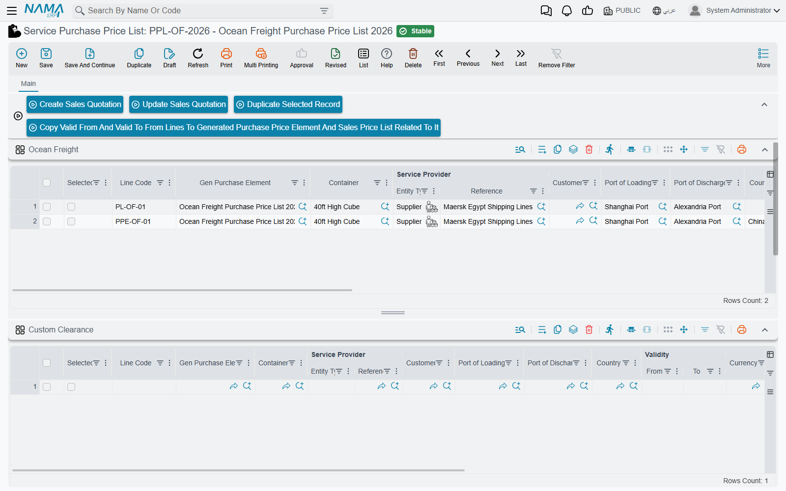
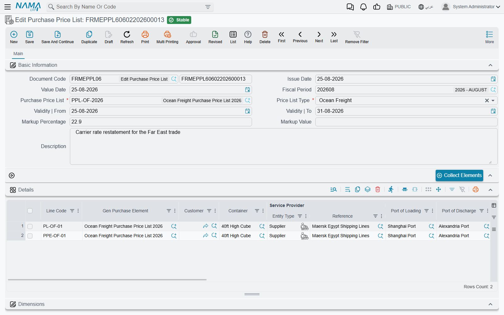

# From Supplier Rates to Customer Quotations

[Price Lists & Markups](./freight-pricing.md) explains what the two price lists hold. This page
follows the work that connects them: a shipping line sends new rates, you load them, you turn the
ones you want into a quotation for a customer, and months later you change the rates without
retyping every list.

## The elements behind every list

Each line you save on a **Service Purchase Price List** becomes a record of its own, a **Purchase
Price Lists Element**, under **Freight Management System → Master Files**. The same happens on the
sales side: each line of a **Service Sales Price List** becomes a **Sales Price Lists Element**. The
list is where you type; the elements are what the rest of the module searches. When an operation
order's **Update Data** button looks for a price, it is looking through elements.

The link is kept in both directions. A purchase line shows the element it created in its **Gen
Purchase Element** column, and a sales line remembers the purchase element it was priced from. Edit
or delete a line and its element is updated or removed with it — so change rates on the list, not
on the element, which the list overwrites the next time it is saved.

## Loading supplier rates

Create the **Service Purchase Price List** for the supplier — its **Price List Type** decides which
tab you fill — and enter the lines. Three buttons on the main tab help with a long rate sheet:

- **Duplicate Selected Record** — copies every line whose **Selected** box is ticked, right below
  itself, without its line code, attachment or element. Handy when twenty routes differ only by the
  port of discharge.
- **Copy Valid From And Valid To From Lines To Generated Purchase Price Element And Sales Price List
  Related To It** — the list must be saved first. When you extend a rate's validity on the lines,
  this pushes each line's **Validity | From** and **Validity | To** into its purchase element and
  into every sales element priced from that element — so quotations already given follow the new
  dates.
- **Create Sales Quotation** and **Update Sales Quotation** — described next.

## Turning rates into a quotation

Tick **Selected** on the purchase lines you want to offer, then:

- **Create Sales Quotation** opens a new **Service Sales Price List** in a pop-up, carrying the
  purchase list's currency and validity dates, with the selected lines copied into the tab that
  matches the purchase list's type.
- **Update Sales Quotation** asks for an existing sales price list and adds the selected lines to
  it.

Each copied line keeps its cost, and its selling price is the cost plus the sales list's markup for
that tab: the markup's fixed value when one is set, otherwise its percentage. Review the pop-up,
choose the customer, and save.

The same two buttons exist on the **Purchase Price Lists Element** list view, in the **More** menu,
for when you would rather pick rates from across several suppliers: select the element rows, then
**Create Sales Quotation** builds one new sales price list from all of them — each element on the tab
of its own type, with its prices as they are — and **Update Sales
Quotation** adds the selected ocean-freight, clearance, trucking and genset elements to an existing
list.

## Re-pricing a quotation

On the **Service Sales Price List**, each service tab has an **Update Prices** button. For every
line it goes back to the purchase element — the one the line was priced from, or, for a line typed
by hand, the first element matching its currency, validity dates, and the route fields of that tab
— and refreshes the line from it: service provider, validity, currency and rate, quantity, the
ENS-CDD and ISPS amounts, and the price with the tab's markup.

A line typed by hand needs **Validity | From**, **Validity | To** and a currency for the search; if
one is missing the button reports which.

## Changing rates in bulk: Edit Purchase Price List

When a supplier revises part of a rate sheet, **Freight Management System → Documents → Edit
Purchase Price List** saves you from opening the list. It needs no document term.

1. Pick the **Purchase Price List**. Its **Price List Type** is filled in.
2. Press **Collect Elements**. Every element of that list is loaded into the grid with its line code
   and current terms.
3. Change what changed. Add lines for new routes.
4. Optionally fill **Validity | From** and **Validity | To** in the header — they then replace the
   validity of every line.
5. Save.

On saving, the document writes back into the purchase price list: each line updates the list line
that created its element, and each new line becomes a new list line (and so a new element).

## Messages you may see

These messages have no Arabic text and show in English on Arabic screens too.

| Message | Why | What to do |
|---|---|---|
| `No Price List Selected To Update` | **Update Sales Quotation** was confirmed without choosing a sales price list. | Run it again and pick the list. |
| `ValidFrom is Required`, `ValidTo is Required`, `Currency is Required` | **Update Prices** met a hand-typed sales line without the field it needs to find a purchase element. | Fill the line's validity dates and currency. |
| *Details must be filled* | An **Edit Purchase Price List** is being saved with an empty grid. | Press **Collect Elements** or add lines. |
| *duplicate Line Code {0}* | Two lines of an **Edit Purchase Price List** carry the same line code. | Remove the duplicate line. |
