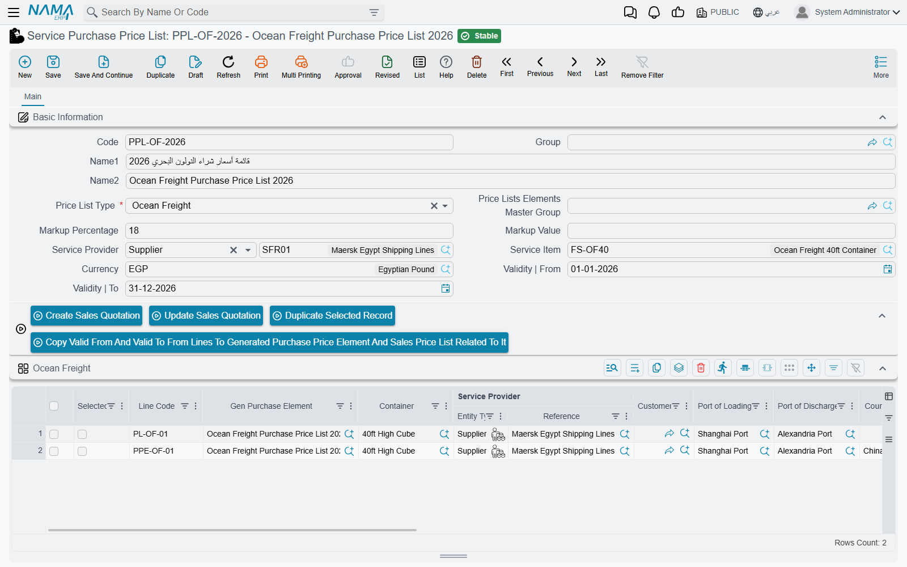
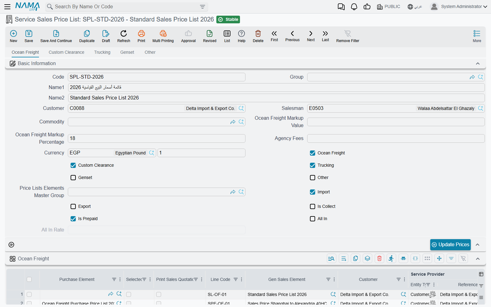

# Price Lists & Markups

A freight company profits from the difference between what it pays suppliers for a service and what it sells it to the customer for. Price lists in the freight module make that difference managed and calculated automatically, instead of pricing each shipment by hand.

You'll find the lists under **Freight Management System → Master Files**.

## Purchase Price List

Records what you buy services from suppliers for. Each list has:

- **Service Provider** — the supplier (shipping line, clearance agent…).
- **Service Item** and price list type.
- **Validity period (Valid From / Valid To)**, currency, and exchange rate.
- A default **Markup** for the list.
- Lines per service type: **ocean freight, customs clearance, trucking, genset, courier, other** — each with its price and conditions.

## Sales Price List

Records what you sell services to the customer for. It stands out in that it builds the selling price on top of the purchase price plus a profit margin for each service type separately:

- **Customer and Sales Man**, commodity, and the import/export and collect/prepaid flags.
- **A markup per service** — *ocean freight markup, clearance markup, trucking markup, genset markup, other markups* — each carrying both a **percentage** and a **fixed value**.
- **All-In** — an option for a single combined rate (All-In Rate) instead of detailing each service, with **Agency Fees**.
- Textual **Conditions** per service type, to print on the customer's quotation.

::: tip How the markup is calculated
The profit markup (FRM Mark) is flexible: it can be a **percentage** over the purchase price, a **fixed value** added to it, or both together. That's how you price one service at "cost + 10%", another at "cost + $50", and a third combining both.
:::

## From the list to the operation order

The lists aren't a static reference — they're the actual pricing source. Inside the [operation order](./operation-orders.md), the **Update All Services** button pulls prices from the matching lists (by customer, commodity, ports, container, and service type), filling in the purchase cost and selling price in every service line at once.

The **Edit Purchase Price List** document also lets you update purchase prices in bulk without opening each list individually.

## Linking sale to cost

When [invoicing sales](./freight-invoicing.md), the system matches each sale line to its corresponding purchase line in the same operation order (same service item, currency, quantity, ports, container, and commodity), computing the **actual cost** and the **difference (profit)** for each line — so you know your profit at the level of a single service, not just the shipment.

## Messages you may see

All five belong to the **Sales Price List**.

| Message | Why | What to do |
|---|---|---|
| *You Must Select at least One Of Service Item Types* — «يجب اختيار خدمة واحدة على الاقل من الخدمات الأربعة التالية(شحن بحري ـ نقل ـ تخليص ـ مولدات)» | None of the four service flags — ocean freight, custom clearance, trucking, genset — is ticked, so the list would price nothing. | Tick the service types this list covers. |
| *You Must Select at least one Of types: IsCollect, IsPrepaid, IsAllIn* — «يجب إختيار على الأقل نوع من الأنواع الاتيه: IsCollect, IsPrepaid, IsAllIn» | None of Collect, Prepaid or All-In is ticked, so there is no charging basis to match a shipment against. | Tick the one that applies. |
| *You must use only one of those options [All In Rate, Prepaid and Collect]* — «يجب إختيار واحد فقط من [All In Rate, Prepaid and Collect]» | More than one of those three is ticked; they are mutually exclusive. | Leave one ticked and make a separate list for the other basis. |
| *You can not calculate All In Rate in public LegalEntity, add default LegalEntity in configuration* — «لا يمكن حساب All In Rate على الشركة العام، قم بإضافة إفتراضى الشركة فى الإعدادات» | The list is marked All-In but no legal entity can be resolved for it — the record sits on the public legal entity and no default is configured. | Set the legal entity on the list's dimensions, or configure a default legal entity, before using All-In. |
| *Header customer {0} does not match line customer {1}* — «العميل برأس السجل {0} لا يطابق العميل على السطر {1}» | The list header names a customer and one of the service lines names a different one. | Clear the customer on the line so it inherits the header, correct it, or move the line to that customer's own list. |
