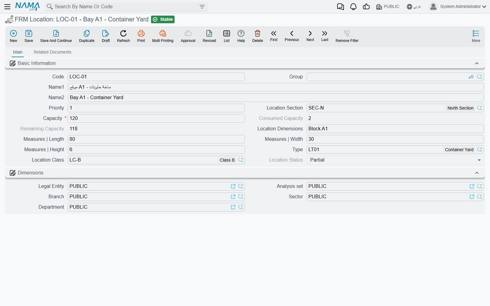
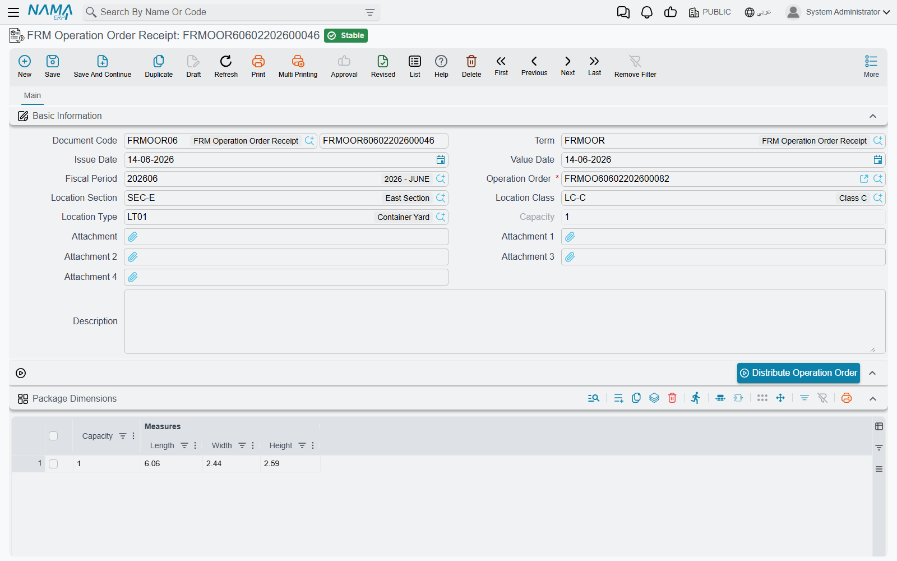
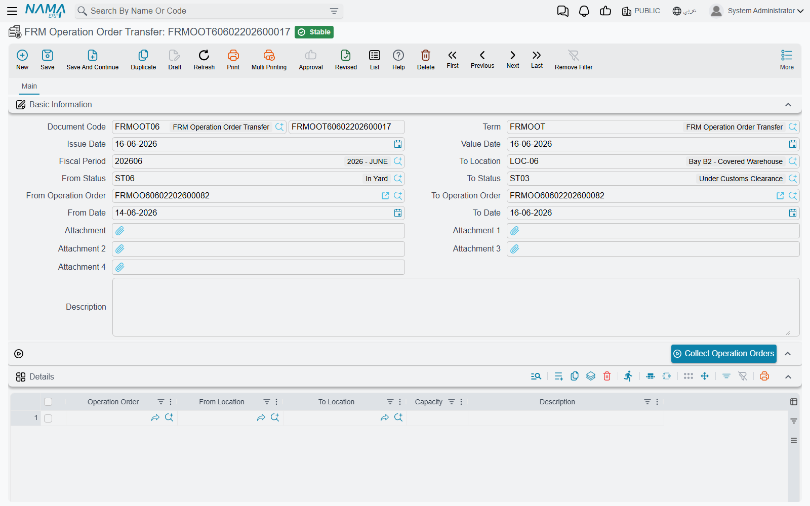

# Storage Locations

Some freight companies do more than book space on a ship: they hold the cargo themselves — in a
yard, a bonded warehouse or a cold store — between the day it arrives and the day it leaves. The
freight module tracks that with **locations** that have a capacity, and three documents that move
an operation order's cargo into a location, between locations and out again. The same locations
also hold postal mail items, for the postal half of the module.

Nothing here touches accounting. Storage is a record of where things are and how full each place
is.

## Setting up locations

All the files are under **Freight Management System → Master Files**.

**FRM Location** is a place that can hold cargo. Its fields:

- **Capacity** — required, and must be more than zero. It is a plain number in whatever unit you
  count in: pallets, square metres, container slots. Operation orders and mail items consume it.
- **Consumed Capacity**, **Remaining Capacity** and **Location Status** — kept by the system after
  every movement. The status is **Free** while nothing is stored, **Full** when the remaining
  capacity reaches zero, and **Partial** in between.
- **Length**, **Width** and **Height** — the physical size of the place. When cargo is described by
  its dimensions, only locations at least that long, wide and high are proposed for it.
- **Location Dimensions** — a free-text description of the size, for people.
- **Priority** — the order in which locations are proposed: the lowest number first.
- **Location Section**, **Type** and **Location Class** — three ways of grouping locations. Each
  points to a simple code-and-name file (**FRM Location Section**, **FRM Location Type**, **FRM
  Location Class**). A receipt can be restricted to one section, type or class.

The location's **Related documents** tab shows two lists: **FRM Storage System Entries** — every
movement in and out of the place — and **FRM Storage System Entries Current Shipment**, the mail
items that are in it right now.

::: tip Number the priorities by walking distance
Distribution fills the lowest-priority locations first. Give the places nearest the gate the lowest
numbers and the system will fill the yard from the front.
:::

## How much space does an operation order need?

The [operation order](./operation-orders.md) carries its size in the **Package Dimensions** group:
a single **Capacity** figure, and a grid of dimension lines — each with a **Capacity** and a
**Length**, **Width** and **Height**. When there are dimension lines, their capacities added
together are the order's capacity; the header figure is used only when the grid is empty.

## Receiving: FRM Operation Order Receipt

Open **Freight Management System → Master Files → FRM Operation Order Receipt** and pick the
**Operation Order**. Its dimension lines are copied into the receipt's **Package Dimensions** grid,
where you can correct them to what actually arrived. Optionally narrow the search with a **Location
Section**, **Location Class** or **Location Type**.

Then press **Distribute Operation Order**. The system builds the **Details** grid — one line per
location, with the capacity placed there:

1. It lists the locations that are not marked **Prevent Usage** and not **Full**, inside the
   section, class and type you chose, lowest **Priority** first.
2. If the receipt has no dimension lines, it pours the operation order's capacity into those
   locations one after another, filling each one's remaining capacity before moving on.
3. If it has dimension lines, each line is placed separately, and only in locations big enough for
   its length, width and height.

Two module settings change the search — see [Freight Configuration](./freight-configuration.md):
**Do Not Suggest Partially Free Locations** proposes only completely free places, and **Keep All
Capacity In a Single Location Section** insists the whole order fits inside one section, trying the
sections one by one.

You can edit the proposed lines before saving; when you pick a location by hand, the search hides
full locations and, for an order with dimension lines, locations too small for it.

When the receipt is saved, the locations fill, the operation order's dimension lines are replaced
by the receipt's, and — if the receipt's term carries a **Status** — the operation order takes that
status (see [Freight Document Terms](./freight-document-terms.md)).

::: warning One receipt per operation order
An operation order can be received only once, and the receipt must place exactly the order's
capacity — no more, no less. The rules and their messages are listed on
[Operation Orders](./operation-orders.md#Messages-you-may-see).
:::

## Moving: FRM Operation Order Transfer

**FRM Operation Order Transfer** moves stored cargo from one location to another — to consolidate a
half-empty row, or to move a shipment to the loading area.

Fill the selection fields in the header, choose the **To Location**, and press **Collect Operation
Orders**:

- **From Date** / **To Date** — operation orders whose value date falls in the range.
- **From Status** / **To Status** — operation orders whose status falls in the range.
- **From Operation Order** / **To Operation Order** — a range of operation-order codes.

For every matching operation order, and every location where it still has cargo, the system adds a
line moving that cargo from its current location to the **To Location**. Adjust the lines as you
need — split a capacity, change a destination — and save. The search for a destination never
offers a full location or the line's own source.

## Releasing: FRM Operation Order Delivery

**FRM Operation Order Delivery** is the gate-out. Pick the **Operation Order** and the **Details**
grid fills by itself with every location where the order's cargo currently sits and the capacity
it occupies there. Saving empties those locations and sets the operation order's status from the
delivery term.

## Mail items share the locations

The postal documents use the same locations, one unit per mail item. Whether a postal document puts
items into their lines' locations, takes them out or leaves storage alone is set by **Component
Effect Type** on its term — see [Freight Document Terms](./freight-document-terms.md#The-postal-movement-terms).

On the **Mail Item Stock Taking** document, the **Collect Mail Items From Location** button fills
the grid with every mail item currently stored in any location, each with the location it sits in,
ready to be counted.

## Back-dated movements

Every storage document is checked on save: on its own date, each location it touches must have room
for what it brings. A document dated in the past is checked further — the movements that follow it
in the same location are replayed to make sure none of them now overflows. The module setting **Max
Entries To Check After Current Document** (20 by default, 1,000 when empty) decides how many of those
later movements are replayed. A document moved to a later date is checked against ten times that
number, never fewer than 1,000.

## Messages you may see

| Message | Why | What to do |
|---|---|---|
| *No location was found with current criteria* — «لا يوجد موقع بالمعايير الحالية» | **Distribute Operation Order** found no location that is free enough and matches the section, class and type on the receipt. | Clear or change the section, class or type, or free some space. |
| *There are no enough locations in a single section to distribute the operation order capacity* — «لا يوجد مواقع كافية فى قسم واحد لتوزيع أمر التشغيل» | **Keep All Capacity In a Single Location Section** is on, and no section has enough free capacity on its own. | Free space in one section, or switch the setting off for this receipt's period. |
| *There are no enough locations for the following dimensions : length {0}, width {1}, height {2}, capacity {3}* — «لا يوجد سعة كافية بالأبعاد الآتية : الطول {0} , العرض {1} , الأرتفاع {2} , السعة {3}» | The locations big enough for that dimension line do not have that much room left. | Free a large enough location, or correct the dimension line. |
| *There are no enough locations in the section {0} for the following dimensions : length {1}, width {2}, height {3}, capacity {4}* — «لا يوجد سعة كافية فى سكشن {0} بالأبعاد الآتية : الطول {1} , العرض {2} , الأرتفاع {3} , السعة {4}» | The same, when the order must stay inside one section. The message names the last section tried. | As above, within one section. |
| *The remaining capacity {0} of the location {1} is less than the capacity needed {2}* — «السعى المتبقية {0} للموقع {1} أقل من السعة المطلوبة {2}» | On the document's date the location does not have room for what the document puts there. | Use another location, reduce the line, or move cargo out first. |
| *Consumed capacity by document {0} on date {1} is {2}, which is more than location {3} capacity* — «السعة المستهلكة بواسطة المستند {0} بتاريخ {1} تساوى {2} و هو اكبر من سعة الموقع {3}» | The document fits on its own date, but a later movement it names would then overflow the location. Typical of back-dated documents. | Date the document after that movement, or change the later document. |
| *Consumed capacity of operation order {0} conflict with document {1} entries on date {2}* — «السعة المستهلكة لأمر التشغيل {0} تتعارض مع إدخالات المستند {1} بتاريخ {2}» | Over time the operation order would hold more than its capacity, or less than nothing — for example a delivery dated before the receipt. | Check the dates and capacities of the order's receipt, transfers and delivery. |
| *Consumed capacity {0} must be less than or equal to location capacity {1}* | A location's **Capacity** was lowered below what is already stored in it. This message has no Arabic text and shows in English on Arabic screens too. | Move cargo out first, or keep the capacity. |
| *Capacity {0} must be more than zero* — «يجب ان تكون السعة أكبر من الصفر» | A location is being saved with an empty, zero or negative **Capacity**. | Enter a positive capacity. |
