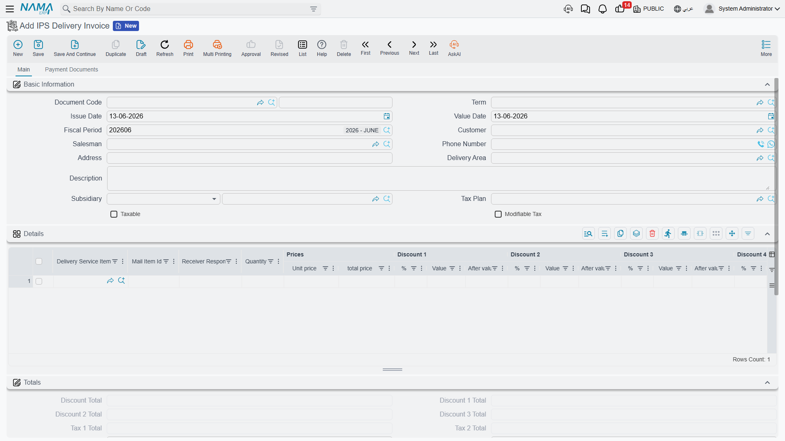

# Delivery Service

The final stage in a mail item's journey: delivering it to the customer and collecting the service value and any customs fees. The two documents of this stage — the **Delivery Request** and the **Delivery Invoice** — combine the operational side (who receives, where, and when) with the financial side (how much is collected), and both are sent electronically to the tax authority.

You'll find them under **Freight Management System → Documents**.

## Delivery Request

Delivery starts with a request that specifies the customer, the delivery address, and the delivery date:

- **Customer and Sales Man**.
- **Address and shipment address**, **phone number**, and **Delivery Area**.
- **Delivery date and due date**.
- **Service lines (Details)** — the requested delivery service items with their prices.
- **Payment Lines / External Payments** to record collection on delivery (cash on delivery).

## Delivery Invoice

The invoice records the value of the delivery service in accounting and bills it to the customer. It carries the same structure as the request (customer, address, delivery area, service lines, payments), but it creates the financial effect and is sent to the tax authority as an e-invoice. See [E-Invoicing Handling](./freight-einvoicing.md) for the sending details.

## Delivery pricing

Delivery pricing is built on two master files:

- **Delivery Service Item** — the service you sell (standard delivery, express, customs fees…).
- **Delivery Service Price** — the price table that links the service item to the price, often by **delivery area**, so farther destinations are priced higher automatically.

## Non-delivery handling

Not every delivery attempt succeeds. When delivery fails (recipient absent, wrong address, refused), the case is recorded with a **Non-Delivery Reason** and a **Non-Delivery Measure** — both defined in the master files — and the item is returned to sorting for a retry or held. **Events** also allow tracking by recording the item's stops across the journey.

::: tip Delivery completes the postal cycle
The delivery request and invoice are where postal operations turn into revenue. Link **delivery areas** to clear service prices once, and delivery requests are priced automatically, with e-invoices flowing to the authority with no manual work.
:::
