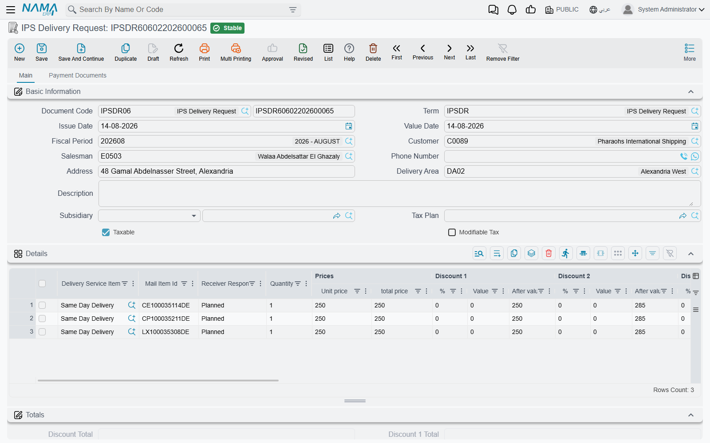
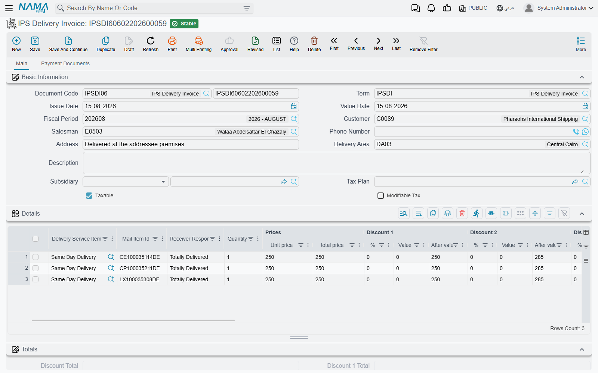

# Delivery Service

The final stage in a mail item's journey: delivering it to the customer and collecting the service
value and any customs fees. The two documents of this stage — the **Delivery Request** and the
**Delivery Invoice** — combine the operational side (who receives, where, and when) with the
financial side (how much is collected).

You'll find them under **Freight Management System → Documents**.

## Delivery Request

Delivery starts with a request that specifies the customer, the delivery address, and the delivery
date:

- **Customer and Sales Man**.
- **Address and Shipment Address**, **Phone Number**, and **Delivery Area**.
- **Delivery Date and due date**.
- **Service lines (Details)** — one line per mail item, with its delivery service item and price.
- **Payment Lines / External Payments** to record collection on delivery (cash on delivery).

Requests are usually not typed by hand. When the [Postal Parcels Sort](./ips-mail-items.md) is saved
on a term that names a **Delivery Request Book** or **Delivery Request Term**, it creates the
requests itself:

1. It takes the sort lines whose **Receiver Response** is still **Initial** — the items waiting to
   go out.
2. It groups them by the receiver's mobile number, so everything for one person travels together.
3. It creates one Delivery Request per mobile number, under that book and term, with one line per
   mail item.
4. It prices each line from the **IPS Delivery Service Price** (below): the first item of the group
   at the **First Shipment Price**, every further item at the **Other Shipments Price**.

Saving the sort again rebuilds those requests rather than adding new ones.

## Delivery Invoice

The invoice bills the delivery to the customer. It carries the same structure as the request
(customer, address, delivery area, service lines, payments). Choosing a request in its **From
Document** copies the request's customer, sales man, delivery area and date, addresses, phone
number and lines.

The invoice can also create itself. When the request's term has **Auto Generate Delivery Invoice**
ticked, the moment a delivery document reports the outcome of the request's items the system
creates — or updates — the delivery invoice for that request, under the **Generated Invoice Book**
and **Generated Invoice Term**, with one payment line in the **Delivery Invoice Payment Method**
for the amount the delivery document collected. The same delivery document also writes each
item's outcome back onto the request's lines — **Totally Delivered** or **Unsuccessfully
Delivered**. The term settings are on [Freight Document Terms](./freight-document-terms.md#The-postal-delivery-terms).

::: warning Decide which of the two documents books the revenue
The request and the invoice share one term shape, and both are processed through the accounting
sides on their own term. If the invoice carries the revenue, leave the request term's debit and
credit sides empty — otherwise the same delivery is booked twice.
:::

## Delivery pricing

Delivery pricing is built on two master files:

- **Delivery Service Item** — the service you sell (standard delivery, express, customs fees…),
  with its **Tax Plan** and subsidiary accounts.
- **IPS Delivery Service Price** — a price table. Each line names a **Mail Class**, a **First
  Shipment Price**, an **Other Shipments Price**, and an optional **From Date** / **To Date**.

When the sort prices a request, it takes the first price line whose mail class matches the item
and whose dates cover today; an item with no matching line is priced at zero. So keep one current
line per mail class, and close a line's **To Date** before adding its replacement.

## Non-delivery handling

Not every delivery attempt succeeds. When delivery fails (recipient absent, wrong address,
refused), the case is recorded with a **Non Delivery Reason** and a **Non Delivery Measure** —
both defined in the master files — on the Postal Parcels Sort, and reported to IPS with the non-delivery
event (see [IPS Integration](./ips-integration.md#Reporting-events)).

::: tip Delivery completes the postal cycle
The delivery request and invoice are where postal operations turn into revenue. Keep one current
price per mail class, give the sort term a delivery-request book, and requests are created and
priced as the items are sorted.
:::
