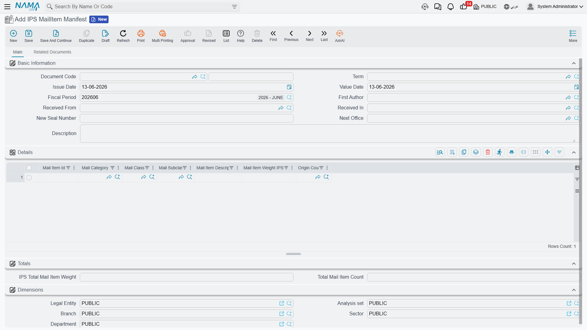
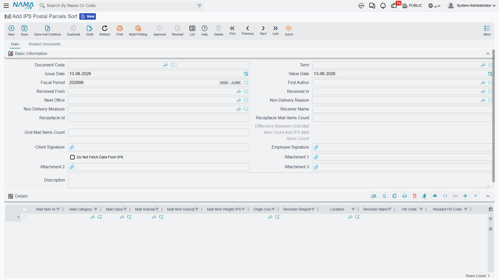

# Mail Items

After the inbound receptacles are opened, the **mail item** becomes the focus of the work: it's recorded, transferred between offices, adjusted, stock-taken, and sorted for delivery. This page covers the documents that manage the mail-item lifecycle, all under **Freight Management System → Documents**.

All these documents share a common header carrying **Received From**, **Received In**, and **Next Office**, the total item count and weight, and a new seal number when re-closing.

## Mail Item Manifest

The entry point for items into the system: when the inbound receptacles are opened, the manifest records every item inside — its identifier, class and category, HS code, declared and actual weight, country of origin, recipient, and value and currency. It's what builds the postal inventory the rest of the documents work on.

## Mail Item Transfer

Items move from one office to another on their way to delivery. The transfer document records the movement of a group of items from the **Received From** to the **Next Office**, updating their location in the network and leaving a trail for tracking.

## Mail Item Adjustment

To correct item data when discrepancies are found — a different weight, a wrong classification, a revised HS code, or a count correction. This document keeps the postal inventory accurate without having to cancel the preceding documents.

## Mail Item Stock Taking

For periodic stock taking of the stored mail items: it empties the store for the physical count then re-stores, so you reconcile what physically exists against what's recorded in the system and settle the differences.

## Mail Retention Document

Some items are held and not delivered immediately — for customs, security, or unreachable-recipient reasons. The retention document records the held items and the **Retention Reason**, to follow them up until they're resolved (release, return, destruction).

## Postal Parcels Sort

Before delivery, items are sorted. The sort document is the richest in this group:

- It records the **sorted items** for delivery, compares the **receptacle item count** against the **count in the network (grid)**, and highlights the **difference** automatically.
- It records the **missing mail items** of the receptacle when a shortage is found.
- It links the **Non-Delivery Reason / Measure** for items that can't be delivered.
- It captures the **client's signature and the employee's signature** as proof.
- It offers a **do not fetch data from IPS** option for manual work when needed.

::: tip Item classification governs everything
The accuracy of the **class, category, and subclass** and the HS code on each item is what makes sorting, clearance, and pricing correct. Set up the classification master files first (see the [postal overview](./ips-postal-intro.md)), then let the documents build on them.
:::
