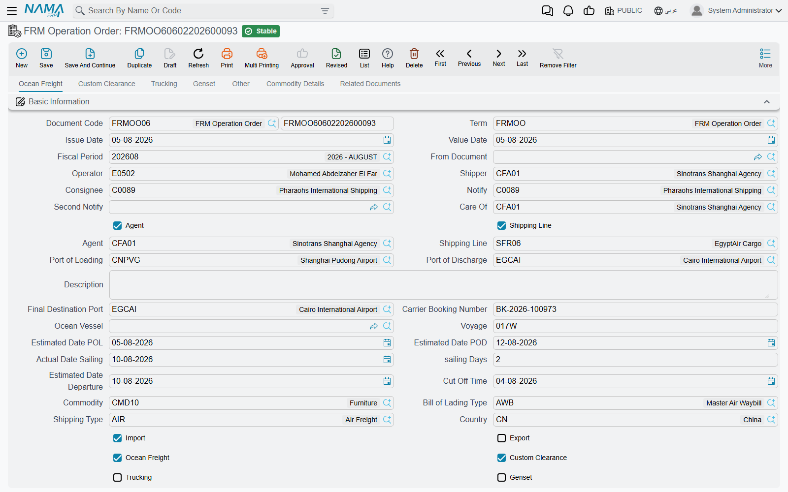

# Operation Orders

The operation order is the heart of the Freight Management module. Think of it as the **complete shipment file**: everything about a single shipment — the parties, the vessel and voyage, the ports, the container, and the services with their costs and selling prices — lives here. And from the operation order, the bill of lading and the sales and purchase invoices branch off.

You'll find it under **Freight Management System → Documents → FRM Operation Order**.

## Shipment parties

An operation order starts by identifying who is involved in the shipment:

- **Shipper** — the customer who owns the goods being sent.
- **Consignee** — the receiving party.
- **Agent** and **Notify / Notify 2** — the parties notified of the shipment's arrival.
- **Shipping Line** — the supplier carrying out the ocean freight.
- **Subsidiary** — the party billed financially (customer, supplier, employee, account…).

You also set whether the shipment is **Import** or **Export**, and **Collect** or **Prepaid**.

## Voyage and container data

In this section you record the transport details:

- **Ocean Vessel and Voyage**, plus the carrier booking number.
- **Loading, discharge, and final-destination ports**, and the gate-in/gate-out ports.
- **Estimated dates** for loading, discharge, actual sailing, and sailing days.
- **Container, its type, and count**, plus the total container number.
- Sensitive-shipment data such as **temperature, humidity, and ventilation** for reefer containers.
- **Commodity**, shipping type, and operation status.

## Services — the core of the operation order

What sets the operation order apart is that it splits services into **separate sections**, each with its own lines carrying cost and selling price:

| Section | Purpose |
|---------|---------|
| **Ocean Freight** | freight charges from the shipping line |
| **Custom Clearance** | clearance fees and services |
| **Trucking** | inland transport to/from the port |
| **Genset** | running refrigeration units |
| **Courier** | sending documents |
| **Other** | any additional services |
| **Transport / Remarks** | operational notes and data |
| **Loading Points** | goods loading locations |
| **Certificates & Forms** | documents required for the shipment |
| **Dimensions** and **Commodity** | weights and volumes of the goods |

Flags such as *ocean freight? clearance? trucking?* control which sections appear, so you only see what applies to your shipment.

## Buttons on the operation order

The operation order's buttons sit on the tab they act on.

**On the Ocean Freight tab** (the first tab):

- **Create Bill of Lading** — the order must be saved first. Opens a new [bill of lading](./bills-of-lading.md)
  in a pop-up, filled from the order: the parties and their addresses, vessel, voyage, ports,
  carrier booking number, commodity, reefer settings and bill-of-lading type. Its estimated arrival
  date is the actual sailing date plus the order's sailing days.
- **Create Purchase Invoice** — opens a new [purchase invoice](./freight-invoicing.md) in a pop-up
  with one line for every service line whose **Selected** box is ticked, in any section, at its
  purchase price. Tick the lines first; with none ticked the button stops.
- **Update All Services** — refreshes every section the order uses (ocean freight, custom
  clearance, trucking, genset, courier) from the matching [price lists](./freight-pricing.md) in one
  go. It needs the **Shipper**.
- **Update Data** — the same, for the ocean-freight section only. It needs the **Shipper**,
  **Shipping Line**, **Port Of Loading** and **Port Of Discharge**. When the order is both Collect
  and Prepaid, collect lines are priced for the collect count and prepaid lines for the prepaid
  count; otherwise for the total container count.
- **Duplicate Operation** — the order must be saved first. Opens a copy of the order for a similar
  shipment, with the booking number, vessel, voyage, estimated dates, departure date and cut-off
  time cleared.
- **Short Shipment** — opens a follow-up order for cargo that missed the sailing. The new order is
  coded after the original with a running suffix (`OO-0012-1`, `OO-0012-2`…), points back to it in
  **From Document**, and starts with all its service sections empty.

**On the Custom Clearance, Trucking, Genset and Other tabs**, each section has its own **Update
Data** button that refreshes just that section. Clearance needs the **Shipper**, **Port Of
Loading** and **Commodity**; trucking and genset need the **Shipper** (and, when the module is not
set to **Multi Loading Points**, the **Gate In Port**, **Gate Out Port** and **Loading Point** —
see [Freight Configuration](./freight-configuration.md)); the courier lines on the Other tab need
the **Shipping Line** and **Country**.

::: tip What a refresh keeps
An **Update Data** button replaces its section with what the price lists return. A line whose
**Ignore Update** box is ticked keeps its current values when the price list still returns its sales
element; lines brought in by the buttons arrive with **Ignore Update** already ticked, so press the
button again only after unticking the lines you want refreshed.
:::

**On the operation order list**, the **More** menu has **Telex Released**: select the orders whose
original bills were released by telex and run it to tick **Telex Released** on all of them at once.

## Operation order status (FRM OO Status)

Each operation order tracks its **status** across its lifecycle. The status isn't only updated manually — it also changes automatically via **status entries** recorded by the documents that handle the order: a sales invoice, sales order or sales return, and the operation-order receipt, transfer and delivery, each stamp the status set on their [document term](./freight-document-terms.md). The order shows the latest one, so you instantly know which shipment is in the yard, which has left, and which has been invoiced.

## Delivery, Receipt, and Transfer

Alongside the operation order, the module offers helper documents to manage the physical movement of containers and goods:

- **FRM OO Delivery** — delivering the goods/container.
- **FRM OO Receipt** — receiving them.
- **FRM OO Transfer** — moving them between locations.

You'll find these files under **Master Files**, and they're used to track the physical location of the shipment independently of its financial effect. How they fill and empty locations is on [Storage Locations](./freight-storage-locations.md).

## Messages you may see

The first three rows belong to the operation order itself; the rest belong to the **FRM OO Receipt**, which is where the capacity rules live.

| Message | Why | What to do |
|---|---|---|
| *You should select some lines* — «يجب أختيار بعض السطور أولا» | **Create Purchase Invoice** was pressed with no service line ticked **Selected**. | Tick the lines to be bought, then press it again. |
| `shipper is required` and the other `… is required` messages of the **Update** buttons | A field the price-list search needs is empty — the message names it by its internal name, for example `shipper,portOfLoading,commodity is required`. These messages have no Arabic text. | Fill the named fields on the header and press the button again. |
| *You Must Select at least One Of Service Item Types* — «يجب اختيار خدمة واحدة على الاقل من الخدمات الأربعة التالية(شحن بحري ـ نقل ـ تخليص ـ مولدات)» | None of the four service flags — ocean freight, custom clearance, trucking, genset — is ticked on the operation order, so no service section would appear. | Tick the flags that describe the shipment; they are what makes the matching service sections visible. |
| *Capacity of operation order {0} must be more than zero* — «يجب ان تكون سعة أمر التشغيل {0} أكبر من الصفر» | The receipt's operation order has no usable capacity: neither the receipt's dimension lines nor the order's own Capacity field give a figure above zero. | Fill the Capacity on the operation order, or enter the dimension lines on the receipt so the capacity can be derived from them. |
| *The sum of capacity in the details {0} must be equal to the capacity in the operation order {1}* — «مجموع السعة فى سطور التفاصيل {0} يجب أن يساوى السعة فى رأس المستند {1}» | The capacity totalled from the receipt does not match the capacity the operation order carries. | Adjust the receipt lines, or the order's capacity, until the two figures are the same. |
| *You must add at least one dimension* — «يجب إدخال بعد واحد على الأقل» | A dimension line on the receipt has its height, width **and** length all empty or zero. | Enter at least one of the three, or delete the row. |
| *{0} can not be negative* — «لا يمكن إدخال قيمة سالبة في الحقل {0}» | A dimension line on the receipt carries a negative capacity, height, width or length. The message names the field. | Enter a positive figure. |
| *Operation Order {0} is used in {1}* — «أمر التشغيل {0} مستخدم فى {1}» | A committed FRM OO Receipt already exists for this operation order — the message names it. One receipt per operation order. | Open the existing receipt and amend it, or cancel it before writing another. |
