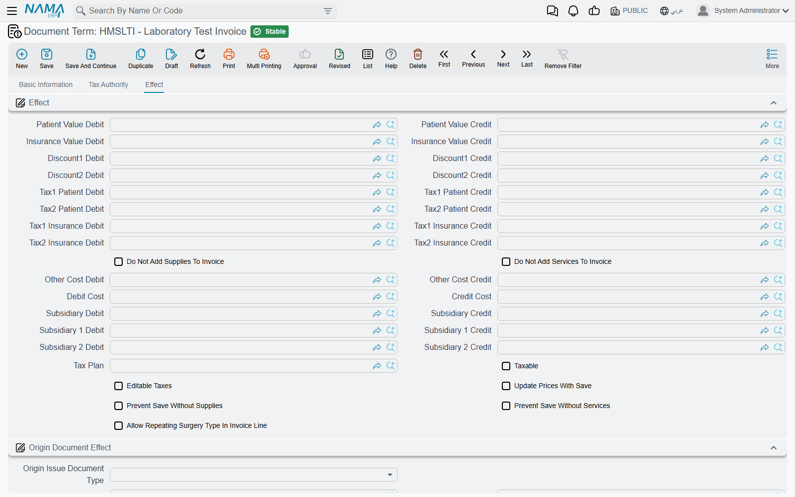
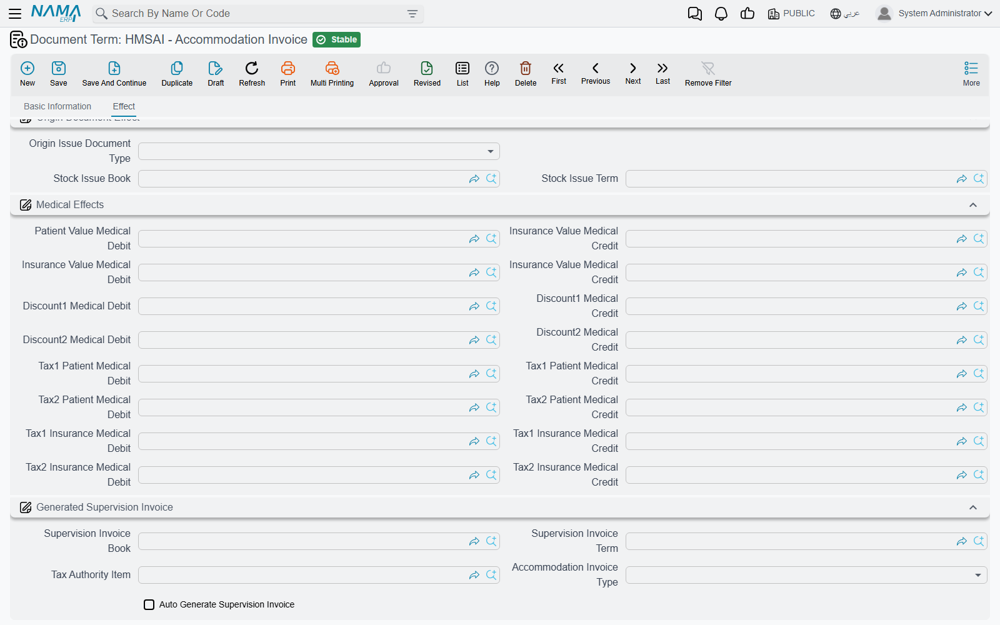
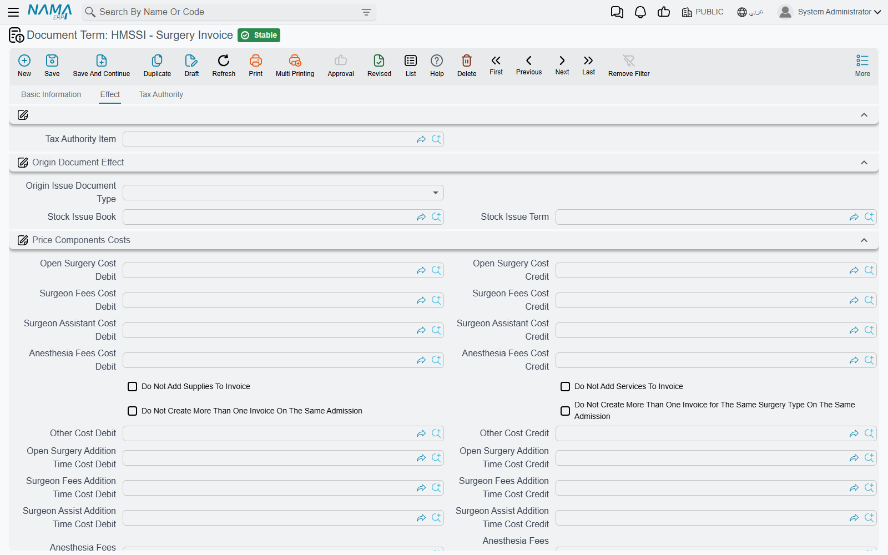
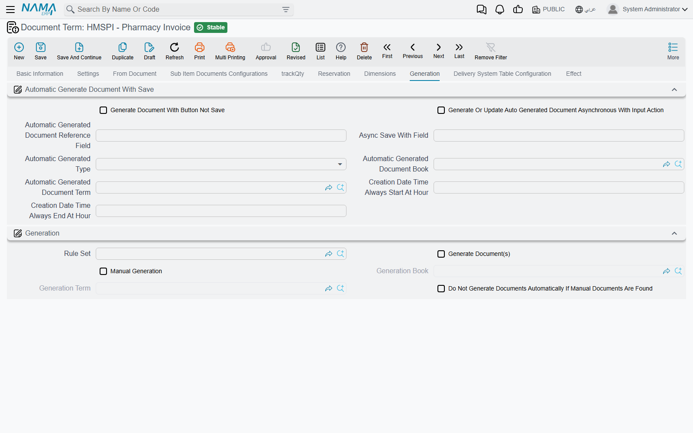

# Invoice Document Terms

A hospital invoice posts nothing on its own. Every account it touches — the patient's receivable, the
insurer's receivable, the revenue, the discounts, the taxes, the doctor's share — is named on its
**document term**, and an invoice saved under a term with empty sides is saved, priced and printed
without a single ledger line. When support is asked "why did this lab invoice not reach the patient's
account?", the answer is almost always on this page.

Sixteen invoice and return types share one **Effect** tab. This page explains that tab once, then what
each family of invoice adds to it. Terms are edited in **Basic → Settings → Document Term**: open the
term whose *Document Type* is the invoice you are configuring. The documents that make up a stay —
admission, accommodation, exit, closing invoice, feeding, surgery package — have their own, much
shorter terms, on [Stay and Operations Document Terms](./hms-terms-stay-and-operations.md).

## How an HMS invoice turns into an entry

Every priced line on a hospital invoice carries a price block: the price, two discounts, the patient's
share and the insurer's share, Tax 1 and Tax 2 each split between the two, the cost and up to three
subsidiary shares (see [Invoicing & Billing](../hms-invoicing.md)). When the invoice is saved, each
line is posted pair by pair from the Effect group:

- **A pair posts only when both sides are filled.** *Patient Value Debit* without *Patient Value
  Credit* posts nothing for the patient's share — there is no warning, the value simply never reaches
  the ledger.
- **Every main line, every supplies line and every services line is posted**, unless the term's *Do
  Not Add Supplies To Invoice* or *Do Not Add Services To Invoice* keeps that grid out.
- Each side is an ordinary account side — a fixed account or one taken from a source on the document —
  described on [Accounting Effects Configuration](/modules/supplychain/document-terms/doc-term-accounting-effects).
  HMS adds its own sources: **Patient**, **Doctor**, **Medical Insurance Company** and **Medical
  Specialty** from the invoice header, and the line's own **Laboratory Test Type**, **Radiology
  Type**, **Surgery Type**, **Physical Therapy Type**, **Medical Service**, **Pharmacy** or **Blood
  Bank**. A side sourced from one of these posts to that record's account, which is how a lab test
  type or a pharmacy gets its own revenue account.

::: tip Patient or doctor?
When the invoice's **Medical Document Category** has *Use Doctor Instead Of Patient In
Accounting Effects* ticked, every side whose source is **Patient** posts to the **doctor's** account
instead. This is the switch behind doctor revenue-sharing arrangements — see
[Medical Master Files](../hms-medical-master-files.md).
:::

## The Effect group — the sides

| Pair | Field ids | What it posts, per line |
|---|---|---|
| **Patient Value Debit / Credit** | `termConfig.patientValueDebit` / `termConfig.patientValueCredit` | The patient's share of the price. |
| **Insurance Value Debit / Credit** | `termConfig.insuranceValueDebit` / `termConfig.insuranceValueCredit` | The insurer's share. |
| **Discount1 Debit / Credit** | `termConfig.discount1Debit` / `termConfig.discount1Credit` | The Discount 1 value. |
| **Discount2 Debit / Credit** | `termConfig.discount2Debit` / `termConfig.discount2Credit` | The Discount 2 value. |
| **Tax1 Patient Debit / Credit** | `termConfig.tax1PatientDebit` / `termConfig.tax1PatientCredit` | The patient's part of Tax 1. |
| **Tax2 Patient Debit / Credit** | `termConfig.tax2PatientDebit` / `termConfig.tax2PatientCredit` | The patient's part of Tax 2. |
| **Tax1 Insurance Debit / Credit** | `termConfig.tax1InsuranceDebit` / `termConfig.tax1InsuranceCredit` | The insurer's part of Tax 1. |
| **Tax2 Insurance Debit / Credit** | `termConfig.tax2InsuranceDebit` / `termConfig.tax2InsuranceCredit` | The insurer's part of Tax 2. |
| **Debit Cost / Credit Cost** | `termConfig.costDebit` / `termConfig.costCredit` | The line's cost value, from the [medical cost list](../hms-pricing.md). |
| **Subsidiary Debit / Credit** | `termConfig.subsidiaryDebit` / `termConfig.subsidiaryCredit` | The first subsidiary share — typically the doctor's or an outside lab's share of the revenue. |
| **Subsidiary 1 Debit / Credit**, **Subsidiary 2 Debit / Credit** | `termConfig.subsidiary1Debit` … `termConfig.subsidiary2Credit` | The second and third subsidiary shares. |

**Other Cost Debit / Credit** also sits in this group, but only the surgery invoice uses it — it is
the "other" fee component of an operation (see below). On every other invoice it posts nothing.

A typical cash-and-insurance setup: *Patient Value* debits the patient (source Patient) and credits a
revenue account; *Insurance Value* debits the insurer (source Medical Insurance Company) and credits
the same revenue; the two tax pairs debit the patient or insurer and credit the output-tax account.

::: info Overhead lines post through their own item
The estimated or actual overhead carried on an invoice's overhead grid is not posted by the term. Each
**Overhead Item** names its own estimated-value and actual-value sides, and the invoice uses the
actual ones once an [Actual Overhead Calculation](../hms-pricing.md#Indirect-overhead-costing) has
given it an actual value.
:::

## The Effect group — the options

| Option | Field id | What it does |
|---|---|---|
| **Do Not Add Supplies To Invoice** | `termConfig.doNotAddSuppliesToInvoice` | The supplies grid is left out of the invoice total and out of the entry. The supplies are still issued from stock. |
| **Do Not Add Services To Invoice** | `termConfig.doNotAddServicesToInvoice` | The same for the services grid. |
| **Tax Plan** | `termConfig.taxPlan` | The tax plan used for a line whose service, type or room names no tax plan of its own. |
| **Taxable** | `termConfig.taxable` | Whether the plan's taxes apply to this invoice type at all. |
| **Editable Taxes** | `termConfig.editableTaxes` | Taxes are no longer recalculated from the tax plan on save, so a tax typed on a line is kept. |
| **Update Prices With Save** | `termConfig.updatePricesWithSave` | Every save looks every line's price up again from the insurance approval and the price lists. Prices typed by hand are overwritten — unless the invoice's *Allow Changing Main Prices*, *Allow Changing Services Prices* or *Allow Changing Supplies Prices* is ticked for that grid. |
| **Prevent Save Without Supplies** | `termConfig.preventSaveWithoutSupplies` | Refuses to save an invoice whose supplies grid is empty. |
| **Prevent Save Without Services** | `termConfig.preventSaveWithoutServices` | Refuses to save an invoice whose services grid is empty. |
| **Allow Repeating Surgery Type In Invoice Line** | `termConfig.allowRepeatingSurgeryTypeInInvoiceLine` | Surgery invoice only: two operation lines may name the same surgery type. |

The three *Allow Changing … Prices* switches are on each invoice, not on the term. On a saved invoice
they are ticked from the **More** menu (*Allow Changing Main Prices*, *Allow Changing Services
Prices*, *Allow Changing Supplies Prices*), which is how a price agreed at the desk survives *Update
Prices With Save*.

## Origin Document Effect — issuing the supplies of a service invoice

Service invoices carry a supplies grid filled from the **Medical Supplies** tab of the service or type
being billed. The **Origin Document Effect** group («تأثيرات المستند المنشأ») turns that grid into a
stock document:

| Field | Field id | What it does |
|---|---|---|
| **Origin Issue Document Type** | `termConfig.issueDocType` | **Stock Issue** issues the supplies on save; **Stock Issue Request** raises a request for the store instead. Empty: nothing is generated. |
| **Stock Issue Book** / **Stock Issue Term** | `termConfig.issueForHMSInvoiceBook` / `termConfig.issueForHMSInvoiceTerm` | The book and term of the generated document. Both are needed. |

The pharmacy-family invoices below do not use this group — they move stock through their Generation
tab. The full story is on [Pharmacy, Supplies & Blood Bank](../hms-pharmacy-and-supplies.md).

## What each invoice family adds

### Check, attendant, lab, radiology, physical therapy, services and supervision invoices

These seven terms are the Effect tab plus one more tab, **Tax Authority** («مصلحة الضرائب»), with a
single field, **Tax Authority Item** `termConfig.taxAuthorityItem`. On the **Check Invoice**,
**Attendant Invoice** and **Supervision Invoice** it is the item every line is reported under when the
invoice is sent to the tax authority. Lab, radiology, physical therapy and services invoices report
each line under the tax-authority item of its own test type, radiology type, therapy type or medical
service, so the field on their terms can stay empty.

### Accommodation invoice

The accommodation invoice posts the **accommodation price** of each of its day lines through the Effect
group. The medical-supervision part of the same lines is billed separately, by a **Supervision Invoice**
the accommodation invoice can create for you. The group **Generated Supervision Invoice** («فاتورة
الإشراف الطبى المنشأة») sets that up:

| Field | Field id | What it does |
|---|---|---|
| **Auto Generate Supervision Invoice** | `termConfig.autoGenSupervisionInvoice` | On save, create (or rebuild) one Supervision Invoice holding a line per day of each accommodation line. Rooms ticked *Do Not Create Room Supervision Invoice* are skipped. |
| **Supervision Invoice Book** / **Supervision Invoice Term** | `termConfig.supervisionInvoiceBook` / `termConfig.supervisionInvoiceTerm` | The book and term of the generated Supervision Invoice — whose own term then posts it. |
| **Tax Authority Item** | `termConfig.taxAuthorityItem` | The item the accommodation invoice's lines are reported under to the tax authority. |
| **Accommodation Invoice Type** | `termConfig.accommodationInvoiceType` | Shown here, but what splits the stay into invoices is the same field on the **Accommodation** term — see the stay terms page. |

The accommodation invoice's term also carries a **Medical Effects** group; leave it empty, since the
supervision charge is posted by the generated Supervision Invoice.

### Surgery invoice

The surgery term puts its own group, **Price Components Costs** («تكاليف أسعار العمليات»), under the
Effect group. An operation's price is made of components — open surgery, surgeon fees, surgeon
assistant, anaesthesia and other — each with a cost for the standard hours and an extra cost for
additional time, and each component has its own pair:

| Pair | What it posts |
|---|---|
| **Open Surgery Cost**, **Surgeon Fees Cost**, **Surgeon Assistant Cost**, **Anesthesia Fees Cost**, **Other Cost** (Debit / Credit) | The cost of that component for the standard hours. |
| **Open Surgery Addition Time Cost**, **Surgeon Fees Addition Time Cost**, **Surgeon Assist Addition Time Cost**, **Anesthesia Fees Addition Time Cost**, **Other Addition Time Cost** (Debit / Credit) | The extra cost of that component for hours beyond the standard. |
| **Subsidiary Addition Time** (Debit / Credit) | Shown on the screen; the surgery entry does not post it. |

The same group holds the two rules that limit surgery invoices per admission: **Do Not Create More
Than One Invoice On The Same Admission** and **Do Not Create More Than One Invoice for The Same Surgery
Type On The Same Admission**. Some options appear twice on this screen (the supplies/services switches,
Other Cost, and the Origin Document Effect group); both copies are the same field. The term ends with
a **Tax Authority** tab. How the components are priced is on
[The Surgery Lifecycle](../hms-surgery-lifecycle.md).

### Pharmacy, supplies, service-and-supply and blood bank invoices, and the three returns

**Pharmacy Invoice**, **Pharmacy Return**, **Medical Supplies Invoice**, **Supply Return**, **Service
And Supply Invoice**, **Blood Bank Invoice** and **Blood Bank Return** are inventory documents, so their
terms open with the standard supply-chain term tabs — Settings, From Document, quantity tracking,
reservation, Dimensions, **Generation** and the rest, all described under
[supply chain document terms](/modules/supplychain/document-terms/) — and end with the HMS Effect tab
above.

Two things differ from the service invoices:

- **The stock document comes from the Generation tab.** A *Generation Book* and *Generation Term* make
  the invoice issue its items (and the return receive them back). The Origin Document Effect group on
  these terms is not used.
- **A return does not reverse the sides for you.** It posts the same pairs as the invoice, in the
  direction its own term gives them, so a return term needs each pair set the other way round from
  the invoice term — patient value on the credit side where the invoice debits it, and so on.

Of the Effect group, these terms post the patient and insurance values, both discounts, the four tax
pairs, the cost and the first subsidiary share.

## Documents without HMS term options

Lab and radiology requests and results, the surgery request and approval, the patient diagnosis and
health status, the outpatient reservation, Change Patient Price Plan and Actual Overhead Calculation
have no HMS-specific term tab. Their terms carry only the general settings every document has.
