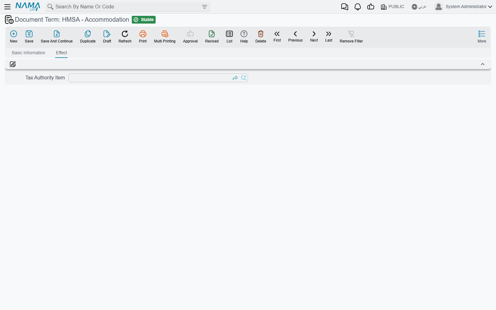

# Stay and Operations Document Terms

An inpatient's stay is a chain of documents that create other documents: the admission creates the
accommodation, the accommodation creates the accommodation invoices, the accommodation invoice creates
the supervision invoice, the feeding issue creates stock issues. Which of those links actually fire —
and under which book and term the generated document is saved — is decided on the terms of the
documents on this page. A chain that "stops" (an admission with no accommodation, a stay with no
invoice) almost always has an empty book or term somewhere along it.

Terms are edited in **Basic → Settings → Document Term**. The invoice terms — the patient/insurer
sides every priced document posts with — are on [Invoice Document Terms](./hms-terms-invoices.md).

## Patient Admission — creating the accommodation

The admission term has one group, **Generated Accommodation Doc** («مستند التسكين المنشأ»):

| Field | Field id | What it does |
|---|---|---|
| **Accommodation Book** / **Accommodation Term** | `termConfig.accommodationBook` / `termConfig.accommodationTerm` | When an admission with **Generate Accommodation Doc** ticked is saved, an Accommodation is created under this book and term, carrying the patient, admission date and time, room and bed, prices, insurer and endurance percentages. Leave either empty and no accommodation is created, ticked or not. Unticking the flag later deletes the generated accommodation. |
| **Allow Accommodation Intersection In The Same Room** | `termConfig.allowAccommodationIntersectionInTheSameRoom` | Normally a bed cannot be booked by a second accommodation while the first is still in it. Tick this to let stays of this admission type overlap on the same bed — for a mother and newborn sharing a cot, for example. |

## Accommodation and Accommodation Transfer — building the accommodation invoices

The accommodation term's single group, **Generated Accommodation Invoice** («فاتورة التسكين
المنشأة»), is the most important term in the module for billing: it decides how a stay becomes
invoices. The accommodation exit uses **this** term too when it writes the final invoices, so it must be
filled in even if you never want temporary invoices.

| Field | Field id | What it does |
|---|---|---|
| **Accommodation Invoice Book** / **Accommodation Invoice Term** | `termConfig.accommodationInvoiceBook` / `termConfig.accommodationInvoiceTerm` | The book and term every accommodation invoice of the stay is saved under. |
| **Accommodation Invoice Type** | `termConfig.accommodationInvoiceType` | How the stay is split: **Invoice Every Day** («فاتورة كل يوم») writes one invoice per billable day; **Invoice At In** («فاتورة في الدخول») writes one invoice for the whole stay, dated on the first day; **Invoice At Out** («فاتورة في الخروج») writes one invoice dated on the discharge day. |
| **Generate Temporary Accommodation Invoice On Save** | `termConfig.genAccommodationInvoice` | Each save of a running accommodation (one with no exit yet) rebuilds the stay's invoices up to today, at the configured check-out hour, so the bill to date is always on file. |
| **update Invoice Prices After Save** | `termConfig.updateInvoicePrices` | Each save rebuilds the stay's invoices with the current prices. On the accommodation this happens only while the patient has not left. |

The **Accommodation Transfer** term has only **update Invoice Prices After Save**: tick it so that
moving a patient to a dearer or cheaper room re-prices the stay's invoices when the transfer is saved,
cancelled or deleted — the final invoices if the patient has already left, the temporary ones otherwise.

How many days each invoice line counts depends on the check-in and check-out hours in
[Hospital Management System Settings](../hms-configuration.md). A line ticked **Do not Allow System To Edit
Selected Line** on an accommodation invoice is left as it is when the invoices are rebuilt.

## Accommodation Exit — the final invoices

Saving an exit always writes the stay's **final** accommodation invoices, using the accommodation's
term above. Its own term has a single option, under **Origin Document Effect**:

| Field | Field id | What it does |
|---|---|---|
| **Do Not Delete Generated Invoices When Deleting This Document** | `termConfig.doNotDeleteGeneratedInvoices` | Normally cancelling or deleting an exit deletes the admission's accommodation invoices with it, and they are rebuilt from the running stay. Tick this to keep them. |

## Closing Invoice — the discharge adjustments

The closing invoice does not post the stay's invoices again — each of them has already posted itself.
It posts only the **admission-level adjustments** typed on its header, and its term names their
sides:

| Pair | Field ids | Posts |
|---|---|---|
| **Tax1 Debit / Credit**, **Tax2 Debit / Credit** | `termConfig.tax1Debit` … `termConfig.tax2Credit` | The Tax 1 and Tax 2 values of the closing invoice. |
| **Fees 1 Debit / Credit**, **Fees 2 Debit / Credit** | `termConfig.fees1Debit` … `termConfig.fees2Credit` | The Fees 1 and Fees 2 values. |
| **Discount1 Debit / Credit**, **Discount2 Debit / Credit** | `termConfig.discount1Debit` … `termConfig.discount2Credit` | The Discount 1 and Discount 2 values. |

As on the invoices, a pair posts only when both sides are filled, and a side can take its account from
the **Patient**.

## Surgery Package Invoice — settling the package

| Field | Field id | Posts / does |
|---|---|---|
| **Difference Debit / Credit** | `termConfig.differenceDebit` / `termConfig.differenceCredit` | The total of the lines' *Difference* — agreed price against actual price. |
| **Revenue Difference Debit / Credit** | `termConfig.revenueDebit` / `termConfig.revenueCredit` | The total of the lines' *Revenue Difference*. |
| **Invoice Discount Debit / Credit** | `termConfig.invoiceDiscountDebit` / `termConfig.invoiceDiscountCredit` | The invoice's header discount. |
| **Show All Patient Admissions** | `termConfig.showAllPatientAdmissions` | The admission picker normally lists only the patient's admissions that are still open and carry a surgery package. Tick this to list every admission. |

The package itself is explained on [The Surgery Lifecycle](../hms-surgery-lifecycle.md).

## Surgery Reservation — the theatre gap

The reservation term has the general settings and one option,
**Consider Difference In Times Between Reservations Of The same Room**
`termConfig.considerDiffInTimesBetweenRoomReservations`. With it ticked, a reservation is refused when
another reservation of the same operating room falls within the gap set on that room's file
(*Difference in time between consecutive reservations of the same room*). Unticked, the gap is ignored.

## Feeding Issue — meals out of the kitchen

The feeding issue is an inventory document, so its term opens with the standard supply-chain term tabs.
What turns its lines into stock movements is the last group on its **Effect** tab:

| Field | Field id | What it does |
|---|---|---|
| **Assembly Document Book** / **Assembly Document Term** | `termConfig.assemblyDocumentBook` / `termConfig.assemblyDocumentTerm` | A meal line that carries a recipe (the feeding type's bill of materials) becomes an **Assembly Document** that consumes the ingredients and produces the meal — one per line. |
| **Stock Issue Book** / **Stock Issue Term** | `termConfig.stockIssueBook` / `termConfig.stockIssueTerm` | Lines without a recipe are issued together on one **Stock Issue**. |

The feeding issue bills nobody, so the patient/insurer sides higher up on its Effect tab are not used;
leave them empty. Its cost reaches the ledger through the stock issue and assembly documents it
creates.

## Messages you may see

| Message | Why | What to do |
|---|---|---|
| *Can not create Accommodation Invoice, please add DocumentBook and DocumentTerm in Accommodation Doc Term.* — «لا يمكن إنشاء فاتورة إقامة، برجاء إضافة دفتر وتوجية الفاتورة فى توجية مستند تسكين المريض.» | An accommodation, transfer or exit tried to build the stay's invoices, but the accommodation's term has no Accommodation Invoice Book or Term. | Fill both on the term of the admission's accommodation, then save the document again. |
| *Can not create Accommodation Invoice, please add Accommodation Invoice Type in Accommodation Doc Term.* — «لا يمكن إنشاء فاتورة إقامة، برجاء إضافة تحديد نوع فاتورة الإقامة فى توجية مستند تسكين المريض.» | Same, but the Accommodation Invoice Type is empty. | Choose Invoice Every Day, Invoice At In or Invoice At Out on the accommodation term. |
| *Previous document {0} in date [{1} , {2}] Must Be Out for bed {3}, intersect with same bed* — «السند السابق {0} بتاريخ [{2} , {1}] يجب أن يكون خروج للغرفة {3} , لأنه متقاطع مع نفس الغرفة» | The bed is still occupied by the stay named in the message, and the admission's term does not allow overlapping stays. | Pick another bed, discharge or transfer the other patient first, or tick *Allow Accommodation Intersection In The Same Room* if sharing is intended. |
