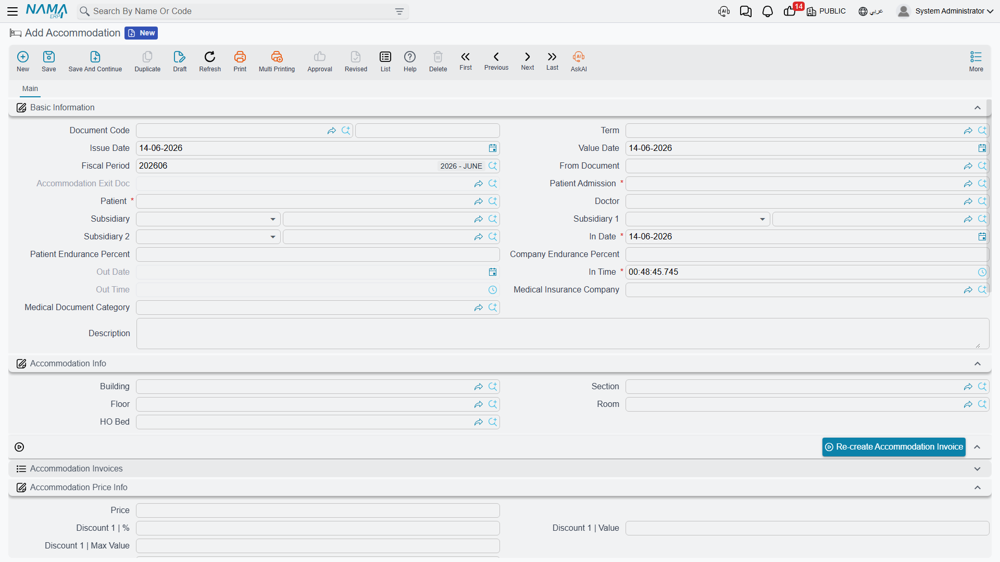
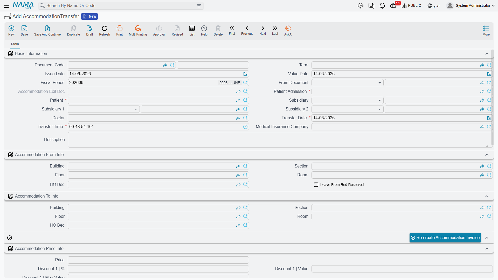
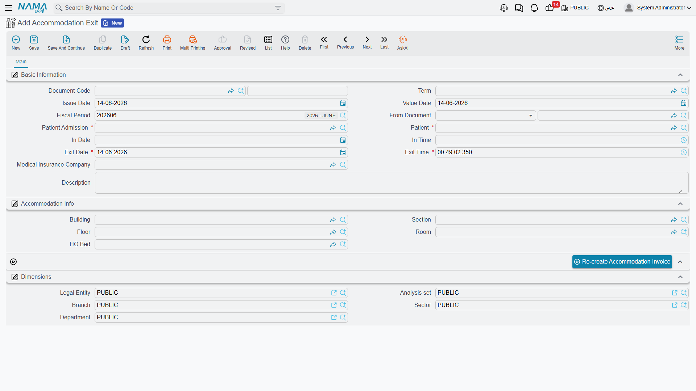
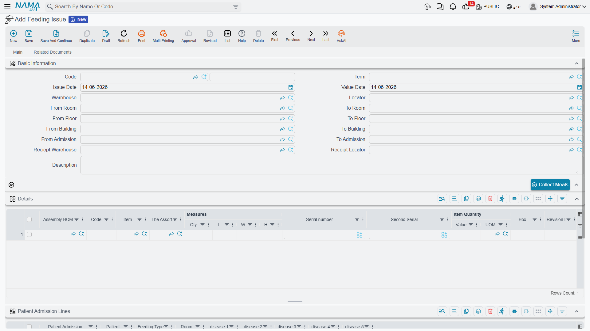

# Accommodation & Feeding

Once admitted, a patient needs a **bed** and **meals**. Accommodation is what books the patient a bed, starts the daily accommodation and medical-supervision charges, and tracks their moves until discharge. Every accommodation document posts a **bed-occupancy** entry and may auto-generate an **accommodation invoice** depending on the term config.

## Accommodation

**Accommodation** is the bed-booking record that physically houses the inpatient. It is usually auto-generated from the admission (when "Generate Accommodation Doc" is ticked) but can be created manually. It records in/out dates and times, the bed location (building/section/floor/room/bed), and the nightly price split between patient and insurer.

On **save**, it posts a **bed-occupancy** line (marking the bed occupied from the in-date/time), and **if there is no exit document yet**, it generates the **accommodation invoice** (when the term config enables it). A bed is **required** to save. On cancel, the occupancy lines are removed and the admission's accommodation and price fields are reset. A **Re-create Accommodation Invoice** button regenerates the invoice.

## Transfers between rooms

**Accommodation Transfer** moves an inpatient from one bed/room to another (e.g. from a general ward to ICU). It records the **"from"** location and the **"to"** location, the transfer date and time, and re-prices the new accommodation. Selecting the admission loads the patient's **current** accommodation into the "from" block, and you can keep the old bed booked via the **Leave From Bed Reserved** flag.

## Exit

**Accommodation Exit** is the discharge document — it ends the patient's accommodation and admission, frees the bed, and paves the way for final billing. Selecting the "from document" (the running accommodation) copies the patient, admission, in-dates and location automatically. To prevent double-discharge, the patient lookup is limited to **patients whose admission has not yet been closed by an exit**. From it, the stay is consolidated into the **[Closing Invoice](./hms-invoicing.md)**.

## Feeding issue

**Feeding Issue** issues meals to inpatients from a warehouse, **automatically choosing the right diet based on each patient's diagnosis** — a bridge between patient care and inventory (it produces a stock issue).

The magic is in the **Collect Meals** button: from a range of rooms/floors/buildings/admissions, it finds all patients **still in the hospital** (admission not yet closed), reads each one's diagnosis, picks the **most appropriate [feeding type](./hms-medical-master-files.md)** (the highest-order one matching the diagnosis diseases), and then auto-builds both the patient lines and the detailed food-item lines — saving the nurse from choosing diets by hand.

