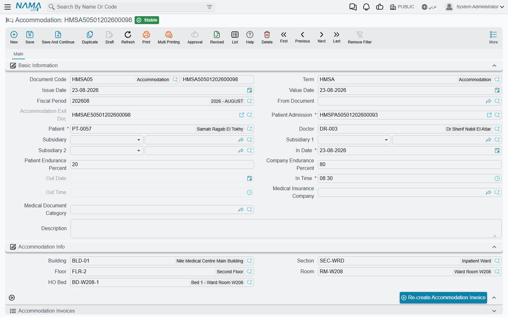
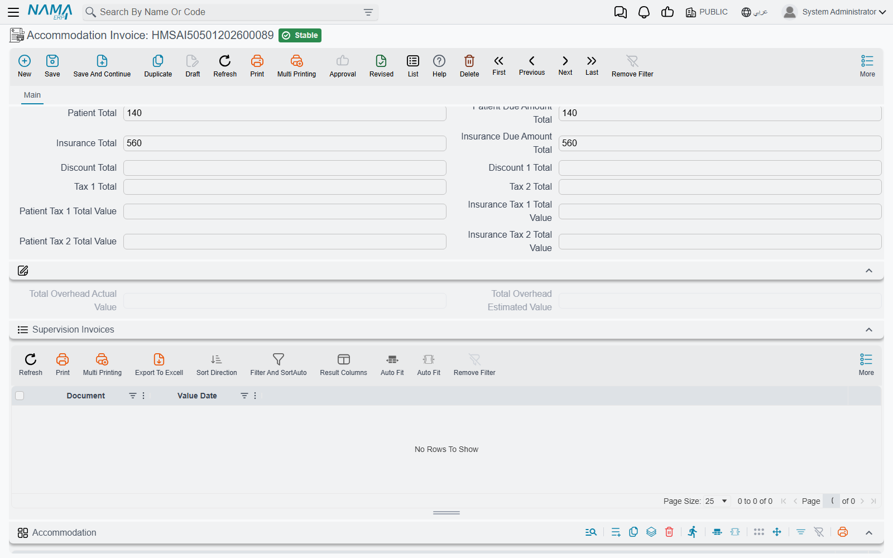
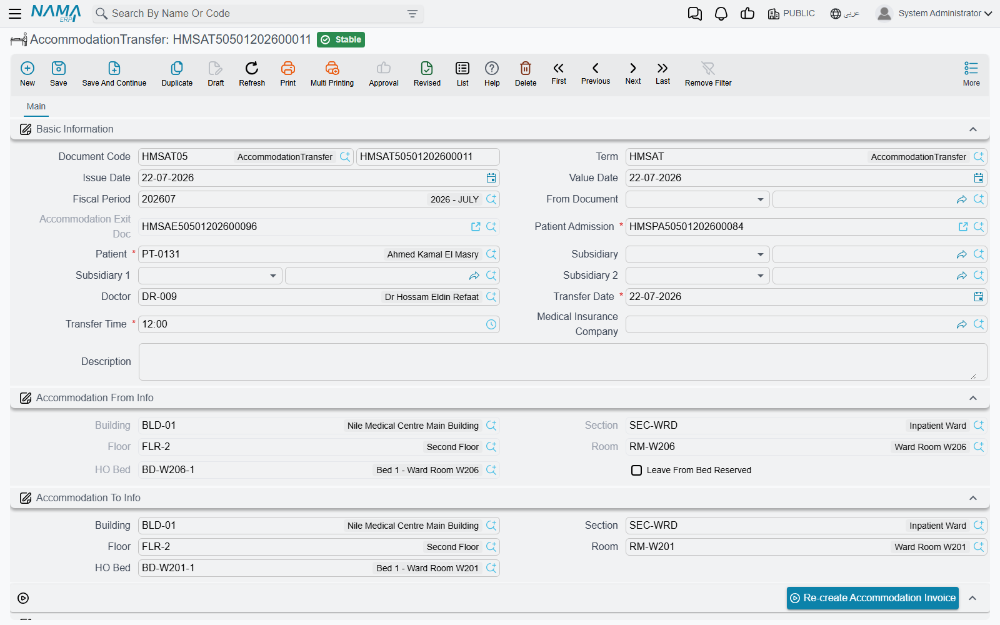
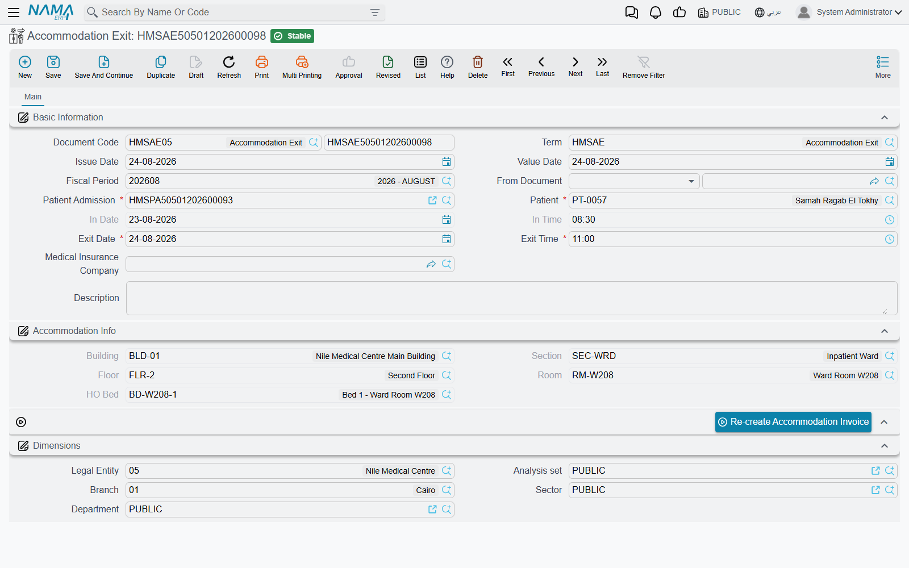
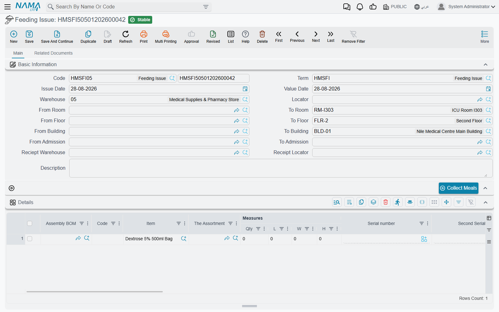

# Accommodation & Feeding

Once admitted, a patient needs a **bed** and **meals**. Accommodation is what books the patient a bed,
starts the daily accommodation and medical-supervision charges, and tracks their moves until discharge.
It is the most stateful part of the module: every accommodation document writes an entry into the
admission's **stay history**, and the beds, the rooms, the patient file and the accommodation invoices
are all rebuilt from that history each time it changes.

| Screen | Menu | Its own buttons |
|---|---|---|
| **Accommodation** | Hospital Management System → Documents → Accommodation | **Re-create Accommodation Invoice** |
| **Accommodation Transfer** | Hospital Management System → Documents → AccommodationTransfer | **Re-create Accommodation Invoice** |
| **Accommodation Exit** | Hospital Management System → Documents → Accommodation Exit | **Re-create Accommodation Invoice** |
| **Feeding Issue** | Hospital Management System → Feeding → Feeding Issue | **Collect Meals** |

The transfer's menu entry really is written as one word, *AccommodationTransfer*.

## The stay history: in, transfer, out

Think of a stay as a row of entries in a ledger of beds:

1. The **Accommodation** writes an *in* entry: this patient, this bed, from this date and time.
2. Each **Accommodation Transfer** closes the current bed and opens a new one — an *out* for the old
   bed and an *in* for the new.
3. The **Accommodation Exit** writes the final *out*.

The entries of one admission must follow each other in time. A transfer dated before the accommodation,
or an accommodation that is not the first entry of its admission, is refused with a message naming the
two documents (see the table at the end). For the same reason, the accommodation cannot be deleted while
a transfer after it exists — delete the transfer first.

Every change to the history updates three things at once:

- the bed's **Reserved** flag — a bed is reserved while its last entry is an *in*;
- the room's **Room Status** — empty, partly occupied or fully occupied, from its beds;
- the patient file's **current accommodation** — the room and bed the patient is in now.

Unless the admission's term allows it, a bed cannot hold two overlapping stays (see
[Stay and Operations Document Terms](./document-terms/hms-terms-stay-and-operations.md)).

## Accommodation

**Accommodation** is the bed booking. It is usually created by the admission — when *Generate
Accommodation Doc* is ticked and the admission's term names an accommodation book and term — but it can
be entered by hand. It records the in date and time, the bed location (building, section, floor, room,
bed), and three price blocks: the **Accommodation Price Info** (the nightly bed price), the **Medical
Supervision Price Info** (the daily supervision fee), and the **Total Price Info**. Both prices come
from the room's [classification](./hms-facility.md), split between patient and insurer. A bed is
**required** to save.

Cancelling an accommodation removes its entries and clears the accommodation, prices and the
*Generate Accommodation Doc* flag on the admission.

## How the stay is billed

Accommodation is billed by **Accommodation Invoices**, which the system writes for you from the stay
history. Two moments matter:

- **While the patient is in**, an accommodation saved under a term with *Generate Temporary
  Accommodation Invoice On Save* writes **temporary** invoices covering the stay up to today, at the
  configured check-out hour. Each later save rebuilds them, so the bill to date is always on file.
- **When the patient leaves**, the Accommodation Exit writes the **final** invoices up to the exit date
  and time, replacing the temporary ones.

How the stay is cut into invoices — one per day, one at admission, or one at discharge — is the
*Accommodation Invoice Type* on the accommodation's term. How many days each line counts is set by
the check-in and check-out hours in [Hospital Management System Settings](./hms-configuration.md): with
the default 00:00 every calendar day the patient touched is one day, and with a noon-to-noon day a
patient who arrives in the morning is charged from the previous day. Each invoice line carries one
stretch of the stay — its room, in and out date and time, days count, and the accommodation and
medical prices of the document that opened it — so a transfer to a dearer room shows up as a new line
at the new price.

The **Re-create Accommodation Invoice** button on all three documents rebuilds the admission's invoices
on demand: the final ones if the patient has left, otherwise the temporary ones up to today. Use it
after correcting a price or a date. A line ticked **Do not Allow System To Edit Selected Line** on an
invoice is kept as it is.

::: tip Supervision is billed on its own invoice
The accommodation invoice posts the bed price. The medical-supervision fee of the same days is billed
by a **Supervision Invoice** that the accommodation invoice creates when its term has *Auto Generate
Supervision Invoice* ticked — one line per day, skipping rooms ticked *Do Not Create Room Supervision
Invoice*. See [Invoice Document Terms](./document-terms/hms-terms-invoices.md).
:::

## Transfers between rooms

**Accommodation Transfer** moves an inpatient from one bed or room to another — from a general ward to
ICU, say. Picking the admission loads the patient's **current** location into **Accommodation From
Info**; you fill **Accommodation To Info**, the **Transfer Date** and **Transfer Time**, and the price
blocks hold the accommodation and supervision prices for the new room. **Leave From Bed Reserved** keeps the old bed
marked reserved after the patient leaves it — for a patient expected back after surgery, for example.

With *update Invoice Prices After Save* ticked on the transfer's term, saving, cancelling or deleting a
transfer re-prices the stay's invoices.

## Exit

**Accommodation Exit** is the discharge document. It ends the stay, frees the bed, writes the final
accommodation invoices and links itself to the admission, its accommodation and its transfers. Picking
the "from document" (the running accommodation) copies the patient, admission, in dates and location.
The patient lookup offers only **patients whose admission has not been closed by an exit**, so a
patient cannot be discharged twice. The exit date cannot be before the in date.

Cancelling an exit deletes the stay's accommodation invoices — unless its term has *Do Not Delete
Generated Invoices When Deleting This Document* ticked — and rebuilds the temporary ones from the stay
that is now running again. From the exit, the stay is settled in the
**[Closing Invoice](./hms-invoicing.md#The-closing-invoice)**.

## Feeding issue

**Feeding Issue** issues meals to inpatients from a warehouse, **choosing each patient's diet from
their diagnosis** — a bridge between patient care and the kitchen store.

The work is done by the **Collect Meals** button: from a range of rooms, floors, buildings and
admissions, it finds every patient **still in hospital** (admission not yet closed), reads each one's
diagnosis, picks the **most appropriate [feeding type](./hms-medical-master-files.md)** (the
highest-order one matching the diagnosis diseases), and builds both the patient lines and the
food-item lines — saving the nurse from choosing diets by hand.

On save, lines whose meal has a recipe become **Assembly Documents** (consuming the ingredients), and
the rest are issued on one **Stock Issue**, under the books and terms named on the feeding issue's term.

## Messages you may see

| Message | Why | What to do |
|---|---|---|
| *Exit Date {0} Could not be before In Date {1}.* — «تاريخ الخروج {0} لا يجب ان يكون قبل تاريخ الدخول {1}» | The exit is dated before the accommodation it closes. | Correct the exit date and time. |
| *The document {0} can not be the first entry for admission document {1}* — «المستند {0} لا يمكن ان يكون أول مستند تسكين لإستمارة الدخول {1}» | A transfer or exit is dated before the admission's accommodation, so it would be the first entry of the stay. | Check the dates; every stay starts with its accommodation. |
| *The document {0} date [{1} , {2}] can not be the next document after document {3} date [{4} , {5}]* — «المستند {0} الذى تاريخه [ {2} , {1}] لا يمكن ان يكون بعد مستند التسكين {3} الذى تاريخه [{4} , {5}]» | The entries of the stay are out of order — for example a second accommodation after one that is still open. | Fix the date of the document named first, or transfer the patient instead of opening a new accommodation. |
| *You can not delete this doc {0} before delete transfer doc {1}* — «لا يمكن حذف هذا السند {0} , حيث هناك سند نقل تسكين {1} بعد هذا السند» | A transfer exists after the document you are deleting. | Delete the transfer named in the message first. |
| *Previous document {0} in date [{1} , {2}] Must Be Out for bed {3}, intersect with same bed* — «السند السابق {0} بتاريخ [{2} , {1}] يجب أن يكون خروج للغرفة {3} , لأنه متقاطع مع نفس الغرفة» | The chosen bed is still occupied by the stay named in the message. | Choose another bed, or move the other patient out first. |
| *Can not create Accommodation Invoice, please add DocumentBook and DocumentTerm in Accommodation Doc Term.* — «لا يمكن إنشاء فاتورة إقامة، برجاء إضافة دفتر وتوجية الفاتورة فى توجية مستند تسكين المريض.» | The invoices were to be built but the accommodation's term has no invoice book or term. | Fill *Accommodation Invoice Book* and *Term* on the accommodation's term. |
