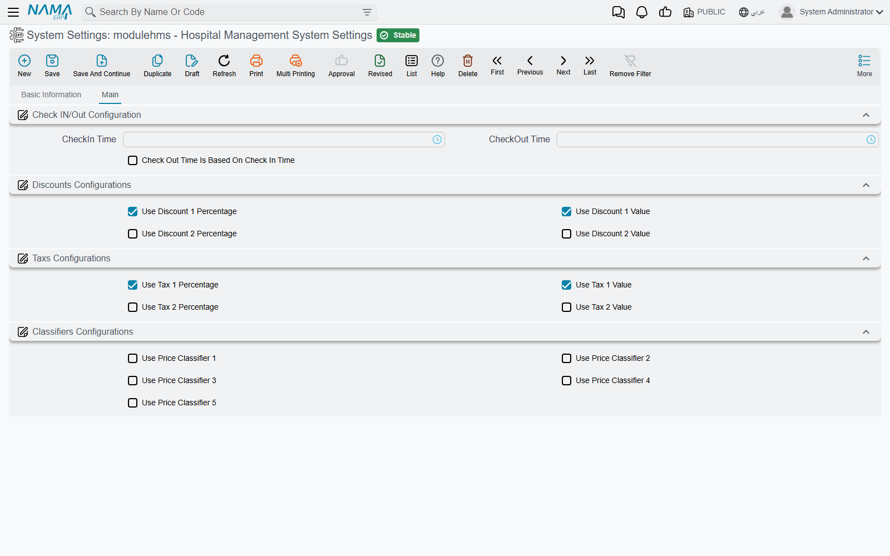

# Hospital Management System Settings

The hospital module has one settings record, and it is small: seventeen options on a single tab.
Four of them change how a stay is counted into billable days, and the rest decide which discount, tax
and price-classifier fields the hospital screens show at all. Nothing here posts anything or blocks a
save — but the first block decides how many nights every inpatient is charged for, so it is worth
setting deliberately before the first admission.

You open it from **Hospital Management System → Settings → Hospital Management System Settings**.
The record carries the usual header (code, name, configuration group and the dimensions it applies to)
and one tab, **Main** («الرئيسية»), with four groups.

## Check IN/Out Configuration — how a stay becomes billable days

A hospital charges accommodation by the day, but patients do not arrive at midnight. The three options
in this group set the hotel-style "day" that accommodation invoices count in.

| Option | What it does |
|---|---|
| **CheckIn Time** | The hour the billing day starts. A patient who arrives **before** this hour is charged from the previous day. Default 00:00. |
| **CheckOut Time** | The hour the billing day ends. A patient who leaves **after** this hour is charged one more day. Default 00:00. |
| **Check Out Time Is Based On Check In Time** | Ignores both hours above. Each patient's day starts at the time of their **first** accommodation and ends one minute before that time the next day, so the stay is billed in 24-hour cycles from arrival. |

Both hour fields show their English labels on Arabic screens too (*CheckIn Time*, *CheckOut Time*);
the shipped product has no Arabic label for them. The third option reads
«احتساب وقت الدخول والخروج حسب أول وقت دخول في الإقامة».

### A worked example

A patient arrives on 1 January at 10:00 and is discharged on 3 January at 13:00.

- **With both hours left at 00:00** (the default), every calendar day the patient touched counts:
  1, 2 and 3 January — **3 days**.
- **With CheckIn Time and CheckOut Time both at 12:00**, arriving at 10:00 is before check-in, so the
  stay starts on 31 December at 12:00; leaving at 13:00 is after check-out, so it runs to 4 January at
  12:00 — **4 days**.
- **With Check Out Time Is Based On Check In Time ticked**, the day runs from 10:00 to 09:59. Leaving
  at 13:00 on 3 January crosses the second 09:59 boundary — **3 days**. Leaving at 09:00 the same day
  would have been **2 days**.

The same hours set the **invoicing date** of each accommodation-invoice line (a line whose day began
before the check-in hour is dated the previous day), and they are the "today at check-out time" that a
still-running stay is billed up to when temporary accommodation invoices are rebuilt — see
[Accommodation & Feeding](./hms-accommodation.md).

## Discounts Configurations and Taxs Configurations — which columns you see

Every priced hospital document carries the same price block: price, two discounts, the patient and
insurer split, two taxes, the totals. Most hospitals use one discount and one tax, so these eight
options hide the parts you do not use.

| Option | Shows | Default |
|---|---|---|
| **Use Discount 1 Percentage** | Discount 1 percent, value and maximum value on service lines and price blocks | On |
| **Use Discount 1 Value** | Discount 1 value in the document totals | On |
| **Use Discount 2 Percentage** | Discount 2 percent, value and maximum value on service lines and price blocks | Off |
| **Use Discount 2 Value** | Discount 2 value in the document totals | Off |
| **Use Tax 1 Percentage** | Tax 1 percent (and, on lines, its value) | On |
| **Use Tax 1 Value** | Tax 1 value in price blocks and totals | On |
| **Use Tax 2 Percentage** | Tax 2 percent (and, on lines, its value) | Off |
| **Use Tax 2 Value** | Tax 2 value in price blocks and totals | Off |

These options only show or hide fields. A discount or tax that comes from a price list, a medical
discount or a tax plan is still calculated and still posted when its field is hidden, so turn on the
fields for every discount and tax you actually use.

## Classifiers Configurations — the five price classifiers

**Use Price Classifier 1** to **Use Price Classifier 5** add the *Price Classifier* fields to the
hospital invoices and price-list grids. A price classifier is an extra matching key of your own — for
example "night shift" or "VIP wing" — taken from the shared *Sales Price Classifier* files. A
price-list line that names a classifier only matches an invoice carrying the same classifier; a line
that leaves it empty matches any invoice. All five are off by default.

## When a change shows on screen

The hospital screens are built from these options when the screens are generated, so a change here
does not appear on an open screen. After saving the settings, run **Regenerate UI** from Utilities (or
**Regenerate Screens** from any [Screen Modifier](/platform/screen-modifier/screen-modifier-overview))
and have users reload the browser page. The check-in and check-out hours are different: they are read
every time an accommodation invoice is built, so they apply from the next save.

::: warning Changing the hours does not re-bill old stays
Existing accommodation invoices keep the days they were built with. Only invoices that are rebuilt —
by saving an accommodation document again or pressing **Re-create Accommodation Invoice** — use the
new hours.
:::

## Options that exist but are not on the screen

The settings record also holds **Show Costs**, which adds cost percent and cost value to the price
blocks. It is not on the settings screen, so it stays off unless it is set by import.
