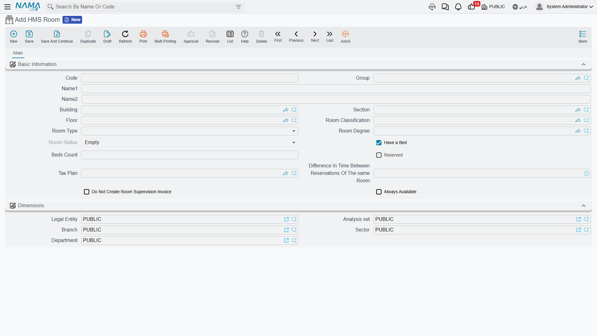
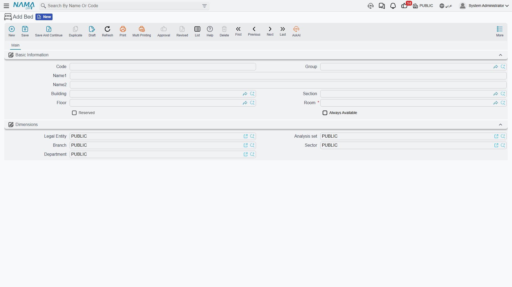
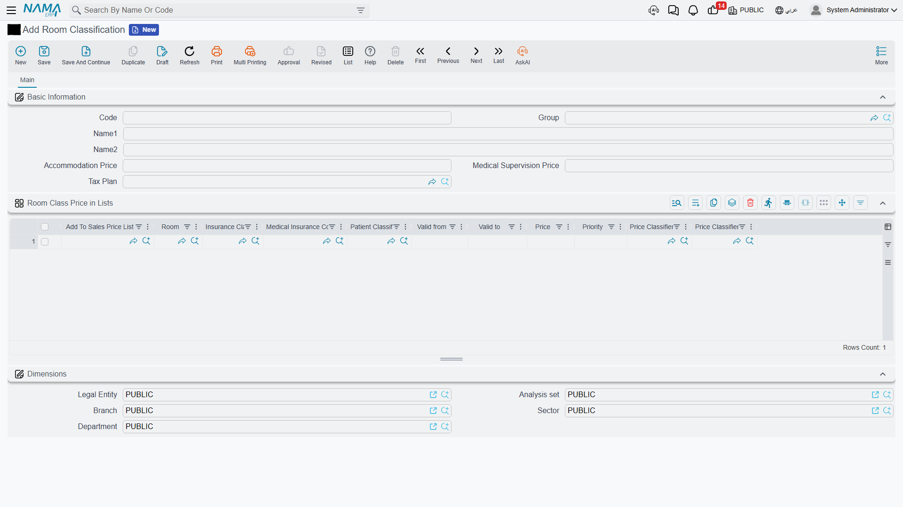
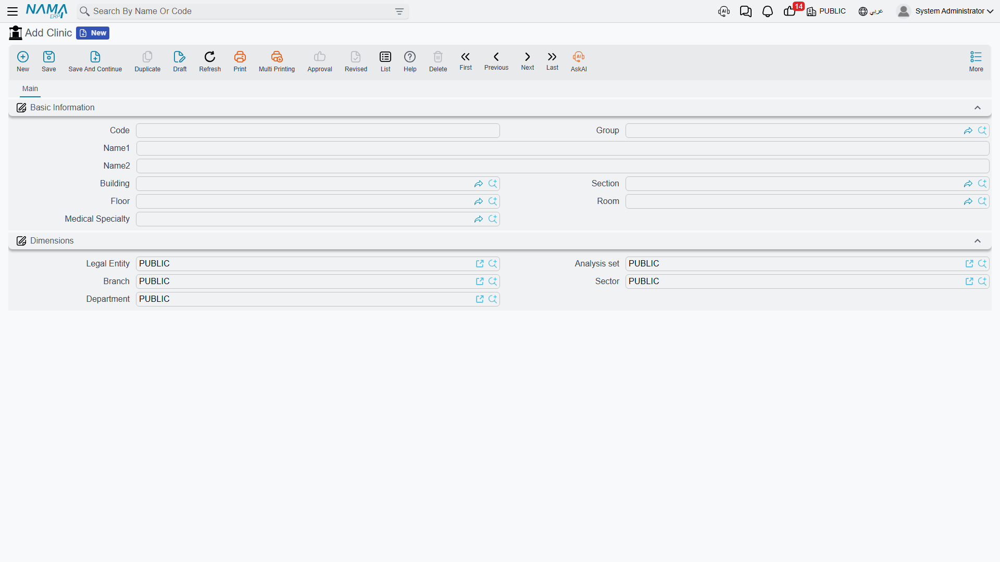

# Hospital Structure & Rooms

Before you admit your first patient, you need to map your building inside the system: which buildings you have, their floors and sections, which rooms and beds they hold, and which clinics operate. You'll find all of this under **Hospital Management System → Hospital Structure**, built once and then reused across every admission and accommodation document.

## The hierarchy: building → floor → section → room → bed

A hospital is organized in five nested levels:

- **HMS Building** — the top physical level. You may have several buildings (main building, outpatient building, maternity wing…). Everything below belongs to a building.
- **HMS Floor** — a level inside a building, so rooms and beds can be located precisely.
- **Hospital Section** — an operational/medical department (Surgery, Internal Medicine, ICU, Pediatrics…) that groups rooms, beds and clinics by clinical area.
- **HMS Room** — the most detailed unit (see below).
- **Bed** — an individual bed within a room, enabling admission and reservation at bed level (not just room level) in multi-bed rooms.

## The room: the heart of accommodation

The room is the richest of the structure files, because it controls bed booking, accommodation and billing. Besides its location (building/section/floor), a room carries:

- **Room Classification**, **Room Type** and **Room Degree** — classifiers that define the room's nature and price.
- **Have a Bed** and **Beds Count** — whether the room is a multi-bed ward or a single room.
- **Reserved** and **Room Status** — to track occupancy.
- **Difference in time between consecutive reservations of the same room** — the cleaning/preparation buffer before the room can be re-booked.
- **Do Not Create Room Supervision Invoice** and **Always Available** — billing and availability exceptions.
- **Tax Plan** — how tax is calculated on this room's accommodation.

The bed is a simpler file: its location (building/section/floor/room) and its status (reserved / always available).

## Room classification: where accommodation pricing lives

This is where accommodation is actually priced. For each **room classification** (private, shared, VIP, ICU…):

- **Accommodation Price** — the base nightly fee.
- **Medical Supervision Price** — the daily medical-supervision fee for patients in this class.
- **Tax Plan**.

Below that, a **price-in-lists** grid lets you vary the price by insurance company, insurance class, patient class, validity period (from/to) and a specific room — with a priority to break ties between matching rows. This is how the correct nightly rate flows automatically into the accommodation invoice for each patient's situation.

::: info Room classification vs. degree
**Room Degree** is a simple extra classifier (first, second, economy…) used alongside classification and type, and has no price of its own — pricing comes from the **room classification**.
:::

## Clinics

A **Clinic** is the consultation point for outpatients — a place tied to a location (building/section/floor/room) and to a **medical specialty**. It's used later in scheduling and outpatient reservations to route the patient to the right specialty and place.

::: tip Start with what you actually need
You don't have to enter every room and bed at once. Start with room classifications and their prices, then the sections and rooms where you'll first receive patients, and add the rest gradually.
:::
