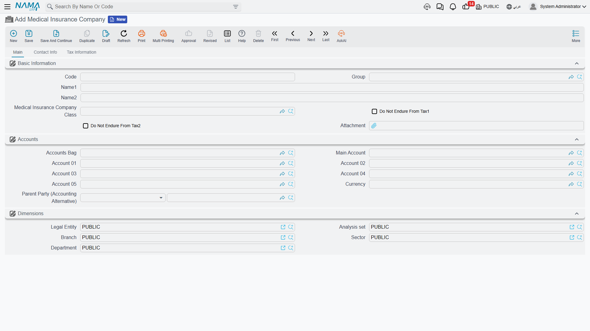
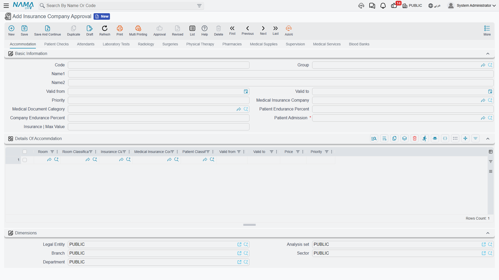

# Medical Insurance & Approvals

Insurance is what makes hospital billing different: the patient rarely pays the whole bill. So before we price any service, we define the insurance companies we deal with, how we classify them, and most importantly the **insurance approval** that sets the agreed prices and how they split between patient and company.

## Insurance companies and their classes

A **Medical Insurance Company** is the payer we bill for the covered portion of patients' invoices. It is a full accounting party — with a ledger account where coverage liability is posted and aged like any receivable. Besides Accounts, Taxes and Contact info, it carries the **Do Not Endure From Tax 1/2** flags.

To organize prices and coverage we use two classifiers:

- **Insurance Classification** — a coverage tier (gold, silver, VIP…) used as a dimension on price lines and invoices to pick the agreed price.
- **Medical Insurance Company Class** — a grouping of companies into one class, so a price/approval line can apply to a whole class of companies instead of a single one.

## The insurance approval: the source of prices and coverage

**Insurance Company Approval** is the heart of the insurance system. It is the agreed price list with the company, and it tells the system — per service type — the agreed price and the **patient-vs-company endurance split**.

The approval is organized into **one tab per service type** (accommodation, check, attendants, lab tests, radiology, surgeries, physiotherapy, pharmacy, supplies, supervision, services, blood bank). Each tab repeats a common header: **valid from/to, priority, insurance company, document category, patient endurance percent, company endurance percent, patient admission, and the insurance max value**. Each tab then carries a pricing grid specific to its service type (room and classification for accommodation; doctor, degree and test type for lab; surgery type and its fee components for surgeries; and so on).

When any service is billed, the system looks up the matching approval (by company, insurance class, patient class, doctor and date) and takes the price and the endurance percentages from it — and from it too comes the **insurance maximum value** shown on the invoice lines. This is how your agreements with insurers translate into the correct automatic split on every invoice.

::: tip Approvals vs. general prices
The approval sets insured patients' prices and their endurance split. Cash patients' prices come from a **[Medical Sales Price List](./hms-pricing.md)**. Both systems use the same classifiers (patient class, doctor, degree, period), so they work together.
:::
