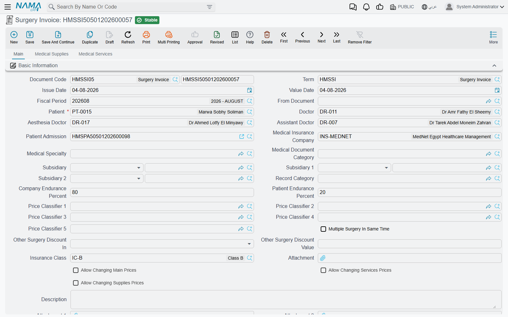
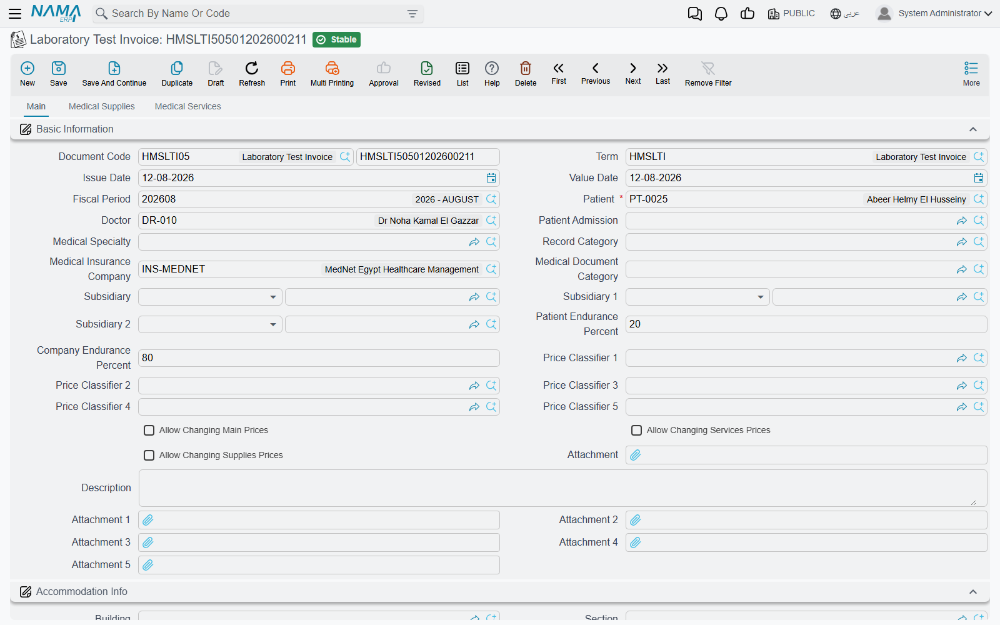
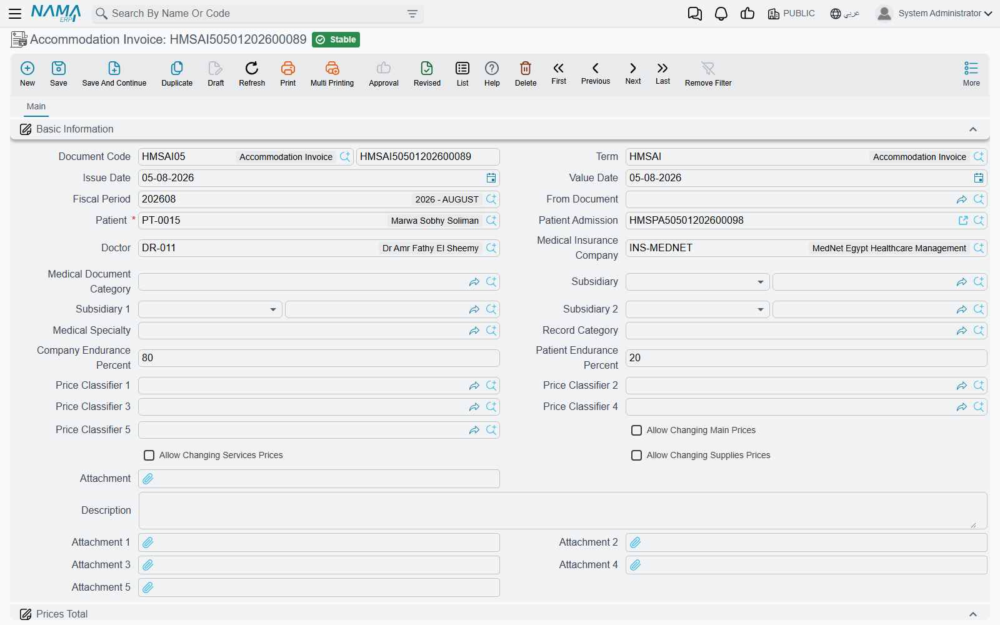
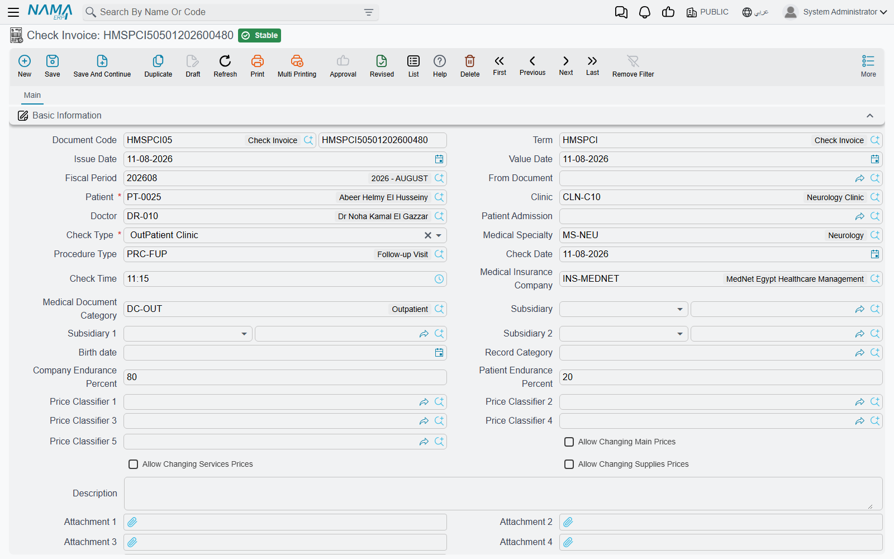
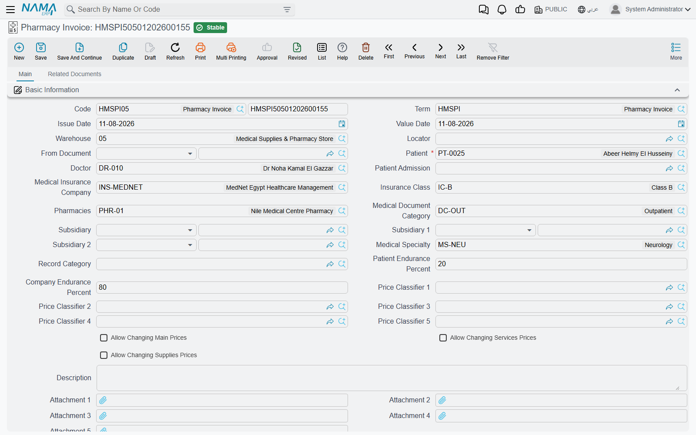
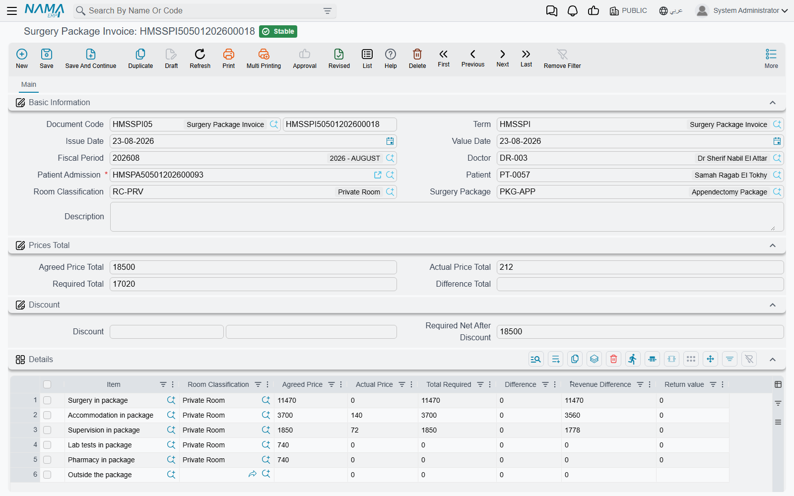
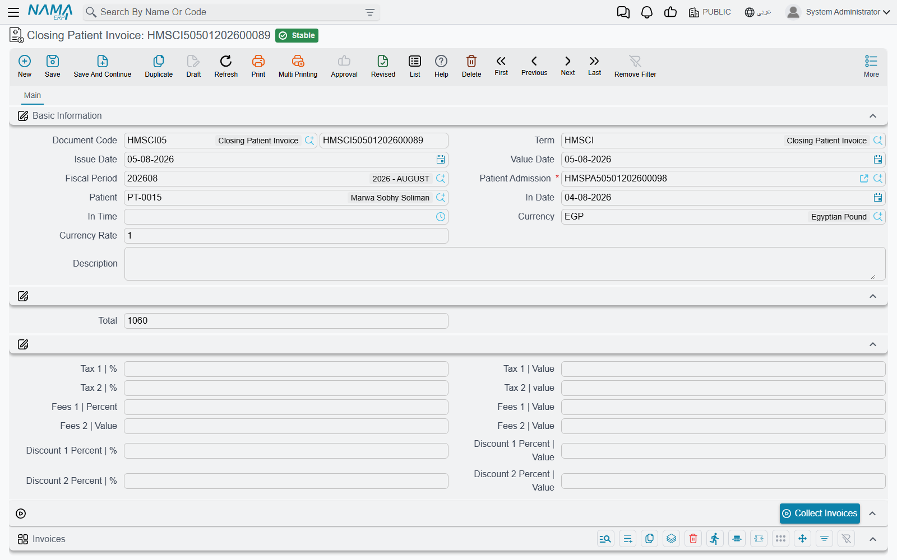

# Invoicing & Billing

Billing is the hospital's financial backbone. The rule is simple: **one invoice per service type**. These invoices are very similar in structure and then differ in their lines by service type. All of them are documents that produce an **accounting effect**.

## The common pattern across all invoices

Service invoices share one skeleton:

1. **Document header** — document code, term, issue and value dates, fiscal period, and dimensions.
2. **Patient context** — patient, **patient admission** (linking the charge to the admission), insurance company and class, patient/company endurance percentages, often the doctor, specialty and document category, and the cost-bearing parties.
3. **Service lines** — each with a rich price block that computes: price, discount 1/2, **patient/insurer split** (a percent and value each), the **insurance max value from the approval and from the admission**, taxes split between patient and insurer, **total patient due** and **total insurance due**, and the cost percentage/value with its allocation to subsidiaries.
4. **Totals** — mirroring the above at document level.
5. **Overhead lines** — on most invoices.

::: tip Split billing is the core idea
Every line is automatically divided into a **patient share** and an **insurance share** (using the endurance percentages from the [insurance approval](./hms-insurance.md) and the admission), each taxed separately and posted to a distinct account in the **term config**. That term config is what maps the value types (patient value, insurance value, discounts, taxes, cost, subsidiary cost) to ledger accounts.
:::

## Service invoices

These follow the service pattern (price + supervision + addition-time cost for surgeries):

- **Accommodation Invoice** — the room/bed accommodation fee, usually auto-generated from the accommodation document.
- **Attendant Invoice** — accommodation for the patient's companion.
- **Lab Test Invoice** — lab tests, with optional supplies and services.
- **Radiology Invoice** — imaging and its supplies.
- **Physical Therapy Invoice** — physiotherapy sessions.
- **Supervision Invoice** — the doctor's supervision of the patient.
- **Services Invoice** — general medical services.
- **Check Invoice** — the outpatient consultation, uniquely carrying a **Medicines** grid for drugs prescribed at the visit.

The richest of these is the **Surgery Invoice**: three tabs (surgery, supplies, services), with anesthesia and assistant doctors, price classifiers, accommodation info and attachments in the header; the surgery line breaks the fee into its components (open surgery, surgeon, assistant, anesthesia, other) with standard and additional hours. The supplies tab is a full inventory line that produces a stock issue.

## Inventory invoices and returns

These invoices **move stock** and add **Service Fees** accounts; their line is a full inventory line (item, unit, lot, batch, expiry, warehouse):

- **Pharmacy Invoice** and **Pharmacy Return** — dispensing drugs and returning them.
- **Supplies Invoice** and **Supply Return** — issuing supplies and returning them.
- **Service And Supply Invoice** — services and supplies on one document.
- **Blood Bank Invoice** — issuing blood units and related services (moves blood stock).

## The surgery package invoice

**Surgery Package Invoice** bills an operation against an **agreed package price** instead of itemized billing. It shows the **agreed price total**, the **actual** total and the **difference**, and per item: the agreed price, the actual price, and the difference and revenue difference. Accounting-wise, it posts the gap between the package price and the actual cost of services via dedicated difference accounts.

## The closing invoice

**Closing Invoice** is the discharge settlement document. When a patient leaves, this single invoice gathers **every individual invoice issued during the stay** into one statement, then applies admission-level taxes, fees and discounts to reach the final amount owed by the patient/insurer.

Its heart is the **Collect Invoices** button, which pulls all the patient's invoices tied to the admission into the details grid (invoice, date, value). Its header carries the admission, patient and in-date, plus **Tax 1/2**, **Fees 1/2** and **Discount 1/2** fields (percent + value) for admission-level adjustments. It posts the consolidated patient and insurance receivables together with those adjustments.

## Messages you may see

Several of these only appear when the invoice's term config asks for them: the empty-grid rules are switched on by *Prevent Save Without Services* and *Prevent Save Without Supplies*, and the two surgery-per-admission rules by their own options on the surgery term.

| Message | Why | What to do |
|---|---|---|
| *Main lines can not be empty* — «لا يمكنك ترك نفاصيل الرئيسية فارغة» | The invoice's main service grid has no rows. Every invoice except the Check Invoice and the Attendant Invoice requires at least one; on a pharmacy invoice or return it is the term option *Prevent Save Without Supplies* that raises it. | Add the service, drug or supply line that is being billed. |
| *Services lines can not be empty* — «لا يمكنك ترك نفاصيل الخدمات فارغة» | The invoice's term config has *Prevent Save Without Services* ticked and the Services grid is empty. | Add a services row, or untick that option on the term config if services are genuinely optional here. |
| *Supplies lines can not be empty* — «لا يمكنك ترك نفاصيل المستلزمات فارغة» | The invoice's term config has *Prevent Save Without Supplies* ticked and the Supplies grid is empty. | Add a supplies row, or untick the option on the term config. |
| *The current discount value {0} is greater than the max discount value {1} of current employee* — «قيمة الخصم الحالى {0} أكبر من اقصى قيمة خصم {1} للموظف الحالى» | A discount value exceeds the maximum the employee behind the logged-in user is allowed to give. On a line discount the two numbers are not filled in and the message shows `{0}` and `{1}` literally; on the surgery package invoice's header discount they are. | Reduce the discount, or have the invoice entered by someone whose employee record allows it. The limits are the Max Discount fields on the employee file. |
| *The current discount percentage {0} is greater than the max discount percentage {1} of current employee* — «نسبة الخصم الحالية {0} أكبر من اقصى نسبة خصم {1} للموظف الحالى» | As above, for a discount percentage rather than a value. | As above. |
| *Surgery type {0} is repeated* — «نوع عملية {0} مكرر» | Two surgery lines on a Surgery Invoice name the same surgery type, and the term config does not allow repeating it. | Merge the lines, or tick *Allow Repeating Surgery Type In Invoice Line* on the surgery term config if two operations of the same type really were performed. |
| *Surgery type {0} was not found in the surgery lines* — «نوع العملية {0} غير موجود فى سطور العمليات الجراحية» | A supplies or services row on a Surgery Invoice is attributed to a surgery type that has no line in the surgery grid. | Correct the surgery type on the row, or add the missing surgery line — every supply and service must hang off an operation being billed. |
| *From Date can not be after To Date* — «من تاريخ يجب أن يكون قبل إلى تاريخ» | On a Surgery Invoice line, the surgery-hours from date and hour fall after the to date and hour. | Correct the surgery hours; the check compares date *and* hour, so an operation crossing midnight needs the later date on the To side. |
| *There is an invoice {0} on the admission {1}, you can not create more than one invoice on the same admission* — «لا يمكنك إنشاء أكثر من فاتورة على استمارة دخول المريض {1}، حيث يوجد فاتورة {0} على نفس استمارة دخول المريض» | The surgery term config has *Do Not Create More Than Invoice On The Same Admission* ticked and a committed Surgery Invoice already exists for this admission. | Add the lines to the existing invoice, or cancel it first. |
| *There is an invoice {0} on the admission {1} and surgery type {2}, you can not use the same surgery type more than once* — «يوجد فاتورة {0} للاستمارة {1} لنوع العملية {2} - لا يمكنك انشاء اكثر من فاتورة لنفس نوع العملية الجراحية» | The surgery term config forbids the same surgery type twice on one admission, and a committed invoice on this admission already bills that type. | Bill the operation on the existing invoice, or relax the option on the term config. |
| *Surgery request used in another surgery invoice* — «طلب العملية الجراحية مستخدم بالفعل فى فاتورة عملية جراحية اخرى» | The From Document is a surgery request that is already linked to a different Surgery Invoice. | Open the request to find the invoice it belongs to; one request bills once. |
| *The patient Admission {0} does not have a surgery package* — «إستمارة الدخول {0} ليس بها اتفاق عملية» | A Surgery Package Invoice names an admission that carries no agreed surgery package, so there is no package price to bill against. | Put the package on the admission, or bill the operation with an ordinary Surgery Invoice. |
| *You can not create closing document for the admission document {0} because that document already has an closing document {1}* — «لا يمكن عمل فاتورة ختامية لهذا السند {0} حيث أنه له فاتورة ختامية بالفعل {1}» | The admission already has a Closing Invoice — the message names it. One discharge settlement per admission. | Open the existing closing invoice and press *Collect Invoices* again to pick up anything added since, or cancel it before writing a new one. |
