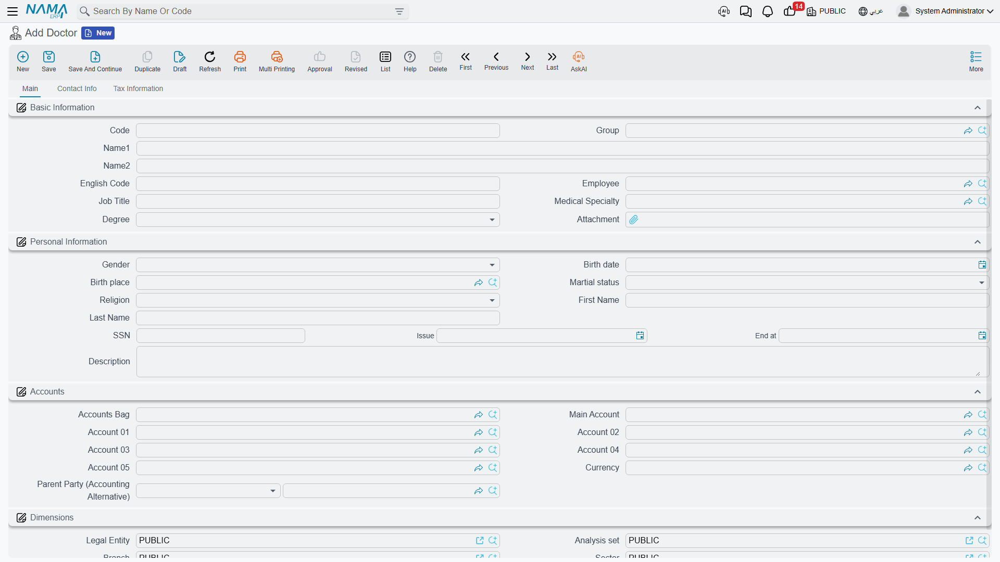
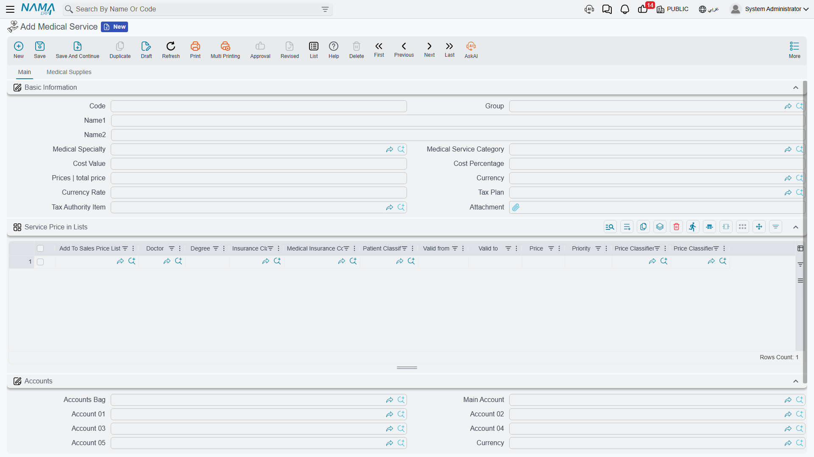
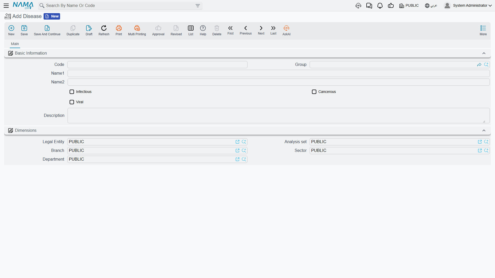
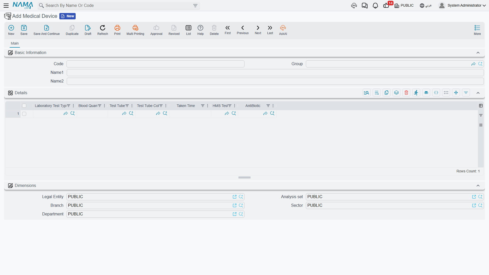
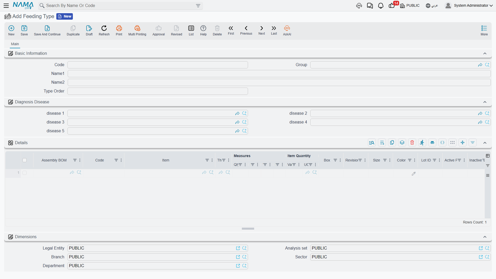
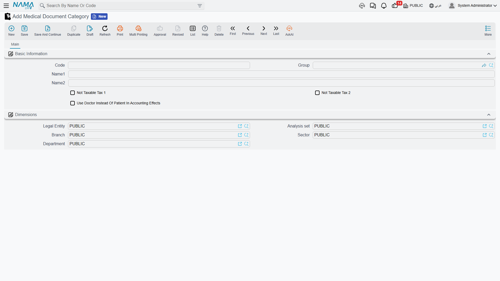

# Medical Master Files

Having mapped the building, we now define the staff and medical concepts that the documents work with every day: doctors, specialties, diseases, medical services, analyzers, feeding, and patient classes. Most live under **Hospital Management System → Master Files** (some under specialized menus such as Laboratory Tests and Feeding, as noted).

## The doctor

**Doctor** is one of the richest files. It records the physician's details, specialty and degree, can be linked to an HR **Employee** record, and — crucially — it acts as an **accounting party**, with its own ledger account so the doctor's share/commission can be paid out. Its data spans tabs: Basic Information (specialty, degree, job title), Personal Information (gender, birth, national ID), Accounts, Taxes, Contact Info, and Tax Information. Because **doctor and degree** are pricing classifiers, a service's price can differ from one doctor to another.

A **Medical Specialty** classifies doctors, clinics and services (cardiology, orthopedics, pediatrics…) and is itself an accounting party, so revenue can be tracked per specialty.

## The medical service

**Medical Service** is the core priced item in the system — a consultation, a procedure, a nursing service. It carries a **cost** and a **price**, a tax plan, and a **tax-authority item** (for e-invoicing), and links to a specialty and a service category. Like the room classification, it has a **price-in-lists** grid that varies the price by doctor/degree/insurer/patient class and period. What's distinctive is its **Medical Supplies** tab: a list of items consumed when the service is performed, so inventory is issued automatically at billing time.

Services are grouped under a **Medical Service Category** to organize the catalog and reporting.

## Diseases and antibiotics

**Disease** is the catalog of diagnoses used when recording a patient's diagnosis, and a disease can be flagged by nature: **infectious**, **cancerous**, or **viral** — useful later for choosing the right diet and for statistics.

**Antibiotic** is a list used by the labs (especially in sensitivity/culture testing) to record which antibiotics a sample was tested against. You'll find it under the **Laboratory Tests** menu.

## Analyzers

Despite its English label "Medical Device," this is a **lab analyzer**, and its definition specifies **which tests the device runs** and each test's requirements: blood quantity, tube type and color, time taken, and the associated test and antibiotic. This later drives the sample-collection instructions on lab requests. You'll find it under the **Laboratory Tests** menu.

## Feeding, patient classes and document categories

- **Feeding Type** — a patient diet (normal, diabetic, liquid…). It defines a priority **order**, the diseases it is recommended for (so a diet can be chosen automatically from the diagnosis), and a recipe-like list of food components (as a BOM) with quantities and costs to issue from the kitchen. This file plays a central role in **[Feeding Issues](./hms-accommodation.md)**.

- **Patient Classification** — a patient tier (cash, staff, company, exempt, VIP…), and a key **pricing classifier**: prices differ by patient class in price lists and insurance approvals.

- **Medical Document Category** — controls the **tax and accounting behaviour** of a whole class of documents: exempting them from Tax 1 or Tax 2, and choosing to **use the doctor instead of the patient in accounting effects** — handy for the doctor revenue-sharing model.

::: info Other simple classifiers
The system also includes simple reference lists such as **Procedure Type** for classifying medical procedures. These are defined with just a code and name and used for classification.
:::
