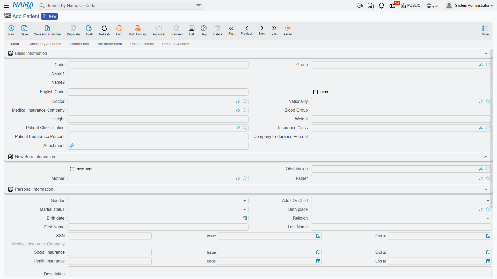
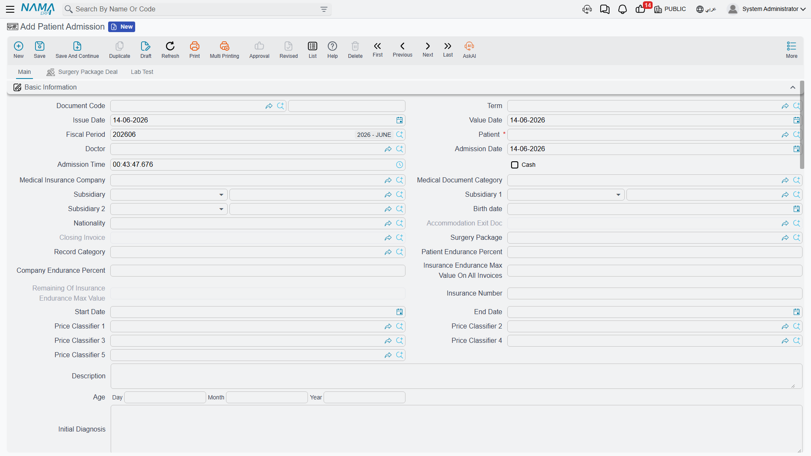
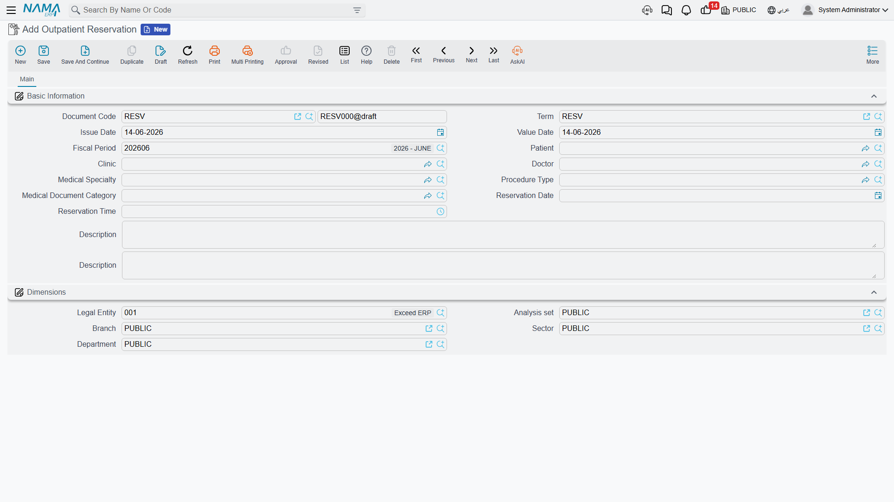
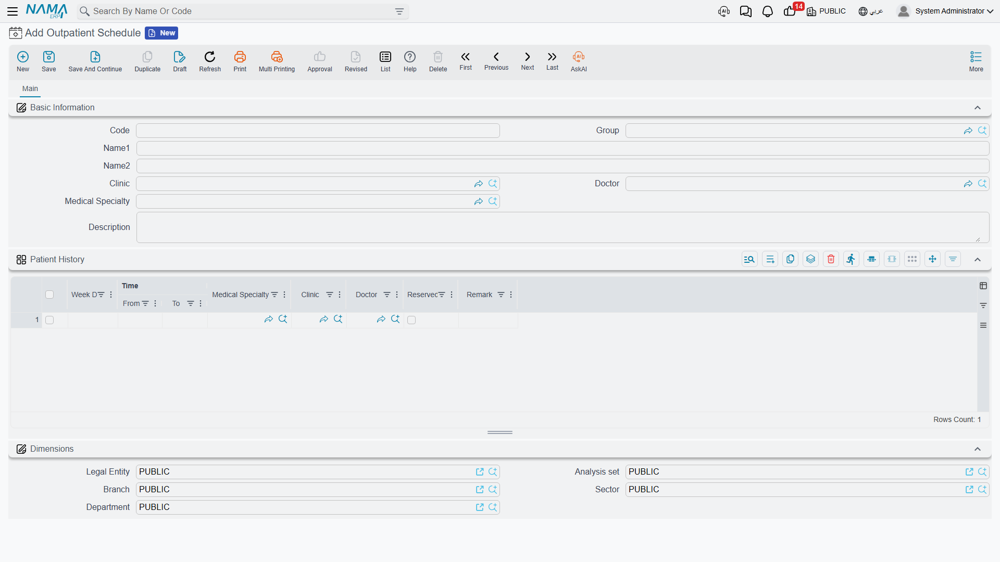
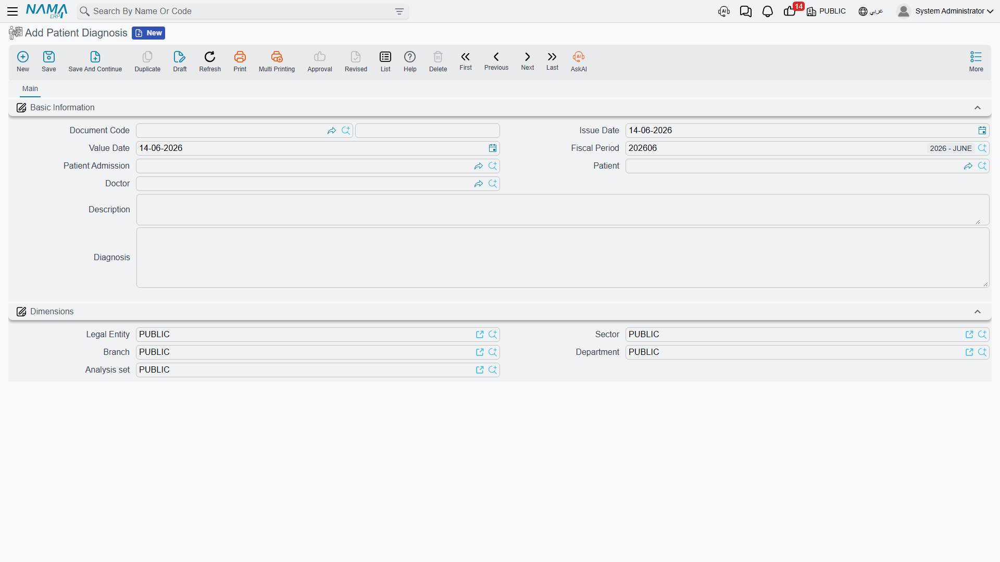
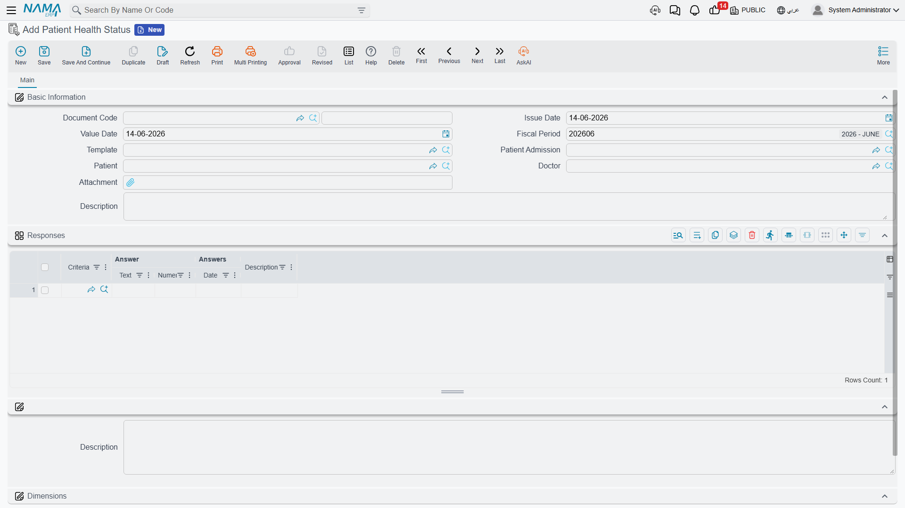
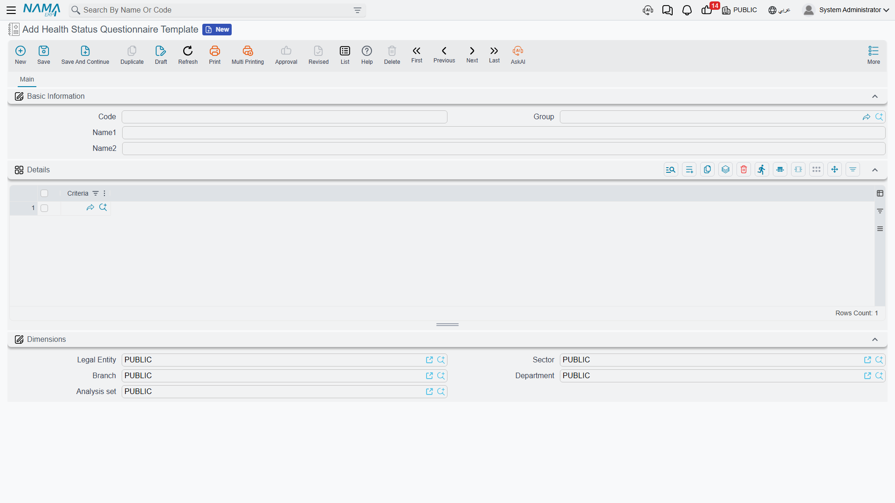

# Patients & Admission

This is where the patient's journey really begins. On this page we cover the patient file itself, how an outpatient is booked, how an inpatient is admitted via the admission form, plus recording diagnosis and health status.

## The patient file

**Patient** is the pivotal record everything attaches to. It is at once a medical record **and an accounting party** (via the Subsidiary Accounts tab), so the patient can be billed and tracked financially like any customer. Its data spans tabs: Basic Information (attending doctor, blood group, height, weight, patient class, insurance company, endurance percentages), New Born Information (linking an infant to mother and father), Personal Information (gender, birth — age is auto-calculated — national ID and insurance card), current accommodation info, plus Accounts, Taxes and Contact info.

The file also holds a **patient-history** grid (diagnosis date, disease, degree, medication) and a **Related Records** tab that gives a 360° view of the patient: admissions, checks, accommodations, lab tests, radiology, surgeries and all their invoices.

::: tip From patient file to admission
The patient file carries a **Create Patient Admission** button that opens a new admission form pre-filled with the patient's details, doctor and insurer — the start of the inpatient journey.
:::

## The patient admission

**Patient Admission** is the pivotal document for an inpatient — accommodation, surgeries, lab tests, diagnosis and the closing invoice all branch from it. It's the richest document in the module.

Its header carries: patient, doctor and admission date/time; insurance company and document category; endurance percentages; the **insurance maximum value across all invoices** with a live **remaining** counter; price classifiers; an initial diagnosis; and a **diagnosis diseases** group (used later to choose feeding). The admission also links the exit document, the closing invoice and a surgery package if any.

A key feature is the **Generate Accommodation Doc** flag: when ticked and the admission is saved, an **[Accommodation](./hms-accommodation.md)** document is generated automatically (booking the bed and starting accommodation charges). There's also an **Update Price Data on All Invoices** button to recompute endurance percentages across all the admission's invoices when the insurance plan changes. The admission carries grids for next-of-kin, services rendered during the stay, surgery-package items, and lab tests requested at admission.

## Outpatient clinics

For patients who don't need admission, we use the scheduling system:

- **Outpatient Schedule** — the recurring weekly availability for a clinic, doctor and specialty: per weekday, time slots (from/to) with a flag for whether each is taken.
- **Outpatient Reservation** — booking an actual visit: patient, clinic, doctor, specialty, procedure type, and the reservation date and time.

## Diagnosis and health status

**Patient Diagnosis** records the doctor's assessment of the patient (optionally linked to an admission): patient, doctor, and the diagnosis text.

**Patient Health Status** is a structured questionnaire filled in for a patient based on a reusable **template**. The template is built from reusable **health-status questions**:

- **Health Status Question** — a single question with a response type (text/choice/number/date); for "choice" it carries the list of allowed answers.
- **Questionnaire Template** — a reusable bundle of questions applied to patients.

The health-status document then records an answer per question (text/number/date) — ideal for nursing and intake forms.

