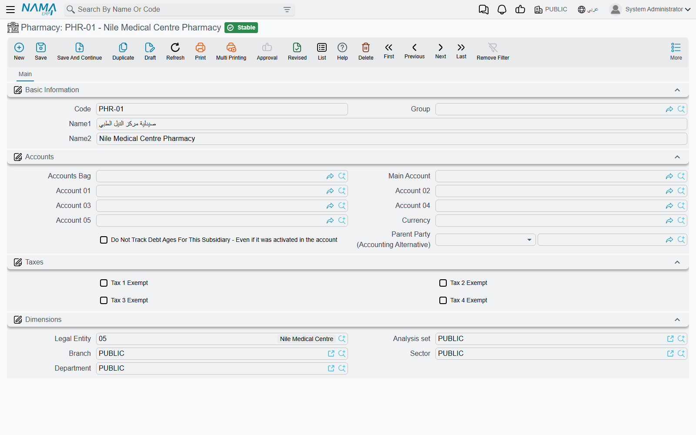
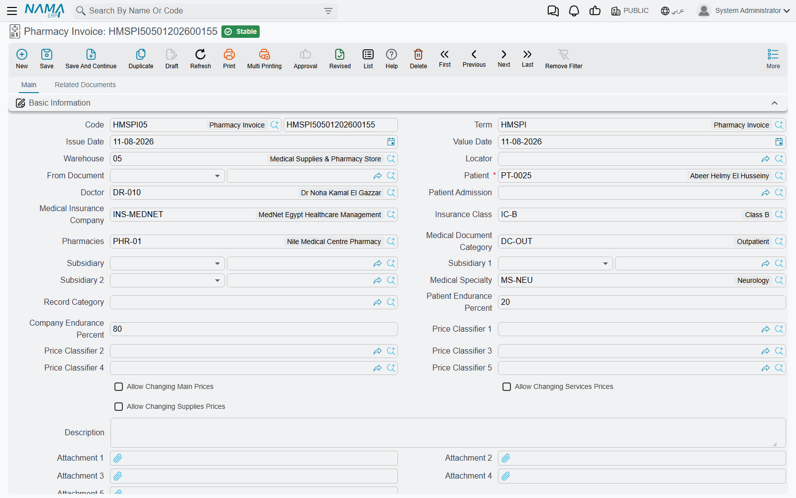
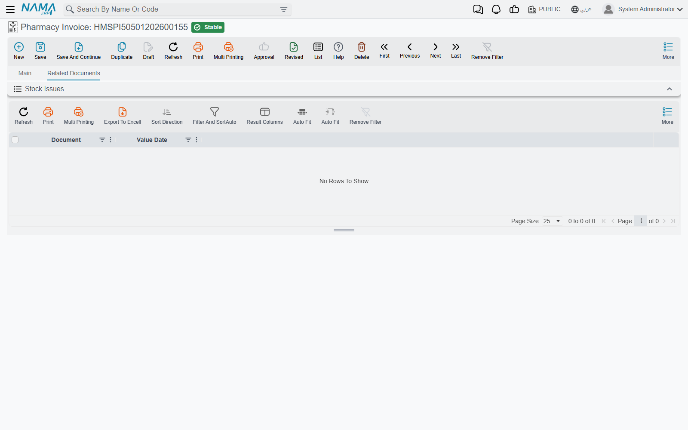
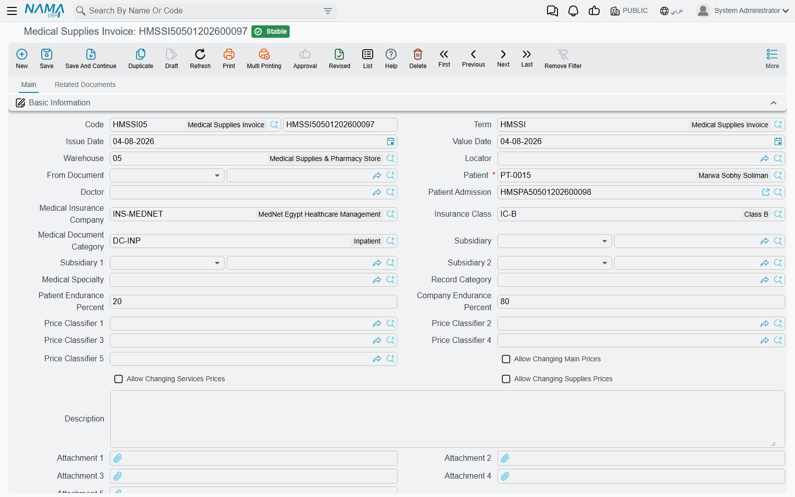
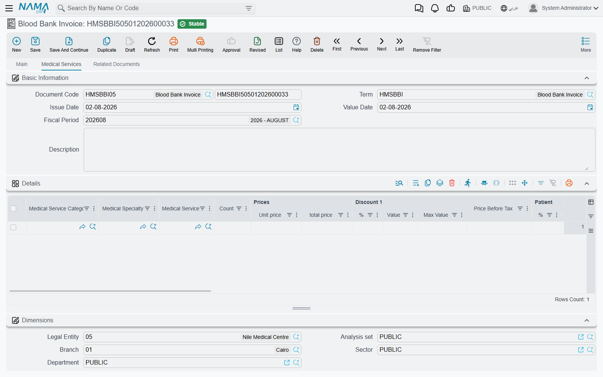
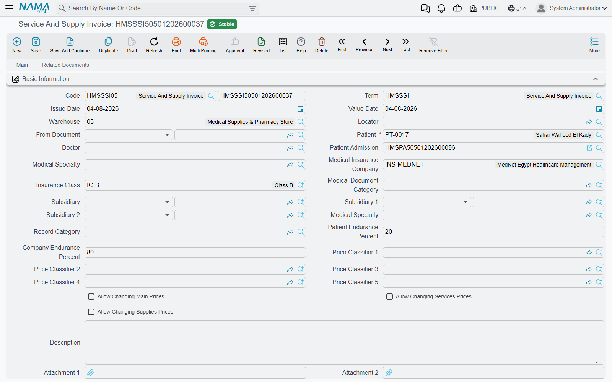

# Pharmacy, Supplies & Blood Bank

Most hospital invoices sell something you cannot put on a shelf — a consultation, a night in a room, an
X-ray. This page is about the other kind: drugs, medical supplies and blood units, which leave a
warehouse when they are billed and come back into it when they are returned. Each of these invoices
does two jobs at once. It bills the patient and the insurer, with the usual
[patient/insurer split](./hms-invoicing.md), and it **moves stock** by producing a stock issue (or, for a
return, a stock receipt) behind the scenes.

There are two routes by which stock leaves the warehouse in this module:

- **Stock invoices** — Pharmacy Invoice, Medical Supplies Invoice, Service And Supply Invoice and Blood Bank
  Invoice, plus their returns. Every line is an item line, and the whole grid becomes a stock document.
- **Supplies inside a service invoice** — a lab test, radiology, surgery or other service invoice that
  carries a supplies grid alongside its services. Only that supplies grid becomes a stock document.

The two routes are configured in different places on the document term, so they are covered separately
below.

## The Pharmacy and the Blood Bank master files

A **Pharmacy** (Hospital Management System → Pharmacies → Pharmacy) is the dispensing point a pharmacy
invoice is issued from — the main pharmacy, an inpatient pharmacy, an outpatient window. The file is
deliberately small: a code, a group, the Arabic and English names, a **Subsidiary Accounts** block and the
dimensions. That accounts block is the point of the file — it makes each pharmacy an accounting party, so
the pharmacy's revenue or stock movement can be posted to its own account.

A **Blood Bank** (Hospital Management System → Blood Banks → Blood Bank) has the same shape — basic
information, Subsidiary Accounts and dimensions — and plays the same role for blood units.

On the invoice's document term, an accounting side can take its subsidiary from the document: choose
**Pharmacy** as the source on a Pharmacy Invoice term, or **Blood Bank** on a Blood Bank Invoice term, and
the entry lands on the account of the pharmacy or blood bank named on the invoice header.

## The pharmacy invoice

**Pharmacy Invoice** (Hospital Management System → Pharmacies → Pharmacy Invoice) dispenses drugs to a
patient. Its header carries the patient, doctor and patient admission, the insurance company and
insurance class, the **Pharmacy**, the medical document category, the subsidiaries, the medical
specialty, the patient and company endurance percentages and the price classifiers. Below that sit the
accommodation information (the patient's room at the time), the price totals, and the overhead totals.

The **details** grid is a full inventory line — item, unit and quantity, warehouse, lot, box, revision,
size and colour, production and expiry dates — followed by the unit price, the medical specialty, and
the price block that splits each line between the patient and the insurer. The overhead items grid sits
under it.

When you pick an item, its price is looked up the same way as any other HMS service: by the item, unit
and quantity, the patient, the insurance company and class, the doctor and the price classifiers,
against the [insurance approval](./hms-insurance.md) and the [medical sales price list](./hms-pricing.md).

Saving the invoice creates a **stock issue** for the details grid, taking the warehouse and locator from
the invoice header. The **Related documents** tab lists it under **Stock Issues**, so you can open the
stock document from the invoice. Edit the invoice and the stock issue is updated; delete or cancel it and
the stock issue goes with it. If you empty the grid, the stock issue is deleted.

::: info The stock issue comes from the Generation tab
For the pharmacy invoice and the other stock invoices on this page, the stock document is created only
when the document term's **Generation** tab names a **Generation Book** and a **Generation Term**. Those
two fields decide which book and term the stock issue (or, for a return, the stock receipt) is saved
under. Leave either one empty and the invoice still bills and posts, but no stock moves.
:::

### Returning drugs: the pharmacy return

**Pharmacy Return** is the mirror document for drugs that come back unused. It carries the same header
(patient, doctor, admission, insurer, pharmacy, endurance percentages, price classifiers) and the same
item grid, but saving it creates a **stock receipt** instead of a stock issue — the Related documents
tab lists it under **Stock Receipt**. It has no overhead grid.

The return posts through the same accounting sides as the invoice (patient value, insurance value,
discounts, taxes, cost), and nothing in it reverses the direction for you: the return's own document term
must hold the sides the other way round from the invoice's term. Give the return term the patient value
on the credit side where the invoice term has it on the debit side, and so on for each pair.

## Supplies invoices and their return

**Medical Supplies Invoice** (Hospital Management System → Medical Services → Medical Supplies Invoice)
issues medical supplies — dressings, syringes, catheters — to a patient. It has the same header as the
pharmacy invoice minus the pharmacy, the same item grid, and the overhead items grid. Saving it creates a
stock issue, listed under **Stock Issues** on its Related documents tab.

**Supply Return** takes supplies back: same header and item grid, no overhead, and saving it creates a
stock receipt. As with the pharmacy return, its term's accounting sides must be set the other way round.

**Service And Supply Invoice** bills services and supplies on one document. Its main tab holds the item
grid first and then a second grid, **Medical Service Details**, where each row names a service category,
medical specialty and medical service with a count and its own price block. Only the item grid becomes
the stock issue; the service rows are billed but move no stock.

## Blood bank invoice and return

**Blood Bank Invoice** (Hospital Management System → Blood Banks → Blood Bank Invoice) issues blood units
and bills them. Its header names the **Blood Bank**; its main grid is an item grid like the pharmacy's,
and a second tab, **Medical Services**, holds service rows (cross-matching, for example) that are billed
alongside. Saving it issues the blood units through a stock issue, listed under **Stock Issues**.

**Blood Bank Return** receives unused units back into the blood bank's warehouse through a stock
receipt. It is described with the clinical documents on [Clinical Orders & Results](./hms-clinical-orders.md#The-blood-bank).

## Supplies inside service invoices

The second route starts on the master files. A **Medical Service** and each sellable type — lab test,
radiology, physical therapy and surgery type — carries a **Medical Supplies** tab: the items consumed
whenever that service is performed, with their quantities, warehouse and a **Free Item** tick. (See
[Medical Master Files](./hms-medical-master-files.md) and [Medical Service Catalog](./hms-service-catalog.md).)

When you pick that service or type on a line of a service invoice, its medical supplies are copied into
the invoice's supplies grid and priced, and its linked services into the services grid. A supply marked
**Free Item** is issued but not charged: on save its price is cleared, so it moves stock without adding
to the bill.

These supplies are turned into a stock document by the **Origin Document Effect** group on the service
invoice's document term:

| Field | What it does |
|---|---|
| **Origin Issue Document Type** | **Stock Issue** issues the supplies straight away. **Stock Issue Request** creates a request instead, for the store to fulfil. Leave it empty and no stock document is created. |
| **Stock Issue Book** / **Stock Issue Term** | The book and term the generated document is saved under. Both must be filled, or nothing is generated. |

The generated document takes its warehouse from the invoice header and is kept in step with the
invoice: editing the supplies grid updates it, emptying the grid deletes it, and cancelling the invoice
deletes it.

Two options on the same term decide how the supplies are billed. **Do Not Add Supplies To Invoice** keeps
the supplies grid out of the invoice total and out of its accounting entry — the supplies are still
issued from stock, but the patient is not charged for them on this invoice. **Do Not Add Services To
Invoice** does the same for the services grid.

## Prices on these invoices

Two term options and three actions control whether a saved invoice's prices can change.

**Update Prices With Save** on the document term re-prices every line from the approval and the price
lists each time the invoice is saved. That keeps the invoice in line with the current agreements, but it
also overwrites any price somebody typed by hand. For the exception, every invoice on this page except
the three returns carries three actions in the **More** menu:

| Action | What it does |
|---|---|
| **Allow Changing Main Prices** | Ticks the flag of the same name on the saved invoice, so the main grid's prices are no longer recalculated on save. |
| **Allow Changing Services Prices** | The same for the services grid. |
| **Allow Changing Supplies Prices** | The same for the supplies grid. |

The invoice must be saved before you press them. Once a flag is ticked, the prices on that grid are left
exactly as entered on every later save.

Two more term options apply to the stock invoices. **Prevent Save Without Supplies** refuses to save an
invoice whose item grid is empty, and **Prevent Save Without Services** refuses one whose services grid
is empty — so only tick the second on a term whose document has a services grid (the Service And Supply
Invoice and the Blood Bank Invoice).

## Messages you may see

| Message | Why | What to do |
|---|---|---|
| *Main lines can not be empty* — «لا يمكنك ترك نفاصيل الرئيسية فارغة» | The term has *Prevent Save Without Supplies* ticked and the item grid of a pharmacy, supplies, service-and-supply or blood bank invoice (or one of the returns) is empty. | Add the items being issued or returned, or untick the option on the term. |
| *Services lines can not be empty* — «لا يمكنك ترك نفاصيل الخدمات فارغة» | The term has *Prevent Save Without Services* ticked and the services grid is empty. On a document with no services grid, such as the Pharmacy Invoice, this option makes every save fail. | Add a service row, or untick the option on that term. |
| *Unit price can not be negative* — «سعر الوحدة لا يمكن أن يكون سالب» | A line's unit price is below zero. | Correct the unit price; to give something away, use a discount or, on a supplies line of a service invoice, the Free Item tick. |
| *Patient {0} does not match patient {1} in admission {2}* — «المريض {0} لا يطابق المريض {1} الموجود فى إستمارة الدخول {2}» | The patient on the invoice is not the patient on the patient admission it names. | Pick the admission that belongs to this patient, or correct the patient. |
| *Total of patient endurance percent and company endurance percent must equal 100* — «مجموع حقلى نسبة تحمل المريض ونسبة تحمل الشركة يجب أن يساوى 100» | The patient and company endurance percentages, on the header or on a line, do not add up to 100. | Fix the two percentages so that together they make 100. |
| *Overhead item {0} is repeated in line {1}* — «بند التكلفة الغير مباشرة {0} مكرر في السطر {1}» | The same overhead item appears twice in the invoice's overhead grid. | Delete the duplicate row. |
