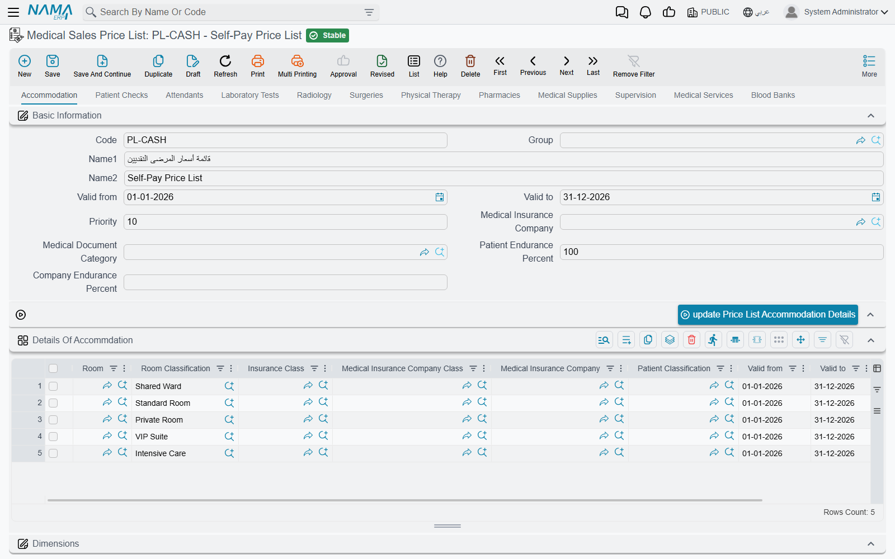
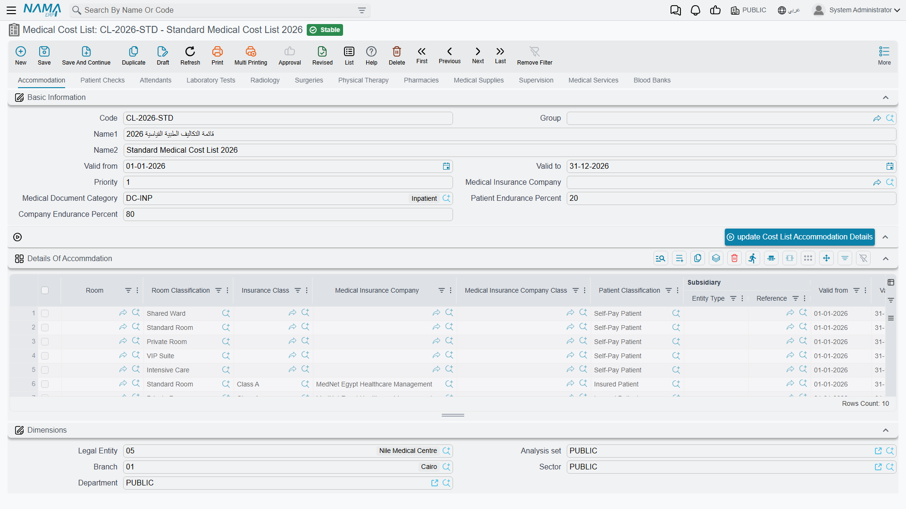
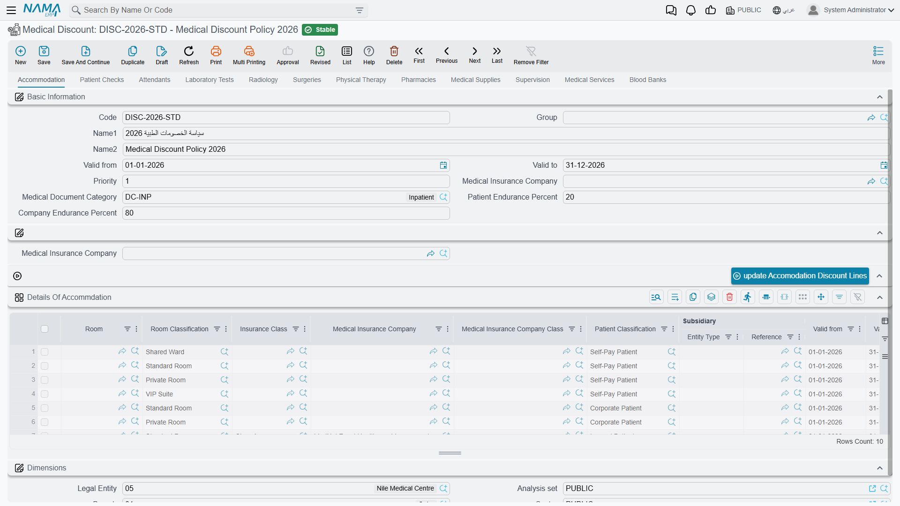
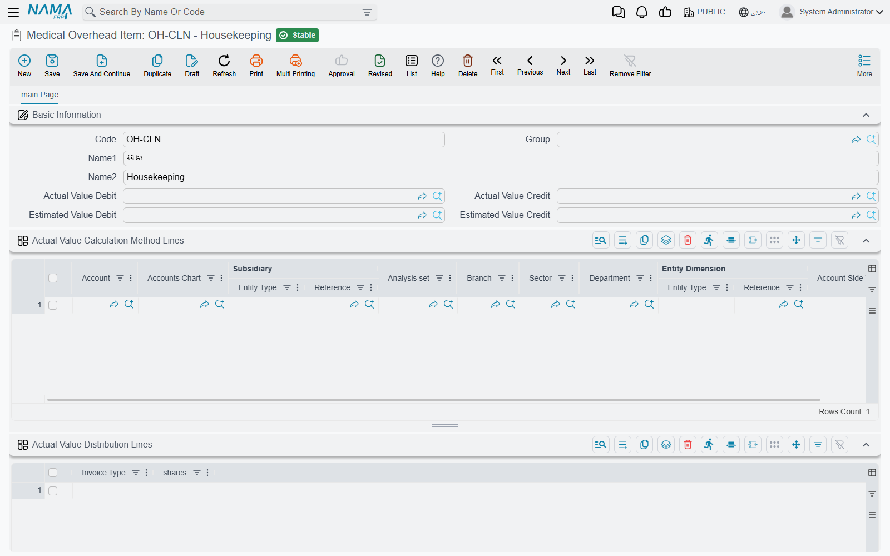
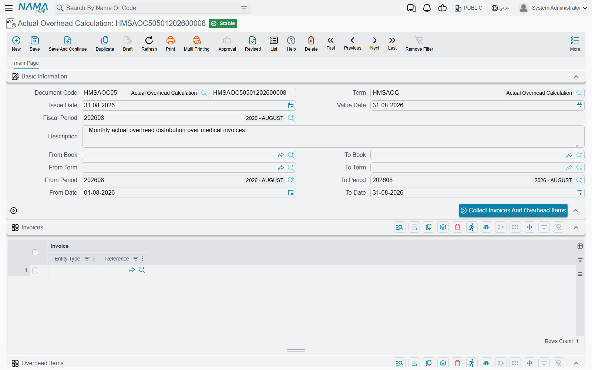
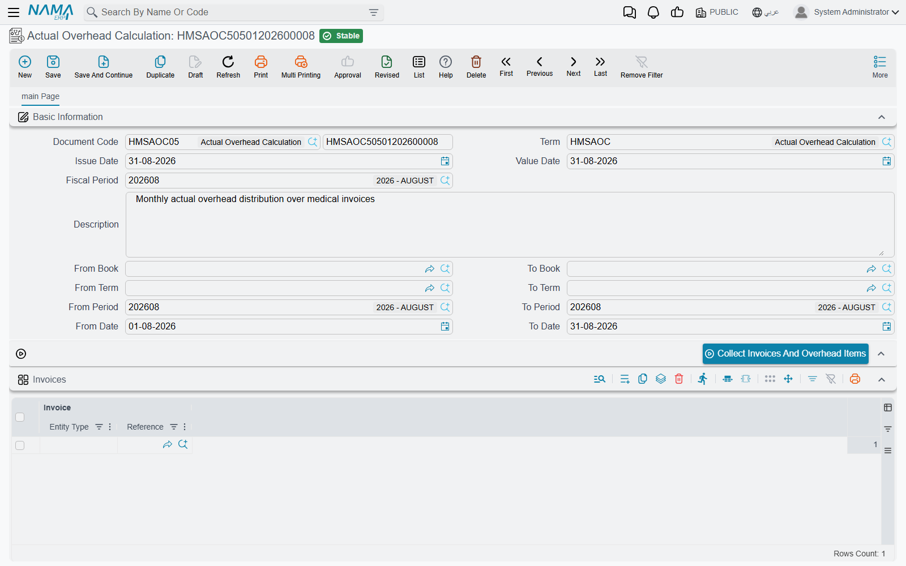
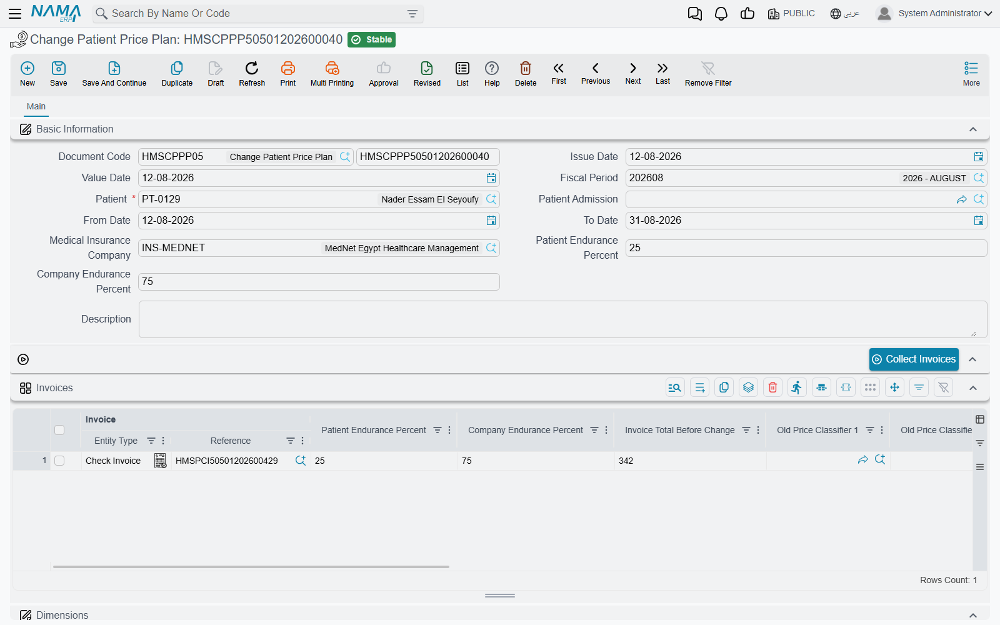

# Pricing, Costing & Discounts

Every hospital service has a selling price and a cost. As a hospital grows, pricing each service individually becomes impractical, so **lists** gather prices, costs and discounts in one place. These lists all share a single structure, so learning it once is enough.

| Screen | Menu | Its own buttons |
|---|---|---|
| **Medical Sales Price List** | Hospital Management System → Master Files → Medical Sales Price List | One update button per tab |
| **Medical Cost List** | Hospital Management System → Master Files → Medical Cost List | One update button per tab |
| **Medical Discount** | Hospital Management System → Master Files → Medical Discount | One update button per tab |
| **Medical Overhead Item** | Hospital Management System → Medical Overhead → Medical Overhead Item | None |
| **Medical Overhead List** | Hospital Management System → Medical Overhead → Medical Overhead List | One update button per tab |
| **Actual Overhead Calculation** | Hospital Management System → Medical Overhead → Actual Overhead Calculation | **Collect Invoices And Overhead Items**, **Calculate Overhead Value**, **Distribute Overhead Actual Value** |
| **Change Patient Price Plan** | Hospital Management System → Documents → Change Patient Price Plan | **Collect Invoices** |

## The shared structure: a tab per service type

The **sales price list, cost list, discount, and overhead list** all follow the same pattern: a tab per service area (accommodation, check, attendants, lab, radiology, surgeries, physiotherapy, pharmacy, supplies, supervision, services, blood bank), and a grid of lines on each tab.

Each tab repeats a common header: code and name, **valid from/to**, **priority**, **insurance company**, **document category**, and **patient/company endurance percent**. And the lines on every grid share the same **matching keys** used to select a line at billing time: the relevant service reference (room / doctor / test type / radiology type / surgery type / item…), degree, **insurance class, insurance company, insurance company class, patient class**, the period, and priority to break ties. What differs between the lists is only the **value columns**.

Every tab of the four lists ends with its own **update** button — on the sales price list's
accommodation tab it is *update Price List Accommodation Details*, and each tab names its own service
type. The button copies the tab's header values — priority, valid from and to, the price classifiers,
the insurance company, the patient and company endurance percents and the document category — onto
**every line of that tab's grid**, so you can enter a block of lines and stamp them with one set of
matching keys instead of filling each line by hand. The lines are changed on screen; save the list to
keep them.

## The medical sales price list

**Medical Sales Price List** is the selling-price book — its core column is **price**. Certain tabs add their own columns (the surgeries tab breaks out standard hours and surgeon/assistant/anesthesia fees; the pharmacy, supplies and blood tabs add quantity and unit). This list determines what the patient is charged for each service, varied by doctor, insurer, patient class and period.

## The medical cost list

**Medical Cost List** has the same shape, but its columns capture **cost** rather than price: **cost percentage and value**, with up to three **subsidiary** splits per line (the doctor's/lab's/external party's share of the revenue). On the surgeries tab every fee component expands into percentage + value + an additional-time cost. This list is used for revenue-sharing with doctors and for profitability.

## Medical discounts

**Medical Discount** applies two stacked discounts per line: **Discount 1** and **Discount 2** (each a percent and a max value). As on the other lists, each tab's update button stamps the header's insurance company, period, priority and endurance percents onto its lines. It's used to apply patient- or insurer-specific discounts to services.

## Indirect (overhead) costing

Not every cost is direct — there's electricity, cleaning, administration. The system allocates these onto services through a three-piece machinery:

- **Overhead Item** — defines a single indirect-cost item (electricity, housekeeping…) and its accounts, **how to read its actual value** from the ledger, and **how to distribute it** across invoice types by weights (shares).

- **Overhead List** — the **estimated** indirect cost loaded onto each service (it follows the shared tabbed structure), applied automatically to invoices.

- **Actual Overhead Calculation** — a period-end document that replaces the estimate on each invoice with its share of the **actual** cost (below).

### The period-end routine

Each invoice already carries an **estimated** overhead from the overhead list, posted through the
overhead item's estimated-value sides. At period end, the **Actual Overhead Calculation** works out
what the overhead really cost and spreads it back over the same invoices. Its three buttons are meant
to be pressed in order:

1. **Collect Invoices And Overhead Items** — fill in a date range or a period range (book and term
   ranges narrow it further) and press it. It lists every hospital invoice in the range on the
   **Invoices** grid, and every overhead item those invoices carry on the **Overhead Items** grid.
   Save the document.
2. **Calculate Overhead Value** — for each overhead item, reads its actual-value calculation lines
   (how to sum its real cost from the ledger) and writes the result on the **Actual Overheads** grid.
3. **Distribute Overhead Actual Value** — totals the actual value of each item and the estimated value
   the collected invoices carried for it.

Committing the document is what writes the result back: each overhead item's actual total is split
between invoice types by the **shares** on the item, and each invoice of that type receives the part
proportional to its own estimate. From then on the invoice's overhead line holds an actual value, and
its overhead is posted through the item's **actual-value** sides instead of the estimated ones.
Cancelling the calculation clears those actual values again.

## Changing a patient's price plan

Sometimes insurance coverage is confirmed after a patient is admitted and their invoices have been issued. The **Change Patient Price Plan** document re-prices a patient's issued invoices retroactively. You pick the patient, their admission, the period, the insurance company and the new endurance percentages; the **Collect Invoices** button gathers their invoices in range, and the grid shows for each invoice the **total before** and **after** the change, with the old and new price classifiers.

## Messages you may see

| Message | Why | What to do |
|---|---|---|
| *Field {0} and field {1} can not be filled together* — «لا يمكن ملءالحقل {0} والحقل {1} معاً» | A line on the **surgeries** tab of a medical sales price list names both a Surgery Type and a Surgery Classification. A line may be keyed on one or the other, never both. | Clear whichever of the two is not the matching key you want, and add a second line if you need both kinds of rule. |
| *You can not use overhead item {0} because it is already used in the same period in the document {1}* — «لا يمكنك استخدام بند التكلفة الطبية {0} حيث أنه بالفعل مستخدم في نفس الفترة في المستند {1}» | Another committed Actual Overhead Calculation whose periods and dates overlap this one already distributes the same overhead item; the message names it. | Remove the item from this document, or narrow the period range so the two do not overlap — an overhead item is distributed once per period. |
| *You Must At Least Fill From Date - To Date Or From Period - To Period* — «يجب على الأقل ملء الحقول من تاريخ - إلى تاريخ أو من فترة إلى فترة» | **Collect Invoices And Overhead Items** was pressed with no range at all. | Fill a date range or a period range, then press it again. |
| *Repeated invoice {0}* — «الفاتورة {0} مكررة» | The same invoice is listed twice in the Change Patient Price Plan grid, usually after pressing *Collect Invoices* on top of rows that were already there. | Delete the duplicate row, or clear the grid and collect again. |
| *Invoice {0} do not belong to patient {1}* — «الفاتورة {0} لا تخص المريض {1}» | A row in the grid names an invoice issued to a different patient — typically a row typed by hand, or left behind after the header patient was changed. | Clear the grid and press *Collect Invoices* again so only that patient's invoices are listed. |
