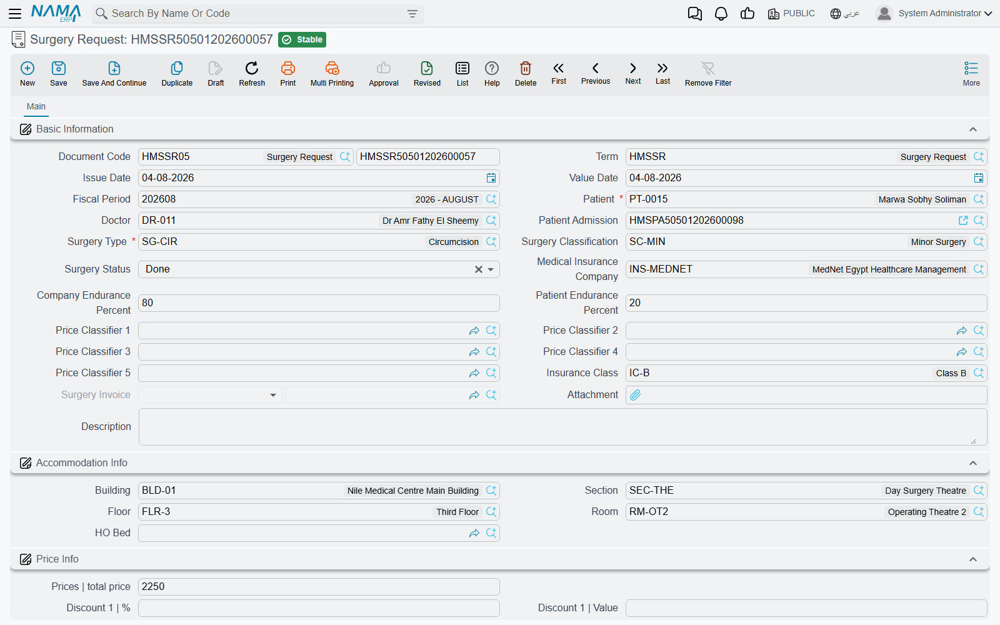
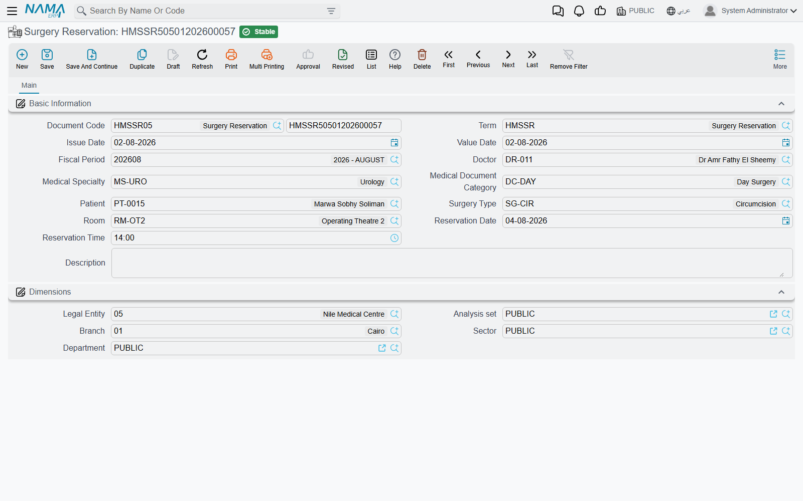
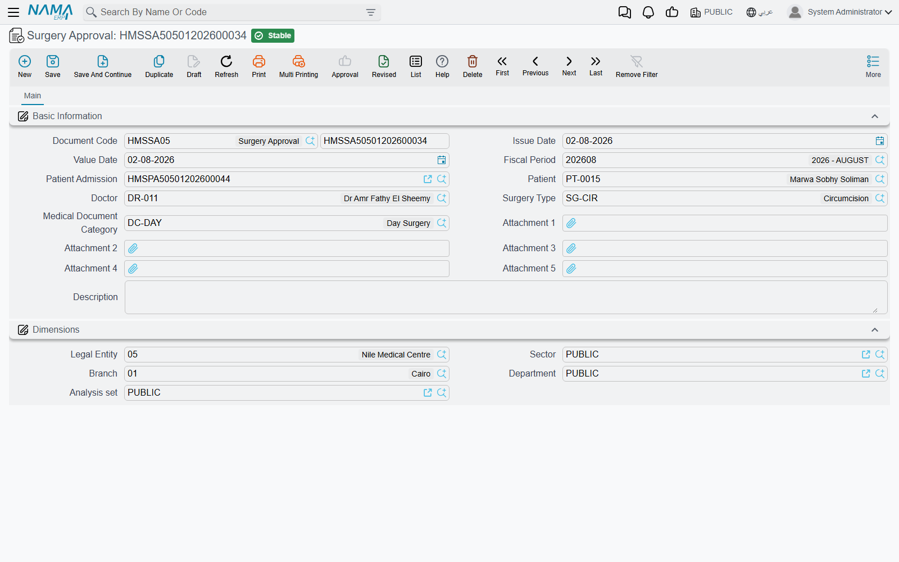
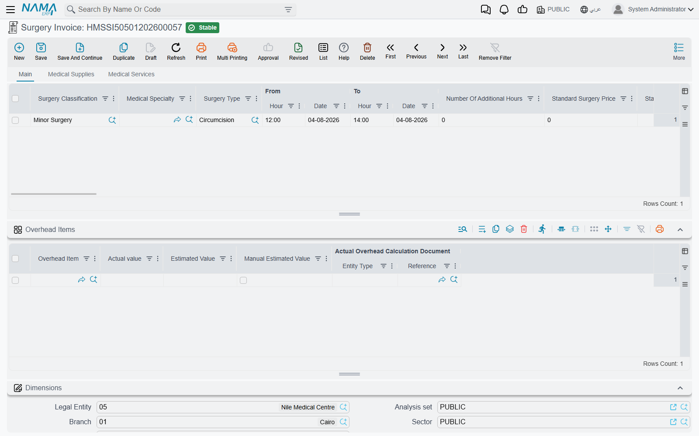
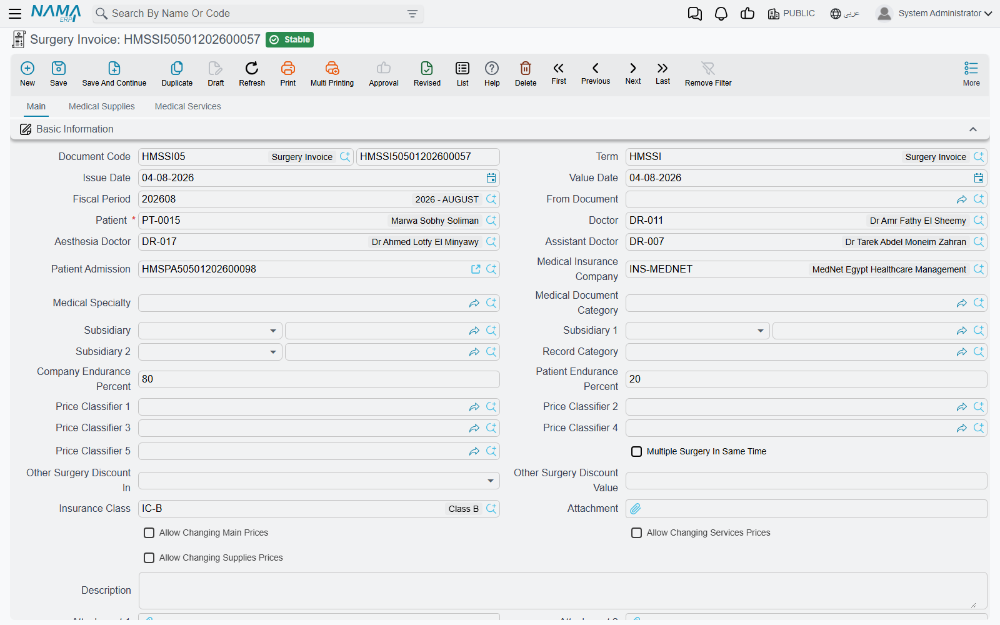
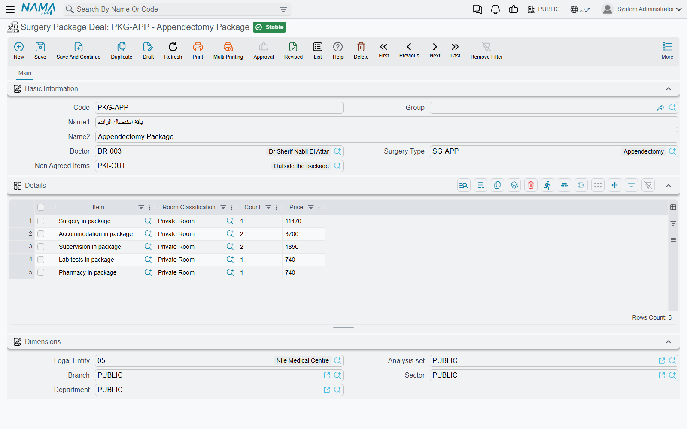
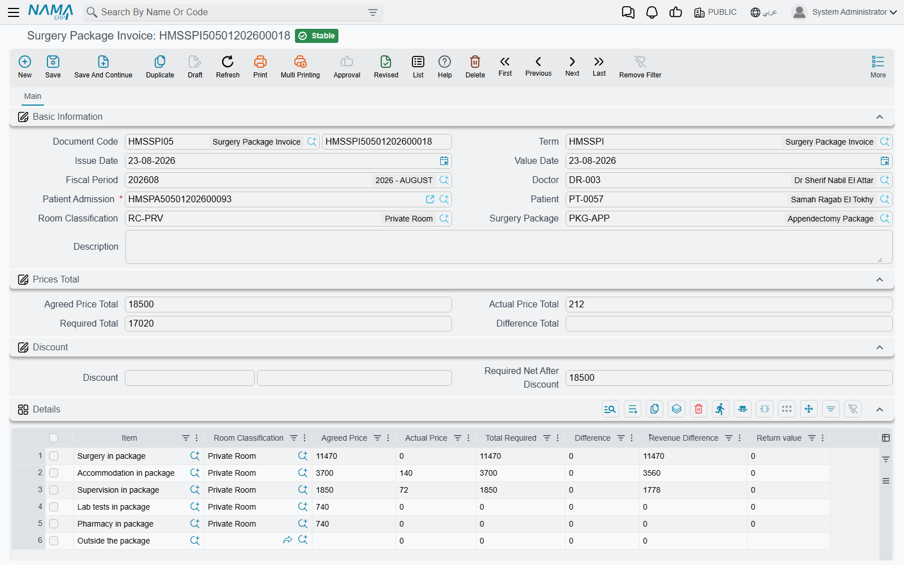
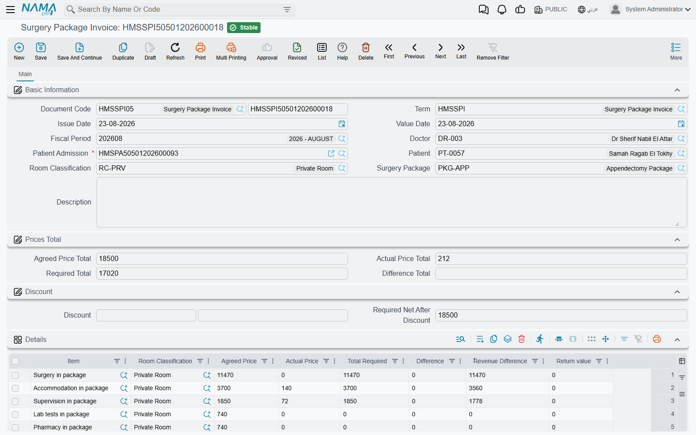

# The Surgery Lifecycle

An operation touches more screens than any other service in the hospital. The surgeon asks for it, the
theatre is booked, the patient signs a consent, the operation is billed with its supplies and services —
and, when the hospital has sold the patient an all-in package, the whole stay is later settled against the
agreed price. This page follows one operation through all of those screens, in the order a hospital meets
them.

The screens are spread over three menu groups, which is the first thing to know when you look for them:

| Screen | Where it lives in the menu |
|---|---|
| Surgery Request | Hospital Management System → Surgeries |
| Surgery Invoice | Hospital Management System → Surgeries |
| Surgery Approval | Hospital Management System → Documents |
| Surgery Reservation | Hospital Management System → Surgery Package Deal |
| Surgery Package Deal | Hospital Management System → Surgery Package Deal |
| Surgery Package Invoice | Hospital Management System → Surgery Package Deal |

None of the documents creates the next one automatically. Each is entered on its own, and they are tied
together by the patient, the admission and — between the request and the invoice — the **From Document**
field.

## 1. The surgery request

A **Surgery Request** is the surgeon's order: which patient, which admission, which **Surgery Type**, the
**Surgery Classification**, and a **Surgery Status** that moves through *Initial*, *In Progress* and *Done*.
It also carries the insurance context the invoice will need — **Medical Insurance Company**, **Insurance
Class**, **Company Endurance Percent** and **Patient Endurance Percent**, the price classifiers — plus the
patient's **Accommodation Info** (building, section, floor, room, bed) and a **Price Info** block.

The request posts nothing and has no buttons of its own. Its read-only **Surgery Invoice** field stays empty
until an invoice is saved from it, and is what tells you the request has been billed.

## 2. Booking the theatre: the surgery reservation

A **Surgery Reservation** books an operating room for a date and time: **Doctor**, **Medical Specialty**,
**Patient**, **Surgery Type**, **Room**, **Reservation Date** and **Reservation Time**. It is not linked to
the request or to the admission; it is the scheduling record.

Rooms need time between operations for cleaning and preparation. Each room carries a **Difference In Time
Between Reservations Of The same Room**, and when the reservation's term has **Consider Difference In Times
Between Reservations Of The same Room** ticked, saving checks every other saved reservation of the same room.
If one starts within that gap either side of yours — a 60-minute gap and an existing booking at 10:00 blocks
anything from 09:00 to 11:00 — the reservation is refused and the message names the conflicting booking. With
the option ticked, the room's gap field becomes mandatory too, so the room file must have it filled in.

## 3. The consent: the surgery approval

A **Surgery Approval** records that the patient (or guardian) agreed to the operation: **Patient Admission**,
**Patient**, **Doctor**, **Surgery Type**, **Medical Document Category** and up to five attachments for the
signed forms. It has no buttons, posts nothing, and no other document checks for it — it is the hospital's
record, kept against the admission.

## 4. Billing the operation: the surgery invoice

The **Surgery Invoice** is where the money is. It has three tabs — **Main** (the operations themselves),
**Medical Supplies** and **Medical Services** — and every priced line is split between patient and insurer
as on any other hospital invoice (see [Invoicing & Billing](./hms-invoicing)).

### Starting from the request

Pick the request in **From Document** and the invoice fills itself in: patient, doctor, admission, insurance
company and class, endurance percentages, price classifiers, accommodation info and the remarks are copied,
and one operation line is added for the request's surgery type, classification and status, priced afresh from
the price sources. The From Document lookup only offers requests that are not yet billed (or are billed on
this same invoice), so one request bills once; saving the invoice writes the invoice back into the request's
**Surgery Invoice** field, and cancelling or deleting it clears that field again.

You can also leave From Document empty and enter the lines directly.

### The operation lines and their hours

Choosing a **Surgery Type** on a line does a lot at once:

- fills the **Surgery Classification** from the surgery type;
- prices the line, including its **Standard Surgery Price**, **Standard Hours Number** and **Additional Hour
  Price**, and the split into the fee components **Open Surgery**, **Surgeon Fees**, **Surgeon Assistant**,
  **Anesthesia Fees** and **other**, each with its cost percentage and value;
- loads the surgery type's default supplies onto the **Medical Supplies** tab and its default services onto
  the **Medical Services** tab, each priced, with the supplies' **Planned Quantity** taken from the surgery
  type;
- recalculates the overhead items.

Operations often run longer than planned, and the line's **From** and **To** date and hour handle that. On
save, the system measures the real duration, subtracts the standard hours and writes the rest into **Number
Of Additional Hours**. The line price is then the standard price plus additional hours × additional hour
price. A surgery with 2 standard hours at 5,000 and 800 per extra hour that runs from 10:00 to 13:30 is
billed 5,000 + 1.5 × 800 = 6,200.

The cost of that extra time is tracked per fee component: the **Calc Addition Time For …** ticks (for open
surgery, surgeon, surgeon assistant, anesthesia, other and subsidiary) decide which components carry an
addition-time cost value. Untick one and its addition-time cost is set to zero.

### Other header options

- **Multiple Surgery In Same Time** — when several operations are done in one session, the most expensive
  line keeps its price and every other line gets the **Other Surgery Discount Value** percentage as a
  discount, placed in Discount 1 or Discount 2 according to **Other Surgery Discount In**. Their cost and
  subsidiary values are reduced by the same percentage.
- **Anesthesia Doctor** and **Assistant Doctor** — recorded alongside the surgeon.
- **Do Not Remove Supplies And Services With Surgery Type** — normally, deleting an operation line also
  deletes the supply and service lines that came with it. Tick this to keep them.
- **Warehouse** and **Generated Issue Document** on the Medical Supplies tab — the warehouse the supplies are
  issued from, and the stock issue created for them according to the term.

Every supply and service line belongs to one of the operations on the invoice (its **Surgery Type** column);
if it is left empty, the first operation's type is filled in on save.

### Freezing prices: the More-menu actions

The invoice's term can have **Update Prices With Save** ticked. Then every save prices the lines again from
the price sources, which keeps the invoice in step with price lists and approvals but overwrites any price
typed by hand. The **More** menu of a saved invoice has three actions that turn re-pricing off for one part
of this invoice:

| Action | What stays as entered |
|---|---|
| **Allow Changing Main Prices** | The operation lines |
| **Allow Changing Services Prices** | The Medical Services lines |
| **Allow Changing Supplies Prices** | The Medical Supplies lines |

Each action ticks the header check box of the same name, and the screen reloads. From then on, prices
you type on that part survive saving.

### The term options that govern surgery invoices

Three term options exist mainly for surgery:

- **Allow Repeating Surgery Type In Invoice Line** — lets one invoice carry the same surgery type on two
  lines. Without it, the second line is refused.
- **Do Not Create More Than One Invoice On The Same Admission** — one surgery invoice per admission.
- **Do Not Create More Than One Invoice for The Same Surgery Type On The Same Admission** — a surgery type
  can be billed only once per admission, across invoices.

The term also maps the accounting: besides the usual patient, insurance, discount, tax and cost sides, a
surgery term has a side pair per fee component and per addition-time cost (**Price Components Costs**).

## 5. The package path

Some patients buy the operation as a package: one agreed price for the operation and, often, the stay around
it. That path adds two screens.

### The package deal and the admission

A **Surgery Package Deal** names a **Doctor** and a **Surgery Type**, a **Non Agreed Items** package item for
anything billed outside the deal, and a details grid of package items, each with a room classification, a
count and a **Price** — the agreed price for that part of the stay. Picking a package item fills the room
classification from it. See [Medical Service Catalog](./hms-service-catalog#Surgery-packages) for package
items.

The package is attached to the patient through the **Patient Admission**: its **Surgery Package** field, and
the admission's **Surgery Package Deal** tab, which lists the package items and their agreed prices when the
admission is saved. Every invoice of the stay is then billed normally — surgery invoice, accommodation,
pharmacy and so on.

### Settling the package: the surgery package invoice

At the end, the **Surgery Package Invoice** compares what was agreed with what was actually billed. Pick the
**Patient Admission** — the lookup offers admissions of the chosen patient that carry a package and have not
yet been closed by an accommodation exit; the term option **Show All Patient Admissions** removes that filter
— and the invoice fills the patient and the package, then builds one line per package item:

- **Agreed Price** — from the package.
- **Actual Price** — the total of the admission's saved invoices that the package item covers, matched by
  the item's flags (a surgery invoice is matched in three parts: its operations, its supplies and its
  services). Returns (pharmacy, supplies, blood bank) are subtracted and shown in **Return value**.
- **Total Required** — the larger of the two.
- **Difference** — how far the actual exceeded the agreed price.
- **Revenue Difference** — how much of the agreed price was not used.

Invoices that no package item covers are gathered on a last line under the package's **Non Agreed Items**,
which has no agreed price, so its whole actual price is required. The header shows **Agreed Price Total**,
**Actual Price Total**, **Required Total** and **Difference Total**, and the **Discount** group (percent or value,
each filling the other) gives **Required Net After Discount**. The lines are rebuilt from the admission's
invoices on every save.

On save, the invoice posts three amounts, each only when the term has both sides of its pair: the total
**Difference** (Difference Debit / Credit), the total **Revenue Difference** (Revenue Difference Debit /
Credit) and the header discount (Invoice Discount Debit / Credit). The individual invoices have already
posted the patient's and insurer's receivables; this document posts only the settlement against the
package.

The package invoice has no buttons of its own.

## Messages you may see

| Message | Why | What to do |
|---|---|---|
| *There is a reservation doc {0} on the room {1}, reserved at {2} and the allowed time to make another reserve on this room is {3}* — «يوجد سند حجز {0} على الغرفة {1} تم الحجز في {2} والوقت المسموح به لعمل حجز آخر على نفس الغرفة هو {3}» | Another saved Surgery Reservation books the same room within the room's gap, and the reservation term has *Consider Difference In Times Between Reservations Of The same Room* ticked. | Move the reservation outside the gap, book another room, or review the gap on the room file. |
| *Main lines can not be empty* — «لا يمكنك ترك نفاصيل الرئيسية فارغة» | The surgery invoice has no operation line. | Add the operation being billed. |
| *Surgery type {0} is repeated* — «نوع عملية {0} مكرر» | Two operation lines name the same surgery type and the term does not allow repeating it. | Merge the lines, or tick *Allow Repeating Surgery Type In Invoice Line* on the term if two such operations really were done. |
| *Surgery type {0} was not found in the surgery lines* — «نوع العملية {0} غير موجود فى سطور العمليات الجراحية» | A supply or service line is attributed to a surgery type that has no operation line. | Correct the surgery type on the row, or add the missing operation line. |
| *From Date can not be after To Date* — «من تاريخ يجب أن يكون قبل إلى تاريخ» | On an operation line, the From date and hour fall after the To date and hour. | Correct the hours; an operation crossing midnight needs the later date on the To side. |
| *Total of patient endurance percent and company endurance percent must equal 100* — «مجموع حقلى نسبة تحمل المريض ونسبة تحمل الشركة يجب أن يساوى 100» | On an operation or service line, the patient and insurance percentages do not add up to 100. | Correct the two percentages on the line. |
| *Surgery request used in another surgery invoice* — «طلب العملية الجراحية مستخدم بالفعل فى فاتورة عملية جراحية اخرى» | The From Document is a request already billed on a different surgery invoice. | Open the request; its Surgery Invoice field names the invoice that billed it. |
| *There is an invoice {0} on the admission {1}, you can not create more than one invoice on the same admission* — «لا يمكنك إنشاء أكثر من فاتورة على استمارة دخول المريض {1}، حيث يوجد فاتورة {0} على نفس استمارة دخول المريض» | The term allows one surgery invoice per admission and a saved one exists. | Add the lines to the existing invoice, or cancel it first. |
| *There is an invoice {0} on the admission {1} and surgery type {2}, you can not use the same surgery type more than once* — «يوجد فاتورة {0} للاستمارة {1} لنوع العملية {2} - لا يمكنك انشاء اكثر من فاتورة لنفس نوع العملية الجراحية» | The term allows each surgery type once per admission and a saved invoice already bills this one. | Bill it on the existing invoice, or relax the option on the term. |
| *The patient Admission {0} does not have a surgery package* — «إستمارة الدخول {0} ليس بها اتفاق عملية» | The package invoice names an admission without a surgery package. | Put the package on the admission, or bill with an ordinary surgery invoice. |
