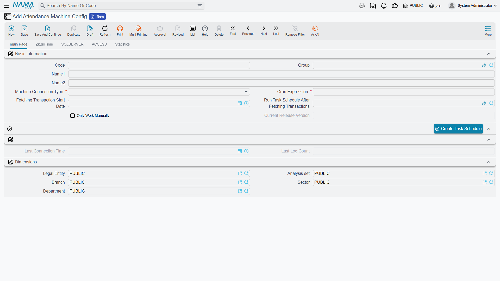

# Attendance Machines

Raw punch data can reach Nama in one of two ways. It can be **pulled automatically** on a schedule, straight from the fingerprint machine's own API or database — configured once through an **Attendance Machine Configuration** (إعدادات ماكينة الحضور) — or it can be **imported by hand** from a time-sheet file the machine exports, matched against a named formula that tells Nama how that file's columns and dates are laid out. This page covers the automated path and its configuration entity; the manual file-import formula and the handling of imperfect punch data each have their own dedicated, in-depth page linked below.

## Attendance Machine Configuration — the automated path

Found at **Payroll > Time Attendance > Attendance Machine Config**.

::: tip Requires its own license
Automated machine integration is gated behind a dedicated add-on (`humanresource-attendance-import-cron`), separate from the base Payroll license — check with your account manager if the **Attendance Machine Config** screen isn't visible.
:::

A configuration record is identified by Code / Group / Arabic Name / English Name, then defines *how* and *when* Nama connects to the machine:

| Field (English → Arabic) | Purpose |
|---|---|
| Machine Connection Type (نوع اتصال الماكينة) | One of **ZkBioTime**, **SQLSERVER**, or **ACCESS** — which kind of machine/vendor system to talk to. Choosing one reveals a matching tab with the connection details below. |
| Cron Expression (Cron Expression) | The schedule on which Nama automatically connects and pulls new transactions. |
| Fetching Transaction Start Date (تاريخ بداية سحب الحركات) | The earliest date to collect punches from — transactions before it are never fetched. |
| Only Work Manually (تشغيل يدوي فقط) | Turns off the automatic cron schedule entirely; the connection is only triggered by hand. |
| Run Task Schedule After Fetching Transactions (المهمة المجدولة المراد تشغيلها بعد سحب البيانات من الماكينة) | An optional scheduled task to chain immediately after each successful fetch — for example, one that regenerates attendance-driven salary components. |

The **Create Task Schedule** action turns the configuration into a live, running scheduled task once its connection details are complete.

### The three connection types

Each connection type has its own tab collecting the details it needs, but they share the same shape: connection settings, a query that pulls the raw transactions, and a mapping grid.

| Connection type | Tab fields | What it connects to |
|---|---|---|
| **ZkBioTime** | Machine URL, Username, Password, SQL Query | The vendor's own ZkBioTime platform/API. |
| **SQLSERVER** | Machine URL, Database Port, Database Name, Username, Password, SQL Query | A SQL Server database the machine (or its vendor software) writes transactions into directly. |
| **ACCESS** | File Path, Access Query | An older machine that exports its log into a local Microsoft Access database file. |

For each type, an **Add Default Queries** action (إضافة الاستعلامات الافتراضية) — worded per connection type, e.g. "Add Default Queries For ZK" or "Add Default Queries For Zk Bio Time" — pre-fills a working query so the configuration doesn't have to be written from scratch. A separate **Read For Period Query** is used specifically when re-fetching a custom date range on demand, rather than the incremental cron pull. The **Mapping** grid (Response Field / Column Index / Column Alias) then tells Nama which column of the query's result corresponds to which piece of information — employee code, date, time, and so on.

A **Statistics** tab keeps a running **Attendance Machine Cron Log**, alongside the main page's own **Last Connection Time** and **Last Log Count**, so a failed or empty run is easy to spot without digging through server logs.

::: tip Not the same thing as the file-import formula
An Attendance Machine Configuration talks to the machine (or its database) directly and on a schedule. It is a different mechanism from the manual **Time Attendance** document import described below — the two are not interchangeable, and a given machine only needs one of them, whichever fits how it exports data.
:::

## The manual path: importing an exported file

Many machines don't expose an API or a reachable database at all — they only export a time-sheet file (Excel or delimited text) that has to be imported by hand into a **Time Attendance** document. Making sense of that file's layout — how the employee code, date, and time are encoded, what delimiter separates fields — is the job of the **attendance and departure formula**, a small pattern language (`#empid`, `#date{...}`, `#time{...}`) configured once per machine and then selected on the import.

::: tip Full formula reference
See **[Attendance and Departure Formulas](../attendance-machine-formula.md)** for the complete, worked-through reference on defining and using these import formulas.
:::

## Imperfect punches: missed scans and overlapping lines

Whichever path brings the data in, real-world punch data is rarely perfectly clean — an employee forgets to scan out, or stays on site past midnight and produces two incomplete lines instead of one complete one. Nama has a dedicated feature for correcting this without touching the original imported data.

::: tip Handling incomplete or overlapping attendance lines
See **[Ignoring Overlapping Attendance and Departure Lines](../ignore-overlapping-attendance.md)** for how a manual correction voucher can take priority over specific incomplete machine-imported lines.
:::

## Related pages

- **[Time Attendance](time-attendance.md)** — the document that actually holds imported and electronic punches, and turns them into salary effects.
- **[Attendance Plans & Shifts](attendance-plans-and-shifts.md)** — the expected schedule that incoming punches are measured against.
