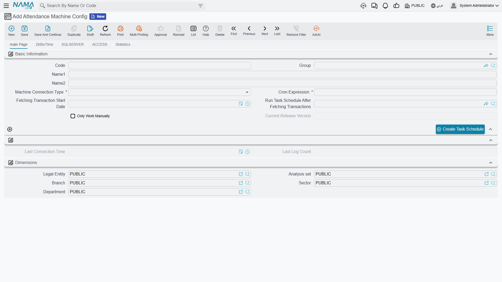

# Attendance Machines

Raw punch data can reach Nama in one of two ways. It can be **pulled automatically** on a schedule, straight from the fingerprint machine's own API or database — configured once through an **Attendance Machine Configuration** (إعدادات ماكينة الحضور) — or it can be **imported by hand** from a time-sheet file the machine exports, matched against a named formula that tells Nama how that file's columns and dates are laid out.

A given machine normally needs only one of them, whichever fits how it exposes its data. If the machine publishes an API or writes into a database you can reach, take the automated path — it is set up once and then runs unattended. If it only ever produces a file, the manual path is your option, and it has its own dedicated reference linked below.

## The automated path: letting Nama collect by itself

Importing a file every morning gets old quickly. If a fingerprint machine exposes an API, or writes its readings into a database you can reach, Nama can collect those readings by itself — every hour, every night, on whatever schedule you choose — and leave your HR staff with nothing to do but review the result.

An **Attendance Machine Configuration** is the record that makes that happen. It is a small master file that answers four questions: *which* machine, *how* to talk to it, *when* to talk to it, and *what to do* with what comes back.

Find it at **Payroll → Time Attendance → Attendance Machine Config**.

::: tip Requires its own license
Automated machine integration is gated behind a dedicated add-on (`humanresource-attendance-import-cron`), separate from the base Payroll license. If the **Attendance Machine Config** screen isn't in the menu, check with your account manager.
:::

::: warning The record is only half of the setup
The configuration lives in Nama, but Nama never dials the machine itself. A small companion application called **attcron**, installed on a computer at the branch that can see the machine, reads this configuration and does the actual collecting. Setting up the record is step one; installing the agent is step two — see [The attcron Attendance Agent](../../../integration/attcron-agent.md).

This split is deliberate. Fingerprint machines usually sit on a branch's local network with no route in from outside, so the traffic has to start from the branch. That means branches need no fixed IP address; they only need to be able to reach the Nama server.
:::

### The main page

A configuration is identified like any master file — Code, Group, Arabic Name, English Name — and then describes the connection and its schedule:

| Field (English → Arabic) | Purpose |
|---|---|
| Machine Connection Type (نوع اتصال الماكينة) | **ZkBioTime**, **SQLSERVER**, **ACCESS** or **Timetaag**. Choosing one tells you which of the four tabs below to fill in. |
| Cron Expression | How often the agent collects. See the warning below — the syntax has six fields, not five. |
| Fetching Transaction Start Date (تاريخ بداية سحب الحركات) | The earliest moment worth collecting from, used only on the very first run. |
| Only Work Manually (تشغيل يدوي فقط) | Turns the schedule off completely; the agent then collects only when someone presses a button in its own screen. |
| Run Task Schedule After Fetching Transactions (المهمة المجدولة المراد تشغيلها بعد سحب البيانات من الماكينة) | The scheduled task to run after each successful collection — normally the one that turns raw punches into a Time Attendance document. |
| Current Release Version (الإصدار الحالي) | Read-only. The version of the agent that last sent data, so you can tell at a glance whether a branch is running an old build. |
| Last Connection Time / Last Log Count (اخر وقت اتصال / اخر عدد حركات) | Read-only. When the agent last delivered data and how many readings were in that delivery. |

::: warning The cron expression has six fields
Nama uses six-field cron syntax — **seconds** first, then minutes, hours, day-of-month, month, day-of-week. `0 5 * * * *` means "at five minutes past every hour". The familiar five-field syntax from Unix (`5 */1 * * *`) is **not** valid here.

Nama checks the expression when you save and refuses an invalid one with *"Invalid cron expression: … "*. If an invalid expression somehow reaches the agent, the agent quietly falls back to running every twelve hours — so a collection that seems mysteriously slow is worth checking here first.

The check is skipped entirely when **Only Work Manually** is ticked.
:::

### The four connection types

Each type gets its own tab. Fill in the tab that matches your **Machine Connection Type** and ignore the other three.

#### ZkBioTime

For sites running the vendor's own ZkBioTime platform, which publishes its transactions over a web interface. Along with Timetaag, this is one of the two types that need no database access and no SQL to write.

| Field | Value |
|---|---|
| Machine URL (رابط الماكينة) | The address of the ZkBioTime web application, e.g. `http://192.168.1.50:8081`. |
| Username / Password | A ZkBioTime login with permission to read transactions. |

The agent signs in, then reads transactions page by page until it has caught up. The SQL Query, Read For Period Query and Mapping grid shown on this tab are **not used** by the ZkBioTime connection — its data format is fixed and needs no mapping.

#### SQLSERVER

For any machine whose software stores its readings in a SQL Server database — ZK's older desktop software being the common case.

| Field | Value |
|---|---|
| Machine URL | The SQL Server host, usually `localhost` when the agent runs on the same computer as the machine software. |
| Database Port | Usually `1433`. |
| Database Name | The machine software's database, e.g. `TATimeAttendance`. |
| Username / Password | A database login that can read the punch tables. |
| SQL Query | The query that fetches new readings — see below. |
| Read For Period Query | The variant used when someone re-reads a specific date range by hand. |
| Mapping grid | Which column of the result is which piece of information. |

#### ACCESS

For older machines that keep their log in a local Microsoft Access file. The tab is the same shape as SQL Server, with two differences: **Machine URL** is relabelled **File Path** and holds the full path to the `.mdb` or `.accdb` file on the computer where the agent runs, and **SQL Query** is relabelled **Access Query**.

::: warning Fill in the fields Access doesn't really need
The agent refuses to start unless Machine URL, Username, Password **and** Cron Expression all have values, and the record itself won't save without Database Port and Database Name. An Access setup doesn't use the username, password, port or database name at all — but they still have to contain something. Put placeholder values in them.
:::

#### Timetaag

For sites whose fingerprint devices report to **Timetaag**, a cloud attendance service. This one is different in kind from the other three: there is no machine database and no local machine software to read. The devices upload their readings to Timetaag themselves, and the agent simply asks Timetaag's servers for whatever has accumulated.

| Field | Value |
|---|---|
| Timetaag Server URL (رابط خادم Timetaag) | The Timetaag service address, `https://app.timetaag.com`. |
| Timetaag API Key (مفتاح Timetaag) | The key issued by Timetaag. The tab shows this field twice — see below. |

The key comes from **Timetaag, not from Nama**. Sign in to the Timetaag dashboard as the company administrator and use **Generate API token**.

The tab presents the key field twice, because Timetaag expects two things on every request: an API key identifying your company, and an authorization token. The agent sends the first field as the API key and the second as the token. If Timetaag issued you a single value, put it in both fields; if it issued two, keep them in that order.

As with ZkBioTime, readings arrive in a fixed format, so the SQL Query, Read For Period Query and Mapping grid on this tab are **not used**.

::: tip Timetaag needs the internet, not the local network
The other three types need the agent to sit on the same network as the machine or its database. Timetaag needs the opposite: the computer running the agent must be able to reach `app.timetaag.com` over the internet. A branch locked down to internal traffic only will fail here even though everything is configured correctly.
:::

### The two queries

The SQL Server and Access connections need you to supply the query that reads the punches. There are two of them, and they differ in one important way: **how many placeholders they contain.**

- **SQL Query** is the incremental one, run on every scheduled collection. It takes **exactly one `?`**, into which the agent puts the moment it last collected up to. The query should return everything newer than that.
- **Read For Period Query** is used only when an operator asks the agent for a specific date range. It takes **exactly two `?`** — the start and the end of that range.

You do not have to write either from scratch. The **Add Default Queries** action on each tab fills in a working, matching pair:

| Action | Writes queries for |
|---|---|
| Add Default Queries For Zk Bio Time (إضافة الاستعلامات الافتراضية لـ Zk Bio Time) | The ZkBioTime database's transaction table. |
| Add Default Queries For Zk (إضافة الاستعلامات الافتراضية لـ Zk) | ZK's classic check-in/check-out tables — in T-SQL on the SQL Server tab, in Access syntax on the Access tab. |

Both actions also populate the mapping grid with a standard set of thirteen lines, so a default configuration is complete in one click.

::: warning The Zk button is the wrong button for the ZkBioTime type
Pressing **Add Default Queries For Zk** while the connection type is ZkBioTime **clears** both query fields rather than filling them. For that type, use **Add Default Queries For Zk Bio Time**.
:::

### The mapping grid

The mapping grid answers one question per line: *which column of my query's result holds this piece of information?* It maps result columns to what Nama needs — it has nothing to do with matching employees.

| Column | Meaning |
|---|---|
| Response Field (Response Field) | The piece of information this result column carries. |
| Column Index (Column Index) | Its position in the result, counting from 1. Takes priority when filled in. |
| Column Alias (Column Alias) | Its name in the result, used when Column Index is left empty. |

Give **one** of Column Index or Column Alias for every line; a line with neither is rejected when the record is saved, with both columns reported as required.

The available Response Fields are `EmployeeCode`, `firstName`, `lastName`, `department`, `punchTime`, `punchState`, `punchStateDisplay`, `verifyType`, `verifyTypeDisplay`, `gpsLocation`, `areaAlias`, `terminalSN` and `uploadTime`.

::: tip Only some of them are actually stored
`EmployeeCode` and `punchTime` are the two that matter — nothing works without them. `punchState`, `punchStateDisplay`, `verifyTypeDisplay`, `terminalSN`, `areaAlias` and `uploadTime` are stored alongside each reading.

`firstName`, `lastName`, `department`, `verifyType` and `gpsLocation` are read from your query but **not** kept. Mapping them does no harm, and the default mapping includes them, but don't expect to find them in Nama afterwards.
:::

### Where the readings land

Collected readings do **not** go straight into a Time Attendance document. They travel through two stages, and knowing both is what makes this feature diagnosable.

**Stage one — the inbox.** Each delivery from the agent is parked whole, exactly as it arrived. A background process picks inbox entries up roughly every ten seconds and unpacks them. If unpacking fails, the entry stays put, its **Retry Count** goes up, and what went wrong is written into its **Error Log**. After **five** failed attempts an entry is left alone permanently and needs someone to look at it.

**Stage two — the cron log.** Successfully unpacked readings become **Attendance Machine Cron Log** rows: employee, punch time, punch state, terminal, upload time. A reading that already exists — same configuration, same employee, same punch time — is skipped, so re-collecting a period never produces duplicates.

Both are visible on the configuration's **Statistics** (الإحصائيات) tab, which embeds the Attendance Machine Cron Log and the inbox side by side. That tab is the first place to look when a branch says its data hasn't arrived: readings sitting in the inbox with a Retry Count above zero point at a data problem, an empty cron log with a recent **Last Connection Time** points at a query returning nothing, and a stale Last Connection Time points at the agent itself.

A reading is rejected outright, and recorded in the inbox's Error Log, when it has no employee identification at all, when its punch time is missing, or when its punch time isn't a valid date and time.

### From raw readings to a Time Attendance document

The cron log is a warehouse of timestamps; it is not yet attendance. Turning it into a **Time Attendance** document — pairing entries with exits, matching employees, applying shift rules — is the job of the scheduled task named in **Run Task Schedule After Fetching Transactions**, which runs automatically after each batch of readings is unpacked (a few seconds after the agent delivers them, not at the moment of delivery).

You don't have to build that task by hand. The **Create Task Schedule** action on the main page creates it and opens it in a popup, pre-filled with:

- a query that joins the cron log to employees on the **Attendance Machine Code**, padded to eight characters so `007` and `7` match, for the current month;
- an import formula, `empid#datetime{yyyy-MM-dd HH:mm:ss}#alternatingPunch`, which treats the first reading of each day as the arrival and the last as the departure;
- a query that decides which document the readings go into — its code, book, fiscal period, value date and legal entity.

::: warning Adjust the pre-filled document query before using it
The generated document query hard-codes a document book of `TAB` and a legal entity code of `1`. Change both to match your own setup, or the task will fail or file attendance under the wrong company.
:::

The formula in that task is the same little pattern language used for manual file imports. If the default first-and-last-of-the-day behaviour doesn't suit your shifts, [Attendance and Departure Formulas](../attendance-machine-formula.md) explains every alternative.

### How the agent knows where to resume

You will never be asked to manage this, but understanding it explains a lot of "why did it fetch that?" questions. Each time the agent finishes a collection it remembers how far it got, and starts from there next time. On a completely fresh install, with nothing remembered yet, it works down a short list:

1. the latest punch time already stored in Nama for this configuration — so reinstalling the agent does not re-send months of history;
2. failing that, the **Fetching Transaction Start Date** on this record;
3. failing that, two months ago.

**Fetching Transaction Start Date** therefore only ever matters on a first run against an empty configuration. Setting it later has no effect; to re-collect an old period, use the agent's own *Read For Period* button instead.

A **Timetaag** connection is the exception, because the Timetaag service filters by date rather than by time: whatever start and end moments the agent asks for, it returns every reading whose punch time falls on those calendar dates. Each scheduled collection therefore re-reads the whole of the current day, not only the minutes since the last one. Because Nama discards readings it already holds, this produces no duplicates — though it does mean the agent's own statistics table shows how many readings the day held at the moment of the run, rather than how many were new. Seeing the same number repeat all afternoon is normal, and is not a sign that collection has stalled.

The agent also steps its starting point back by half an hour on every run, and that half hour earns its keep at exactly one moment: just after midnight, when subtracting it puts the start of the window back on the previous date. The previous day is then collected one last time — which is how a punch made just before midnight still reaches Nama when the device uploads it a few minutes into the new day.

### Validation messages

| Message | Cause |
|---|---|
| A required-field error on Machine URL, Username, Password, Cron Expression or Machine Connection Type | These five are always mandatory, whatever the connection type. |
| A required-field error on Database Port, Database Name or SQL Query | These become mandatory as soon as the type is SQLSERVER or ACCESS. |
| Required-field errors on both Column Index and Column Alias of a mapping row | That row gives neither; supply one of them. |
| *Cron expression is required when automatic scheduling is enabled* | The expression is empty and **Only Work Manually** is not ticked. |
| *Invalid cron expression: … - Error: …* | The expression could not be understood. Remember it needs six fields. |

## The manual path: importing an exported file

Many machines don't expose an API or a reachable database at all — they only export a time-sheet file (Excel or delimited text) that has to be imported by hand into a **Time Attendance** document. Making sense of that file's layout — how the employee code, date, and time are encoded, what delimiter separates fields — is the job of the **attendance and departure formula**, a small pattern language (`#empid`, `#date{...}`, `#time{...}`) configured once per machine and then selected on the import.

::: tip Full formula reference
See **[Attendance and Departure Formulas](../attendance-machine-formula.md)** for the complete, worked-through reference on defining and using these import formulas.
:::

## Imperfect punches: missed scans and overlapping lines

Whichever path brings the data in, real-world punch data is rarely perfectly clean — an employee forgets to scan out, or stays on site past midnight and produces two incomplete lines instead of one complete one. Nama has a dedicated feature for correcting this without touching the original imported data.

::: tip Handling incomplete or overlapping attendance lines
See **[Ignoring Overlapping Attendance and Departure Lines](../ignore-overlapping-attendance.md)** for how a manual correction voucher can take priority over specific incomplete machine-imported lines.
:::

## Related pages

- **[The attcron Attendance Agent](../../../integration/attcron-agent.md)** — installing and operating the branch application that collects the punches.
- **[Attendance and Departure Formulas](../attendance-machine-formula.md)** — the pattern language behind both the manual import and the scheduled task above.
- **[Time Attendance](time-attendance.md)** — the document that actually holds imported and electronic punches, and turns them into salary effects.
- **[Attendance Plans & Shifts](attendance-plans-and-shifts.md)** — the expected schedule that incoming punches are measured against.
