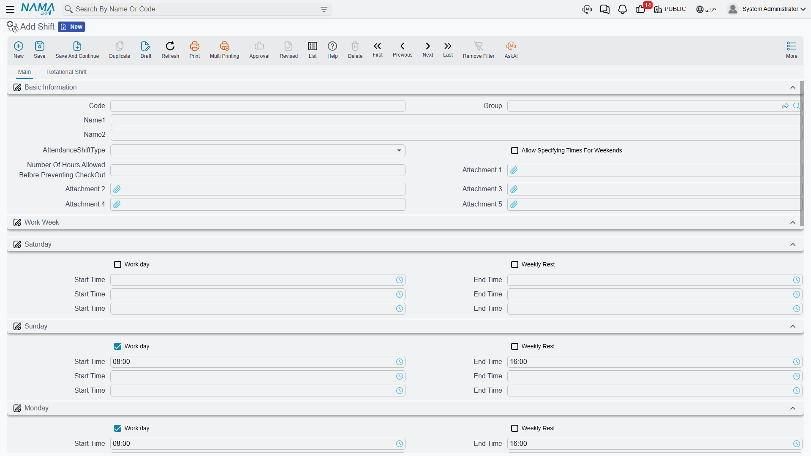
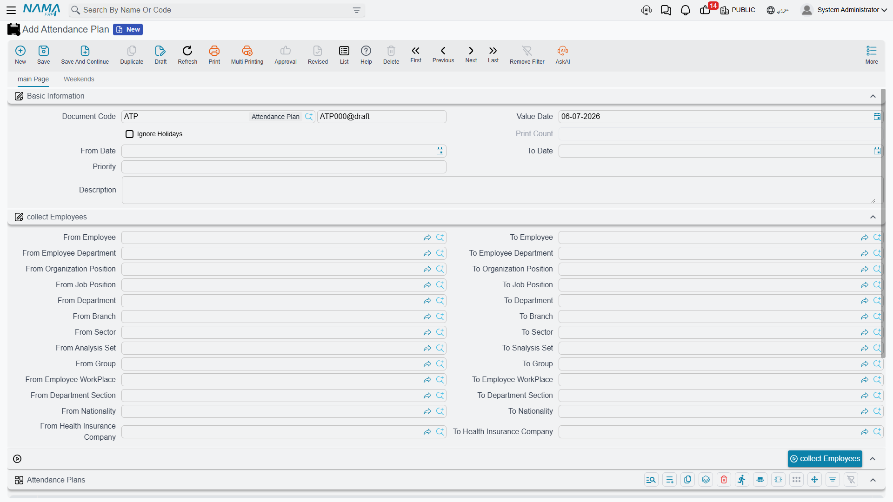

# Attendance Plans & Shifts

Before Nama can tell whether a punch was "late" or an hour was "overtime," it needs to know what the employee's schedule was *supposed to be* that day. Two master records carry that schedule: an **Attendance Shift** (ملف الدوام) is the reusable weekly-hours template — 8 to 4, Sunday to Thursday, say — and an **Attendance Plan** (خطة الدوام) is the document that hands a shift out to a range of employees for a period of time. Shifts are built once; plans are what assign them.

## Attendance Shift — the weekly-hours template

Found at **Payroll > Time Attendance > Shift**.

A shift is keyed by Code / Group / Arabic Name / English Name like any master file, plus an **AttendanceShiftType** (نوع دوام الحضور) that decides how its hours are defined:

| Shift type | How it works |
|---|---|
| Normal (عادية) | A single fixed weekly pattern — the **Main** tab lists Saturday through Friday, each day with a **Work day** (يوم عمل) or **Weekly Rest** (راحة إسبوعية) switch and up to three Start/End time pairs (a split shift with a midday break, for example). |
| Automatic (تلقائي) | Instead of one fixed pattern, the **Auto Shifts** grid lists several candidate time windows (Start Time, End Time, Checkout From/To Time); Nama picks whichever window best matches the employee's actual punch, and one row can be flagged as the **Default Shift** (دوام إفتراضى) to fall back on. Useful when employees on the same shift code don't all start at exactly the same minute. |
| Rotational (دورية) | The **Rotational Shift** tab defines a **Group Details** grid (working hours per rotation group) and a **Rotation Details** grid (when each group's rotation starts and which rotation line it follows) — for shift patterns that cycle employees through different weeks on a schedule, rather than repeating the same week forever. |

Two more switches apply regardless of type:

| Field (English → Arabic) | Purpose |
|---|---|
| Allow Specifying Times For Weekends (السماح بتحديد مواعيد الحضور و الانصراف للعطلات الاسبوعية) | Lets a weekly-rest day still carry its own start/end times, for cases where staff are occasionally expected in on their day off. |
| Number Of Hours Allowed Before Preventing CheckOut (عدد الساعات المسموح بها قبل منع تسجيل الانصراف من خلال التطبيق) | Caps how early an employee can check out through the mobile/electronic attendance app before the shift's end time — see [Time Attendance](time-attendance.md) for how electronic check-ins and check-outs are recorded. |

Like other payroll master data, a shift can be scoped with the standard **Dimensions** (legal entity, branch, sector, department, analysis set) so different parts of the organization keep their own shift catalogs.

## Attendance Plan — assigning a shift to employees

Found at **Payroll > Time Attendance > Attendance Plan**.

A plan doesn't define hours itself — it *distributes* shifts that already exist to whichever employees match a set of criteria, for a date range. Its header covers:

| Field (English → Arabic) | Purpose |
|---|---|
| Value Date / From Date / To Date (التاريخ الفعلي / من تاريخ / إلى تاريخ) | The window this plan is effective for. |
| Priority (الأولوية) | When more than one plan could apply to the same employee on the same day, the higher-priority plan wins. |
| Ignore Holidays (تجاهل الأجازات الرسمية) | Whether the shift's hours still count on days marked as official holidays. |
| Description (ملاحظات) | Free-text notes on the plan. |

The **Collect Employees** action (تجميع الموظفين) does the matching: fill in an employee range — From/To Employee, Department, Job Position, Organization Position, Branch, Sector, Group, Analysis Set, Employee Workplace, Department Section, Nationality, or Health Insurance Company — and the button pulls every employee who fits into the plan's **Attendance Plans** grid, where each line then names the actual **Shift** (الدوام) to apply (plus an optional **Added Shift** (دوام إضافي) for a second concurrent shift, and its own priority and date range per line).

::: tip A plan can also override weekly rest days
A second tab, **Weekends**, lets the same plan carry a separate set of lines — scoped by employee, department, job position, or department section, over a date range — that override an employee's normal weekly rest days (up to three weekend days per line) without touching their assigned shift. This is handled entirely within the Attendance Plan record; it doesn't require a separate document.
:::

A plan, like a shift, can be scoped with the standard **Dimensions** (legal entity, branch, sector, department, analysis set).

## Workflow

1. **Build the shift(s)** under **Shift** — pick Normal for a fixed weekly pattern, Automatic when start times vary and Nama should match the closest window, or Rotational for a cycling schedule.
2. **Raise an Attendance Plan** with the date range and priority it should apply for.
3. **Define the employee range** and use **Collect Employees** to preview and populate the matching employees.
4. **Assign the shift** (and, if needed, an added shift) on each collected line.
5. **Optionally add Weekends overrides** on the same plan for employee groups whose weekly rest days differ from the default.

## Related pages

- **[Time Attendance](time-attendance.md)** — where the actual punches recorded against these shifts are captured and turned into salary effects.
- **[Attendance Machines](attendance-machines.md)** — how raw punch data reaches Nama in the first place, whether through scheduled machine integration or manual import.
