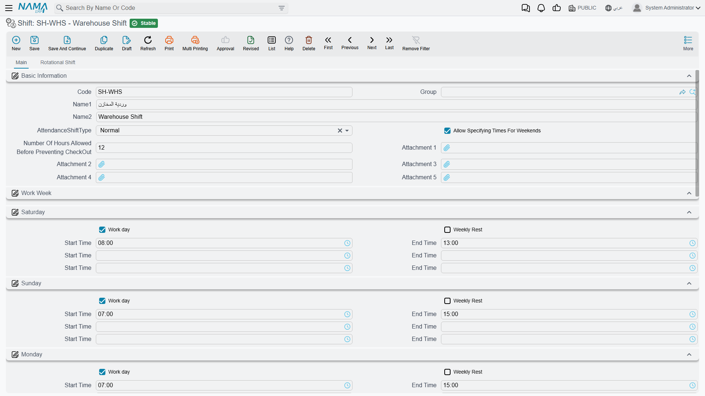
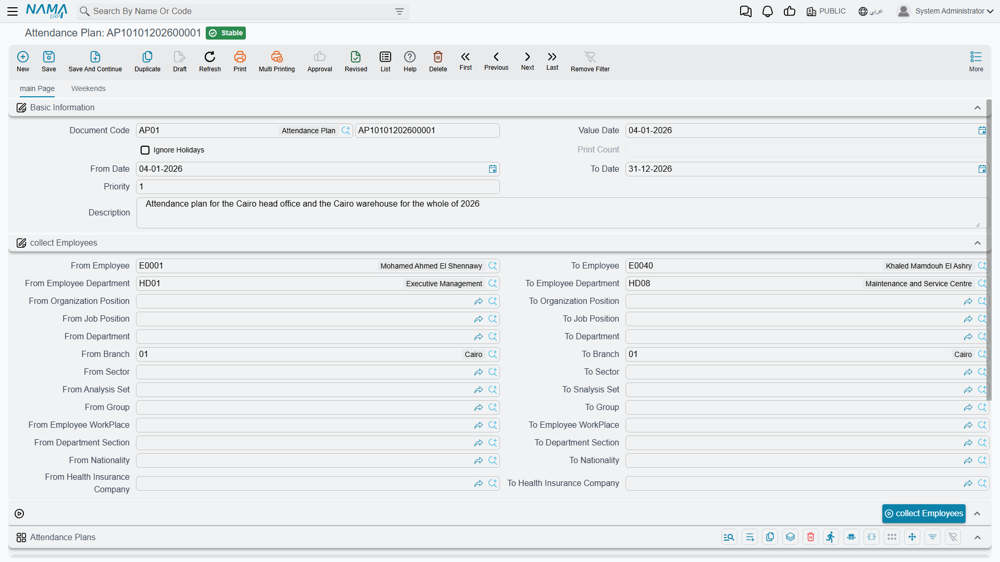

# Attendance Plans & Shifts

Before Nama can tell whether a punch was "late" or an hour was "overtime," it needs to know what the employee's schedule was *supposed to be* that day. Two master records carry that schedule: an **Attendance Shift** (ملف الدوام) is the reusable weekly-hours template — 8 to 4, Sunday to Thursday, say — and an **Attendance Plan** (خطة الدوام) is the document that hands a shift out to a range of employees for a period of time. Shifts are built once; plans are what assign them.

## Attendance Shift — the weekly-hours template

Found at **Payroll > Time Attendance > Shift**.

A shift is keyed by Code / Group / Arabic Name / English Name like any master file, plus an **AttendanceShiftType** (نوع دوام الحضور) that decides how its hours are defined:

| Shift type | How it works |
|---|---|
| Normal (عادية) | A single fixed weekly pattern — the **Main** tab lists Saturday through Friday, each day with a **Work day** (يوم عمل) or **Weekly Rest** (راحة إسبوعية) switch and up to three Start/End time pairs (a split shift with a midday break, for example). |
| Automatic (تلقائي) | Instead of one fixed pattern, the **Auto Shifts** grid lists several candidate windows — each one pointing at an underlying **Shift** and carrying the arrival window (Start Time, End Time, Checkout From/To Time) that routes a punch to it. Nama reads the employee's actual punch and files it under whichever window it matches, and one row can be flagged as the **Default Shift** (دوام إفتراضى) to fall back on. Ideal when the same employees might work either a morning or an evening turn, and you want the system to recognise which one they worked instead of docking them (see the worked example below). |
| Rotational (دورية) | The **Rotational Shift** tab defines a **Group Details** grid (working hours per rotation group) and a **Rotation Details** grid (when each group's rotation starts and which rotation line it follows) — for shift patterns that cycle employees through different weeks on a schedule, rather than repeating the same week forever. |

Two more switches apply regardless of type:

| Field (English → Arabic) | Purpose |
|---|---|
| Allow Specifying Times For Weekends (السماح بتحديد مواعيد الحضور و الانصراف للعطلات الاسبوعية) | Lets a weekly-rest day still carry its own start/end times, for cases where staff are occasionally expected in on their day off. |
| Number Of Hours Allowed Before Preventing CheckOut (عدد الساعات المسموح بها قبل منع تسجيل الانصراف من خلال التطبيق) | Caps how early an employee can check out through the mobile/electronic attendance app before the shift's end time — see [Time Attendance](time-attendance.md) for how electronic check-ins and check-outs are recorded. |

Like other payroll master data, a shift can be scoped with the standard **Dimensions** (legal entity, branch, sector, department, analysis set) so different parts of the organization keep their own shift catalogs.

### Automatic shift — letting Nama choose day vs. night

An automatic shift solves the classic "the employee might work either the morning or the evening turn, and I don't want the system to guess wrong and dock them" problem. You don't tell Nama which turn each person is on — you list every possible turn, each with the arrival window that identifies it, and Nama reads the actual punch and files it under whichever turn it falls in. Nothing is wrongly counted as late or absent, and the attendance/fingerprint report shows the punch against the turn it actually matched.

Each line of the **Auto Shifts** grid points at an underlying **Shift** — usually a Normal shift you built earlier — stamped with the arrival window that should route a punch to it:

| Column (English → Arabic) | Purpose |
|---|---|
| Shift (الدوام) | The already-built shift this window resolves to (the Morning or Night template, say). Required on every line. |
| Start Time / End Time (وقت الحضور من / إلى ساعة) | The check-in window that identifies this turn — a punch whose check-in falls inside it is measured against this shift. |
| Checkout From / To Time (وقت الانصراف من / إلى وقت) | The matching check-out window, for turns that also need the departure time to disambiguate. |
| Default Shift (دوام إفتراضى) | Flag one line as the fallback used when a punch matches no window. |

**Worked example — a morning and an evening turn.** Say the company runs a morning turn 8 AM–4 PM and an evening turn 4 PM–12 AM, and anyone who shows up within a couple of hours of the start counts as on time:

1. Build two **Normal** shifts first — one "Morning" (8→4) and one "Evening" (4→12), each with its own weekly pattern.
2. Build a third shift and set its **AttendanceShiftType** to **Automatic**.
3. In its **Auto Shifts** grid add two lines:
   - Line 1 → **Shift = Morning**, Start Time `7:00 AM`, End Time `9:00 AM`.
   - Line 2 → **Shift = Evening**, Start Time `2:00 PM`, End Time `6:00 PM`.
4. Assign this automatic shift to the employees through an **Attendance Plan**, exactly as you would any other shift.

Now an employee who punches in anywhere between 7 and 9 is measured against the Morning turn; one who punches between 2 and 6 is measured against the Evening turn — with no manual reassignment. Widen or narrow each window to control how much early/late latitude each turn allows.

## Attendance Plan — assigning a shift to employees

Found at **Payroll > Time Attendance > Attendance Plan**.

A plan doesn't define hours itself — it *distributes* shifts that already exist to whichever employees match a set of criteria, for a date range. Its header covers:

| Field (English → Arabic) | Purpose |
|---|---|
| Value Date / From Date / To Date (التاريخ الفعلي / من تاريخ / إلى تاريخ) | The window this plan is effective for. |
| Priority (الأولوية) | When more than one plan could apply to the same employee on the same day, the higher-priority plan wins. |
| Ignore Holidays (تجاهل الأجازات الرسمية) | Whether the shift's hours still count on days marked as official holidays. |
| Description (ملاحظات) | Free-text notes on the plan. |

The **Collect Employees** action (تجميع الموظفين) does the matching: fill in an employee range — From/To Employee, Department, Job Position, Organization Position, Branch, Sector, Group, Analysis Set, Employee Workplace, Department Section, Nationality, or Health Insurance Company — and the button pulls every employee who fits into the plan's **Attendance Plans** grid, where each line then names the actual **Shift** (الدوام) to apply (plus an optional **Added Shift** (دوام إضافي) for a second concurrent shift, and its own priority and date range per line).

::: tip A plan can also override weekly rest days
A second tab, **Weekends**, lets the same plan carry a separate set of lines — scoped by employee, department, job position, or department section, over a date range — that override an employee's normal weekly rest days (up to three weekend days per line) without touching their assigned shift. This is handled entirely within the Attendance Plan record; it doesn't require a separate document.
:::

A plan, like a shift, can be scoped with the standard **Dimensions** (legal entity, branch, sector, department, analysis set).

## Workflow

1. **Build the shift(s)** under **Shift** — pick Normal for a fixed weekly pattern, Automatic when start times vary and Nama should match the closest window, or Rotational for a cycling schedule.
2. **Raise an Attendance Plan** with the date range and priority it should apply for.
3. **Define the employee range** and use **Collect Employees** to preview and populate the matching employees.
4. **Assign the shift** (and, if needed, an added shift) on each collected line.
5. **Optionally add Weekends overrides** on the same plan for employee groups whose weekly rest days differ from the default.

## Messages you may see

| Message | Why | What to do |
|---|---|---|
| *Work day {0} both option {1} and option {2} can not be true* — «يوم العمل {0} الأوبشن {1} و الأوبشن {2} لا يمكن تفعيلهم معا» | On the shift's weekly pattern the same day has both **Work day** and **Weekly Rest** ticked. | Leave one ticked. If staff are occasionally called in on a rest day, keep **Weekly Rest** and use **Allow Specifying Times For Weekends** instead. |
| *The date {0} is repeated* — «التاريخ {0} مكرر» | Two rows in a rotational shift's **Rotation Details** start their rotation on the same date. | Give each rotation row its own start date. |
| *The date {0} is in wrong order* — «التاريخ {0} في ترتيب غير صحيح» | The **Rotation Details** rows are not in ascending date order, so the cycle cannot be read top to bottom. | Re-order the rows so the rotation start dates run forwards. |
| *Field {0} - {1} can not be greater than list size {2}* — «الحقل {0} - {1} لا يمكن ان يكون اكبر من حجم الجريد {2}» | A rotation row points at a rotation-group line number that does not exist — the number is larger than the count of rows in **Group Details**. | Point the row at one of the existing group lines, or add the missing group line first. |
| *You cannot add weekend lines while the option {0} is enabled, weekends are taken from the weekend document instead* — «لا يمكنك إضافة سطور راحات أسبوعية طالما أن الخيار {0} مفعل، حيث يتم اعتماد الراحات الأسبوعية من سند الراحات الأسبوعية» | HR Configuration's **Take Weekends From Weekend Doc Not Att Plan** is on, so weekly rest days come from the weekend document — and the plan's **Weekends** tab must stay empty. | Empty the Weekends tab and record the override on the weekend document, or switch that configuration option off if overrides belong on the plan. |
| *Repeated lines ({0},{1}) with same employee {2}, priority {3}, from date {4} and to date {5}* — «السطور رقم ({0} و {1}) مكررة لنفس الموظف {2} والأولوية {3} من تاريخ {4} إلى تاريخ {4}» | Two lines in the plan grid carry the same employee, the same priority and the same date range, so there is no way to tell which shift wins. | Delete one of the two lines, or separate them by priority or by date range. |
| *From Date should be less than To Date* | A plan line's **From Date** is after its **To Date**. This message has no Arabic string, so it stays in English on Arabic screens. | Correct the line's dates. |
| *Department section {0} belongs to employee department {1}, and you are using employee department {2}* — «القسم الوظيفي {0} ينتمي إلى إدارة الموظف {1}، قد تم اختيار إدارة الموظف {2}» | A plan line names a **Department Section** that sits under a different **Employee Department** from the one chosen on the same line. | Pick a section that belongs to the chosen department, or change the department to the section's own. |

## Related pages

- **[Time Attendance](time-attendance.md)** — where the actual punches recorded against these shifts are captured and turned into salary effects.
- **[Attendance Machines](attendance-machines.md)** — how raw punch data reaches Nama in the first place, whether through scheduled machine integration or manual import.
