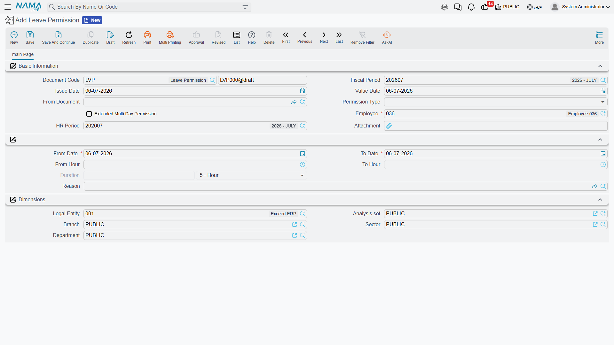
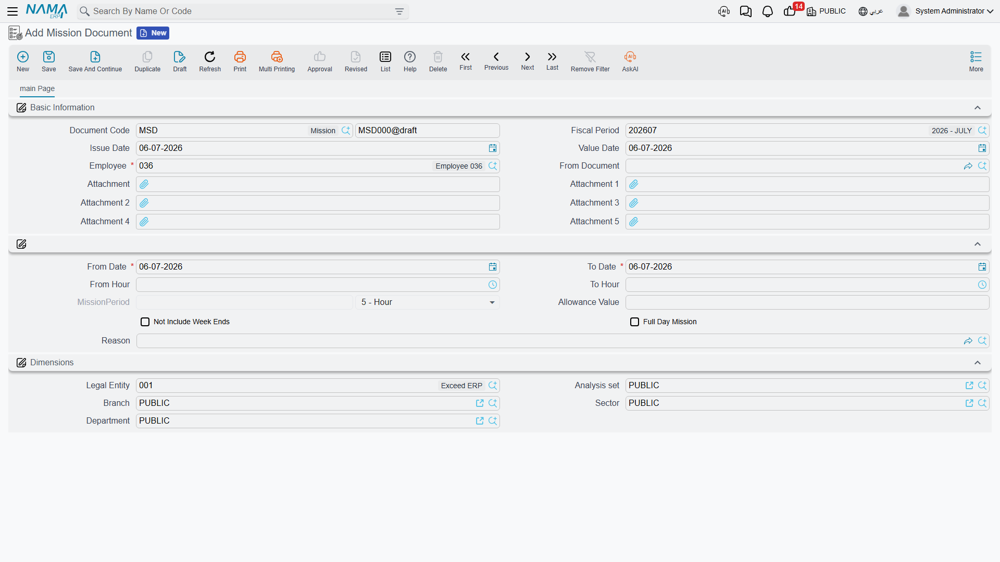

# Leave Permissions & Missions

Not every departure from the schedule needs a full [vacation](../vacations/vacation-documents.md). Sometimes an employee just needs to leave two hours early, arrive late, or step out on company business for the afternoon. Nama covers these short, intra-day exceptions with two lightweight documents: **Leave Permission** (إذن إنصراف) for authorized time away from the desk, and **Mission Document** (سند مأمورية) for time spent out of the office on business. Neither posts to the ledger by itself — their whole job is to make sure that short absence is *explained* on the attendance record rather than showing up as unexplained lateness or a gap in the day.

## Leave Permission — authorized short absence

Found at **Payroll > Time Attendance > Leave Permission**.

A Leave Permission records a specific, time-boxed absence for one employee, with a **Permission Type** that says why:

| Permission Type | Arabic | Typical use |
|---|---|---|
| Early Leave | اذن مبكر | Leaving before the shift ends. |
| Late Arrival | اذن تاخير | Arriving after the shift starts. |
| Leave During Work | انصراف خلال العمل | Stepping out mid-shift and returning. |
| Forgot Check In | نسيان بصمة دخول | Covers a missing check-in — often created via **Convert To Leave Permission** from an [Electronic Attendance](time-attendance.md#Electronic-Attendance-mobile-self-service-punches) record flagged that way. |
| Forgot Check Out | نسيان بصمة خروج | Covers a missing check-out, the same way. |
| Other 1 / 2 / 3 | أخرى 1 / 2 / 3 | Site-specific catch-all categories. |

Its header carries the usual document identity plus two fields worth calling out:

| Field (English → Arabic) | Purpose |
|---|---|
| From Document (بناءا على) | An optional link to whatever record this permission originates from — most often the Electronic Attendance punch it was converted from, following the same "document tells you where it came from" idea covered in [HR Requests & Documents](../concepts/hr-requests-and-documents.md). |
| Extended Multi Day Permission (إذن ممتد لأكثر من يوم) | Lets a single permission span more than one calendar day, instead of being confined to one. |
| HR Period (فترة الرواتب) | The payroll period this permission counts against. |

The body of the document pins down exactly how long the absence is:

| Field (English → Arabic) | Purpose |
|---|---|
| From Date / To Date (من تاريخ / إلى تاريخ) | The date span the permission covers. |
| From Hour / To Hour (من ساعة / إلي ساعة) | The specific hours within that span. |
| Duration — Value / Unit (المدة — القيمة / الوحدة) | The computed length of the permission, in Day/Week/Month/Year/Hour/Minute/Second. |
| Reason (السبب) | A [Leave Reason](#Leave-Reason-catalog-of-reasons) picked from the shared reasons catalog. |

::: info No accounting effect
A Leave Permission does not generate any ledger entry by itself. Its effect is entirely on the attendance record — an hour marked here is an hour that will not be flagged as unexplained lateness or absence when the period's performance indicators are calculated. If the reason or the component setup calls for a deduction (an unpaid leave reason, for instance), that shows up later as a salary component driven by the resulting performance-indicator figure, not as something the permission itself posts.
:::

## Leave Permission Configuration — the guardrails

**Leave Permission Configuration** (إعدادات إذن الانصراف, master file at **Payroll > Main > Leave Permission Configuration**) is where an organization caps how much of this short-absence allowance an employee (or group of employees) can use. Rather than one flat rule, it holds a **Details** grid of rules, each scoped by:

- A **date range** the rule applies within (From/To Value Date).
- The **Leave Permission document's own dimensions** (its legal entity, branch, sector, department, analysis set) or a free-form **query/definition**.
- The **employee's dimensions** (legal entity, branch, sector, department, analysis set).

and each rule then sets:

| Field (English → Arabic) | Purpose |
|---|---|
| Max Permission Hours Per Month (أقصى عدد ساعات إذون انصراف شهريا) | The total hours of leave permission an employee can take in a month. |
| Max Single Permission Hours (أقصى عدد ساعات للإذن الواحد) | The longest any one permission can be. |
| Max Permissions Per Month (أقصى عدد إذون انصراف شهريا) | The number of separate permissions allowed in a month, regardless of their individual length. |

Because a rule can be scoped narrowly (one department) or broadly (the whole company), an organization can give, say, sales staff a looser allowance than back-office staff, all from the same configuration record.

## Leave Reason catalog of reasons

**Leave Reason** (نوع سبب, master file at **Payroll > Main > Leave Reason**) is a shared reasons catalog — the same entity backs reasons for vacations, leave permissions, rewards, penalties, suspensions, and missions, distinguished by its **Selected Group** field:

| Selected Group | Arabic | Applies to |
|---|---|---|
| Vacation | الأجازة | Vacation documents. |
| Leave | إنصراف | Leave Permission documents. |
| Reward | مكافأة | Reward records. |
| Penalty | جزاء | Penalty records. |
| Suspension | وقف عن العمل | Suspension documents. |
| Mission | مأمورية | Mission Documents. |

For a reason scoped to **Leave**, the fields that matter are:

| Field (English → Arabic) | Purpose |
|---|---|
| Without Salary Deducted From Termination (بدون مرتب و يخصم من نهاية الخدمة) | This reason's leave is unpaid, and counts against end-of-service calculations. |
| Without Salary Not Deducted From Termination (بدون مرتب ولا يخصم من نهاية الخدمة) | Unpaid, but does **not** affect end-of-service. |
| Max Permission Count Per Reason (أقصي عدد أذون شهريا لكل سبب على حدة) | A monthly cap specific to this one reason, on top of whatever Leave Permission Configuration allows overall. |
| Deducted From Paid Vacation Period In Dues (تخصم من مدة الأجازة مدفوعة الأجر في التصفية) | Whether time taken under this reason eats into the paid-vacation period counted at final settlement. |
| Consider Return Date As Working Start Date (إعتبار تاريخ العودة تاريخ مباشرة العمل) | Treats the day the employee returns as a fresh work-start date for calculation purposes. |
| Change Employee State To (تغير حالة الموظف إلى) | Optionally flips the employee's working state (e.g. to Suspended) while this reason is in effect. |
| Max Permissions Per Month / Max Permission Hours Per Month / Max Single Permission Hours | The same three caps as Leave Permission Configuration, settable per reason instead of (or in addition to) globally. |

## Mission Document — time out of the office on business

Found at **Payroll > Time Attendance > Mission Document**.

A Mission Document records an employee being away from their normal workplace **on the company's business** — a client visit, a delivery run, an external meeting — as opposed to a personal absence. Structurally it looks a lot like a Leave Permission:

| Field (English → Arabic) | Purpose |
|---|---|
| Employee (الموظف) | Who is on the mission. |
| From Document (بناءا على) | The optional originating record, same idea as on Leave Permission. |
| From Date / To Date, From Hour / To Hour | The span of the mission. |
| Mission Period — Value / Unit (مدة المأمورية) | The computed length of the mission. |
| Allowance Value (قيمة البدلات) | A monetary allowance associated with the mission (e.g. transport or per-diem), which a salary formula can pick up. |
| Not Include Week Ends (لا تشمل العطله الأسبوعية) | Excludes weekly rest days from the mission's counted period. |
| Full Day Mission (مهمه يوم كامل) | Marks the mission as covering the entire working day rather than part of it. |
| Reason (السبب) | A Leave Reason scoped to **Mission**. |
| Attachment 1–5 | Supporting documents (a travel order, a client visit report, and so on). |

::: tip A mission is time worked, not time off
The key distinction from a Leave Permission is intent: a mission employee is still working, just not at their desk. That is why full-day missions don't need to be flagged as absent, and why a mission commonly carries an **Allowance Value** rather than a deduction — it is compensating the employee for being out, not excusing an absence.
:::

## Workflow

1. **Short authorized absence**: raise a **Leave Permission** with the right Permission Type, date/hour range, and a **Leave Reason** scoped to Leave — or let a forgotten Electronic Attendance punch convert into one automatically.
2. **Cap the allowance**: define (or rely on) **Leave Permission Configuration** rules and the reason's own per-reason limits so short absences don't quietly add up unchecked.
3. **Business trip out of the office**: raise a **Mission Document** with its own date/hour range, an allowance if applicable, and a **Leave Reason** scoped to Mission.
4. **Let attendance and salary read the result**: both documents feed the day's attendance picture, which performance indicators then turn into the relevant salary additions or deductions.

## Related pages

- **[Time Attendance](time-attendance.md)** — the punch record that leave permissions and missions adjust the reading of.
- **[HR Requests, Documents & Aggregated Documents](../concepts/hr-requests-and-documents.md)** — the general request/document pattern; leave permissions and missions use the lightweight "document with an optional From Document origin" variant of it.
- **[How Salary Is Calculated](../concepts/hr-salary-engine.md)** — how attendance figures, including permissions and missions, ultimately turn into pay.
