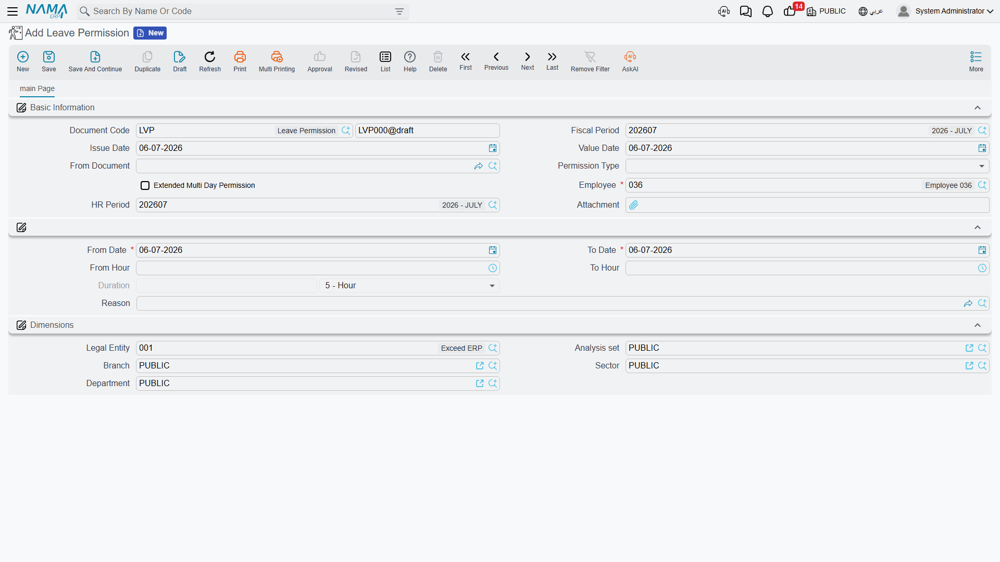
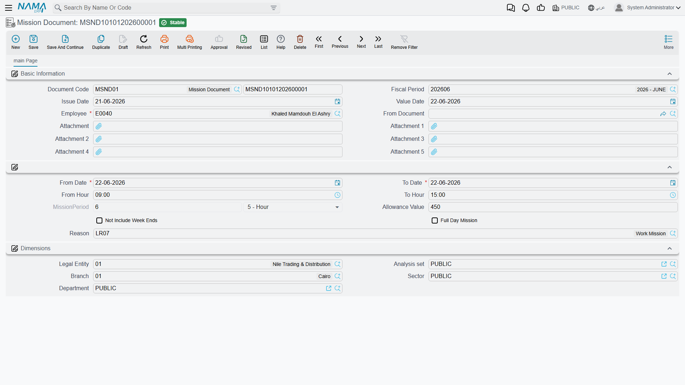

# Leave Permissions & Missions

Not every departure from the schedule needs a full [vacation](../vacations/vacation-documents.md). Sometimes an employee just needs to leave two hours early, arrive late, or step out on company business for the afternoon. Nama covers these short, intra-day exceptions with two lightweight documents: **Leave Permission** (إذن إنصراف) for authorized time away from the desk, and **Mission Document** (سند مأمورية) for time spent out of the office on business. Neither posts to the ledger by itself — their whole job is to make sure that short absence is *explained* on the attendance record rather than showing up as unexplained lateness or a gap in the day.

## Leave Permission — authorized short absence

Found at **Payroll > Time Attendance > Leave Permission**.

A Leave Permission records a specific, time-boxed absence for one employee, with a **Permission Type** that says why:

| Permission Type | Arabic | Typical use |
|---|---|---|
| Early Leave | اذن مبكر | Leaving before the shift ends. |
| Late Arrival | اذن تاخير | Arriving after the shift starts. |
| Leave During Work | انصراف خلال العمل | Stepping out mid-shift and returning. |
| Forgot Check In | نسيان بصمة دخول | Covers a missing check-in — often created via **Convert To Leave Permission** from an [Electronic Attendance](time-attendance.md#Electronic-Attendance-mobile-self-service-punches) record flagged that way. |
| Forgot Check Out | نسيان بصمة خروج | Covers a missing check-out, the same way. |
| Other 1 / 2 / 3 | أخرى 1 / 2 / 3 | Site-specific catch-all categories. |

Its header carries the usual document identity plus two fields worth calling out:

| Field (English → Arabic) | Purpose |
|---|---|
| From Document (بناءا على) | An optional link to whatever record this permission originates from — most often the Electronic Attendance punch it was converted from, following the same "document tells you where it came from" idea covered in [HR Requests & Documents](../concepts/hr-requests-and-documents.md). |
| Extended Multi Day Permission (إذن ممتد لأكثر من يوم) | Lets a single permission span more than one calendar day, instead of being confined to one. |
| HR Period (فترة الرواتب) | The payroll period this permission counts against. |

The body of the document pins down exactly how long the absence is:

| Field (English → Arabic) | Purpose |
|---|---|
| From Date / To Date (من تاريخ / إلى تاريخ) | The date span the permission covers. |
| From Hour / To Hour (من ساعة / إلي ساعة) | The specific hours within that span. |
| Duration — Value / Unit (المدة — القيمة / الوحدة) | The computed length of the permission, in Day/Week/Month/Year/Hour/Minute/Second. |
| Reason (السبب) | A [Leave Reason](#Leave-Reason-catalog-of-reasons) picked from the shared reasons catalog. |

::: info No accounting effect
A Leave Permission does not generate any ledger entry by itself. Its effect is entirely on the attendance record — an hour marked here is an hour that will not be flagged as unexplained lateness or absence when the period's performance indicators are calculated. If the reason or the component setup calls for a deduction (an unpaid leave reason, for instance), that shows up later as a salary component driven by the resulting performance-indicator figure, not as something the permission itself posts.
:::

## Leave Permission Configuration — the guardrails

**Leave Permission Configuration** (إعدادات إذن الانصراف, master file at **Payroll > Main > Leave Permission Configuration**) is where an organization caps how much of this short-absence allowance an employee (or group of employees) can use. Rather than one flat rule, it holds a **Details** grid of rules, each scoped by:

- A **date range** the rule applies within (From/To Value Date).
- The **Leave Permission document's own dimensions** (its legal entity, branch, sector, department, analysis set) or a free-form **query/definition**.
- The **employee's dimensions** (legal entity, branch, sector, department, analysis set).

and each rule then sets:

| Field (English → Arabic) | Purpose |
|---|---|
| Max Permission Hours Per Month (أقصى عدد ساعات إذون انصراف شهريا) | The total hours of leave permission an employee can take in a month. |
| Max Single Permission Hours (أقصى عدد ساعات للإذن الواحد) | The longest any one permission can be. |
| Max Permissions Per Month (أقصى عدد إذون انصراف شهريا) | The number of separate permissions allowed in a month, regardless of their individual length. |

Because a rule can be scoped narrowly (one department) or broadly (the whole company), an organization can give, say, sales staff a looser allowance than back-office staff, all from the same configuration record.

## Leave Reason catalog of reasons

**Leave Reason** (نوع سبب, master file at **Payroll > Main > Leave Reason**) is a shared reasons catalog — the same entity backs reasons for vacations, leave permissions, rewards, penalties, suspensions, and missions, distinguished by its **Selected Group** field:

| Selected Group | Arabic | Applies to |
|---|---|---|
| Vacation | الأجازة | Vacation documents. |
| Leave | إنصراف | Leave Permission documents. |
| Reward | مكافأة | Reward records. |
| Penalty | جزاء | Penalty records. |
| Suspension | وقف عن العمل | Suspension documents. |
| Mission | مأمورية | Mission Documents. |

For a reason scoped to **Leave**, the fields that matter are:

| Field (English → Arabic) | Purpose |
|---|---|
| Without Salary Deducted From Termination (بدون مرتب و يخصم من نهاية الخدمة) | This reason's leave is unpaid, and counts against end-of-service calculations. |
| Without Salary Not Deducted From Termination (بدون مرتب ولا يخصم من نهاية الخدمة) | Unpaid, but does **not** affect end-of-service. |
| Max Permission Count Per Reason (أقصي عدد أذون شهريا لكل سبب على حدة) | A monthly cap specific to this one reason, on top of whatever Leave Permission Configuration allows overall. |
| Deducted From Paid Vacation Period In Dues (تخصم من مدة الأجازة مدفوعة الأجر في التصفية) | Whether time taken under this reason eats into the paid-vacation period counted at final settlement. |
| Consider Return Date As Working Start Date (إعتبار تاريخ العودة تاريخ مباشرة العمل) | Treats the day the employee returns as a fresh work-start date for calculation purposes. |
| Change Employee State To (تغير حالة الموظف إلى) | Optionally flips the employee's working state (e.g. to Suspended) while this reason is in effect. |
| Max Permissions Per Month / Max Permission Hours Per Month / Max Single Permission Hours | The same three caps as Leave Permission Configuration, settable per reason instead of (or in addition to) globally. |

## Mission Document — time out of the office on business

Found at **Payroll > Time Attendance > Mission Document**.

A Mission Document records an employee being away from their normal workplace **on the company's business** — a client visit, a delivery run, an external meeting — as opposed to a personal absence. Structurally it looks a lot like a Leave Permission:

| Field (English → Arabic) | Purpose |
|---|---|
| Employee (الموظف) | Who is on the mission. |
| From Document (بناءا على) | The optional originating record, same idea as on Leave Permission. |
| From Date / To Date, From Hour / To Hour | The span of the mission. |
| Mission Period — Value / Unit (مدة المأمورية) | The computed length of the mission. |
| Allowance Value (قيمة البدلات) | A monetary allowance associated with the mission (e.g. transport or per-diem), which a salary formula can pick up. |
| Not Include Week Ends (لا تشمل العطله الأسبوعية) | Excludes weekly rest days from the mission's counted period. |
| Full Day Mission (مهمه يوم كامل) | Marks the mission as covering the entire working day rather than part of it. |
| Reason (السبب) | A Leave Reason scoped to **Mission**. |
| Attachment 1–5 | Supporting documents (a travel order, a client visit report, and so on). |

::: tip A mission is time worked, not time off
The key distinction from a Leave Permission is intent: a mission employee is still working, just not at their desk. That is why full-day missions don't need to be flagged as absent, and why a mission commonly carries an **Allowance Value** rather than a deduction — it is compensating the employee for being out, not excusing an absence.
:::

## When a mission overlaps something else

Because a mission is time worked, it does not sit quietly beside the attendance record — it takes part in it. The day gains a stretch of hours that no fingerprint produced, and that stretch has to coexist with whatever else the day already holds: the real punches, a leave permission, a partial vacation. Two questions come out of that, and between them they account for most of the support traffic around missions.

### The same hours claimed twice — overlap and priority

Picture an employee who scans in at 09:06 and out at 17:05, and who also has a mission covering 09:00 to 17:00 on that same day. Eight hours were worked, but the day is carrying two records of them. Unless something reconciles the two, those eight hours are counted twice.

The reconciliation is a payroll setting, in **Payroll Settings** under the **Attendance Settings** group:

<HRConfigOption option-code="value.handleOverlapBetweenAttendanceAndMissions" link-title="Handle Overlap Between Attendance, Missions, and Leave Permissions" />

With it enabled, the day's records are laid out on a single timeline and compared in pairs. Wherever two of them cover the same minutes, the stronger record keeps those minutes and the weaker one is trimmed back to the part that does not overlap — or dropped entirely when the stronger record covers it end to end. Strength is a number you set, and the **lowest number wins**:

| Setting (English → Arabic) | Default |
|---|---|
| Mission Document Priority With Overlap (اولوية المأموريات عند التداخل) | 1 |
| Time Attendance Priority With Overlap (اولوية الحضور و الانصراف عند التداخل) | 2 |
| Leave Permission Priority With Overlap (اولوية الأذون عند التداخل) | 3 |
| Partial Vacation Priority With Overlap (اولوية الاجازات الجزئية عند التداخل) | 4 |

So out of the box a mission outranks everything else: in the example above the mission keeps 09:00–17:00 and the punch line is dropped, because the mission covers it from end to end. Swapping the first two numbers makes the fingerprint the authority instead, leaving the mission only the hours the machine did not already account for.

::: warning An older settings record may not have it enabled
A payroll settings record created today has overlap handling ticked from the start, but a record that predates the option keeps it unset — and unset means off, with both records counted in full. When a day shows double hours, read that checkbox before investigating anything else rather than assuming the default.
:::

### The mission's hours become the day's check-in and check-out

Because the mission joins the day as a genuine stretch of time, the day's first-in and last-out readings can be taken from the mission's own **From Hour / To Hour**. This is why mission days read as exact round times — 09:00:00 to 17:00:00 — sitting in the same list as ordinary fingerprint days reading 09:06:35 and 16:58:12. Nothing is wrong with the data: you are looking at the mission's own hours, not at a punch.

If you would rather the mission stay out of those two readings, the same settings group has a pair of switches for it (with the matching pair for leave permissions beside them):

<HRConfigOption option-code="value.missionDoesNotAffectInFirstInTime" link-title="Mission Does Not Affect In First In Time" />

<HRConfigOption option-code="value.missionDoesNotAffectInLastOutTime" link-title="Mission Does Not Affect In Last Out Time" />

## A mission on the weekly rest day

This case earns its own heading: it is the most frequently misread behaviour in mission handling, and the figures it produces look exactly like a bug.

Start with the ordinary case. On a working day a mission's hours are measured against what the shift expected, as long as the setting that lets missions count toward overtime at all is on:

<HRConfigOption option-code="value.missionsAddsOvertime" link-title="Consider Missions in Overtime Calculation" />

With it enabled, an eight-hour mission against an eight-hour shift produces **zero** overtime. The mission accounted for the day and nothing is left over, which is what everyone expects to see.

A weekly rest day has no shift behind it, so it has no expected hours — there is nothing to measure the mission against and nothing to subtract. A different rule applies there: **the whole mission counts as overtime**. The same eight hours therefore appear twice on the same day, in two different columns:

| The day | Net Mission Time (إجمالي وقت المأموريات) | Net Overtime (إجمالي الوقت الإضافي) |
|---|---|---|
| Working day — eight-hour mission on an eight-hour shift | 8 | 0 |
| Weekly rest day — eight-hour mission | 8 | 8 |

Read as a description of the day, that is not a duplicate at all. The employee gave up their day off, so every hour of it is overtime, and the mission column is simply recording *why* they were there. The trouble starts only when the salary formula pays both columns — then the same eight hours are paid twice and a day off quietly costs double.

Which column should pay is a decision for whoever built the salary components, and the system will honour either one. There are two ways to settle it:

**Stop the mission from becoming overtime.** Clearing *Consider Missions in Overtime Calculation* leaves the rest day's overtime at zero and pays the mission through mission time alone. It is the blunter of the two, because the same switch also governs working days, where it is what lets a mission's hours count toward overtime alongside the hours actually punched.

**Leave the figure alone and stop the indicator from reading it.** On the [Performance Indicator](../performance/performance-indicators.md) that feeds the overtime component, tick **Not Included In Week Ends** (لا يتم احتسابه في أيام العطلات الأسبوعية). The indicator then returns zero for every weekly rest day, so the overtime column stays accurate on the attendance record but never reaches the salary. Its siblings cover official holidays, vacation days and ordinary working days, which lets an indicator be aimed at exactly the kind of day it is meant to pay for.

::: info Holidays and vacation days can be told to behave like working days
The all-overtime rule is not peculiar to the weekly rest day — an official holiday and a vacation day are treated the same way by default. Unlike the rest day, though, those two can be switched back, so that the day measures the mission against expected hours the way a working day does:

<HRConfigOption option-code="value.calculateNormalWorkHoursForHolidays" link-title="Calculate Normal Work Hours For Holidays (Overtime will not be all day)" />

<HRConfigOption option-code="value.calculateNormalWorkHoursForVacations" link-title="Calculate Normal Work Hours For Vacations (Overtime will not be all day)" />
:::

## Workflow

1. **Short authorized absence**: raise a **Leave Permission** with the right Permission Type, date/hour range, and a **Leave Reason** scoped to Leave — or let a forgotten Electronic Attendance punch convert into one automatically.
2. **Cap the allowance**: define (or rely on) **Leave Permission Configuration** rules and the reason's own per-reason limits so short absences don't quietly add up unchecked.
3. **Business trip out of the office**: raise a **Mission Document** with its own date/hour range, an allowance if applicable, and a **Leave Reason** scoped to Mission.
4. **Let attendance and salary read the result**: both documents feed the day's attendance picture, which performance indicators then turn into the relevant salary additions or deductions.

## Related pages

- **[Time Attendance](time-attendance.md)** — the punch record that leave permissions and missions adjust the reading of.
- **[HR Requests, Documents & Aggregated Documents](../concepts/hr-requests-and-documents.md)** — the general request/document pattern; leave permissions and missions use the lightweight "document with an optional From Document origin" variant of it.
- **[How Salary Is Calculated](../concepts/hr-salary-engine.md)** — how attendance figures, including permissions and missions, ultimately turn into pay.
