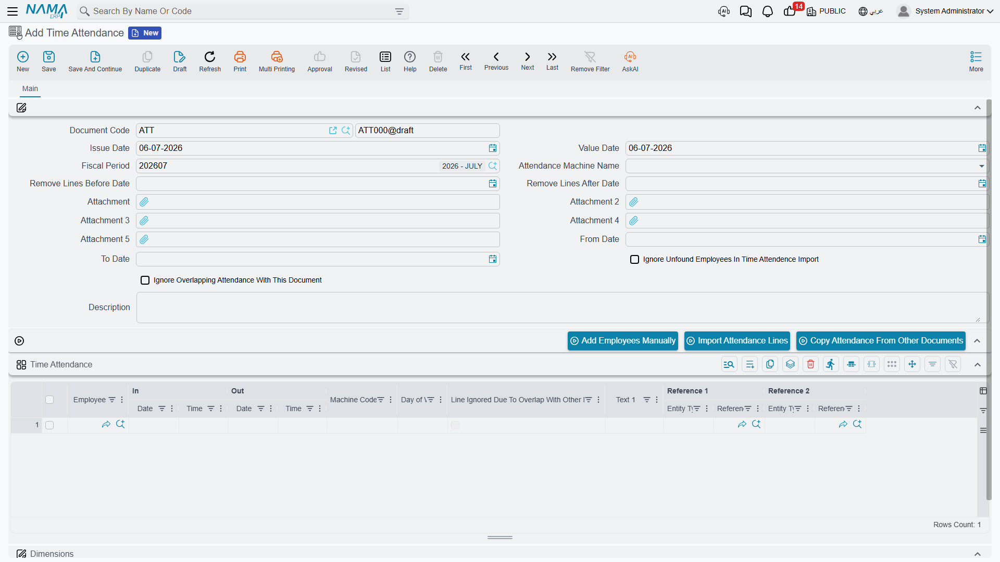
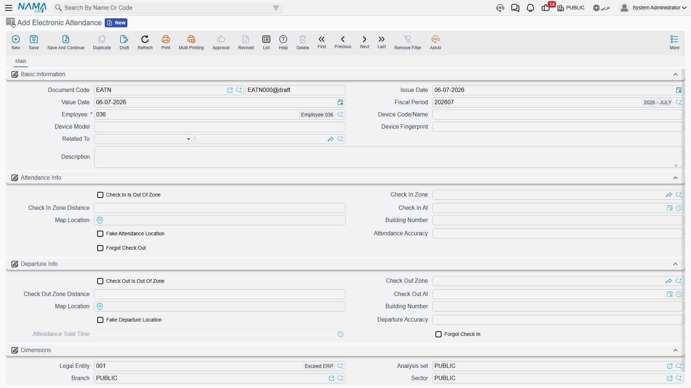

# Time Attendance

An [Attendance Plan and Shift](attendance-plans-and-shifts.md) tells Nama what an employee's day is *supposed* to look like. This page is about what actually happened: the raw check-in and check-out punches, however they were captured, and how those punches turn into money on the payslip.

Nama records punches two different ways, for two different sources:

- **Time Attendance** (حضور / إنصراف) — a batch document that brings in punches from a physical fingerprint/card machine, one file (or a manual line) at a time, for many employees at once.
- **Electronic Attendance** (حضور إلكتروني) — a single employee's own check-in/check-out through the mobile app, optionally geofenced to a specific location.

Both ultimately feed the same place: a per-employee, per-day record of "in" and "out" that the salary engine reads when it calculates lateness, overtime, and absence.

## Time Attendance — punches from a machine

Found at **Payroll > Time Attendance > Time Attendance**.

A Time Attendance document is a container for a batch of punches — usually everyone whose fingerprint machine exported a file that day, or that week. Its header covers the batch as a whole:

| Field (English → Arabic) | Purpose |
|---|---|
| Document Code / Book (رقم المستند / الدفتر) | The document's own numbering. |
| Issue Date / Value Date (تاريخ التحرير / التاريخ الفعلي) | When it was written up, and the accounting/business date it counts for. |
| Fiscal Period (الفترة) | The HR period this batch of punches belongs to. |
| Attendance Machine Name (آلة الحضور والإنصراف) | Which machine's export format this document expects — see [Attendance Machines](attendance-machines.md) for how a machine's file layout is described to Nama. |
| From Date / To Date (من تاريخ / إلى تاريخ) | The date range the imported punches should fall within. |
| Remove Lines Before/After Date (حذف السطور قبل/بعد تاريخ) | Housekeeping switches that drop stray lines outside the expected range before saving. |
| Ignore Unfound Employees In Import (تجاهل اكواد الموظفين الغير موجودة) | Skip file rows whose machine employee-code doesn't match anyone, instead of stopping the whole import. |
| Ignore Overlapping Attendance With This Document (تجاهل الحضور والانصراف المتقاطع) | See [Attendance Machines](attendance-machines.md) — lets this batch's punches coexist with punches already recorded for the same employee/time from another document, rather than conflicting. |
| Attachment 1–5 (مرفق) | The exported machine file(s) themselves, up to five per document. |

Three buttons drive how lines get onto the document, rather than typing each punch by hand:

| Action | Purpose |
|---|---|
| **Add Employees Manually** (إضافة موظفين يدويا) | Adds specific employees as blank lines, for hand-entering their in/out times directly. |
| **Import Attendance Lines** (إستيراد الحضور والإنصراف) | Reads the attached machine file(s) using the selected machine's formula and populates the grid automatically. |
| **Copy Attendance From Other Documents** (نسخ الحضور والانصراف من السندات الأخرى) | Pulls in punches already saved on other Time Attendance documents, for merging or correcting a range. |

Each resulting line in the **Time Attendance** grid records one employee's in/out pair for one day:

| Column (English → Arabic) | Purpose |
|---|---|
| Employee (الموظف) | Who punched. |
| In Date / In Time (الحضور | تاريخ / وقت) | Check-in timestamp. |
| Out Date / Out Time (الإنصراف | تاريخ / وقت) | Check-out timestamp. |
| Machine Code (كود الماكينة) | The employee's ID as known to the physical machine, distinct from their Nama employee code. |
| Day of Week (اليوم) | Read-only, for a quick sanity check against weekends/holidays. |
| Line Ignored Due To Overlap (تم تجاهل السطر للتقاطع) | Marked automatically when this line was suppressed because another document already covers the same time — see Attendance Machines. |
| Text 1 / Reference 1 / Reference 2 | Free extra fields some machine formulas populate. |

::: tip Nama never talks to the machine directly
Whatever the brand of fingerprint or card machine, Nama only ever reads the **file it exports** — it does not connect to the device over the network. The [Attendance Machines](attendance-machines.md) page covers how that file's format is described to Nama (the attendance formula) and how machine-to-machine punch overlaps are resolved.
:::

## Electronic Attendance mobile self-service punches

Found at **Payroll > Mobile App - HR > Electronic Attendance**.

Where Time Attendance is a bulk import, Electronic Attendance is one employee tapping "check in" / "check out" on their phone, one record per punch pair. Its header identifies the employee and the device:

| Field (English → Arabic) | Purpose |
|---|---|
| Employee (الموظف) | Who is checking in. |
| Device Code/Name (كود/اسم جهاز الجرد) | The phone or device the punch was made from. |
| Device Model (نوع الجهاز) | The device's model/type, as reported by the app. |
| Related To (يرتبط بـ) | An optional link back to whatever business record this attendance instance relates to. |

The record then splits into a **Check-In** side and a matching **Check-Out** side, and both can be geofenced independently:

| Field (English → Arabic) | Purpose |
|---|---|
| Check In/Out Is Out Of Zone (الحضور/الإنصراف خارج النطاق) | Whether this punch fell outside its allowed geofence. |
| Check In/Out Zone (منطقة الحضور/الإنصراف) | Which [Electronic Attendance Zone](#Electronic-Attendance-Zone-geofence) the punch was checked against. |
| Check In/Out Zone Distance | How far the punch's GPS position was from that zone's location. |
| Check In/Out At | The timestamp of the punch. |
| Map Location / Building Number (الموقع على الخريطة / رقم المبني) | The GPS point and address captured at the moment of the punch. |
| Fake Attendance/Departure Location | Flagged when the app detects the device's location was likely spoofed. |
| Attendance/Departure Accuracy | The GPS accuracy reported by the device at that moment. |
| Forgot Check Out / Forgot Check In (نسيان بصمة خروج / دخول) | Set when the matching half of the pair was never recorded — the employee checked in but never checked out, or vice versa. |
| Attendance Total Time (إجمالي وقت الحضور) | The computed duration between check-in and check-out. |

::: tip A forgotten punch isn't a dead end
When Electronic Attendance flags **Forgot Check In** or **Forgot Check Out**, the record doesn't just sit there incomplete. The **Convert To Leave Permission** action turns it directly into a [Leave Permission](leave-permissions-and-missions.md) of the matching type (Forgot Check In / Forgot Check Out), so the missing punch gets a proper, reviewable explanation instead of silently counting as an absence.
:::

### Electronic Attendance Zone geofence

**Electronic Attendance Zone** (منطقة حضور إلكتروني, master file at **Payroll > Mobile App - HR > Electronic Attendance Zone**) is what "in zone" or "out of zone" is measured against. Each zone is a location — country, city, state/governorate, area, street, building number, and a point on the map (Map Location) — plus a **Max Distance Away** tolerance. When an employee checks in, Nama compares their GPS position to the zone's point; inside the tolerance, the punch is in-zone, outside it, Electronic Attendance flags it as out-of-zone.

## How a punch becomes an addition or a deduction

Neither Time Attendance nor Electronic Attendance touches the payslip directly — they only establish, per employee per day, when work started and ended. That raw record is then rolled up into daily figures (worked time, lateness, early leave, overtime, absence), and those figures reach salary through **performance indicators**: a [Salary Calculation Formula](../payroll/salary-calculation-formulas.md) of the "Related To Performance Indicator" type reads a [Performance Indicator](../performance/performance-indicators.md) built on the day's attendance figures and turns it into an addition (e.g. an overtime component) or a deduction (e.g. a lateness penalty). See **[How Salary Is Calculated](../concepts/hr-salary-engine.md)** for the full pipeline this step (Step 4) belongs to.

::: warning Attendance documents never post accounting on their own
Time Attendance and Electronic Attendance have no ledger effect of their own — they are pure attendance data. The accounting entry, if any, is always carried by the **Salary Document** that later reads the resulting performance-indicator figures, not by the attendance record itself.
:::

## Workflow

1. **Bulk machine punches**: attach the exported file(s) to a **Time Attendance** document, select the right **Attendance Machine Name**, and run **Import Attendance Lines** — or add employees manually for hand entry.
2. **Mobile self-service punches**: employees check in/out from the app; Nama saves each as an **Electronic Attendance** record, checking the GPS position against any configured **Electronic Attendance Zone**.
3. **Handle a forgotten punch**: use **Convert To Leave Permission** on the flagged Electronic Attendance record rather than leaving it incomplete.
4. **Let the salary engine read the result**: once the period's attendance is complete, performance indicators pick up the daily figures and feed the relevant salary formulas.

## Related pages

- **[Attendance Plans & Shifts](attendance-plans-and-shifts.md)** — the expected schedule that punches are measured against.
- **[Attendance Machines](attendance-machines.md)** — how a machine's exported file format is described to Nama, and how overlapping punches across documents are resolved.
- **[Leave Permissions & Missions](leave-permissions-and-missions.md)** — short in-period exceptions (early leave, forgotten punches, missions) that adjust how a day's attendance is read.
- **[Salary Calculation Formulas](../payroll/salary-calculation-formulas.md)** and **[Performance Indicators](../performance/performance-indicators.md)** — how attendance figures turn into money.
- **[How Salary Is Calculated](../concepts/hr-salary-engine.md)** — the full pipeline attendance feeds into.
