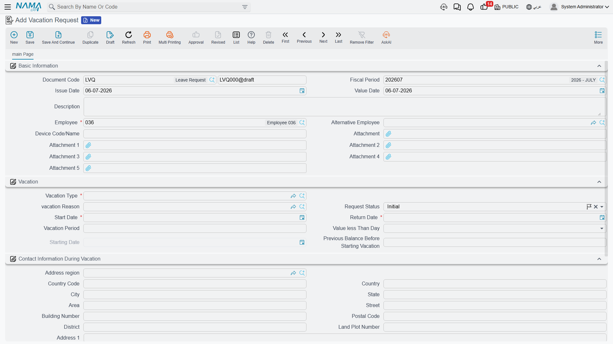
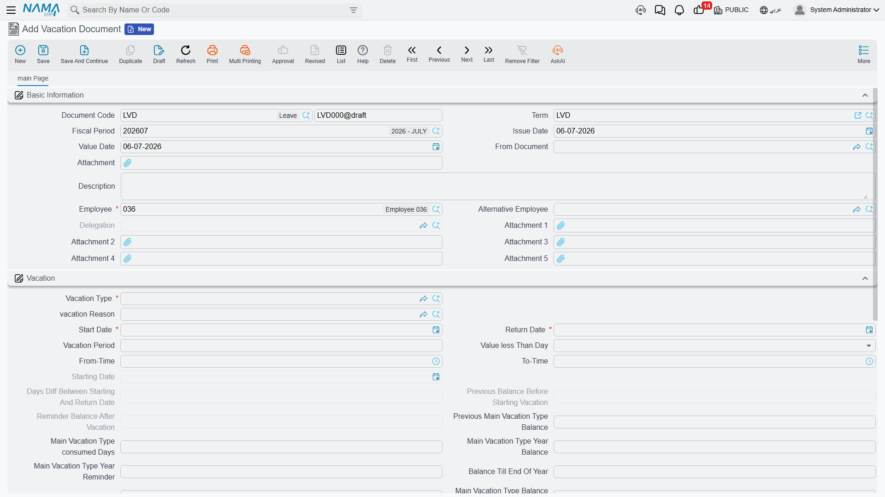

# HR Requests, Documents & Aggregated Documents

Almost everything that happens to an employee in Nama HR — a vacation, a loan, joining the company, leaving it — is recorded through the **same three-layer pattern**. Once you understand this pattern you can read any HR screen, because they all behave the same way. This page explains that pattern once so the rest of the HR documentation can simply point back here.

The three layers are:

1. A **Request** (طلب) — an application that may need approval before anything real happens.
2. A **Document** (سند) — the executed transaction that actually changes balances, pay, or employee state.
3. An **Aggregated** (مجمع) batch — a single screen that produces many ordinary documents (or requests) in one go.

They are not three unrelated screens. They are three deliberate stages of the same business event, and most HR areas ship all three so an organisation can choose how much approval and how much bulk handling it needs.

## Requests: the approval application

A **Request** captures an intention and routes it for a decision before it takes effect. A vacation request, a loan request, a work-starting request and a firing request all carry the real business fields (employee, dates, amounts) *plus* an approval state that an ordinary document does not have.

That state moves through four values:

| State (English) | Arabic | Meaning |
|---|---|---|
| Initial | مبدئي | Just entered; waiting for a decision. |
| Accepted | مقبول | Approved — it may now be turned into a document. |
| Rejected | مرفوض | Turned down; it goes no further. |
| Processed | تمت معالجته | A document has already been generated from it — it is closed and can no longer be accepted or rejected. |

Two buttons drive the decision. On a loan request, for example, the reviewer clicks **Accept** (قبول) or **Reject** (رفض); the state changes accordingly.

::: info A request has no financial effect
A request never touches pay, balances or the ledger on its own — it is purely the paperwork for a decision. The real effect only happens once it becomes a **Document**. This is exactly why the request layer is optional: if your organisation does not need a separate approval step for, say, short leaves, you can enter the document directly and skip the request entirely.
:::

## Documents: the executed action

A **Document** is where the real business effect lives. Saving a vacation document actually consumes the employee's balance and marks the days as leave; saving a loan document actually disburses the loan and schedules its installments; saving a work-starting document actually puts the employee on the payroll. Documents that touch money are **processed** into accounting and inventory effects in the background, exactly like documents elsewhere in Nama (see how effects are processed on each area's own page).

There are two ways a document comes to life from an accepted request:

1. **From the request** — the reviewer opens the accepted request and clicks its generate button (for a vacation request this is **Generate Vacation Doc** / إنشاء سند أجازة). Nama builds a matching document pre-filled from the request.
2. **From the document** — the user opens a fresh document and picks the source request in its "from document" field. This picker deliberately lists **only Accepted requests** — you cannot build a real document from something that is still awaiting approval or was rejected.

Either way, the moment the document is created the originating request flips to **Processed**, so the same request can never be turned into two documents.

::: tip Reading a numbered example
Consider employee Ahmed asking for 10 days of annual leave:

1. HR (or Ahmed via self-service) enters a **Vacation Request** — state **Initial**.
2. His manager opens it and clicks **Accept** — state **Accepted**.
3. HR clicks **Generate Vacation Doc**; a **Vacation Document** is created and saved, consuming 10 days from Ahmed's balance. The request is now **Processed**.

If the manager had clicked **Reject** at step 2, the request would sit at **Rejected** and no document — and no balance change — would ever occur.
:::

## Aggregated documents: the batch factory

When the same action applies to a whole group, entering one document at a time is painful. An **Aggregated** document is a single header with a grid, where **each line spawns one ordinary single-employee document when the batch is saved**. You work in one place, and the system quietly manufactures the individual documents behind it.

The relationship is managed for you:

- Each grid line stores a back-pointer to the single document it created.
- Adding a line creates a new single; removing a line deletes its single.
- Because the singles are **system-managed**, you should **edit the batch, not the generated singles** — changing a single directly puts it out of step with its parent.

::: warning The aggregated term must have a generated book/term
An aggregated document only knows how to create its children if its **document term** (توجيه المستند) names the **book/term to use for the generated single documents**. If that setting is left empty, the batch cannot spawn its singles and saving fails. This is the single most common setup mistake with aggregated screens — configure the generated book on the term before using the batch.
:::

Aggregation also exists at the request layer: an **aggregated request** produces many single **requests** (each still needing its own accept/reject), while an **aggregated document** produces many single **documents** directly.

### Two aggregation axes — do not confuse them

There are **two completely different reasons** to aggregate, and Nama gives each its own screen. This is worth pausing on, because the screens have similar names but mean opposite things.

| Axis | What one grid line means | Example screen | Arabic |
|---|---|---|---|
| **Many employees** | One line per employee — the same action for a whole group | Multi Employee Vacation | سند أجازة مجمع لأكثر من موظف |
| **One employee, many segments** | One line per segment of a single long event, split across balances/types | Aggregated Vacation Document | سند أجازه مجمع |

So a **Multi Employee Vacation** sends *many people* on leave at once (one document each), whereas an **Aggregated Vacation Document** splits *one person's* long leave into several segments (for example, drawing part from the annual balance and part from an unpaid allowance) — and still produces the individual vacation documents underneath. The same "many employees" idea reappears elsewhere (aggregated firing, aggregated loans, aggregated missions); the "one employee, many segments" idea is specific to vacations.

## One document, several possible origins

The layered pattern is flexible about where a document starts. A **Work Starting Document**, for instance, does not have to come from a work-starting request at all — it can originate from:

- a **job offer** that the candidate accepted (onboarding a new hire),
- a **return from a prior vacation** (an employee resuming work), or
- a plain **work-starting request**.

Whatever the origin, the resulting document is the same executed transaction that puts the employee on the payroll. Keep this in mind when tracing where a document "came from" — the source field tells the story.

## Where to find these screens

The request and document screens live beside each other in the menu, grouped by topic:

| Screen | Menu path |
|---|---|
| Vacation Request / Document | Payroll > Vacations > Vacation Request / Vacation Document |
| Aggregated Vacation Document | Payroll > Vacations > Aggregated Vacation Document |
| Multi Employee Vacation | Payroll > Vacations > Multi Employee Vacation |
| Loan Request / Document | Payroll > Loans / Installments > Loan Request / Loan Document |
| Work Starting Request | Human Resources > Recruitment > Work Starting Request |
| Work Starting Document | Payroll > Recruitment > Work Starting Document |
| Firing Request / Document | Payroll > Dues Liquidation and Firing > Firing Request / Firing Document |

## Where this pattern shows up

Now that the pattern is clear, each of these areas simply applies it:

- **[Vacation documents](../vacations/vacation-documents.md)** — the request → document flow and both aggregation axes.
- **[Loans & installments](../loans/hr-loan-documents.md)** — loan request → loan document → installment recovery.
- **[Work starting](../recruitment/work-starting.md)** — onboarding, and the three possible document origins.
- **[Firing & termination](../end-of-service/firing-and-termination.md)** — firing request → firing document → dues liquidation.
