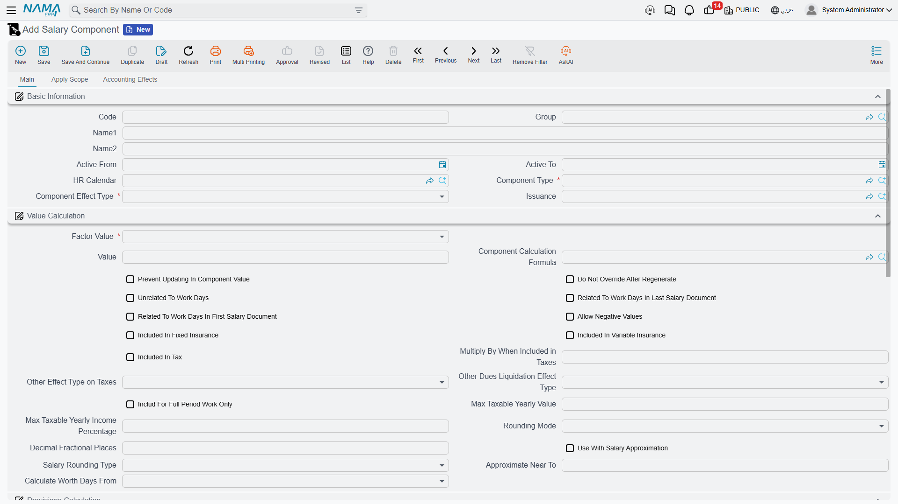
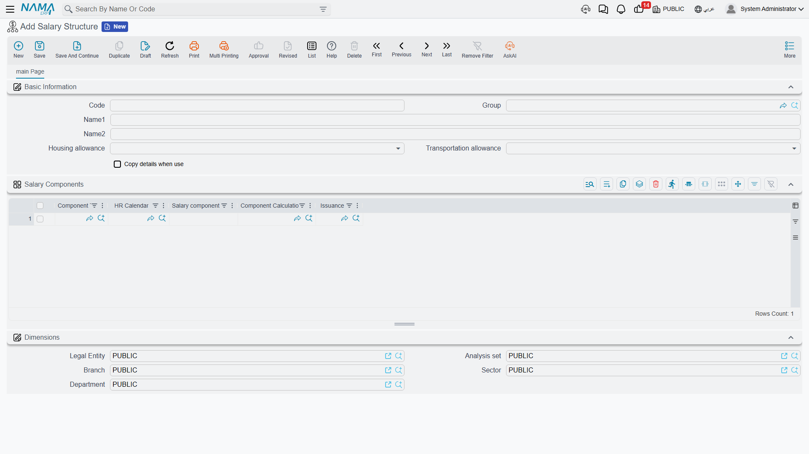

# How Salary Is Calculated

A payslip in Nama is never typed in by hand — it is **computed** from building blocks you set up once and reuse every month. Understanding how those blocks fit together is the key to trusting the numbers, and to fixing them when a figure comes out wrong. This page walks the whole pipeline end to end; the detailed screens each have their own page, linked as we go.

At the highest level, salary flows through **five stages**:

1. **Define** the kinds of pay and deduction (component types).
2. **Price** each one — a fixed value, or a formula.
3. **Assign** components to employees (directly or via a reusable structure).
4. **Feed** the month with attendance and performance figures.
5. **Generate** the salary sheet, which produces one salary document per employee.

Let's follow a component from definition all the way to the payslip.

## Step 1 — Define the kinds of pay and deduction

Everything starts with a **Salary Component Type** (نوع المفرد): the *category* of a pay element — Basic, Housing, Transportation, a tax, overtime, an insurance share, and so on. The type carries the flags that every component of that kind inherits, and two of them are load-bearing:

- **Effect type** — is this money **added**, **deducted**, or neither?

| Effect type | Arabic | Role in the payslip |
|---|---|---|
| Addition (إضافة) | إضافة | Increases the salary (basic, allowances, overtime). |
| Deduction (إستقطاع) | إستقطاع | Reduces the salary (tax, insurance, penalties, installments). |
| Other (أخري) | أخري | Informational only — recorded but **not** added to or subtracted from net pay. |

- **Component order** — the sequence in which components are calculated. This matters enormously: a component that is a *percentage of another* must be calculated **after** the thing it depends on. Tax computed before the allowances it should tax will silently come out as zero.

The type also decides whether the amount counts toward the tax base and the insurance base, and a **Salary Component Group** (مجموعة مفردات) can bundle related components for organisation only — it has no effect on the maths.

## Step 2 — Price each component

A **Salary Component** (مفرد راتب) is the priced element itself. The crucial choice here is its **value method**:

| Value method | Arabic | Meaning |
|---|---|---|
| Constant Value | قيمة ثابتة | A fixed literal number (e.g. a housing allowance of 1,000). |
| Variable Value | متغير | Driven by a **calculation formula**, so the amount changes with the inputs each month. |

A component also carries **applicability filters** (which employees, branches, or job positions it applies to) and its **debit/credit account lines** — this is what lets the salary document post to the general ledger later.

### Formulas: where variable amounts come from

A **Component Calculation Formula** (معادلة حساب المفرد) turns inputs into a number. Its **formula type** names the source of the calculation — a few of the many options:

- **Percentage from totals / additions / deductions** — a slice of other components.
- **Related to a performance indicator** — the amount tracks a measured figure (overtime hours, sales, attendance).
- **Taxes** — a progressive tax computed over brackets.
- **Insurance percentages** — the employee's or company's share of the social-insurance base.
- **Composite** — a formula built from other formulas.

The **calculation method** then decides how the brackets apply:

| Method | Arabic | Behaviour |
|---|---|---|
| One Percentage | نسبة واحدة | A single rate over the whole base. |
| Sections | شرائح | Progressive brackets — each slice of the base is taxed at its own rate. |

Each **calculation line** (bracket) has a range, a factor/rate, optional criteria that gate whether it applies, and optional minimum/maximum clamps. When detailed logging is enabled, every bracket that fires leaves an audit entry on the salary document — the "why is this number what it is" trail that support staff rely on.

::: tip A worked progressive-brackets example
Suppose income tax is defined with **Sections** as:

- 0 – 2,000 → 0%
- 2,001 – 5,000 → 10%
- 5,001 and above → 15%

For a taxable base of **6,000**, the tax is computed slice by slice, not all at one rate:

- first 2,000 → 0
- next 3,000 (2,001–5,000) → 300
- remaining 1,000 (5,001–6,000) → 150

**Total tax = 450.** With **One Percentage** at 15% instead, the whole 6,000 would be taxed → 900. Choosing Sections vs One Percentage is therefore a real business decision, not a cosmetic one.
:::

## Step 3 — Assign components to employees

Components reach an employee in one of two ways, and the order of precedence matters.

Each employee's own record (their [HR information](../setup/employee-hr-information.md), or the job offer they were hired on) can list their personal component lines with per-employee values. A **Salary Structure** (هيكل راتب) is a **reusable template** of component lines — "the standard package for a sales representative", say.

The key rule: **the structure is a fallback, not an override.** When salary is generated, Nama reads the employee's own component lines first; the structure is consulted **only** when the employee has none of their own. So filling in a structure never quietly overwrites what you set on an individual — it fills the gaps.

Within a structure, each line can still override the component master's value or formula, so one template can host small variations without needing a new component for each.

## Step 4 — Feed the month with attendance and performance

Variable amounts need live monthly inputs, and those come mostly from **[time & attendance](../attendance/time-attendance.md)** and **[performance indicators](../performance/performance-indicators.md)**.

Attendance punches are rolled up per day into worked time, overtime, lateness and absence. Those figures reach salary through **performance indicators**: a formula of the "related to a performance indicator" type reads the indicator and turns it into money. A *daily* indicator is factored per working day; a *periodic* one uses the month's total. Attendance also drives the pro-rating of pay for partial months and the deduction for non-worked days.

Employees paid by the day rather than a monthly salary are handled through the **Daily Salary** (أجر يومى) document instead of this monthly component machinery.

## Step 5 — Generate the salary sheet and documents

Finally, the **Salary Sheet** (سجل الرواتب) is the batch run for one HR period: it collects the eligible employees (skipping anyone already paid for that period) and computes each one. Out of the sheet comes a **Salary Document** (سند الراتب) per employee — the individual payslip, and the **source of the accounting effect**. The general-ledger entry is carried on the salary document itself, through the debit/credit account lines of the components that make it up.

The full detail of sheets and documents — including exactly what posts to the ledger — is on the **[salary documents](../payroll/salary-documents.md)** page.

::: warning "Salary Issuance" is a classifier, not a payment
A **Salary Issuance** (صرفية راتب) does **not** pay anyone and does **not** post accounting. It is a **stream/tag** that lets you run parallel payrolls for the same period (for example, a main monthly salary alongside a separate commissions run). Think of it as a label on the payroll stream, not the payment step — the money still flows through the salary document.
:::

## When a component comes out as zero

Because the pipeline is ordered and rule-driven, a mis-set flag usually shows up as a component **silently computing to zero** rather than as an error. The recurring culprits:

::: warning Common self-zeroing causes
- **Wrong component order** — a percentage or tax calculated *before* the components it depends on has nothing to work from and lands on zero. Fix the order.
- **"Other" components** are informational by design — they never add to or subtract from net pay.
- Components classified as **Installment** or **end-of-service/Work-End** items are deliberately zero in an ordinary monthly salary; they only carry value in their own dedicated documents.
- **Housing / Transportation** allowances self-zero unless they are actually enabled on the employee's own record — the structure alone is not enough.
- A **mid-period information change** (a raise or transfer part-way through the month) splits the calculation into segments; check the segment boundaries if a total looks off.
:::

## Related pages

- **[Salary components](../payroll/salary-components.md)** and **[calculation formulas](../payroll/salary-calculation-formulas.md)** — the full detail of Steps 1 and 2.
- **[Salary structures](../payroll/salary-structures.md)** — reusable templates (Step 3).
- **[Salary documents](../payroll/salary-documents.md)** — sheets, documents and the ledger effect (Step 5).
- **[Annual increases](../payroll/hr-annual-increases.md)** and **[salary blocking](../payroll/salary-blocking.md)** — periodic raises and holding pay.
- **[Time & attendance](../attendance/time-attendance.md)** and **[performance indicators](../performance/performance-indicators.md)** — the monthly inputs (Step 4).
- **[HR years & periods](../setup/hr-years-and-periods.md)** — the time framework every salary sheet runs within.
