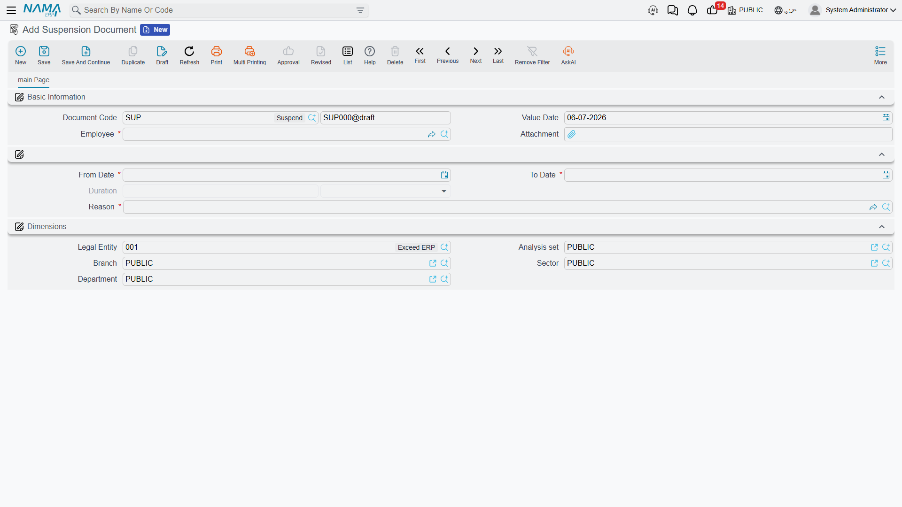

# Suspension

A **Suspension Document** (إيقاف عن العمل) records that an employee was suspended from work for a stretch of days — and, depending on why, whether that stretch is paid or not. It sits in the same disciplinary group as [Rewards & Penalties](rewards-and-penalties.md), but it isn't about a single pay figure; it's about a date range the employee didn't work.

**Where to find it:** Payroll > Reward / Penalty > Suspension Document (الرواتب > نوع مكافأة / جزاء > إيقاف عن العمل).

| Field (English) | Arabic | Notes |
|---|---|---|
| Employee | الموظف | Who is being suspended. |
| Value Date | التاريخ الفعلي | The date this document itself takes effect from. |
| From Date / To Date | من تاريخ / إلى تاريخ | The suspension's date range. |
| Duration | المدة | Calculated automatically once From Date and To Date are set — the number of days between them, inclusive of both ends. |
| Reason | السبب | Picked from the same **Leave Reason** catalog used elsewhere in HR, filtered down to the reasons a company has earmarked for suspension use. |
| Attachment | مرفق | Supporting documentation for the suspension. |

The **Reason** is what decides the pay effect: every Leave Reason carries a **Without Salary Deducted From Termination** flag (بدون مرتب و يخصم من نهاية الخدمة). Pick a reason with that flag on for an unpaid disciplinary suspension; pick one without it for a suspension that doesn't touch pay at all.

::: info No accounting effect
Like [Change Employee State](../vacations/change-employee-state.md), a Suspension Document never touches the ledger on its own. It exists purely to mark a date range and, through its Reason, whether that range is paid.
:::

## What it does to pay

A Suspension Document isn't just a record — the salary engine reads it directly: any suspension whose date range overlaps a payroll period is picked up automatically when that period's [Salary Document](../payroll/salary-documents.md) is generated. If the chosen Reason is flagged **Without Salary**, those days show up on the Salary Document as **Suspension Days Without Salary** (أيام إيقاف عن العمل بدون مرتب) and reduce the pay for the period accordingly; if the Reason isn't flagged that way, the suspension is recorded but the pay is unaffected.

::: tip This is separate from the employee's official working state
Recording a Suspension Document does **not**, by itself, flip the employee's working state to `Suspended`. If a company also wants the employee's official status to read `Suspended` — for reporting, or to keep them out of other workflows — that is a deliberate, separate entry on [Change Employee State](../vacations/change-employee-state.md).
:::

## Related pages

- **[Rewards & Penalties](rewards-and-penalties.md)** — the other discipline-related document, for adjusting a single pay figure rather than a date range.
- **[Change Employee State](../vacations/change-employee-state.md)** — where an employee's official working state (including `Suspended`) is recorded.
- **[Salary Documents](../payroll/salary-documents.md)** — where a suspension's unpaid days actually reduce the period's pay.
