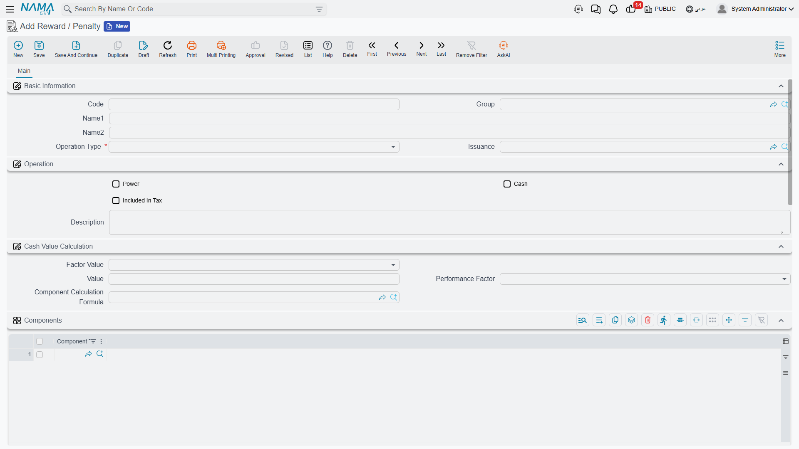
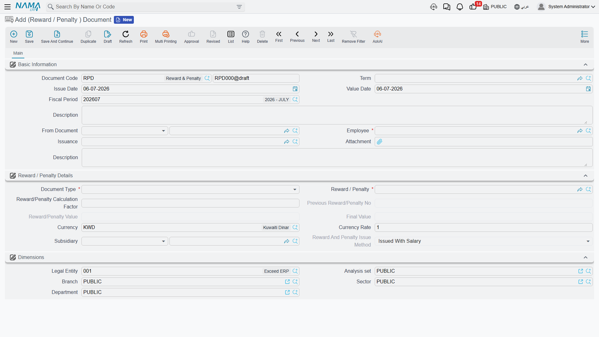

# Rewards & Penalties

Not every adjustment to an employee's pay comes from the [salary structure](../payroll/salary-structures.md) or [attendance](../attendance/time-attendance.md) — some of it is ad hoc: a one-off bonus for good work, or a deduction for a specific incident. That is what a **Reward / Penalty** (نوع مكافأة / جزاء) type and its **(Reward / Penalty) Document** (سند مكافأة/جزاء) exist for: a small, reusable catalog of named bonuses and deductions, and a document that applies one of them to a specific employee on a specific day.

::: tip Not the same as a government penalty
This page is about **payroll-level** rewards and penalties — internal bonuses and disciplinary deductions a company defines for itself. Saudi/Gulf **labor-authority (HO) violations** are a completely different catalog with their own escalation rules and their own ledger posting — see [Government Penalties](../government-relations/government-penalties.md). The two never share a type or a document.
:::

## Where to find them

- **Reward / Penalty** (the catalog) — **Payroll > Reward / Penalty > Reward / Penalty** (الرواتب > نوع مكافأة / جزاء > نوع مكافأة / جزاء).
- **(Reward / Penalty) Document** — **Payroll > Reward / Penalty > (Reward / Penalty) Document** (الرواتب > نوع مكافأة / جزاء > سند مكافأة/جزاء).

## The Reward / Penalty catalog

Each catalog entry is a small master record that says what kind of bonus or deduction this is, and — if it posts to the ledger on its own — where it posts.

| Field (English) | Arabic | Notes |
|---|---|---|
| Group | المجموعة | An optional master group, for organizing a long catalog. |
| Operation Type | نوع الإجراء | `Reward` (مكافأة) or `Penalty` (جزاء) — the two things this catalog can define. |
| Issuance | الصرفية | Ties the type to one [Salary Issuance](../setup/hr-years-and-periods.md), when a company runs more than one payroll stream. |
| Power | عينية | Marks the type as an **in-kind** reward/penalty (a benefit or deduction in goods or services) rather than a cash figure. |
| Cash | النقدي | Marks the type as a **cash** amount. |
| Included In Tax | يضاف إلى وعاء الضريبة | Whether the value feeds into the employee's tax basis. |
| Factor Value | حساب المعامل | The **value method**: `Constant Value` (قيمة ثابتة) — a fixed figure — or `Variable Value` (متغير) — computed at document time, the same idea used for [salary components](../payroll/salary-components.md). |
| Value | القيمة | The fixed amount, when the value method is Constant. |
| Performance Factor / Component Calculation Formula | معدل الأداء / معادلة حساب المفرد | Inputs used to compute the amount when the value method is Variable — the same [calculation formula](../payroll/salary-calculation-formulas.md) machinery salary components use. |
| Components (grid) | المكونات | One or more salary Component Types the variable calculation draws its base figure from (for example, "one day of Basic Salary"). |

Below that, a Reward/Penalty type carries its own **Debit Accounts** and **Credit Accounts** blocks — the same account-line pattern used on [salary components](../payroll/salary-components.md): a distribution type (`Fixed`, `Variable`, or `Fixed With Criteria`) plus one or more account lines. These accounts are what a document posts through, either directly or via the next salary run — see "How it's processed" below.

## The (Reward / Penalty) Document

This is where a specific occurrence gets recorded against one employee.

| Field (English) | Arabic | Notes |
|---|---|---|
| Term | توجيه المستند | The document term — decides numbering, whether this document posts on its own, and where its debit/credit accounts come from. |
| Employee | الموظف | Who receives the reward or penalty. |
| Issuance | الصرفية | Auto-filled from the chosen type when it carries one. |
| Document Type | نوع المستند | `Reward` or `Penalty`, mirrored from the chosen type. |
| Reward / Penalty | نوع مكافأة / جزاء | Which catalog entry this document applies. |
| Reward/Penalty Calculation Factor | معامل حساب المكافأة/الجزاء (عدد مرات التطبيق) | How many times the type's value applies — required whenever the type is a Cash reward/penalty. |
| Previous Reward/Penalty No | عدد المكافأة/الجزاء السابق | An automatic running count of how many times this same type was already committed for this employee — handy for escalating penalties. |
| Reward/Penalty Value | القيمة المعرفة بنوع المكافأة/الجزاء | The per-unit value pulled from the type (fixed, or computed for a Variable type). |
| Final Value | القيمة النهائية | Calculation Factor × Reward/Penalty Value — the bottom line. |
| Subsidiary | الذمة | The settlement party/account this document is booked against. |
| Reward And Penalty Issue Method | طريقة صرف المكافأة / الجزاء | `Issued Immediately` (تصرف الآن) or `Issued With Salary` (تصرف مع الراتب) — see below. |

For example, a "Late Arrival" penalty type worth 50 (one day's basic pay) applied three times in a month produces a Reward/Penalty Calculation Factor of 3, a Reward/Penalty Value of 50, and a Final Value of 150.

::: warning Immediate posting needs a fixed value
If the document's term is set to `Issued Immediately`, Nama requires the chosen Reward/Penalty type to use a **Constant** value method and a **Fixed** distribution on both its debit and credit accounts — a criteria-based or salary-computed value can only flow through a salary run, not post on its own the moment the document is committed.
:::

::: info One per employee per day (optional)
An HR configuration setting can block recording the same Reward/Penalty type for the same employee twice on the same day, to guard against accidental duplicates.
:::

## How it's processed / what it posts

Whether a (Reward / Penalty) Document generates a ledger effect at all is a choice made on its **term** — a document term can turn accounting effects **off** entirely, in which case the document is a pure record with no posting.

When the term does have an accounting effect switched on, committing (or later updating/cancelling) the document creates a background **business request** with a **processing status**, retryable from the **Business Requests** view if it fails — building one debit line and one credit line for the Final Value. The accounts for those two lines come from one of two places, depending on the term's setup: either the **Reward/Penalty type's own Debit/Credit Account Lines** (the same accounts described above), or, if the type doesn't supply them, accounts configured directly on the term itself.

In practice the **Issue Method** decides which pattern is used:

- **Issued Immediately** — the document is normally set up to post on its own, right away, independent of any salary run.
- **Issued With Salary** — the far more common case — the document typically does *not* post on its own; instead its Final Value carries forward and is folded into the employee's next [Salary Document](../payroll/salary-documents.md), which is what actually posts the entry, through the same accounts configured on the Reward/Penalty type. The salary document's own **Rewards / Penalties** grid, and its **Current Month Penalties / Postponed From Previous Month / Postponed To Next Month** figures, are exactly this: the running tally of reward/penalty documents feeding into that period's pay.

## Related pages

- **[Salary Documents](../payroll/salary-documents.md)** — where an "Issued With Salary" reward/penalty actually posts, alongside every other component of the pay run.
- **[Salary Components](../payroll/salary-components.md)** and **[Salary Calculation Formulas](../payroll/salary-calculation-formulas.md)** — the same value-method and account-line patterns reused here.
- **[Government Penalties](../government-relations/government-penalties.md)** — the separate, legally-driven disciplinary catalog for labor-authority (HO) violations.
- **[HR Suspension](hr-suspension.md)** — a related but distinct disciplinary document: suspending an employee from work rather than adjusting a single pay figure.
