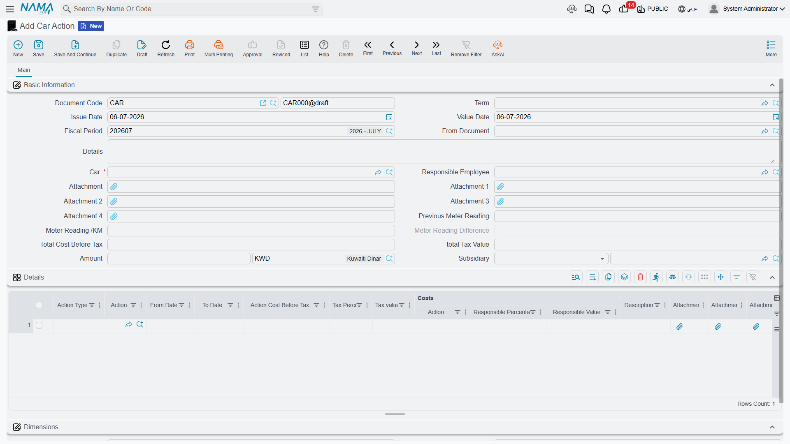
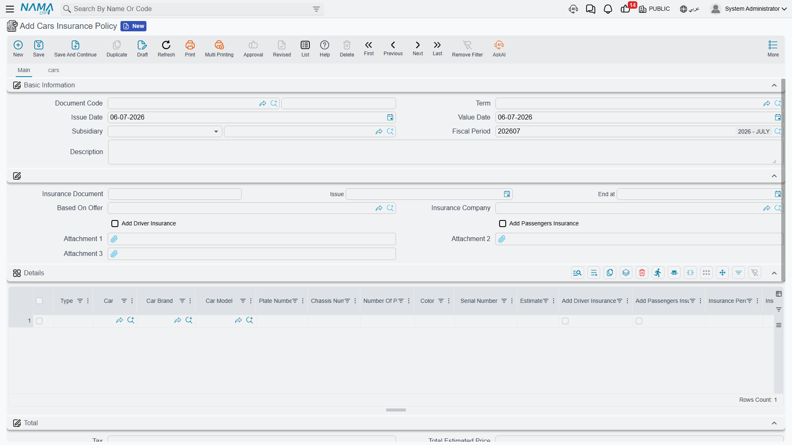
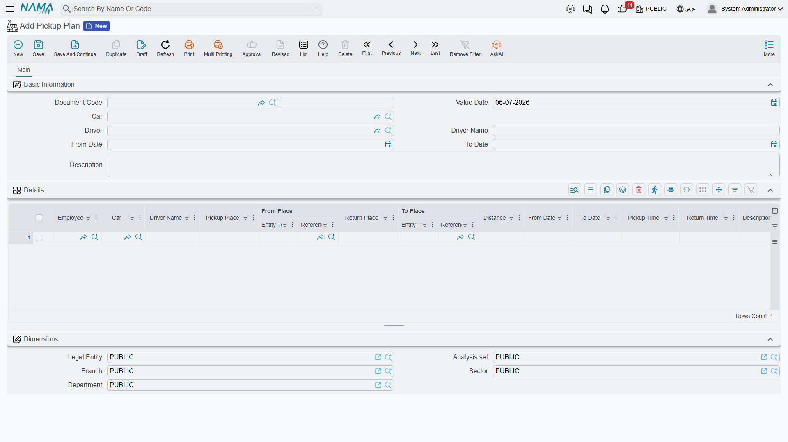
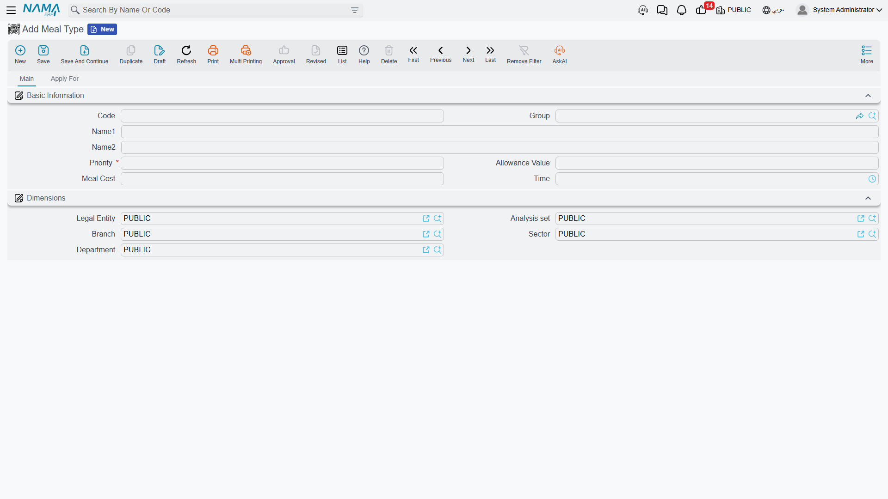

# Employee Services (Vehicles, Transport & Meals)

Beyond salary, most companies run a handful of side benefits for their staff — a car to do the job
with, a bus to get to the site, a hot meal at the canteen. These three areas share nothing in common
functionally, but they share a home in Nama because they are all **catalog-driven employee
perks**: someone maintains a small master list once (car problem codes, meal types, pickup routes),
and the rest of the department repeatedly draws from it. This page walks through all three: **Vehicles**
(assigning and servicing company cars, and insuring them), **Transport** (the routes a company driver
runs to bring employees to and from work), and **Meals** (what is served, to whom, and when it is
delivered).

::: tip Not government traffic penalties
A **Car Action** or **Car Problem** here means something that happened to the *vehicle* — an
accident, a repair, a routine service. Government traffic fines and violations against the *company*
are a completely different, Gulf-specific area — see
[Government Penalties](./government-relations/government-penalties) instead.
:::

## Vehicles

### Recording what happened to a car: Car Action

Every time a company car needs maintenance, gets into an accident, has its licence renewed, or
incurs any other cost, that event is logged as a **Car Action** (`إجراء سيارة`) — found under
**Human Resources → Vehicles → Car Action** (`الموارد البشرية > السيارات > إجراء سيارة`). One
document can carry several such events for the same car in its **Details** grid, each line picking
a broad **Action Type** (License Renewal, Accident, Violation, Regular Maintenance, Repair, or one of
three open "Other" categories) and then a specific **Action** drawn from the **Car Problem**
(`عطل سيارة`) catalog described below — the exact accident type, service item or repair being billed.

| Field (English) | Arabic label | Purpose |
|---|---|---|
| Car | السيارة | The vehicle the document is about. |
| Responsible Employee | الموظف المسئول | The employee (usually the driver) the car is assigned to. |
| Previous Meter Reading / Meter Reading /KM | قراءة العداد السابقة / قراءة العداد /كم | The odometer reading before and after, so mileage between actions is tracked automatically. |
| Action Type | نوع الإجراء | The broad category of what happened (accident, maintenance, repair, licence renewal…). |
| Action | الإجراء | The specific catalog entry from Car Problem that this line bills. |
| Action Cost Before Tax | تكلفة الإجراء قبل الضريبة | What the action cost, before tax. |
| Responsible Percentage / Responsible Value | نسبة تحمل المسئول / قيمة تحمل المسئول | How much of that cost is charged to the responsible employee rather than the company (e.g. an at-fault accident). |

A related **Car Action Request** (`طلب إجراء سيارة`) exists for the same events but without an
accounting effect — a lighter intake form (who processed it, what happened, the estimated cost) that
can be raised before a formal, ledger-posting Car Action is written up.

::: tip How it's processed
Saving a Car Action raises a background **business request** (`Business Request`) that posts the
cost split to the ledger: the debit side covers the action's cost (net of the responsible employee's
share), the responsible employee's share and its tax are posted separately, and the tax on the whole
action is posted on its own pair of accounts. If that request fails, retry it from the
**Business Requests** view.
:::

### The catalog of things that happen to a car: Car Problem

**Car Problem** (`عطل سيارة`) is the master file both Car Action and Car Action Request draw their
**Action** field from — the actual list of accidents, services and repairs a company car can go
through, each carrying its own accounting configuration (accounts bag, tax exemptions) so every
action of the same kind posts consistently. Maintain it under
**Human Resources → Vehicles → Car Problem** before logging actions against it.

### Moving a car between drivers or departments: Car Info Updater

When a car changes hands — a new driver takes it over, it moves to a different branch or department,
its status changes (Active, Suspended, in an Accident, under Maintenance…), or its running kilometres
need correcting — record that with a **Car Info Updater** (`تحديث بيانات سيارة`). Its Details grid is
built as **current value / new value** pairs, one line per car, so the change is explicit and
auditable rather than a silent overwrite: current driver vs. new driver, current status vs. new
status, current running KM vs. new running KM, and the same before/after pairing for legal entity,
branch, sector, department and analysis set. It does not post to the ledger — it only rewrites the
car's own master data.

## Car insurance

Insuring the company fleet runs through its own small lifecycle, separate from day-to-day Car Actions:

1. **Get a quote.** A **Car Insurance Offer Document** (`سند عرض تأمين سيارات`) records what an
   insurance company quoted — the insurance period, the type of cover, and a Details grid priced by
   **car type** rather than by named vehicle (number of cars, estimated price, driver/passenger
   insurance values, an insurance percentage or minimum, an endurance percentage/limit, and an
   instalment breakdown). It has no accounting effect of its own — it is a quote to compare, not a
   commitment.
2. **Commit to the policy.** Once an offer is accepted, a **Cars Insurance Policy**
   (`بوليصة تأمين سيارات`) is opened — optionally **Based On Offer** so it inherits the quote's
   pricing — naming the insurance company and the policy document's number/issue/end dates. Its
   Details grid now lists actual cars, one line each, with plate number, chassis number, brand,
   model, colour, passenger count, driver/passenger insurance values, discount and tax, so the
   policy's net value is built up car by car. A **cars** tab on the policy lists every **Car
   Insurance Adding Document** and **Car Insurance Removing Document** raised against it, so the
   full history of what was added or dropped from the policy is visible from one place.
3. **Add or remove cars mid-term.** Cars bought or sold after the policy was signed are handled by a
   **Car Insurance Adding Document** (`سند إضافة تأمين سيارات`) or a **Car Insurance Removing
   Document** (`سند حذف سيارات من التأمين`) referencing the **Cars Insurance Policy** they amend. The
   removing document additionally works out a **Recovered Price** — the refund due for dropping a
   car before the policy period ends.
4. **Recognise instalments.** Because a policy is usually paid in instalments, a **Car Insurance
   Installment Proof Document** (`قيد إثبات استحقاق قسط تأمين السيارة`) records the accounting entry
   that recognises one instalment as due, referencing the policy or amendment document it belongs to.

| Field (English) | Arabic label | Purpose |
|---|---|---|
| Based On Offer | بناءا على عرض | Links the policy back to the offer whose pricing it copied. |
| Insurance Document (Number / Issue / End at) | وثيقة التأمين (رقم / تاريخ الإصدار / تاريخ الأنتهاء) | The insurer's own document reference and validity dates. |
| Plate Number / Chassis Number | رقم اللوحه / رقم الهيكل | The specific vehicle a policy line covers. |
| Add Driver Insurance / Add Passengers Insurance | إضافة تأمين السائق / إضافة تأمين الركاب | Whether this line's price includes cover for the driver and/or passengers. |
| Total After Discount / Policy Net Value After Taxes | الصافي بعد الخصم / صافي قيمة البوليصة بعد الضرائب | The policy's running totals after discount and after tax. |

::: tip How it's processed
The **Cars Insurance Policy**, the **Adding** and **Removing** documents, and the **Installment
Proof Document** each raise a background business request that posts the contracting cost, discount
and any fees (plus tax on the fees) to the accounts configured on their document term. Only the
**Insurance Offer Document** has no ledger effect — it is a quote, not yet a commitment. If a posting
fails, retry it from the **Business Requests** view.
:::

## Transport: Pickup Plan

A **Pickup Plan** (`خط سير`, literally "route") is a company driver's daily run: which car, which
driver, over what date range, and — line by line in its Details grid — which employees are picked up
from where and dropped off where, at what time, and how far each leg is. It is found under
**Human Resources → Vehicles → Pickup Plan**
(`الموارد البشرية > السيارات > خط سير`) and does not post to the ledger; it is purely an operational
schedule for HR and transport staff to know who is riding which route.

| Field (English) | Arabic label | Purpose |
|---|---|---|
| Car / Driver / Driver Name | السيارة / السائق / إسم السائق | The vehicle and driver running this route. |
| From Date / To Date | من تاريخ / إلى تاريخ | The period this route is valid for. |
| Employee | الموظف | The employee riding this leg of the route. |
| Pickup Place / From Place | مكان الالتقاط / من المكان | Where the employee is collected. |
| Return Place / To Place | مكان التوصيل / إلى المكان | Where the employee is dropped off. |
| Pickup Time / Return Time | وقت الالتقاط / وقت التوصيل | The scheduled times for this leg. |
| Distance | المسافة | The distance covered by this leg. |

## Meals

Feeding employees runs on the same catalog-then-apply pattern as most other employee-services areas:

1. **Define what is served: Meal Type.** A **Meal Type** (`نوع وجبة`) fixes the cost, the delivery
   time and a per-employee **Allowance Value** for a given meal (say, "night-shift dinner"). Its
   **Apply For** tab is what makes it automatic: a criteria definition plus a from/to time window,
   an employee/department/position range, and a set of weekday checkboxes together decide which
   employees qualify for this meal type on which days, without anyone hand-picking names.

   | Field (English) | Arabic label | Purpose |
   |---|---|---|
   | Meal Cost | التكلفة | What one instance of this meal costs. |
   | Allowance Value | قيمة البدلات | The cash allowance paid instead of the meal, where applicable. |
   | Time | وقت التوصيل | The scheduled delivery time for this meal. |
   | Criteria | المعايير | The filter that, combined with the employee/department/position range and weekdays below it, decides eligibility. |
   | From Employee / To Employee | من موظف / الي موظف | The employee range this meal type applies to. |
   | Friday … Thursday | الجمعة … الخميس | Which weekdays this meal type is served on. |

   

2. **Handle exceptions: Meals Details.** When a specific employee needs a one-off adjustment — swap
   the meal for its cash allowance, cancel it for a date range, or otherwise override the automatic
   eligibility from Meal Type — record it on a **Meals Details** (`تفاصيل الوجبات`) document: one line
   per employee, date range, meal type and the desired **Allowance Type** (Meal, Meal Allowance, or
   Cancelled).

3. **Generate and track the actual delivery: Meal Delivery Plan.** A **Meal Delivery Plan**
   (`خطة توصيل الوجبة`) is the operational plan that actually gets meals to people. Set a from/to date
   range and an employee/department/position range, then use **Collect Meals** (`تجميع الوجبات`) to
   pull in every eligible employee — respecting both the Meal Type criteria and any Meals Details
   overrides — as a line carrying its own meal type, delivery date/time, cost and a **Status**
   (Planned, Delivered, Cancelled). As meals actually go out, **Update Status** (`تحديث الحالة`)
   marks each line's real delivery outcome (Meal, Meal Allowance, Cancelled).

None of the three meal documents post to the general ledger — meal cost here is an operational and
allowance-tracking figure, not an accounting entry.

## Related

- [Employee HR Information](./setup/employee-hr-information) — the employee master record that Car
  Action's responsible employee, Pickup Plan's riders, and Meal Delivery Plan's eligible staff are
  all drawn from.
