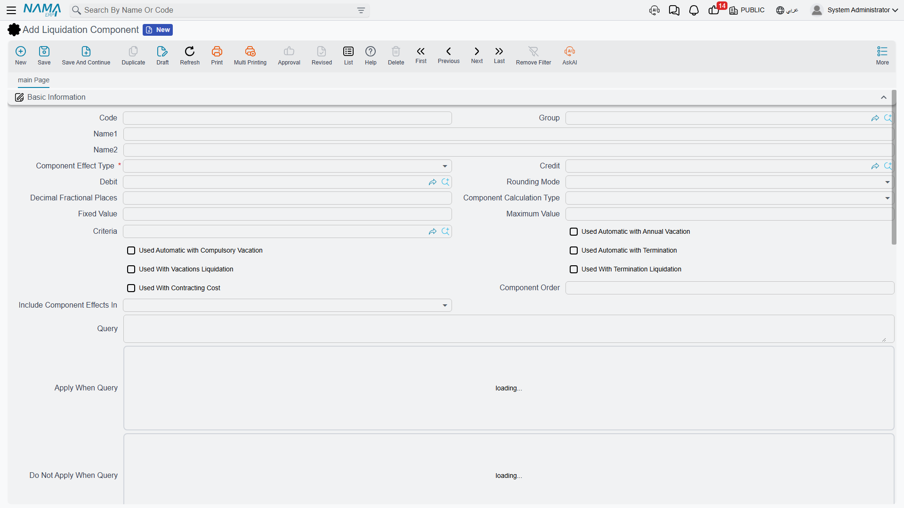
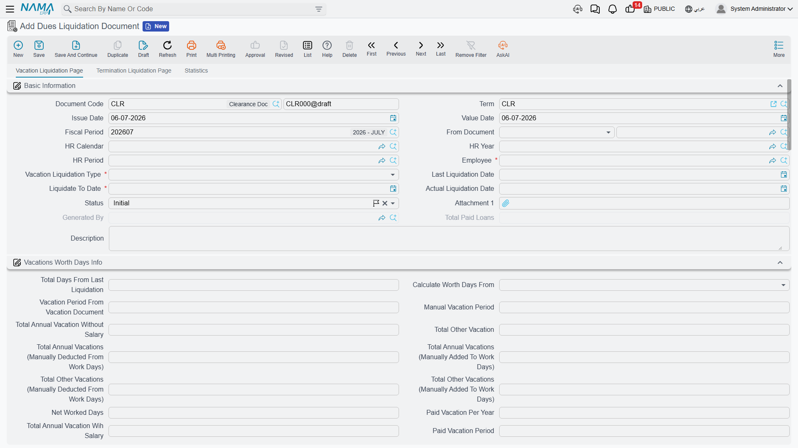

# Dues Liquidation

When someone leaves the company, a single document has to draw a line under everything the two
sides still owe each other and turn it into one number to pay. The **Dues Liquidation Document**
is that final settlement. It gathers the **end-of-service gratuity**, the **cash value of unused
vacation**, any **unpaid salary** still owed, the **outstanding balance of loans** the employee
has to give back, and any **manual adjustments** the HR officer needs to add or deduct — nets them
into a single figure, and hands that figure to a payment voucher.

::: info Gulf-specific settlement
The request → document flow and the salary engine underneath are general HR, but the **gratuity
math** and the settlement document built on top of it follow Gulf / KSA labour-law conventions,
so dues liquidation is **Gulf-specific**. It needs the advanced HR licence
(`humanresource-advanced`).
:::

## Where to find it

The settlement lives under **Payroll → Dues Liquidation and Firing** —
`الرواتب > التصفية وانهاء الخدمات > مستند تصفية مستحقات` (*Payroll → Dues Liquidation and Firing →
Dues Liquidation Document*). You rarely open it from scratch: the usual path is to press
**Generate Dues Liquidation Document (Termination)** on a firing document, which opens a new
settlement already carrying the employee, the service dates and the termination reason. See
[Firing & Termination](./firing-and-termination) for that hand-off.

## Two settlements in one document

A dues liquidation is really **two parallel settlements** living on two tabs of the same document,
because the two things being paid out follow completely different rules:

- The **Vacation Liquidation Page** (`صفحة تصفية الأجازات`) cashes out unused leave. This tab can
  be used on its own, even for an employee who is *not* leaving — for example the annual cash-out
  of an accrued balance. Its **Vacation Liquidation Type** (`نوع تصفية الأجازة`) is either **Annual
  Vacation** (`أجازة سنوية`) or **Compulsory Vacation** (`أجازة إضطرارية`).
- The **Termination Liquidation Page** (`صفحة تصفية نهاية الخدمة`) works out the end-of-service
  gratuity and is only used when employment actually ends. It links back to the **Firing Document**
  (`سند إنهاء الخدمة`) it was generated from.

A third **Statistics** tab (`الإحصائيات`) lists the termination formulas that fed the calculation
and the payment vouchers that were issued.

## The building blocks you configure once

Two setup records make the settlement reusable rather than hand-keyed every time.

### The liquidation component

A **Liquidation Component** (`مكون التصفية`) is a named line that can appear on any settlement —
think "end-of-service gratuity", "air-ticket allowance", "notice-period compensation", "loan
recovery". It is defined at **Payroll → Dues Liquidation and Firing → Liquidation Component** and
decides *how* its value is worked out and *where* it lands in the ledger.

| Field (English) | Arabic label | Purpose |
|---|---|---|
| Arabic Name / English Name | الاسم العربي / الاسم الإنجليزي | The component's display name. |
| Component Effect Type | نوع التأثير | Whether the line is an **addition**, a **deduction**, or an **other** entry. |
| Component Calculation Type | طريقة حساب المكون | Fixed value versus a computed formula. |
| Fixed Value / Maximum Value | القيمة الثابتة / أقصي قيمة | A constant amount, and a ceiling the result can't exceed. |
| Debit / Credit | مدين / دائن | The GL accounts the component posts to. |
| Criteria | المعايير | A filter deciding which employees the component applies to. |
| Used Automatic with Termination | يستعمل اّليا مع تصفيات إنهاء الخدمة | Auto-add this line to every end-of-service settlement. |
| Used Automatic with Annual Vacation | يستعمل اّليا مع تصفيات الأجازات السنوية | Auto-add this line to every annual-vacation cash-out. |
| Used Automatic with Compulsory Vacation | بستعمل اّليا مع تصفيات الأجازات الإضطراريه | Auto-add it to compulsory-leave cash-outs. |
| Component Order | ترتيب المكون | The sequence lines are evaluated in (later lines can depend on earlier ones). |

The **Formulas** grid turns the component into a banded calculation — each row is a service-length
range (**Range From / Range To**, `المدي من / إلي`) with a **Multiply By** (`مضروب في`) and
**Divide On** (`مقسوما علي`) fraction, exactly the pattern used by the termination-reason gratuity
tables. The **Components** grid ties the line to the **salary component types** whose value it
draws from, and the **Accounting Effect Lines** grid lets the debit/credit accounts vary by
employee criteria.

### The document term

Like every posting document, the settlement is governed by a **document term** (`توجيه المستند`)
that names the books, the payment voucher settings and the accounting accounts (the gratuity
expense, the provision-liability account being drawn down, and the loan-recovery account). The term
is what connects the settlement to the general ledger — see the processing note below.

## How the numbers are built

On the termination tab, Nama first establishes the **length of service**. The **Termination Days
Calculation Type** (`احتساب ايام تصفية نهاية الخدمة بناءا علي`) chooses between the system's own
**Total Work Days** (`إجمالي ايام العمل`) and a **Manual Total Work Days** (`مدة الخدمة يدويا`)
figure you type in. From the commencement date and the last work day, the document derives the
**Work Period** as **years / months / days** (`مدة الخدمة (سنة - شهر - يوم)`) and the **Net Worked
Days** (`صافي أيام عمل`) after subtracting unpaid absences.

::: warning The service-days − 1 convention
When it converts the calendar span into a service length, Nama counts the last day as an
**exclusive** boundary — the effective figure is **service days − 1**. This is **intentional**: a
person whose first and last day are the same has served zero completed days, and an employee whose
contract runs from the 1st to the 30th has served 29 elapsed days, not 30. Keep this in mind when
you reconcile a settlement by hand — a one-day difference from a naive day count is expected, not a
bug.
:::

Pressing **Generate Liquidation** (`إصدار التصفيه`) then runs the gratuity formulas attached to the
termination reason and fills the **Termination Liquidation Details** grid — one line per component,
each with its **Base Value**, **Due Value** (`القيمة المستحقه`) and its addition / deduction /
other split. The parallel **Termination Liquidation Components** grid shows the final result of each
liquidation component after its factor is applied. Two supporting toolbars pull in the rest of the
settlement:

- **Collect Unpaid Salary Documents** (`تجميع سندات الرواتب الغير مسددة`) lists every salary
  document that was never paid, so the final wages ride along with the settlement. Tick **Pay With
  Liquidation** (`يصرف مع التصفية`) on the ones to include.
- **Collect Remaining Loans** (`تجميع كل السلف المتبقية`) pulls in the outstanding installment
  balance of the employee's loans as a deduction, so nothing owed to the company is left behind.

Manual one-off lines (an ex-gratia bonus, a disputed deduction) go straight into the components
grid, and up to ten **Subsidiary Amounts** (`مبلغ بالذمه`) let you net off tracked receivables the
employee still carries. The **Ticket Allowance** block (`بيانات بدل التذاكر`) computes the Gulf
air-ticket entitlement — number of tickets × ticket value × entitlement ratio — as its own addition.

Everything rolls up into the **Totals** block: **Net Salary Component Value / Liquidation Net**
(`صافي المفردات (صافي التصفية)`), the ticket total, deducted subsidiary amounts, and finally the
**Net value** (`الصافي`) and the **Total Amount Should be Issued In Liquidation**
(`إجمالي المبالغ الواجب صرفها في التصفية`).

## A worked example

Take an employee leaving after five completed years, whose gratuity-eligible monthly salary is
**6,000** and whose daily wage is **200**.

| Element | How it is worked out | Amount |
|---|---|---|
| End-of-service gratuity | Half a month per year for the first five years: 5 × (6,000 ÷ 2) | **+15,000** |
| Unused annual vacation | 12 unused days cashed out at the daily wage: 12 × 200 | **+2,400** |
| Air-ticket allowance | One ticket worth 1,500 at 100 % entitlement | **+1,500** |
| Unpaid salary | Last month's salary document, never paid, collected into the settlement | **+6,000** |
| Loan recovery | Outstanding installment balance clawed back | **−3,000** |
| **Net settlement** | 15,000 + 2,400 + 1,500 + 6,000 − 3,000 | **= 21,900** |

The document shows **21,900** as its net value. Because the length of service is measured with the
**service-days − 1** convention, the "five years" that drives the gratuity band is the completed
service span, not a calendar count that would round the final partial day up. Once you are happy
with the figure, press **Generate Payment Voucher** (`إنشاء سند صرف`) — or **Generate Payment
Voucher Request** (`إنشاء طلب صرف`) if payments go through an approval step — and the 21,900 is
paid out through Treasury.

## How it's processed / what it posts

Saving the settlement is instant; its effect on the general ledger is raised as a background
**business request** (`طلب أعمال`) with its own **processing status** (`حالة المعالجة`), retryable
from the **Business Requests** view if it fails.

The accounts the settlement uses are the ones named on its **document term** — the gratuity /
liquidation expense and provision-liability sides, and the **loan-recovery** debit and credit that
clear the reclaimed installments. What actually moves the money to the employee is the **payment
voucher** generated from the settlement: the liquidation books the obligation against the right
expense and liability accounts, and the voucher credits the cash / bank account when it pays. If a
settlement is edited after it was first committed, Nama re-issues an **update** business request so
the ledger stays in step; if the term is configured without an accounting effect, the document
still calculates and pays but posts nothing itself.

Committing the settlement is also the event that **resets the provision accrual**: the accumulated
end-of-service and vacation liability has now been paid out, so the next accrual cycle starts fresh.
See [HR Provisions](./hr-provisions).

## Settling many employees at once

For end-of-project releases the **Aggregated Dues Liquidation Document**
(`سند تصفية مستحقات مجمعة`) processes a list of employees from one header, spawning an individual
settlement per employee on commit. You manage the batch, not the generated singles — the aggregated
pattern is explained in
[HR Requests, Documents & Aggregated Documents](../concepts/hr-requests-and-documents).

## Related pages

- [Firing & Termination](./firing-and-termination) — the termination that generates the settlement
  and the termination-reason gratuity rulebook.
- [HR Provisions](./hr-provisions) — the liability that has been accruing all along and that a
  committed settlement resets.
- [Evacuation Approval](./evacuation-approval) — the departmental clearance that often gates the
  settlement.
