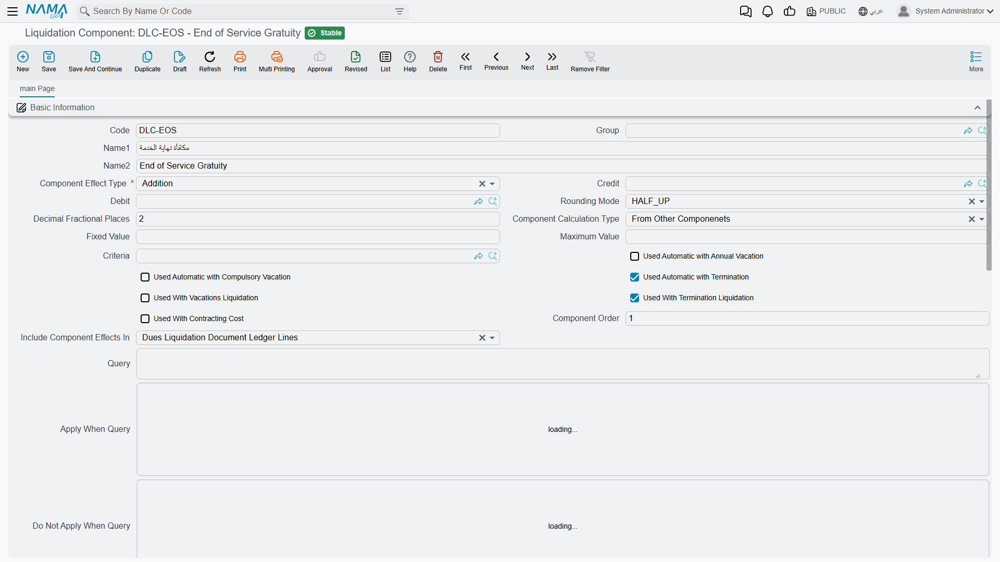
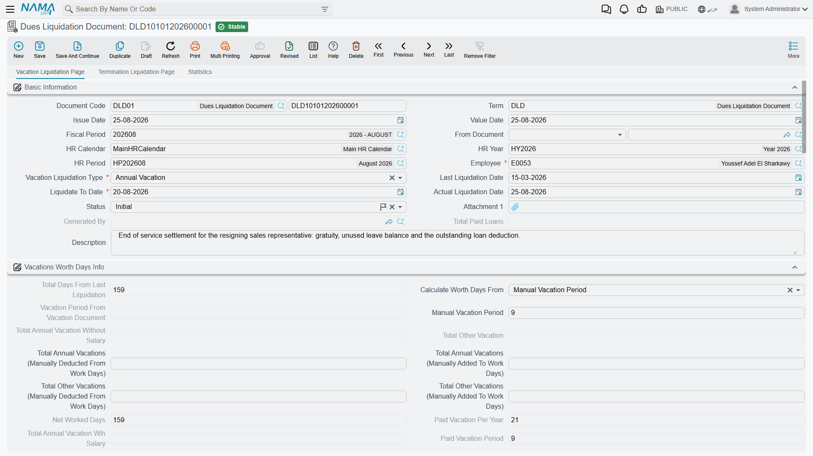

# Dues Liquidation

When someone leaves the company, a single document has to draw a line under everything the two
sides still owe each other and turn it into one number to pay. The **Dues Liquidation Document**
is that final settlement. It gathers the **end-of-service gratuity**, the **cash value of unused
vacation**, any **unpaid salary** still owed, the **outstanding balance of loans** the employee
has to give back, and any **manual adjustments** the HR officer needs to add or deduct — nets them
into a single figure, and hands that figure to a payment voucher.

::: info Gulf-specific settlement
The request → document flow and the salary engine underneath are general HR, but the **gratuity
math** and the settlement document built on top of it follow Gulf / KSA labour-law conventions,
so dues liquidation is **Gulf-specific**. It needs the advanced HR licence
(`humanresource-advanced`).
:::

## Where to find it

The settlement lives under **Payroll → Dues Liquidation and Firing** —
`الرواتب > التصفية وانهاء الخدمات > مستند تصفية مستحقات` (*Payroll → Dues Liquidation and Firing →
Dues Liquidation Document*). You rarely open it from scratch: the usual path is to press
**Generate Dues Liquidation Document (Termination)** on a firing document, which opens a new
settlement already carrying the employee, the service dates and the termination reason. See
[Firing & Termination](./firing-and-termination) for that hand-off.

## Two settlements in one document

A dues liquidation is really **two parallel settlements** living on two tabs of the same document,
because the two things being paid out follow completely different rules:

- The **Vacation Liquidation Page** (`صفحة تصفية الأجازات`) cashes out unused leave. This tab can
  be used on its own, even for an employee who is *not* leaving — for example the annual cash-out
  of an accrued balance. Its **Vacation Liquidation Type** (`نوع تصفية الأجازة`) is either **Annual
  Vacation** (`أجازة سنوية`) or **Compulsory Vacation** (`أجازة إضطرارية`).
- The **Termination Liquidation Page** (`صفحة تصفية نهاية الخدمة`) works out the end-of-service
  gratuity and is only used when employment actually ends. It links back to the **Firing Document**
  (`سند إنهاء الخدمة`) it was generated from.

A third **Statistics** tab (`الإحصائيات`) lists the termination formulas that fed the calculation
and the payment vouchers that were issued.

## The building blocks you configure once

Two setup records make the settlement reusable rather than hand-keyed every time.

### The liquidation component

A **Liquidation Component** (`مكون التصفية`) is a named line that can appear on any settlement —
think "end-of-service gratuity", "air-ticket allowance", "notice-period compensation", "loan
recovery". It is defined at **Payroll → Dues Liquidation and Firing → Liquidation Component** and
decides *how* its value is worked out and *where* it lands in the ledger.

| Field (English) | Arabic label | Purpose |
|---|---|---|
| Arabic Name / English Name | الاسم العربي / الاسم الإنجليزي | The component's display name. |
| Component Effect Type | نوع التأثير | Whether the line is an **addition**, a **deduction**, or an **other** entry. |
| Component Calculation Type | طريقة حساب المكون | Fixed value versus a computed formula. |
| Fixed Value / Maximum Value | القيمة الثابتة / أقصي قيمة | A constant amount, and a ceiling the result can't exceed. |
| Debit / Credit | مدين / دائن | The GL accounts the component posts to. |
| Criteria | المعايير | A filter deciding which employees the component applies to. |
| Used Automatic with Termination | يستعمل اّليا مع تصفيات إنهاء الخدمة | Auto-add this line to every end-of-service settlement. |
| Used Automatic with Annual Vacation | يستعمل اّليا مع تصفيات الأجازات السنوية | Auto-add this line to every annual-vacation cash-out. |
| Used Automatic with Compulsory Vacation | بستعمل اّليا مع تصفيات الأجازات الإضطراريه | Auto-add it to compulsory-leave cash-outs. |
| Component Order | ترتيب المكون | The sequence lines are evaluated in (later lines can depend on earlier ones). |

The **Formulas** grid turns the component into a banded calculation — each row is a service-length
range (**Range From / Range To**, `المدي من / إلي`) with a **Multiply By** (`مضروب في`) and
**Divide On** (`مقسوما علي`) fraction, exactly the pattern used by the termination-reason gratuity
tables. The **Components** grid ties the line to the **salary component types** whose value it
draws from, and the **Accounting Effect Lines** grid lets the debit/credit accounts vary by
employee criteria.

### The document term

Like every posting document, the settlement is governed by a **document term** (`توجيه المستند`)
that names the books, the payment voucher settings and the accounting accounts (the gratuity
expense, the provision-liability account being drawn down, and the loan-recovery account). The term
is what connects the settlement to the general ledger — see the processing note below.

## How the numbers are built

On the termination tab, Nama first establishes the **length of service**. The **Termination Days
Calculation Type** (`احتساب ايام تصفية نهاية الخدمة بناءا علي`) chooses between the system's own
**Total Work Days** (`إجمالي ايام العمل`) and a **Manual Total Work Days** (`مدة الخدمة يدويا`)
figure you type in. From the commencement date and the last work day, the document derives the
**Work Period** as **years / months / days** (`مدة الخدمة (سنة - شهر - يوم)`) and the **Net Worked
Days** (`صافي أيام عمل`) after subtracting unpaid absences.

::: warning The service-days − 1 convention
When it converts the calendar span into a service length, Nama counts the last day as an
**exclusive** boundary — the effective figure is **service days − 1**. This is **intentional**: a
person whose first and last day are the same has served zero completed days, and an employee whose
contract runs from the 1st to the 30th has served 29 elapsed days, not 30. Keep this in mind when
you reconcile a settlement by hand — a one-day difference from a naive day count is expected, not a
bug.
:::

Pressing **Generate Liquidation** (`إصدار التصفيه`) then runs the gratuity formulas attached to the
termination reason and fills the **Termination Liquidation Details** grid — one line per component,
each with its **Base Value**, **Due Value** (`القيمة المستحقه`) and its addition / deduction /
other split. The parallel **Termination Liquidation Components** grid shows the final result of each
liquidation component after its factor is applied. Two supporting toolbars pull in the rest of the
settlement:

- **Collect Unpaid Salary Documents** (`تجميع سندات الرواتب الغير مسددة`) lists every salary
  document that was never paid, so the final wages ride along with the settlement. Tick **Pay With
  Liquidation** (`يصرف مع التصفية`) on the ones to include.
- **Collect Remaining Loans** (`تجميع كل السلف المتبقية`) pulls in the outstanding installment
  balance of the employee's loans as a deduction, so nothing owed to the company is left behind.

Manual one-off lines (an ex-gratia bonus, a disputed deduction) go straight into the components
grid, and up to ten **Subsidiary Amounts** (`مبلغ بالذمه`) let you net off tracked receivables the
employee still carries. The **Ticket Allowance** block (`بيانات بدل التذاكر`) computes the Gulf
air-ticket entitlement — number of tickets × ticket value × entitlement ratio — as its own addition.

Everything rolls up into the **Totals** block: **Net Salary Component Value / Liquidation Net**
(`صافي المفردات (صافي التصفية)`), the ticket total, deducted subsidiary amounts, and finally the
**Net value** (`الصافي`) and the **Total Amount Should be Issued In Liquidation**
(`إجمالي المبالغ الواجب صرفها في التصفية`).

## A worked example

Take an employee leaving after five completed years, whose gratuity-eligible monthly salary is
**6,000** and whose daily wage is **200**.

| Element | How it is worked out | Amount |
|---|---|---|
| End-of-service gratuity | Half a month per year for the first five years: 5 × (6,000 ÷ 2) | **+15,000** |
| Unused annual vacation | 12 unused days cashed out at the daily wage: 12 × 200 | **+2,400** |
| Air-ticket allowance | One ticket worth 1,500 at 100 % entitlement | **+1,500** |
| Unpaid salary | Last month's salary document, never paid, collected into the settlement | **+6,000** |
| Loan recovery | Outstanding installment balance clawed back | **−3,000** |
| **Net settlement** | 15,000 + 2,400 + 1,500 + 6,000 − 3,000 | **= 21,900** |

The document shows **21,900** as its net value. Because the length of service is measured with the
**service-days − 1** convention, the "five years" that drives the gratuity band is the completed
service span, not a calendar count that would round the final partial day up. Once you are happy
with the figure, press **Generate Payment Voucher** (`إنشاء سند صرف`) — or **Generate Payment
Voucher Request** (`إنشاء طلب صرف`) if payments go through an approval step — and the 21,900 is
paid out through Treasury.

## How it's processed / what it posts

Saving the settlement is instant; its effect on the general ledger is raised as a background
**business request** (`طلب أعمال`) with its own **processing status** (`حالة المعالجة`), retryable
from the **Business Requests** view if it fails.

The accounts the settlement uses are the ones named on its **document term** — the gratuity /
liquidation expense and provision-liability sides, and the **loan-recovery** debit and credit that
clear the reclaimed installments. What actually moves the money to the employee is the **payment
voucher** generated from the settlement: the liquidation books the obligation against the right
expense and liability accounts, and the voucher credits the cash / bank account when it pays. If a
settlement is edited after it was first committed, Nama re-issues an **update** business request so
the ledger stays in step; if the term is configured without an accounting effect, the document
still calculates and pays but posts nothing itself.

Committing the settlement is also the event that **resets the provision accrual**: the accumulated
end-of-service and vacation liability has now been paid out, so the next accrual cycle starts fresh.
See [HR Provisions](./hr-provisions).

## Settling many employees at once

For end-of-project releases the **Aggregated Dues Liquidation Document**
(`سند تصفية مستحقات مجمعة`) processes a list of employees from one header, spawning an individual
settlement per employee on commit. You manage the batch, not the generated singles — the aggregated
pattern is explained in
[HR Requests, Documents & Aggregated Documents](../concepts/hr-requests-and-documents).

## Messages you may see

| Message | Why | What to do |
|---|---|---|
| *can not add ticket to liquidation it is issued by the company* — «لايمكن صرف بدل تذكرة مع التصفيه لا الحجز تم من قبل الشركة» | In the Ticket Allowance block both **Pay With Liquidation** and **Ticket Issued By Company** are ticked: the company already bought the ticket, so its value cannot also be paid out in cash. | Untick one of the two — **Ticket Issued By Company** if the employee is being paid the allowance, **Pay With Liquidation** if the company booked the flight. |
| *Option {0} and {1} can not both be true* — «لا يمكن تفعيل الأوبشن {0} و {1} معا» | The Ticket Allowance block has both **Issue Ticket Price Only** and **Issue Total Ticket Price** ticked; they are two different ways of valuing the same entitlement. | Leave only the one you mean: the single ticket price, or the whole family's total. |
| *Last work Day can not be less than Commenecement Date* — «تاريخ أخر يوم عمل لا يمكن ان يكون اقل من تاريخ المباشرة الفعلية» | On the termination tab the **Last Work Day** falls before the **Commencement Date**, so the service span would be negative. | Correct whichever date is wrong; the commencement date comes from the employee's work-starting record. |
| *You can not change field {0} from {1} to {2}* — «لا يمكنك تغيير الحقل {0} من {1} إلى {2}» | HR Configuration's **Prevent More Than One Liquidation At The Same Liquidation Date** is enabled, and you are editing the employee, the liquidation dates or the liquidation type on a settlement that was already committed. | Do not re-point an existing settlement at another employee or period — cancel it and make a new one, or have the configuration option reviewed. |
| *You can not create liquidation doc for employee {0} because field {1} must be greater than the field {2} in liquidation {3}* — «لا يمكنك إنشاء سند تصفية للموظف {0} لأن الحقل {1}  يجب أن يكون أكبر من الحقل {2} الموجود في سند التصفية {3}» | Same configuration option: an earlier committed settlement of the same liquidation type already covers this period, so the new document's **Last Liquidation Date** has to start after that document's **Liquidation To Date**. | Open the settlement named in the message and continue from the day after its *Liquidation To Date*. |
| *You can not change fields because status is paid* — «لا يمكنك تغيير قيم الحقول حيث أن حالة المستند مسدد» | The settlement — or its termination side — is already paid, and the header values that drove the payment are frozen from that point on. | Reverse or cancel the payment voucher first if the figures really must change; otherwise issue a separate correcting document. |
| *Component {0} can not be used with vacation liquidation* — «المكون {0} لا يمكن ان يستخدم مع تصفية الأجازات» | A liquidation component that is not marked for vacation settlement (neither **Used With Vacation Liquidation** nor either automatic-with-vacation flag) was put on the Vacation Liquidation page. | Either tick the component's vacation flag on its setup record, or use a component meant for vacation cash-out. |
| *Component {0} can not be used with termination liquidation* — «المكون {0} لا يمكن ان يستخدم مع تصفية نهاية الخدمة» | The mirror case: a component with neither **Used With Termination Liquidation** nor **Used Automatic with Termination** appears on the Termination Liquidation page. | Tick the termination flag on the component, or pick a component intended for end-of-service. |
| *Can not make liquidation from document contains non annual vacation type* — «لا يمكنك عمل سند تصفية بناءا علي سند اجازة يحتوي علي نوع اجازة بتصنيف غير سنوي» | The **From Doc** is a vacation document whose vacation type is not classified as annual, and HR Configuration's **Prevent Dues Doc From Non Annual Vacation Type** is enabled. | Cash out only annual leave through this route; other classifications are settled through their own documents. |
| *Component {0} can not be repeated* — «المكون {0} لايمكن تكراره» | The same liquidation component appears twice in the components grid. | Delete the duplicate row and put the whole amount on one line. |
| *Another liquidation document was created for the employee {0} after this document {1}* — «تم عمل مستند تصفيه للموظف  {0} بعد هذا المستند {1}» | A later committed settlement of the same liquidation type exists for this employee, so editing or committing this earlier one would leave the two inconsistent. | Work on the latest settlement, or cancel it first and then correct this one. |
| *Issued value {0} in document {1} can not be greater than remaining value {2}* — «المبلغ المصروف {0} في مستند التصفية {1} لا يمكن أن يكون أكبر من المتبقي {2}» | A payment voucher is trying to pay out more than the settlement still has outstanding. | Reduce the voucher amount to the remaining figure shown in the message. |
| *Query can not be empty if Component Calculation method is SQL* — «لا يمكن ترك الإستعلام فارغا إذا كانت طريقة حساب المكون SQL» | On the Liquidation Component setup record the calculation type is **SQL** but the **Query** field was left blank. | Write the statement that returns the value, or change the calculation type to a fixed value or a formula. |
| *Vacation Document {0} not belong to this Employee {1}* — «سند الأجازة {0} لا يخص الموظف {1}» | On the Aggregated Dues Liquidation Document a line points at a vacation document that belongs to a different employee than the line's own. | Choose a vacation document for the right employee, or move the line to that employee. |
| *Last Liquidation Date can not be after or equal Liquidation To Date* — «تاريخ اّخر تصفية لا يمكن ان يساوي او بعد تاريخ تصفية حتي» | On an aggregated line the period reads backwards: the last-liquidation date is on or after the liquidate-to date, so the span to settle is empty. | Set the last-liquidation date to the end of the previously settled period and the liquidate-to date to the new end date. |

## Related pages

- [Firing & Termination](./firing-and-termination) — the termination that generates the settlement
  and the termination-reason gratuity rulebook.
- [HR Provisions](./hr-provisions) — the liability that has been accruing all along and that a
  committed settlement resets.
- [Evacuation Approval](./evacuation-approval) — the departmental clearance that often gates the
  settlement.
