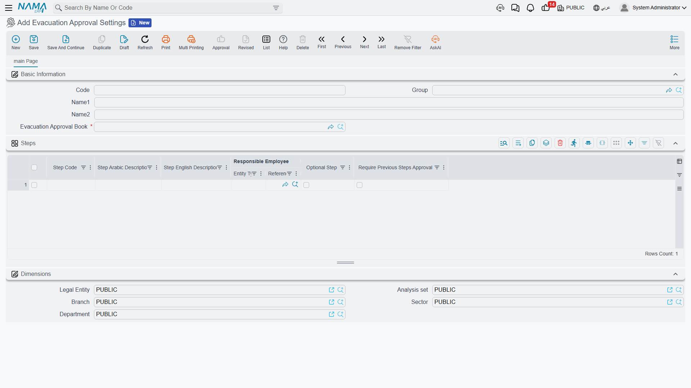
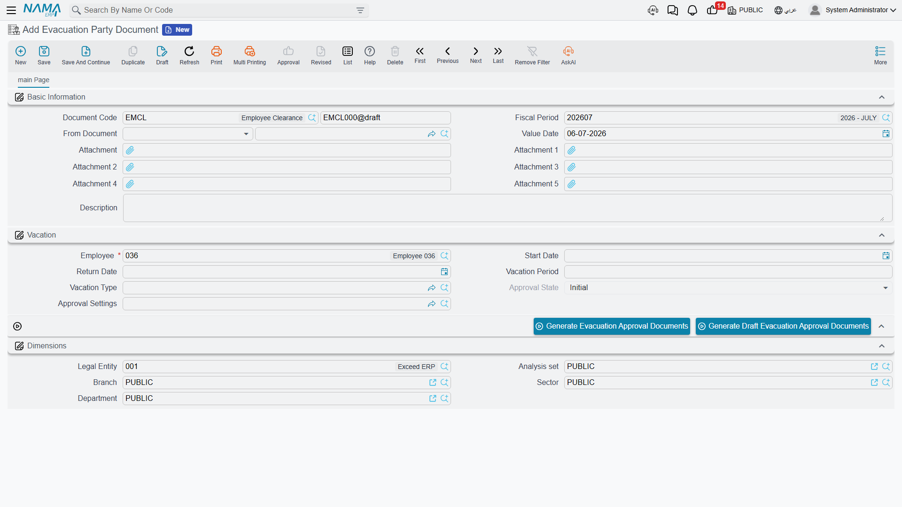

# Evacuation Approval

Before a departing employee can be paid off — or before a long leave is signed off — most companies
run a **clearance**: the person has to be signed out by each department they owe something to. IT
takes back the laptop, the warehouse confirms nothing is on loan, Finance checks there are no
outstanding advances, the line manager releases the handover. In Nama this departmental clearance
(**إخلاء طرف**) is modelled as a small workflow that sits *around* the settlement as a **procedural
gate**: it decides *whether* the paperwork may proceed, but it never touches the money math itself.

::: info A gate, not a calculation
Evacuation approval carries **no accounting effect** and computes no gratuity. It is purely a
sign-off chain. The figures — gratuity, vacation cash-out, loans, net pay — all live on the
[Dues Liquidation](./dues-liquidation) document. Think of the clearance as the checklist that must
be green before that settlement is released. It needs the advanced HR licence
(`humanresource-advanced`).
:::

## The three pieces

The feature is three records working together, all under **Payroll → Dues Liquidation and Firing**
(`الرواتب > التصفية وانهاء الخدمات`):

1. **Evacuation Approval Settings** (`إعدادات الموافقة على سند إخلاء طرف`) — the reusable template
   that lists the clearance **steps** and their order.
2. **Evacuation Party Document** (`سند إخلاء طرف`) — the actual clearance opened for one employee,
   which fans out into one approval per step.
3. **Evacuation Approval Document** (`الموافقة على إخلاء طرف`) — a single step's sign-off, approved
   or rejected by the responsible party.

## Step 1 — Define the clearance template

The **Evacuation Approval Settings** record is where you design the clearance once and reuse it. It
names an **Evacuation Approval Book** (`دفتر الموافقة على إخلاء الطرف`) the individual approvals are
booked into, and carries a **Steps** grid — one row per department or checkpoint the employee must
pass:

| Column (English) | Arabic label | Purpose |
|---|---|---|
| Step Code | كود الخٌطوة | A short identifier for the step. |
| Step Arabic Description / Step English Description | وصف عربي للخطوة / وصف إنجليزي للخطوة | The bilingual name of the checkpoint (e.g. "Return IT equipment"). |
| Responsible Employee | الموظف المسئول | Who signs this step off. |
| Optional Step | خطوة اختيارية | If ticked, the step may be skipped without blocking the clearance. |
| Require Previous Steps Approval | تتطلب تنفيذ الخطوات السابقة أولا | Enforces the **order** — this step cannot be approved until the ones before it are. |

The **Require Previous Steps Approval** flag is what turns a flat checklist into an **ordered**
approval chain: a step so marked stays locked until everything ahead of it is signed, so Finance
can't clear the employee before IT has taken the laptop back.

## Step 2 — Open the clearance for an employee

An **Evacuation Party Document** is raised for the leaving (or departing-on-leave) employee. It
identifies the person and the leave in question — **Employee** (`الموظف`), **Start Date**
(`تاريخ البداية`), **Return Date** (`تاريخ العودة`), **Vacation Period** (`مدة الأجازة`) and
**Vacation Type** (`نوع الأجازة`) — and points at the **Approval Settings** (`إعدادات الموافقة`)
template to use.

Its **Approval State** (`حالة الموافقة`) tracks the whole clearance through four values:

| State (English) | Arabic label |
|---|---|
| Initial | مبدئي |
| Approval In Progress | الموافقة قيد التنفيذ |
| Approved | مقبول |
| Approval Rejected | تم الرفض |

Two buttons fan the clearance out into its steps: **Generate Evacuation Approval Documents**
creates a live approval per step, while **Generate Draft Evacuation Approval Documents**
produces them as drafts first. The party document only
reaches **Approved** once every non-optional step has been approved; a single rejection flips it to
**Approval Rejected**.

## Step 3 — Each responsible party signs their step

Each generated **Evacuation Approval Document** represents one step. It carries the **Step Code**
and the Arabic / English step description copied from the template, the **Employee** being cleared,
the **Responsible Employee** (`الموظف المسئول`) who owns the decision, and a **Decision**
(`القرار`) that is one of:

| Decision (English) | Arabic label |
|---|---|
| Initial | مبدئي |
| Approve | موافقة |
| Reject | رفض |

The responsible party opens their approval, records what they checked, and sets the decision. When
the last required step turns to **Approve**, the parent party document becomes **Approved** and the
settlement is free to proceed.

### The checklist slots are yours to define

Each approval also exposes a set of **generic capture slots** — several reference, number, text and
date fields, plus attachments — that carry **no fixed meaning** in the standard product. They are
there so each company can turn a step into a real checklist: one installation might use a slot to
record an asset tag, another a clearance certificate number, another the date equipment was
returned. Treat them as **configurable** fields to be labelled and used per your own clearance
procedure, not as predefined semantics.

## How it's processed

Evacuation approval is a **workflow**, not a ledger document — it generates **no accounting effect**
and posts nothing to the general ledger. Its only "processing" is the state machine: approvals roll
up into the party document's approval state, and that state is what a settlement can be made to
respect. Because the clearance and the money are deliberately separate, you can run the two in
parallel and simply require the clearance to be **Approved** before the dues liquidation is paid.

## Related pages

- [Dues Liquidation](./dues-liquidation) — the final settlement the clearance gates; all the gratuity
  and vacation-payout math lives there.
- [Firing & Termination](./firing-and-termination) — the termination that sets the whole end-of-service
  process in motion.
