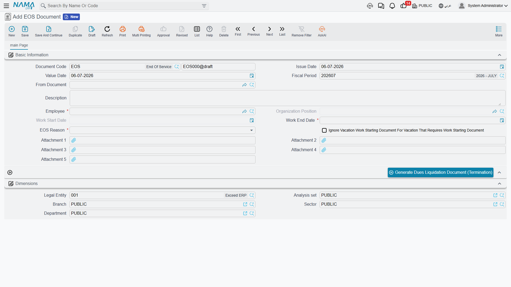
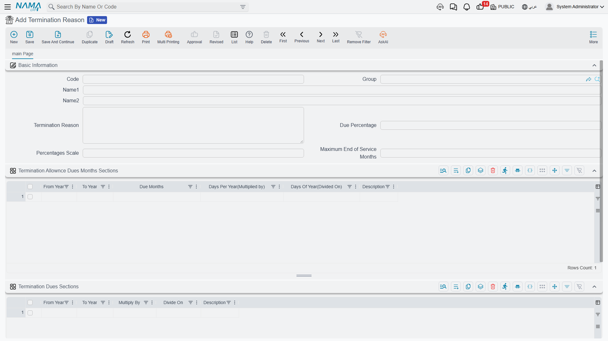

# Firing & Termination

Ending someone's employment is never just a status change. The moment a departure is confirmed,
a chain of obligations comes due: the final settlement of unpaid salary, the cash-out of unused
vacation, any outstanding loans — and, above all, the **end-of-service gratuity** the company owes
for the years served. Nama models the departure itself with a lightweight **request → document**
pair, and keeps the potentially complex gratuity rules in a reusable catalogue of **termination
reasons** so that the same policy is applied consistently to everyone who leaves for the same
reason.

::: info Gulf-specific gratuity
The **request → document** flow and firing reasons are general HR. The **gratuity calculation**
built on top of termination reasons — months-of-salary bands, percentage entitlements and the
end-of-service cap — follows Gulf / KSA labour-law conventions and is **Gulf-specific**.
:::

## Request first, then document

Termination follows the standard HR triplet. A **Firing Request** (`طلب إنهاء الخدمة`) is the
approval-gated application to let someone go; once accepted it produces a **Firing Document**
(`سند إنهاء الخدمة`), the executed record that actually marks the employee as terminated. If your
process doesn't need an approval step you can raise the document directly. For the full mechanics of
how a request is accepted and turned into a document, see
[HR Requests, Documents & Aggregated Documents](../concepts/hr-requests-and-documents).

Both screens live under **Payroll → Dues Liquidation and Firing** —
`الرواتب > التصفية وانهاء الخدمات > سند إنهاء الخدمة` (*Payroll → Dues Liquidation and Firing →
Firing Document*). The firing document requires the payroll HR licence
(`humanresource-payroll`).

The request and the document share the same core fields:

| Field (English) | Arabic label | Purpose |
|---|---|---|
| Employee | الموظف | The person being terminated. |
| Organization Position | الدرجة الوظيفية | Their grade at the time of leaving. |
| Work Start Date | تاريخ بدء العمل | Service start — the anchor for length-of-service. |
| Work End Date | تاريخ إنتهاء العمل | The last working day; the settlement counts up to here. |
| Firing Reason | سبب إنهاء الخدمة | Why they are leaving — this drives the gratuity (below). |
| From Document | بناءا على | On the document: links back to the accepted request. |
| Ignore Vacation Work Starting Document | تجاهل عمل سند مباشرة عمل للأجازات… | Skips generating a return-from-leave document for leaves that would otherwise require one. |
| Attachment 1–5 | مرفق ١–٥ | Supporting paperwork (resignation letter, clearance, etc.). |

The **Firing Reason** is a fixed list: **Resignation** (`إستقالة`), **Dismissal** (`فصل`),
**Pension** (`على المعاش`), **Suspension** (`وقف عن العمل`), and ten open **Other** slots
(*Other 1*…*Other 10*, `أخرى ١`…`أخرى ١٠`) you can repurpose for locally-defined reasons. The
reason matters because it selects which gratuity policy applies.

## Generating the settlement

Neither the firing request nor the firing document works out or pays the money itself — that is the
job of the dues liquidation. To bridge the two, both screens carry a **Generate Dues Liquidation
Document (Termination)** button (`إنشاء مستند تصفية مستحقات (نهاية خدمة)`).
Pressing it opens a **new dues liquidation** pre-filled from the termination — the employee, the
service dates and the applicable termination reason are carried across so you don't re-key them.
From there the settlement computes gratuity, vacation cash-out, loans and final salary, nets them,
and produces the payment. See [Dues Liquidation](./dues-liquidation) for the money math.

## Termination reasons — the gratuity rulebook

A **Termination Reason** (`سبب نهاية الخدمة`) is a master record that turns "why did they leave and
how long did they serve" into "how many months of salary do we owe". One record can cover several
firing reasons at once — the **Termination Reason** field (`سبب نهاية الخدمة`) on the header lists
which firing reasons this rulebook applies to, so you might keep one policy for resignations and a
more generous one for end-of-contract or pension. It is found at
**Payroll → Dues Liquidation and Firing → Termination Reason**.

The gratuity is computed from **two rule tables** that work together, then clamped by an overall
cap:

**1. Months-of-salary bands** — *Termination Allowance Dues Months Sections*
(`شرائح استحقاق شهور بدل نهاية الخدمة`). Each row is a service band and the entitlement it earns:

| Column (English) | Arabic label | Meaning |
|---|---|---|
| From Year / To Year | من سنة / إلى سنة | The service-length band this row applies to. |
| Due Months | عدد شهور استحقاق بدل نهاية الخدمة | Months of salary earned per year inside this band. |
| Days Per Year (Multiplied by) | عدد الايام عن كل سنة (مضروبا في) | Alternative day-based factor: days credited per year. |
| Days Of Year (Divided on) | عدد الايام للسنة (مقسوما علي) | The divisor that turns those days into a fraction of a year. |

This is where the familiar Gulf pattern lives — for example *half a month's wage for each of the
first five years, a full month for every year beyond that* becomes one band for years 0–5 and
another for years 5 and up.

**2. Percentage bands** — *Termination Dues Sections* (`شرائح نسبة استحقاق نهاية الخدمة`). These
scale the earned gratuity by *how* the person left:

| Column (English) | Arabic label | Meaning |
|---|---|---|
| From Year / To Year | من سنة / إلى سنة | The service-length band. |
| Multiply By | مضروب في | Numerator of the entitlement fraction. |
| Divide On | مقسوما علي | Denominator of the entitlement fraction. |

The classic resignation ladder — *nothing under two years, one third between two and five years,
two thirds between five and ten, the full amount after ten* — is expressed as multiply-by /
divide-on fractions (1÷3, 2÷3, 1÷1) per band.

Three header fields govern the whole record: **Due Percentage** (`نسبة استحقاق نهاية الخدمة`) sets
an overall entitlement percentage, **Percentages Scale** (`عدد خانات الكسر للنسب`) controls rounding
precision, and **Maximum End of Service Months** (`الحد الأقصى لأشهر مكافأة نهاية الخدمة`) **caps**
the total gratuity — no matter how long the service, the payout can never exceed this many months
of salary (the Gulf statutory ceiling).

## Terminating many employees at once

For restructurings or end-of-project releases, the **Aggregated Firing Document**
(`سند إنهاء خدمة مجمع`) — and its request counterpart, the **Aggregated Firing Request**
(`طلب إنهاء خدمة مجمعة`) — let you process a whole list of employees from a single header. On
commit the batch spawns one ordinary firing document per employee, each carrying its own reason,
dates and eventual settlement. You manage the batch, not the generated singles; the aggregated
pattern is explained in [HR Requests, Documents & Aggregated Documents](../concepts/hr-requests-and-documents).

## Related pages

- [Dues Liquidation](./dues-liquidation) — the settlement generated from a termination.
- [HR Provisions](./hr-provisions) — the gratuity liability that has been accruing all along.
- [HR Requests, Documents & Aggregated Documents](../concepts/hr-requests-and-documents) — the
  request → document → aggregated pattern behind firing.
