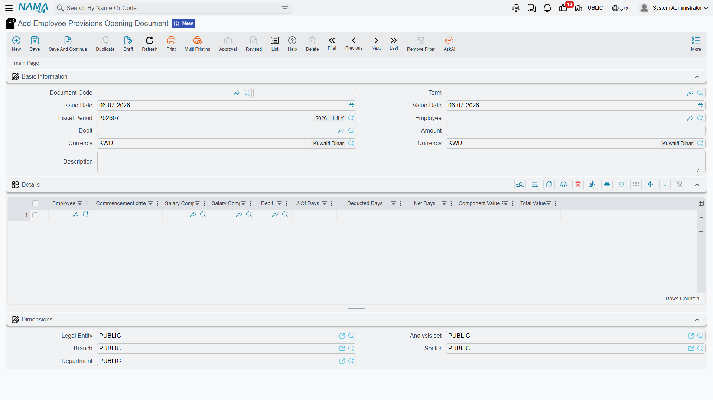
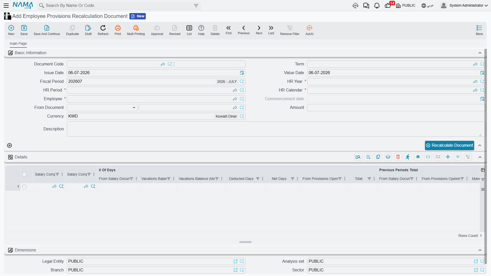

# HR Provisions (End-of-Service & Vacation Accrual)

When an employee eventually leaves, the company owes them money it has been quietly building
up for years: an **end-of-service gratuity** (a lump sum based on how long they served) and the
**cash value of any vacation days they never took**. If you only recognised that liability in
the single month the person walks out the door, your books would look healthy for years and then
take a sudden, distorting hit. **Provisions** solve this. Every period you set aside — *accrue* —
a small slice of the eventual bill, so the general ledger always shows the true, up-to-date
liability the company is carrying for its people.

This is **general HR** functionality: the accrual mechanism works the same everywhere, regardless
of which country's labour law defines the final gratuity formula.

## What a "provision" actually is

A provision (مخصص) is not a checkbox on the employee record. It is built from ordinary **salary
components** that you have flagged to take part in the final settlement. On a salary component,
three switches decide whether it feeds a provision:

- **Included Termination Liquidation** (`يستخدم في حساب تصفيه نهاية الخدمة`) — the component
  contributes to the **end-of-service gratuity** accrual.
- **Included Annual Vacation Liquidation** (`يستخدم في حساب تصفيه الاجازة السنوية`) — the component
  feeds the **unused-vacation cash value** accrual.
- **Include Compulsory Vacation Liquidation** (`يستخدم في حساب تصفية الأجازة الإضطرارية`) — extends
  the vacation accrual to compulsory-leave balances.

Because the provision rides on the salary components themselves, the daily value that gets accrued
is always drawn from the employee's real, current pay. See
[Salary Components](../payroll/salary-components) for how those flags and their debit/credit
account lines are set up.

The provisions lifecycle uses just **two documents**: you **open** the provision once per employee,
then **recalculate** it every period from then on.

## Where to find it

Both screens live under **Payroll → Payroll**:

- Opening: `الرواتب > الرواتب > سند إفتتاحي مخصصات موظف` — *Payroll → Payroll → Employee
  Provisions Opening Document*.
- Recalculation: `الرواتب > الرواتب > سند إعادة احتساب مخصصات موظف` — *Payroll → Payroll →
  Employee Provisions Recalculation Document*.

Provisions recalculation requires the advanced HR licence (`humanresource-advanced`).

## Step 1 — Open the provision (once per employee)

The **Employee Provisions Opening Document** establishes the starting balance for a person whose
service began *before* you started tracking provisions in Nama. It records how many days of
gratuity and vacation value have already been earned, so the first recalculation doesn't try to
book the entire historical liability in one period.

| Field (English) | Arabic label | Purpose |
|---|---|---|
| Employee | الموظف | The person this opening balance belongs to. |
| Commencement date | تاريخ المباشرة الفعلية | The service start date the accrual counts from. |
| Value Date | التاريخ الفعلي | The accounting date of the opening entry. |
| Fiscal Period | الفترة | The financial period the opening posts into. |

The **Details** grid carries one line per provision component, where you enter the historical
**# Of Days** (`عدد الايام`) already earned, any **Deducted Days** (`عدد الأيام المخصومة`), the
resulting **Net Days** (`صافي الأيام`), the **Component Value Per Day** (`قيمة المفرد لليوم`), and
the **Total Value** (`الإجمالي`). If the employee is genuinely new (started under Nama), you can
skip the opening entirely and let the recalculations build the balance from zero.

## Step 2 — Recalculate every period

The **Employee Provisions Recalculation Document** is the workhorse. It is issued for **one
employee and one HR period** at a time, and each run does two things: it works out the total
provision the employee has *earned to date*, and it posts the **difference** between that figure
and everything already accrued — the *adjustment* — so the accrued balance catches up to reality.

| Field (English) | Arabic label | Purpose |
|---|---|---|
| Employee | الموظف | Who is being recalculated. |
| HR Year / HR Period | سنة الرواتب / فترة الرواتب | The payroll period this accrual belongs to. |
| HR Calendar | تقويم الرواتب | The calendar the period is read from. |
| Commencement date | تاريخ المباشرة الفعلية | Service start date driving the day count. |
| From Document | بناءا على | Links back to the opening (or a prior recalc) it builds on. |
| Amount | المبلغ | The total adjustment this document posts. |

Press **Recalculate Document** and Nama fills the **Details** grid — one line per
provision component. The columns walk you through the arithmetic, grouped under **# Of Days**,
**Previous Periods Total**, and the final adjustment:

| Column (English) | Arabic label | Meaning |
|---|---|---|
| # Of Days · Total | عدد الأيام · الإجمالي | Total service days now counted for this component. |
| # Of Days · From Provisions Opening | عدد الأيام · من إفتتاح مخصصات | Days carried in from the opening document. |
| Current Day Value | قيمة اليوم الحالية | What one day of this provision is worth today. |
| Current Total | الإجمالي الحالي | The full provision earned to date (day value × net days). |
| Previous Adjustment Total | إجمالي التسويات السابقة | Everything accrued in earlier recalculations. |
| Adjustment | التسوية | **Current Total − Previous Adjustment Total** — what this run posts. |

### A worked example

Take an employee whose end-of-service gratuity provision is worth **50** per day of service.

- **Period 1.** After the recalc, 100 net days of service have accrued. Current Total = 50 × 100 =
  **5,000**. Nothing was accrued before, so Previous Adjustment Total = 0 and the **Adjustment =
  5,000**. The document posts 5,000.
- **Period 2.** Another period passes; net days rise to 120. Current Total = 50 × 120 = **6,000**.
  Previous Adjustment Total is now 5,000, so the **Adjustment = 6,000 − 5,000 = 1,000**. This run
  posts only the incremental 1,000 — never the whole 6,000 again.

The same logic runs in parallel for the unused-vacation provision: if the employee's daily wage is
200 and they hold a 10-day balance, Current Total = 2,000; had 1,600 been accrued already, this
period's adjustment is 400.

::: warning Runs must happen in order — and a settlement resets the clock
Recalculation is strictly sequential: a period can only be recalculated after the ones before it,
because each run needs the previous accrued total to compute its adjustment. Nama refuses to
process a recalc (or a dues liquidation) that would run out of order. Crucially, **once a dues
liquidation is committed, accrual restarts** — the settlement has paid out the accumulated
provision, so the next accrual cycle begins fresh from the day after. See
[Dues Liquidation](./dues-liquidation).
:::

## How it's processed / what it posts

Saving a recalculation is instant; the ledger effect is raised as a background **business request**
(`طلب أعمال`) with its own **processing status** (`حالة المعالجة`), retryable from the **Business
Requests** view if it fails.

What it posts is an **accrual adjustment**, not a full re-booking. For every detail line, Nama
takes that line's **Adjustment** value and creates a matching debit and credit using the
**debit/credit account lines defined on the salary component** — specifically the account lines
marked to be used with automatic adjustment. In accounting terms the period's accrual **debits the
end-of-service (or vacation) expense** and **credits the corresponding provision-liability
account**, each for the adjustment amount. Because the figure posted is the *difference* from the
previous total, a period where the earned provision happens to fall can post a **negative
adjustment**, releasing part of the liability instead of adding to it. If the document term is
configured to run without an accounting effect, the recalc still tracks the numbers but posts
nothing to the ledger.

## Recalculating many employees at once

Running one document per employee every period does not scale, so the **Aggregated Employee
Provisions Recalculation Document** (`سند إعادة احتساب مخصصات موظف مجمع`) is a batch factory. You
give it an HR period and an **employee range** — from/to employee, department, job position,
branch, sector, nationality and more — press **Collect Employees**, and Nama
lists every matching employee. On commit it spawns one individual recalculation document per
employee, each posting its own adjustment. As with all aggregated documents, you manage the batch,
not the generated singles — see
[HR Requests, Documents & Aggregated Documents](../concepts/hr-requests-and-documents).

## Related pages

- [Salary Components](../payroll/salary-components) — where the liquidation flags and provision
  accounts are configured.
- [Dues Liquidation](./dues-liquidation) — the final settlement that pays out the accrued
  provision and resets the accrual.
- [Firing & Termination](./firing-and-termination) — how a termination triggers the settlement.
