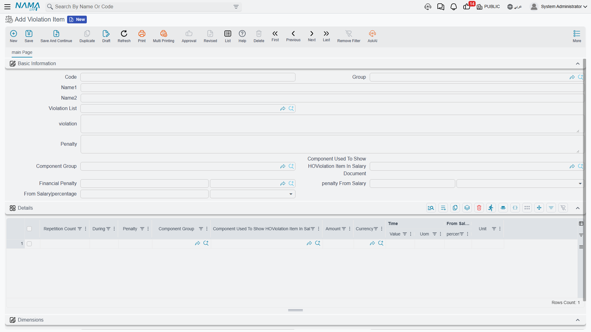
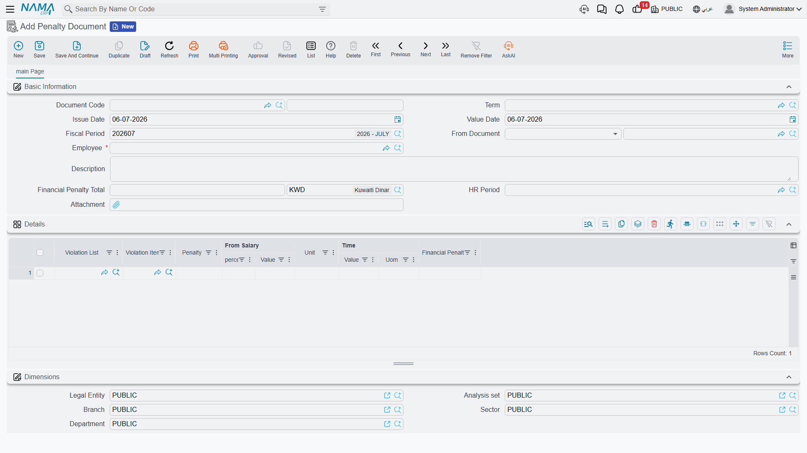

# Government Penalties

Alongside the visa and fee work, the government-relations desk maintains the company's **disciplinary
code** — the internal list of workplace violations and the penalties attached to them — and issues the
documents that apply a penalty to an employee. In Nama this is a small, self-contained subsystem: you
define the rulebook once (the violation articles and their escalating penalties), then raise a
**Penalty Request** and turn it into a **Penalty Document** when a specific employee breaches a rule.

::: warning These are labour / company-code penalties — not two other things they resemble
It is easy to confuse this subsystem with two others; keep them apart:

- **Not traffic / vehicle fines.** A speeding ticket or a parking fine on a company car is recorded
  against the vehicle, not here. Those live in
  [Employee Services (Vehicles, Transport & Meals)](../employee-services).
- **Not the payroll reward / penalty family.** An ad-hoc bonus or a one-off salary deduction the
  manager decides on is the payroll reward/penalty flow — see
  [Rewards & Penalties](../discipline/rewards-and-penalties). The documents on *this* page are driven
  by the formal **violation code** with tiered escalation, and they behave differently in the ledger
  (see below).
:::

This area needs the advanced HR licence (`humanresource-advanced`). For the shared PRO cycle it sits
inside, see the [Government Relations Overview](./government-relations-overview).

## The rulebook: Violation List and Violation Item

The disciplinary code is defined in two layers.

The **Violation List** (`مادة لائحة إدارية`) is the top-level article — the heading in the company's
regulations, such as *attendance violations* or *safety violations*. It carries a code, a group, an
Arabic and an English name, and attachment slots for the official regulation text. Find it under
**Human Resources → Work List → Violation List**
(`الموارد البشرية > لائحة العمل > مادة لائحة إدارية`).

The **Violation Item** (`بند مخالفة`) is the specific offence within an article — *arriving late*,
*leaving without permission* — together with its **base penalty**. This is where the real rulebook
lives. Find it under **Human Resources → Work List → Violation Item**
(`الموارد البشرية > لائحة العمل > بند مخالفة`).

| Field (English) | Arabic label | Purpose |
|---|---|---|
| Code | الكود | The item's code. |
| Group | المجموعة | Its grouping. |
| Arabic Name / English Name | الاسم العربي / الاسم الإنجليزي | The offence's display name. |
| Violation List | مادة لائحة إدارية | The parent article this item belongs to. |
| violation | المخالفة | A description of the violation. |
| Penalty | العقوبة | A description of the penalty. |
| Financial Penalty | الغرامة المالية | A flat fine amount (and currency). |
| penalty From Salary | الخصم من الراتب | A salary deduction expressed as a time period (e.g. deduct 2 days' pay). |
| From Salary \| percentage | من الراتب \| % | A penalty expressed as a percentage of salary. |
| Component Group / Component Used… | مجموعة مفردات راتب / المفرد المستعمل… | Which salary component the penalty shows up under on the payslip. |

### Tiered escalation by repetition

The reason a Violation Item is more than a single fine is its **Details** grid: a ladder of penalty
**tiers** that get harsher the more often the same employee repeats the same offence. Each tier row
carries:

| Column (English) | Arabic label | Meaning |
|---|---|---|
| Repetition Count | عدد مرات التكرار | The occurrence number this tier applies from (1st, 2nd, 3rd…). |
| During | خلال | The window over which repetitions are counted. |
| Penalty | العقوبة | A description of the tier's penalty. |
| Financial Penalty / penalty From Salary / From Salary % | الغرامة المالية / الخصم من الراتب / من الراتب % | The harsher amounts for this tier. |

The **During** window decides *which* previous penalties count toward the repetition tally. It can be
one of four values:

| During (English) | Arabic label | Counts repetitions within… |
|---|---|---|
| Salary Period | فترة الراتب | The same payroll period. |
| Salary Year | سنة الرواتب | The same payroll year. |
| Fiscal Period | فترة محاسبية | The same accounting period. |
| Fiscal Year | سنة مالية | The same accounting year. |

So a rule can read: *first offence in the payroll year — one day's pay; second offence in the same
year — three days' pay; third — a flat fine.* When a penalty document is committed for the employee,
the system counts how many penalty documents for that same violation item the employee already has
within the chosen window, and picks the **applicable tier** — the highest tier whose repetition count
is at or below the employee's next occurrence number. If no tier matches, the item's base penalty is
used.

::: tip Worked example
Suppose the *late arrival* item has base penalty = 1 day's pay, and two tiers, both **During = Salary
Year**: tier at repetition **2** = 3 days' pay, tier at repetition **3** = a flat 500 fine. An
employee with **no** prior late-arrival penalties this year gets the base (1 day). Their **second**
committed penalty this year jumps to the tier-2 penalty (3 days). Their **third** lands on the flat
500 fine.
:::

## Applying a penalty: Request then Document

Issuing a penalty follows Nama's usual request → document split.

The **Penalty Request** (`طلب مخالفة`) is the proposal: it names the employee, the payroll period it
belongs to, and one or more lines each pointing at a violation article and item. It records the
intent and computes the total, but — like every request in Nama — it has **no effect** on its own.
Find it under **Human Resources → Work List → Penalty Request**
(`الموارد البشرية > لائحة العمل > طلب مخالفة`).

The **Penalty Document** (`سند مخالفة`) is the executed penalty. It can be raised directly or built
from an accepted request (its **From Document** field records the origin). It carries the same
employee, period and violation lines, and a computed **Financial Penalty Total**. Find it under
**Human Resources → Work List → Penalty Document** (`الموارد البشرية > لائحة العمل > سند مخالفة`).

| Field (English) | Arabic label | Purpose |
|---|---|---|
| Employee | الموظف | The employee being penalised. |
| HR Period | فترة الرواتب | The payroll period the penalty falls in (also drives repetition counting). |
| From Document | بناءا على | The request or document this one was generated from. |
| Term | توجيه المستند | The document term that supplies the ledger accounts (see below). |
| Violation List / Violation Item | مادة لائحة إدارية / بند مخالفة | The article and item breached (one per line). |
| Financial Penalty | الغرامة المالية | The computed penalty for the line. |
| Financial Penalty Total | إجمالى الغرامة المالية | The document's total penalty amount. |

## How it's processed / what it posts

This is the accounting point that sets government penalties apart from the rest of the
government-relations desk, so it is worth stating plainly.

::: warning The Penalty Document DOES post a real ledger entry — the request does not
When a **Penalty Document** is committed, it raises a genuine general-ledger entry for the penalty
total: a balanced journal with a **debit** side and a **credit** side, both taken from the document's
**term** (`توجيه المستند`) and valued at the document's Financial Penalty Total. This is a real
posting, processed like any other through a **business request** (`طلب أعمال`) with its own
**processing status** (`حالة المعالجة`) that you can retry from the **Business Requests** view.

The **Penalty Request** posts **nothing** — it is only a proposal. And this is the opposite of the
[Payment Request](./government-relations-overview), which merely *records* that a government fee was
paid and does **not** post to the ledger by itself. So within this one area you have two documents
that look similar but behave oppositely: the payment request tracks a fee without posting; the penalty
document actually posts. Do not assume they are the same.
:::

The penalty total the entry carries is the sum of each line's computed penalty — flat fine, plus any
salary-based deduction (a time-period deduction is converted to money against the employee's basic
salary), plus any percentage-of-salary component — after the applicable escalation tier has been
selected. The penalty also surfaces on the employee's payslip through the salary component named on
the violation item, so the deduction and the payroll record stay in step.

## Related

- [Government Relations Overview](./government-relations-overview) — the PRO desk, the fee catalogue,
  and why the Payment Request does **not** post while this document does.
- [Rewards & Penalties](../discipline/rewards-and-penalties) — the payroll bonus/deduction family,
  which is a different thing from these code-driven violation penalties.
