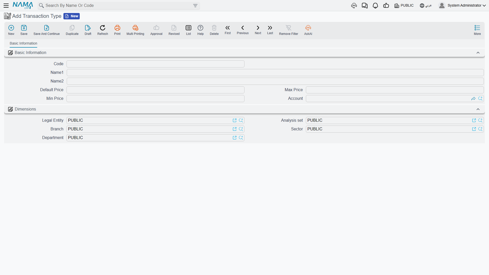
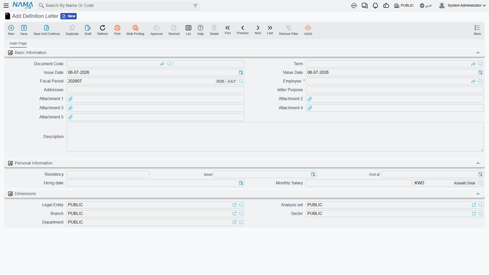
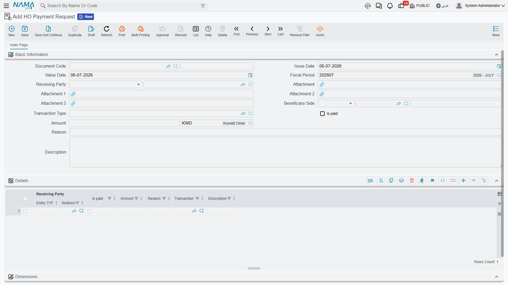

# Government Relations Overview

Every company that employs expatriate staff in the Gulf runs a small back office that never stops:
residency (Iqama) permits expire, work licences have to be renewed, exit and re-entry visas are
issued, passports are handed in and out, GOSI registrations are opened and closed, and a government
fee is attached to almost every one of those steps. The person who does this — the **government
relations officer (PRO / مندوب)** — spends the day moving between the labour portal, the passport
office and the bank. Nama's **Administrative Transactions** and **Visas** menus are the ERP side of
that desk: a family of short documents that record each official transaction, track the fee that was
paid, and — once the transaction actually goes through — write the new dates and numbers back onto
the employee's master record so the rest of HR sees an up-to-date file.

::: info Gulf / KSA-specific area
The whole government-relations family models Saudi / Gulf labour-and-immigration procedures — Iqama,
Kafala sponsorship, GOSI, exit-re-entry visas. It is not used outside that context. The letters and
fee-tracking documents need the advanced HR licence (`humanresource-advanced`); the visa procedures
need the Gulf visa licence (`humanresource-gulf-visa`).
:::

## The recurring cycle

Almost every document in this area follows the same five-beat rhythm, so it is worth learning once:

1. **Pick the employee.** You open a new transaction and choose the employee it concerns.
2. **The official documents fill themselves in, read-only.** The employee's current Iqama /
   residency, work licence, passport number, GOSI and labour details are pulled from the master
   record and shown as **read-only** context. You are looking at the current state of the file, not
   editing it here.
3. **Record the request.** You capture what is being done — the new visa number, the extension date,
   the renewal period, the fee — and save the document.
4. **Pay the fee or get the approval.** The government charge is recorded (and marked as paid), or
   the internal approval is granted.
5. **An update action writes the new facts back to the employee.** Once the transaction is genuinely
   done — the box that says it was **paid** / **renewed** is ticked — a dedicated update step copies
   the new residency end date, visa number or licence date onto the **employee master file**. This
   write-back is guarded: it only runs when the transaction is marked complete, and it will not push
   a date **earlier** than the one already on record, so a stale document can never roll an
   employee's Iqama backwards.

Keep in mind throughout that **only the document has an effect** — a request that is still waiting
for approval changes nothing. The employee's file moves only when the completed transaction runs its
write-back.

## The fee catalogue: Transaction Type

Rather than typing a government charge freehand every time, you define each kind of charge once as a
**Transaction Type** (`نوع معاملة`) — a small master file that is, in effect, a **price list for
government fees**. Each entry fixes the expected amount and the account the fee belongs to, so the
officer can only pick a known transaction and the finance team sees consistent numbers.

You will find it under **Human Resources → Administrative Transactions → Transaction Type**
(`الموارد البشرية > معاملات إداريه > نوع معاملة`).

| Field (English) | Arabic label | Purpose |
|---|---|---|
| Arabic Name / English Name | الاسم العربي / الاسم الإنجليزي | The transaction's display name (e.g. *Iqama renewal fee*). |
| Default Price | السعر الافتراضي | The amount proposed automatically when this transaction is chosen. |
| Min Price / Max Price | أقل سعر / اقصي سعر | The floor and ceiling the recorded fee is allowed to fall between. |
| Account | الحساب | The general-ledger account the fee is charged to. |
| Legal Entity / Branch / Sector / Department | الشركة / الفرع / القطاع / الإدارة | The dimensions that scope where the transaction type is used. |

## The employment certificate: Definition Letter

The one document here that is not about a visa or a fee is the **Definition Letter**
(`خطاب تعريف موظف`) — the salary / employment certificate that HR issues on demand: the letter an
employee takes to a bank to open an account or apply for a loan, or to an embassy for a visa. It
gathers everything such a letter has to state — who the employee is, the addressee it is written to,
the residency details, the hiring date and the monthly salary — onto one printable document.

It lives under **Human Resources → Work List → Definition Letter**
(`الموارد البشرية > لائحة العمل > خطاب تعريف موظف`).

| Field (English) | Arabic label | Purpose |
|---|---|---|
| Employee | الموظف | The employee the letter is about. |
| Addressee | الجهة المخاطبة | The party the letter is addressed to (a bank, an embassy…). |
| Letter Purpose | الغرض من الخطاب | Why the certificate is being issued. |
| Residency (Number / Issue / End) | الأقامة (رقم / تاريخ الإصدار / تاريخ الأنتهاء) | The Iqama details reproduced on the letter. |
| Hiring Date | تاريخ التعيين | The employment start date. |
| Monthly Salary (Amount / Currency) | الراتب الشهري (المبلغ / العملة) | The salary the certificate confirms. |

A Definition Letter is a **statement, not a posting** — issuing one does not touch the general
ledger. It is governed by its own document term, but that term names print and numbering settings
rather than accounting accounts.

## Recording a fee: the Payment Request

When a government charge has to be recorded, the officer raises a **Payment Request**
(`طلب سداد مدفوعات`), found under **Human Resources → Administrative Transactions → Payment
Request** (`الموارد البشرية > معاملات إداريه > طلب سداد مدفوعات`). It captures who the money went to,
who benefited from it, which catalogue transaction it was, the amount and whether it has been paid —
and it can carry several such lines at once in its **Details** grid, so a batch of small government
charges can be logged on one document.

| Field (English) | Arabic label | Purpose |
|---|---|---|
| Receiving Party | جهة الصرف | The party the payment is disbursed to. |
| Beneficiary Side | الجهة المستفيدة | The party that benefits from the transaction (often the employee). |
| Transaction Type | نوع المعاملة | The catalogue fee being paid, drawn from the Transaction Type list above. |
| Amount (Amount / Currency) | المبلغ (المبلغ / العملة) | The fee amount and its currency. |
| Is Paid | تم السداد | Whether the fee has actually been paid. |
| Reason | السبب | A free-text explanation of the charge. |
| Details (grid) | التفاصيل | Multiple fee lines — each with its own receiving party, transaction type, amount and paid flag. |

::: warning The payment request records a fee — it does not post to the ledger by itself
This is the single most important accounting point in the whole area. A **Payment Request only
tracks and records** that a government fee was paid — the beneficiary, the receiving party, the
amount. It **does not, by itself, produce a general-ledger entry.** Saving it debits and credits
nothing; the accounting for the money is driven **downstream** by the actual treasury payment /
voucher that settles it. So do not read a Payment Request as the journal entry for the fee — it
is the record that the fee exists and was paid, and the ledger movement comes from elsewhere.

This is deliberately **different** from a government **penalty**: a penalty document *does* post a
real ledger entry when it is committed. If you need the accounting behaviour of fines and
disciplinary charges, see [Government Penalties](./government-penalties) — do not assume the two
behave the same way.
:::

## How it's processed

Like every document in Nama, saving one of these is instant; any background effect is raised as a
**business request** (`طلب أعمال`) with its own **processing status** (`حالة المعالجة`) that can be
retried from the **Business Requests** view if it fails. For the fee-tracking and letter documents
here there is **no ledger effect to process** — they record facts and (for visa and residency
transactions) write dates back to the employee. The money itself is accounted for by the treasury
payment that settles the fee, not by the request that logged it.

## The rest of the toolkit

The government-relations desk is spread across several focused pages, all sharing the pick-employee →
read-only-docs → record → update-back cycle described above:

- [HR Visas](./hr-visas) — exit / re-entry visas (single and batched), visa extensions, final-exit
  visas, family-visit visas and passport delivery.
- [Residence Renewal](./residence-renewal) — Iqama renewal with its fee breakdown, and the batch
  that harvests residencies about to expire.
- [Visa Pool](./visa-pool) — the company's stock of hiring visas: issue, delegate to a PRO, and
  spend.
- [Social Insurance & Sponsorship](./social-insurance-and-sponsorship) — GOSI register / deregister
  and Kafala sponsorship transfers.
- [Government Penalties](./government-penalties) — the violation-and-penalty disciplinary code — and
  the one document in this area that **does** post a real ledger entry.
