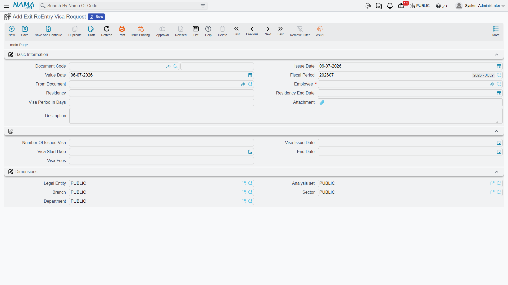
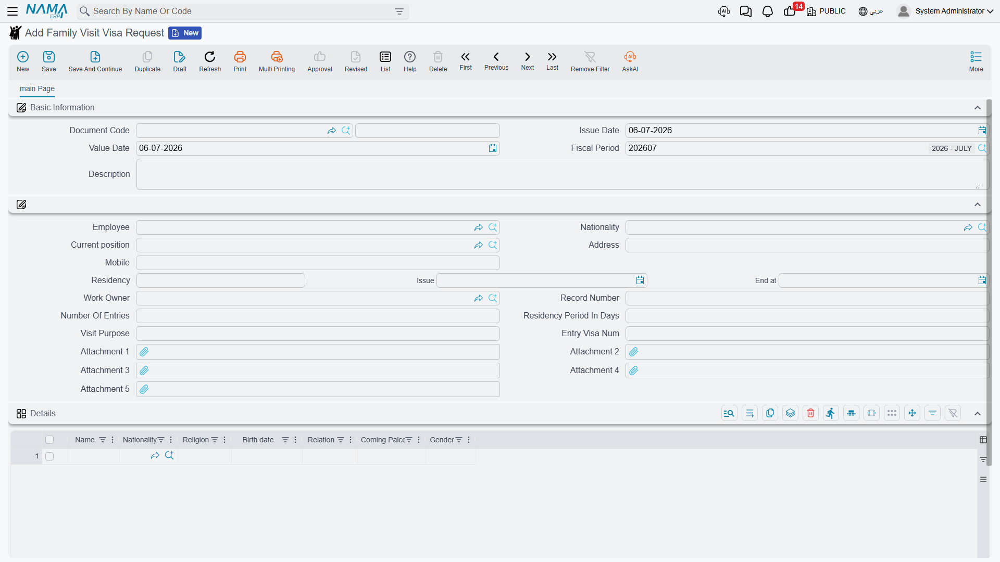

# HR Visas

An expatriate employee in the Gulf cannot simply leave the country and come back, or bring family
over to visit, without a government visa each time — and every one of those visas has an issue date,
a duration and an expiry that HR has to track. Nama's **Visas** menu is where the PRO records each of
those procedures: exit / re-entry visas so a staff member can travel and return, extensions when a
trip runs long, the final-exit visa when someone leaves for good, a family-visit visa to bring
relatives over, and the paperwork for handing a passport back to its owner. Each is a short document
that captures the employee, their current residency and the visa's own dates.

::: info Gulf / KSA-specific, and part of one cycle
These are Saudi / Gulf immigration procedures and need the Gulf visa licence
(`humanresource-gulf-visa`). They all share the pick-employee → read-only-residency → record cycle
described on the [Government Relations Overview](./government-relations-overview) — read that page
first if you have not, especially the note that **only a completed transaction writes anything back
to the employee**.
:::

## The date pattern that runs through all of them

Before the individual documents, learn the one calculation they share. A visa has a **start date**
and a **period in days**; its **end date is simply the start plus the period**. You supply the start
and the duration, and Nama derives the expiry — you do not type the end date and hope it matches.
This is why every visa document shows a start, a period and an end together: the end is a computed
consequence of the other two, and it is that computed end date the completed transaction later writes
back onto the employee's residency / visa record.

## Exit / Re-entry visa

The **Exit / Re-entry Visa Request** (`طلب تأشيرة خروج وعودة`) is the everyday one: it lets an employee
leave the Kingdom and return on the same Iqama. You open it from **Human Resources → Visas → Exit /
Re-entry Visa Request** (`الموارد البشرية > التأشيرات > طلب تأشيرة خروج وعودة`), pick the employee, and
the residency and its end date fill in read-only. You then record the visa's duration and, once
issued, its number and dates.

| Field (English) | Arabic label | Purpose |
|---|---|---|
| Employee | الموظف | The traveller. |
| Residency | الأقامة | The employee's current Iqama (read-only context). |
| Residency End Date | تاريخ إنتهاء الإقامة | When that Iqama expires — a visa cannot outlast it. |
| Visa Period In Days | مدة التأشيرة بالايام | How long the exit / re-entry is valid for. |
| Number Of Issued Visa | رقم التاشيرة | The visa number the government issued. |
| Visa Issue Date | تاريخ الإصدار | When the visa was issued. |
| Visa Start Date | تاريخ البدايه | The date the visa's validity begins. |
| End Date | تاريخ الإنتهاء | The expiry — **start date + period in days**. |
| Visa Fees | رسوم التأشيرة | The government charge for the visa. |
| From Document | بناءا على | The document this request was generated from, when applicable. |

### Issuing a batch at once

When a group of employees is travelling together — a whole crew going home for a season — you do not
open a request each. The **Aggregated Exit / Re-entry Visa Request** (`طلب تأشيرة خروج وعودة مجمع`), also
under **Human Resources → Visas**, carries one line per employee in its details grid (employee,
residency, period, issued number and the same computed dates) and produces an individual exit /
re-entry request per employee. You manage the batch, not the singles it spawns — the aggregated
pattern is explained in
[HR Requests, Documents & Aggregated Documents](../concepts/hr-requests-and-documents).

## Extending an exit / re-entry visa

If the trip runs longer than the visa allows, the **Extending Visa Request**
(`طلب تمديد تاشيرة الخروج والعودة`) pushes the expiry out. It references the original exit visa number
and its current end date, and records the new **Extend To Date** you are extending it to.

| Field (English) | Arabic label | Purpose |
|---|---|---|
| Employee | الموظف | The employee whose visa is being extended. |
| Residency / Residency End Date | الأقامة / تاريخ إنتهاء الإقامة | Current Iqama context. |
| Number Of Exit Visa | رقم تأشيرة الخروج | The exit visa being extended. |
| End Date | تاريخ الإنتهاء | The visa's current expiry. |
| Extend To Date | تمديد إلى تاريخ | The new expiry the extension grants. |

## Final-exit visa

When an employee is leaving the country permanently — at the end of service — the **Final Exit Visa
Request** (`طلب تاشيرة خروج نهائي`) records that departure. It captures the residency, its end date
and, crucially, the employee's **Last Work Date** (`اخر يوم عمل`), which ties the departure to the
end-of-service process.

| Field (English) | Arabic label | Purpose |
|---|---|---|
| Employee | الموظف | The departing employee. |
| Residency / Residency End Date | الأقامة / تاريخ إنتهاء الإقامة | Current Iqama context. |
| Last Work Date | اخر يوم عمل | The employee's final working day. |
| From Document | بناءا على | The document this request was generated from, when applicable. |

## Family-visit visa

The **Family Visit Visa Request** (`طلب زيارة عائليه`) is the one visa that concerns people other than
the employee: it brings the employee's relatives into the country for a visit. Alongside the
employee's own residency, nationality, position and work-owner details, it carries a **Details grid
that lists each family member** coming — their name, nationality, religion, birth date, relationship,
place of arrival and gender — because a single visit visa can cover a whole family.

| Field (English) | Arabic label | Purpose |
|---|---|---|
| Employee | الموظف | The sponsoring employee. |
| Nationality | الجنسية | The employee's nationality. |
| Current Position | المهنة بالأقامة | The employee's profession as printed on the Iqama. |
| Residency (Number / Issue / End) | الأقامة (رقم / تاريخ الإصدار / تاريخ الأنتهاء) | The sponsor's Iqama details. |
| Work Owner | صاحب العمل | The employer / sponsor. |
| Number Of Entries | عدد مرات الدخول | Single- or multiple-entry. |
| Residency Period In Days | مدة الاقامة بالايام | How long the visitors may stay. |
| Visit Purpose | غرض الزيارة | Why the family is visiting. |
| **Details** — Name | الاسم | Each visiting family member's name. |
| **Details** — Nationality / Religion | الجنسية / الديانة | Their nationality and religion. |
| **Details** — Birth date | تاريخ الميلاد | Their date of birth. |
| **Details** — Relation | العلاقة | Their relationship to the employee. |
| **Details** — Coming Place / Gender | جهة القدوم / النوع | Where they are travelling from, and gender. |

## Passport delivery

Companies often hold employees' passports for safekeeping. The **Passport Delivering Request**
(`طلب استلام جواز سفر`) documents handing a passport back — recording the employee, the passport
number and the **Purpose** (`الغرض`) of the release — so there is an auditable trail of who took their
passport and why.

| Field (English) | Arabic label | Purpose |
|---|---|---|
| Employee | الموظف | The passport's owner. |
| Residency | الأقامة | The employee's Iqama context. |
| Passport Number | رقم جواز السفر | The passport being handed over. |
| Purpose | الغرض | Why the passport is being released. |

## How it's processed

None of these visa documents post to the general ledger — they are records and date-carriers, not
accounting entries. Saving one is instant, and any background effect (the write-back of the new visa
number and dates onto the employee once the transaction is complete) runs as a **business request**
(`طلب أعمال`) with its own **processing status** (`حالة المعالجة`), retryable from the **Business
Requests** view if it fails. Any government fee attached to a visa is recorded and settled the way all
government charges are — see the Payment Request note on the
[Government Relations Overview](./government-relations-overview).

## Related pages

- [Government Relations Overview](./government-relations-overview) — the shared pick-employee →
  record → write-back cycle, the government-fee catalogue and the all-important payment-request
  accounting note.
