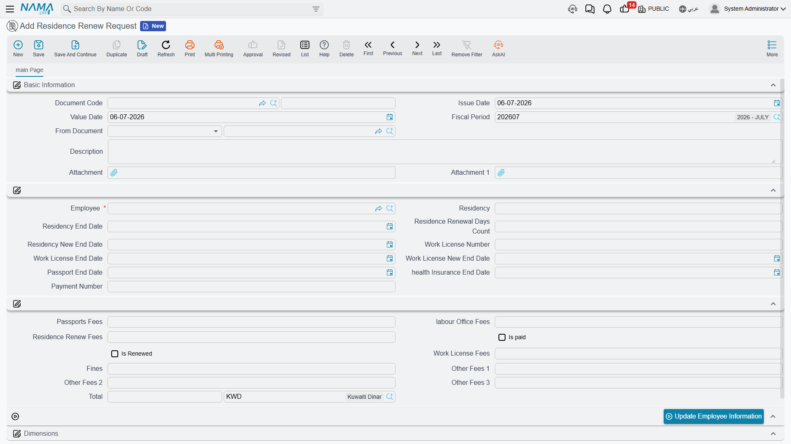
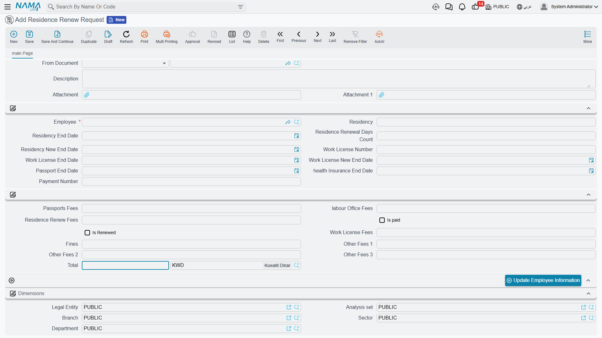

# Residence Renewal

Of every deadline the PRO desk tracks, the Iqama (residency permit) is the one that cannot slip —
an expired residency stops an employee from working, travelling or even opening a bank account.
The **Residence Renew Request** is the document built for that one recurring job: pick the
employee, look at the residency and work-licence dates as they stand today, break down every fee
the renewal cost, mark it paid and renewed, and push the new dates back onto the employee's file.
Alongside it, the **Aggregated Residence Renew Request** does the same thing for a whole batch of
employees at once — and can even go and find, by itself, everyone whose residency is about to run
out.

::: info Gulf / KSA-specific, and part of one cycle
This is a Saudi / Gulf immigration procedure and needs the Gulf visa licence
(`humanresource-gulf-visa`). It follows the pick-employee → read-only-docs → record → update-back
cycle described on the [Government Relations Overview](./government-relations-overview) — read
that page first if you have not, especially the note that **only a completed transaction writes
anything back to the employee**.
:::

## Picking the employee fills in everything, read-only

Open a new Residence Renew Request from **Human Resources → Administrative Transactions →
Residence Renew Request** and choose the **Employee**. The moment you do, the current facts on
that employee's file are copied in for you — the residency number and its end date, the work
licence number and end date, the health-insurance end date, the passport end date. None of these
copied-in fields can be typed over: they are locked so you are always looking at the real current
state of the employee's file, not guessing at it.

| Field (English) | Arabic label | Purpose |
|---|---|---|
| Employee | الموظف | The employee whose residency is being renewed. |
| Residency | الأقامة | The employee's current Iqama number (read-only). |
| Residency End Date | تاريخ إنتهاء الإقامة | The current expiry, copied from the employee (read-only). |
| Work License Number / Work License End Date | رقم رخصة العمل / تاريخ انتهاء رخصة العمل | The current work licence and its expiry (read-only). |
| Passport End Date | تاريخ إنتهاء الجواز | The employee's passport expiry (read-only). |
| Health Insurance End Date | تاريخ إنتهاء التأمين الطبى | The employee's health-insurance expiry (read-only). |
| Payment Number | رقم السداد | A reference to how the government fee was paid. |

## The renewal period and the new end date

Rather than typing the new expiry by hand, you tell Nama how long the renewal covers: fill in
**Residence Renewal Days Count** (`عدد أيام تجديد الإقامة`) and Nama adds that many days to the
current **Residency End Date** to work out **Residency New End Date** (`تاريخ انتهاء الإقامة
الجديد`) for you. The work licence does not follow the same automatic math — because its own
renewal period can run on a different cycle — so **Work License New End Date** (`تاريخ انتهاء رخصة
العمل الجديد`) is typed in directly once the new licence is in hand.

## The fee breakdown that live-sums to a Total

A residency renewal is rarely a single government fee — passport-office charges, a labour-office
fee, the renewal fee itself, the work-licence fee, and sometimes a fine or two, all land on the
same transaction. Rather than adding them up by hand, you enter each one in its own field and Nama
keeps a running **Total** (`الإجمالي`) that recalculates the instant any of them changes.

| Field (English) | Arabic label | Purpose |
|---|---|---|
| Passports Fees | رسوم الجوازات | The passport-office charge. |
| labour Office Fees | رسوم مكتب العمل | The labour-office charge. |
| Residence Renew Fees | رسوم تجديد الإقامة | The residency renewal fee itself. |
| Work License Fees | رسوم رخصة العمل | The work-licence renewal charge. |
| Fines | الغرامات | Any late-renewal or other fine included in this transaction. |
| Other Fees 1 / 2 / 3 | رسوم أخري 1 / 2 / 3 | Any further charges that do not fit the categories above. |
| Total (Total / Currency) | الإجمالي (الإجمالي / العملة) | The live sum of every fee field above, in its currency. |
| Is paid | تم السداد | Whether the fee total has actually been paid. |
| Is Renewed | تم التجديد | Whether the residency has actually been renewed at the government side. |

## Writing the new dates back: Update Employee Information

Filling in the new dates on the request does not, by itself, change anything on the employee's
file — that only happens when you press **Update Employee Information**
(`تحديث معلومات الموظف`), and the button enforces the whole point of this document:

- It refuses to run unless **Is paid** and **Is Renewed** are both ticked — a renewal that has not
  actually gone through cannot update the master file.
- It requires at least one of **Residency New End Date** or **Work License New End Date** to be
  filled in — there has to be something to write back.
- It will not push a new residency or work-licence date **earlier** than the one the employee
  already has — so a stale or out-of-order request can never roll the employee's Iqama or licence
  backwards.

Once those checks pass, the employee's residency end date and work-licence end date are updated on
the **employee master file** in one step, so the rest of HR immediately sees the renewed dates.

## Renewing a whole batch: Aggregated Residence Renew Request

When renewal season hits and a dozen residencies are expiring together, you do not open a request
for each employee. The **Aggregated Residence Renew Request**, also under **Human Resources →
Administrative Transactions**, carries one line per employee in its **Details** grid — the same
employee, residency, fee-breakdown and Total fields described above, one row each — and its
**Update Employees Residence And Work Licence Info** button runs the exact same paid/renewed/
not-earlier-than checks for every line before writing each employee's file. You manage the batch,
not the individual requests it stands in for — the aggregated pattern in general is explained in
[HR Requests, Documents & Aggregated Documents](../concepts/hr-requests-and-documents).

### Letting the batch find the employees for you

Rather than adding employees to the batch by hand, press **collect Employees**
(`تجميع الموظفين`) and Nama goes looking for them itself. Set **Collect Only Residencies Expiring
In (Days)** (`تجميع الإقامات التي ستنتهي خلال (أيام)`) and the batch pulls in every employee whose
residency ends within that many days of today, and **Max Employees To Collect**
(`أقصى عدد موظفين يتم تجميعه`) caps how many lines it will add in one go. The batch's own document
term can also list nationalities that should always be skipped by this auto-harvest, so a
particular workforce segment can be renewed through a separate process if needed.

| Field (English) | Arabic label | Purpose |
|---|---|---|
| Collect Only Residencies Expiring In (Days) | تجميع الإقامات التي ستنتهي خلال (أيام) | Only pull in employees whose residency ends within this many days. |
| Max Employees To Collect | أقصى عدد موظفين يتم تجميعه | The maximum number of employees the collection will add. |

## How it's processed

Like every document here, a Residence Renew Request has **no ledger effect** — it is a record and
a date-carrier, not an accounting entry; the government fee it tracks is settled the way all
government charges are (see the payment-request accounting note on the
[Government Relations Overview](./government-relations-overview)). Saving the document is instant;
the only thing that reaches out and changes something else in the system is the **Update Employee
Information** action, which is retried like any other business request if it fails — from the
**Business Requests** view.

## Related pages

- [Government Relations Overview](./government-relations-overview) — the shared pick-employee →
  record → write-back cycle and the government-fee accounting note.
- [HR Visas](./hr-visas) — the sibling visa procedures that share the same read-only-context
  pattern.
