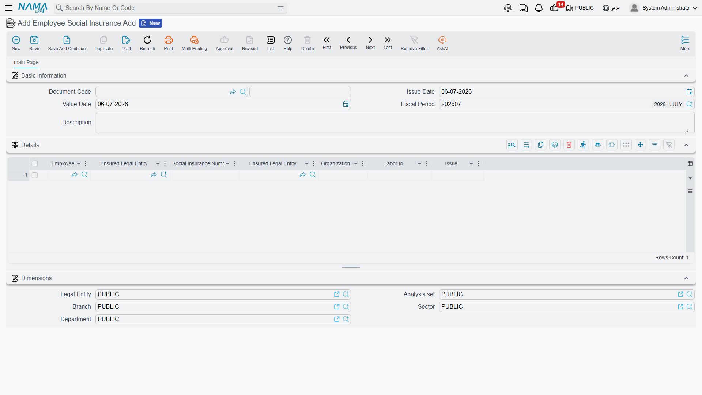
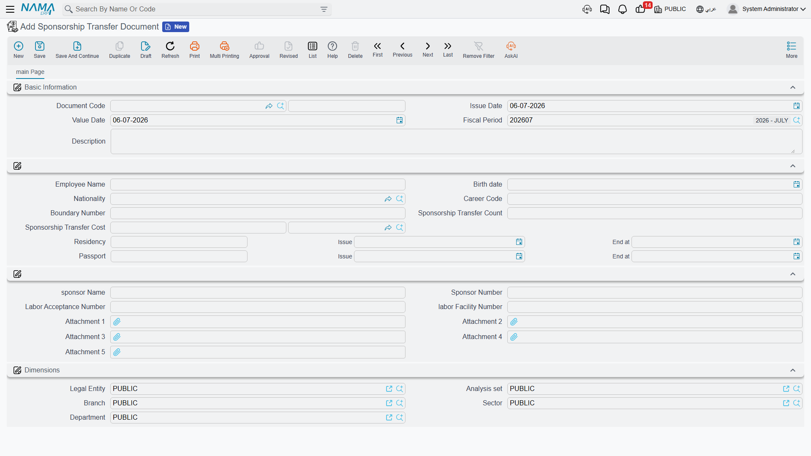

# Social Insurance & Sponsorship

Two of the most sensitive government touch-points for an expatriate workforce are the **GOSI social
insurance register** and the **sponsorship (Kafala)** relationship. When someone joins, they have to
be added to the employer's social-insurance file; when they leave, they have to be taken off it. And
when an employee moves from one employer to another, the sponsorship that ties their residency to a
company has to be formally transferred. Nama models all three as short recording documents that sit
in the same pick-employee → record → write-back rhythm as the rest of the government-relations desk.

::: info Gulf / KSA-specific area
Both the GOSI register and Kafala sponsorship are Saudi / Gulf labour-and-immigration concepts, so
this whole page is only relevant in that context. The social-insurance documents need the Gulf
social-insurance licence (`humanresource-gulf-social-insurance`); the sponsorship-transfer documents
need the Gulf visa licence (`humanresource-gulf-visa`).
:::

For the shared PRO cycle and the fee catalogue these documents draw on, start with the
[Government Relations Overview](./government-relations-overview).

## GOSI: adding and removing employees

Registration with the General Organization for Social Insurance (GOSI) is a two-sided affair — one
document to **enrol** employees, a mirror document to **withdraw** them — and both are deliberately
**line-based**: a single document can register (or deregister) a whole batch of employees at once,
which is exactly how enrolment usually happens after a hiring drive.

### Employee Social Insurance Add

The **Employee Social Insurance Add** (`سند إضافة موظفين للتأمينات الإجتماعية`) document records that
one or more employees have been entered on the employer's GOSI file. Each line names the employee,
the legal entity they are insured under, and the insurance identifiers that come back from GOSI.

You will find it under **Human Resources → Social Insurance → Employee Social Insurance Add**
(`الموارد البشرية > التأمين الأجتماعي > سند إضافة موظفين للتأمينات الإجتماعية`).

| Field (English) | Arabic label | Purpose |
|---|---|---|
| Issue Date | تاريخ التحرير | The date the document is written. |
| Value Date | التاريخ الفعلي | The effective date of the enrolment. |
| Employee | الموظف | The employee being added to the GOSI register (one per line). |
| Ensured Legal Entity | الشركة المؤمنة في التأمين | The company the employee is insured under. |
| Social Insurance Number | رقم التأمين الأجتماعي | The GOSI number issued for the employee. |
| Organization id | رقم المنشأة | The employer's GOSI establishment number. |
| Labor id | الرقم بمكتب العمل | The employee's labour-office number. |
| Issue | تاريخ الإصدار | The issue date of the social-insurance registration. |

### Employee Social Insurance Remove

The **Employee Social Insurance Remove** (`سند حذف موظفين من التأمينات الإجتماعية`) document is the
withdrawal counterpart — used when employees leave or are moved off the insurance file. Its lines
carry the same employee and insurance-number columns, plus the **End at** (`تاريخ الأنتهاء`) date
that closes the registration.

It lives under **Human Resources → Social Insurance → Employee Social Insurance Remove**
(`الموارد البشرية > التأمين الأجتماعي > سند حذف موظفين من التأمينات الإجتماعية`).

## Sponsorship (Kafala) transfer

Under the Kafala system, an expatriate's residency is tied to a sponsor. Moving an employee from one
employer to another — or absorbing a worker whose sponsorship your company is taking over — is a
formal transaction with the labour office, and the **Sponsorship Transfer Document**
(`طلب نقل كفالة موظف`) is where it is recorded.

Because it is a transaction with the authorities, the document gathers everything the transfer file
needs on one screen: the employee's identity and nationality, the residency and passport details, the
number of times the sponsorship has already been transferred (a figure the labour office cares about),
the transfer fee, and the receiving sponsor's particulars — plus attachment slots for the supporting
paperwork.

You will find it under **Human Resources → Administrative Transactions → Sponsorship Transfer
Document** (`الموارد البشرية > معاملات إداريه > طلب نقل كفالة موظف`).

| Field (English) | Arabic label | Purpose |
|---|---|---|
| Employee Name | إسم الموظف | The employee whose sponsorship is being transferred. |
| Birth date / Nationality | تاريخ الميلاد / الجنسية | Identity details for the transfer file. |
| Career Code | رمز المهنة | The occupation code recorded on the labour file. |
| Boundary Number | رقم الحدود | The border / entry number. |
| Sponsorship Transfer Count | عدد مرات نقل الكفالة | How many times this sponsorship has already been transferred. |
| Sponsorship Transfer Cost | قيمة رسوم نقل الكفالة | The government fee for the transfer (amount and currency). |
| Residency (Number / Issue / End at) | الأقامة (رقم / تاريخ الإصدار / تاريخ الأنتهاء) | The Iqama details reproduced on the transfer. |
| Passport (Number / Issue / End at) | جواز السفر (رقم / تاريخ الإصدار / تاريخ الأنتهاء) | The passport details for the transfer. |
| sponsor Name / Sponsor Number | اسم الكفيل / رقم الكقيل | The new sponsor's name and number. |
| Labor Acceptance Number | رقم موافقة مكتب العمل | The labour-office approval number for the transfer. |
| labor Facility Number | رقم المنشة بمكتب العمل | The employer's labour-office establishment number. |
| Attachment 1…5 | مرفق 1…5 | Scanned supporting documents. |

### Transferring several employees at once

When a batch of workers is moved together, the **Aggregated Sponsorship Transfer Document**
(`طلب نقل كفالة مجمع`) captures them all in one grid — each row being one employee's transfer — and,
on save, produces one ordinary Sponsorship Transfer Document per row. As with every aggregated
document in Nama, you manage the batch by editing the aggregated document, not the singles it
generated; see [HR Requests, Documents & Aggregated Documents](../concepts/hr-requests-and-documents)
for how that two-level relationship works. It lives one menu entry along, under
**Human Resources → Administrative Transactions → Aggregated Sponsorship Transfer Document**
(`الموارد البشرية > معاملات إداريه > طلب نقل كفالة مجمع`).

## How it's processed

Saving any of these documents is instant; like every document in Nama, any follow-on work is raised
as a **business request** (`طلب أعمال`) with its own **processing status** (`حالة المعالجة`) that can
be retried from the **Business Requests** view if it fails. None of the documents on this page posts
to the general ledger — they **record** a government fact (an enrolment, a withdrawal, a sponsorship
move) and, where relevant, feed the employee's official-document details. Any fee attached to a
sponsorship transfer is tracked and settled the same way as every other government charge: through the
fee-recording flow described in the [Government Relations Overview](./government-relations-overview),
not by these documents debiting or crediting anything themselves.
