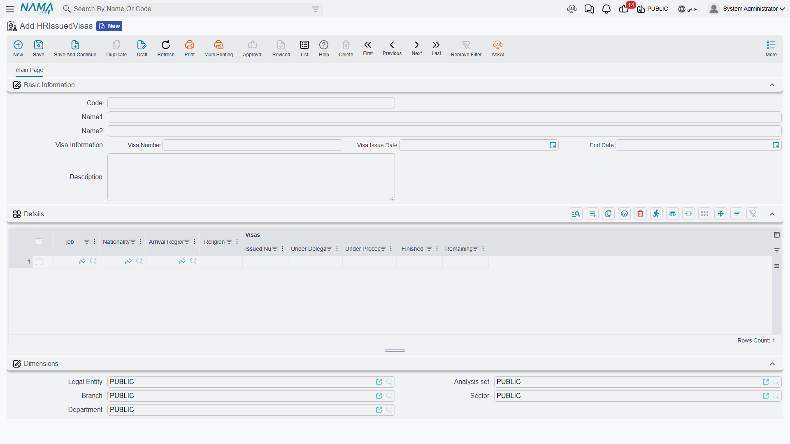
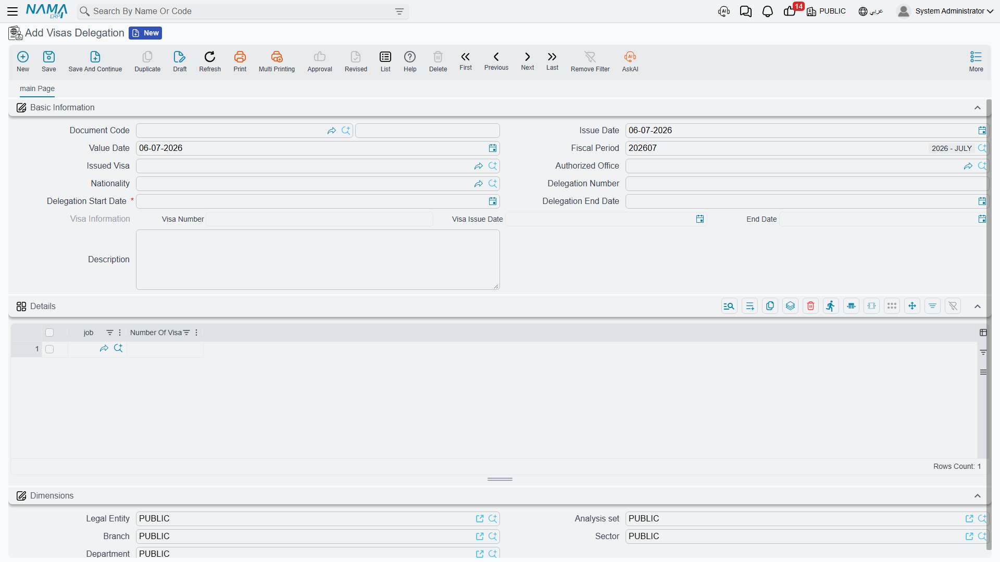

# Visa Pool

Before a single overseas hire can travel, the company needs a work visa allocated to them — and in
Saudi / Gulf recruiting, those visas are not requested one at a time. A company is granted a
**pool** of hiring visas by nationality, job and other quotas, and the PRO desk's job is to manage
that pool as a small piece of inventory: know how many visas of each kind are sitting in stock, hand
a slice of them to a PRO office to work with, and record each one actually spent on a real
government visa. Three documents model that funnel end to end: **Issued Visas** (the stock),
**Visas Delegation** (allocating some of it to an office) and **Visa Handling** (spending an
allocation on an actual visa).

::: info Gulf / KSA-specific
This is a Saudi / Gulf recruitment procedure and needs the Gulf visa licence
(`humanresource-gulf-visa`). Unlike the rest of the government-relations desk, these three
documents are not about an existing employee's paperwork — they track the company's own supply of
hiring visas before anyone is hired. They are found under **Human Resources → Recruiting**, not
**Administrative Transactions**.
:::

## The stock: Issued Visas

**Issued Visas** (`تأشيرات صادرة`) is where the company's granted quota is recorded. It carries the
government visa's own number, issue date and end date at the header, and a **Details** grid with
one row per combination of **job**, **nationality**, **religion** and **arrival region** — because a
government grant is rarely a single flat number, it is usually broken down by exactly these
categories.

| Field (English) | Arabic label | Purpose |
|---|---|---|
| Arabic Name / English Name | الاسم العربي / الاسم الإنجليزي | The grant's display name. |
| Visa Number / Visa Issue Date / End Date | رقم التأشيرة / تاريخ الإصدار / تاريخ الإنتهاء | The government grant's own number and validity. |
| **Details** — job / Nationality | الوظيفة / الجنسية | The job and nationality this row's quota is for. |
| **Details** — Arrival Region | جهة القدوم | Where these hires are expected to arrive from. |
| **Details** — Religion | الديانة | The religion this row's quota is for. |
| **Details** — Visas\|Issued Number | عدد التأشيرات\|المصدر | How many visas were granted for this job / nationality combination. |
| **Details** — Visas\|Under Delegation | عدد التأشيرات\|المفوض به | How many of them are currently handed to a PRO office and not yet spent. |
| **Details** — Visas\|Under Procedure | عدد التأشيرات\|تحت الإجراء | How many have been spent on an actual visa that is still being processed. |
| **Details** — Visas\|Finished | عدد التأشيرات\|المنتهى | How many have completed their journey (the hire has actually arrived). |
| **Details** — Visas\|Remaining | عدد التأشيرات\|المتبقي | What is left available to delegate — issued minus delegated, in-procedure and finished. |

Only **Issued Number** is something you type in; **Under Delegation**, **Under Procedure**,
**Finished** and **Remaining** move on their own as Delegation and Handling documents are saved and
committed against this row — you never edit them directly.

## Step 1 — allocating to an office: Visas Delegation

Once the quota exists, a **Visas Delegation** (`تفويض تاشيرة`) hands a slice of one nationality's
visas to a specific PRO office to work with — you are not spending a visa yet, only reserving it
for that office. You choose the **Issued Visa** grant and the **Nationality** being delegated once
at the header, then break the quantity down by job in the **Details** grid.

| Field (English) | Arabic label | Purpose |
|---|---|---|
| Issued Visa | التأشيرة الصادرة | The stock grant this delegation draws from. |
| Authorized Office | المكتب المفوض | The PRO office the visas are being delegated to. |
| Nationality | الجنسية | The nationality being delegated (one per delegation). |
| Delegation Number | رقم التفويض | The government delegation reference number. |
| Delegation Start Date / Delegation End Date | تاريخ التفويض / تاريخ أنتهاء التفويض | How long the delegation itself is valid for (defaults from the grant's own end date). |
| **Details** — job | الوظيفة | The job this delegated quantity is for. |
| **Details** — Number Of Visas | عدد التأشيرات | How many visas of that job / nationality are being delegated. |

Saving and committing the delegation moves that quantity out of **Remaining** and into **Under
Delegation** on the matching Issued Visas row — Nama checks the same job-and-nationality
combination exists in the stock and refuses the line if the remaining balance cannot cover it.

## Step 2 — spending it: Visa Handling

**Visa Handling** (`منح تأشيرة`) is where a delegated allocation is actually spent on a real visa:
the office has gone to the authorities and obtained a numbered visa with its own validity dates for
one or more of the hires it was allocated. You reference the **Delegation** it is drawn from (and
the same **Issued Visa** grant), and each **Details** line records the visa actually granted.

| Field (English) | Arabic label | Purpose |
|---|---|---|
| Delegation | التفويض | The delegation this handling spends from. |
| Issued Visa | التأشيرة الصادرة | The stock grant behind it. |
| Authorized Office | المكتب المفوض | The office handling the visa. |
| **Details** — Nationality / job | الجنسية / الوظيفة | Which quota row this visa is drawn from. |
| **Details** — Visa Number | رقم التأشيرة | The actual government visa number obtained. |
| **Details** — From Date / To Date | من تاريخ / إلى تاريخ | The visa's own validity period. |
| **Details** — Expiry Period | مدة الصلاحية | How long that validity period runs. |
| **Details** — Number Of Visas | عدد التأشيرات | How many visas this line accounts for. |

Committing a Visa Handling moves the quantity out of **Under Delegation** and into **Under
Procedure** on the Issued Visas row — the visa has stopped being a mere allocation and has become a
real, numbered visa in progress. A later step in the recruitment process (when the hire actually
arrives) is what finally moves a visa from **Under Procedure** into **Finished**, closing out that
unit of the pool for good.

## How it's processed

None of the three documents in this funnel post to the general ledger — they move quantities
between the counters on the Issued Visas stock row, not money. Saving and committing is instant,
and cancelling or editing a Delegation or Handling reverses its quantity move on the same row, so
the counters always reflect exactly what is currently allocated, in progress or finished.

## Related pages

- [Government Relations Overview](./government-relations-overview) — the shared PRO desk this
  pool feeds into once a hire is on payroll.
- [HR Visas](./hr-visas) — the visa procedures for employees who are already on the company's
  books, as distinct from this pre-hire visa pool.
