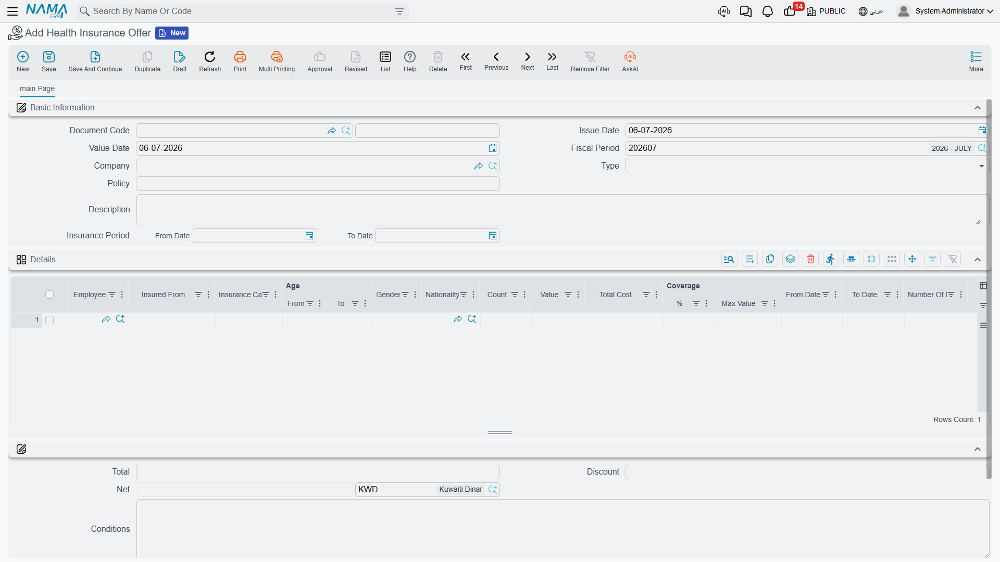
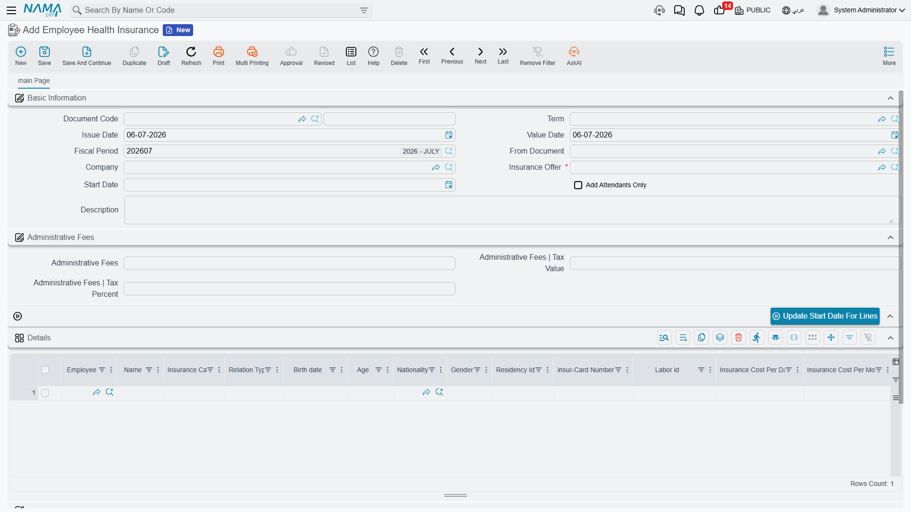
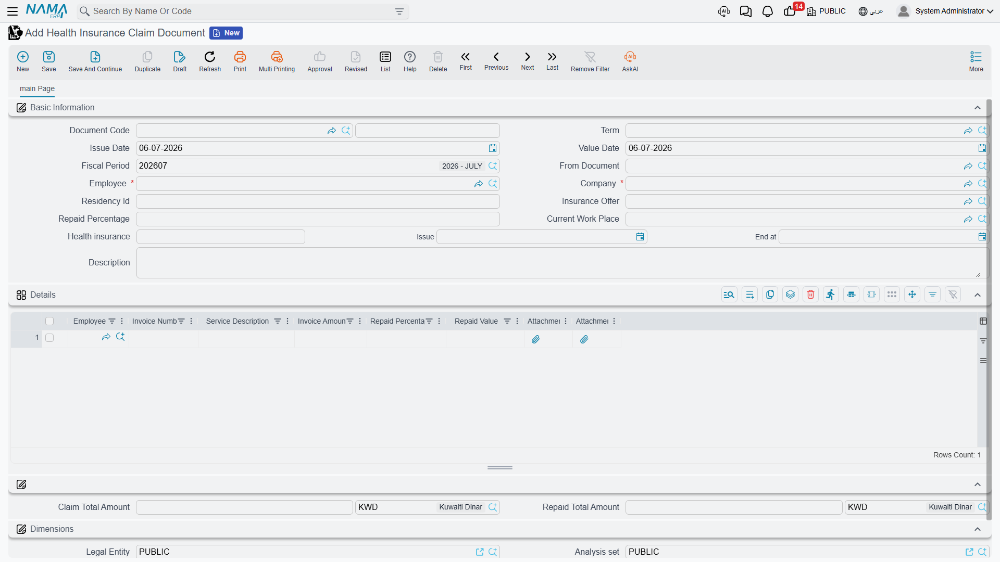
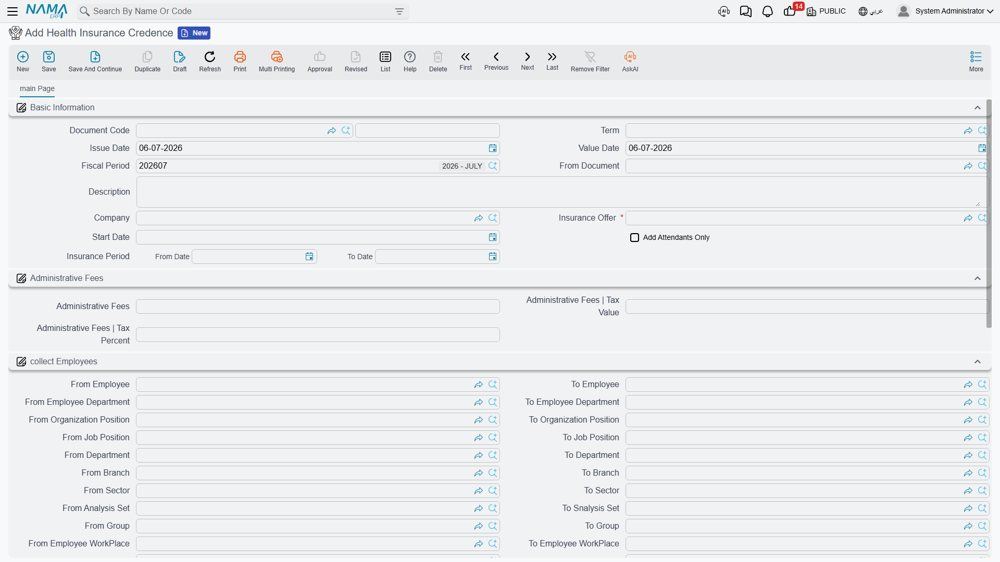

# Employee Health Insurance

In the Gulf, private health insurance is not optional paperwork — it is a government-mandated
benefit, and covering the wrong category, missing a spouse, or letting a policy lapse creates real
liability. Nama's Health Insurance area follows one employee's insurance from the day the company
picks a policy to the day that employee is finally removed from it: set up the policy the insurer
offered, enrol employees (and their families) onto it, submit medical claims against it, upgrade
someone to a richer coverage tier mid-year, credit a batch of employees to a new company, and — when
someone leaves — take them off cleanly.

::: info Gulf-specific
Every document on this page needs the Gulf health-insurance licence (Gulf Health Insurance). It sits
in its own **Human Resources → Health Insurance** menu group, separate from the government-relations
procedures (residency, work licence) even though both are Gulf-only and both read/write the same
employee master file.
:::

## Before anyone is enrolled: the policy and the offer

Two different "policy" concepts show up in this area, and they are easy to confuse because both
translate loosely as "insurance policy":

- **Insurance Offer** (عرض تأمين مقدم من شركة) is the pricing sheet a specific insurance company
  quoted your organisation — a document you fill in yourself, line by line, once a year or whenever
  you switch insurers.
- **Social Insurance Policy** (سياسة التأمينات الاجتماعية) is an unrelated, much simpler master file
  used for the *government* social-insurance contribution brackets on an employee's HR record (fixed
  and variable percentages, by date range, capped at a minimum/maximum) — it lives under Payroll
  licensing and has nothing to do with the private health-insurance offer described below. It is
  only grouped in this same menu because Nama files health-related setup together.

### Filling in the Insurance Offer

Open **Human Resources → Health Insurance → Health Insurance Offer** and pick a **Type** — health
insurance offers use **Healthy**, while the same screen family is reused elsewhere in Nama for fire,
car and other insurance types, so always confirm **Healthy** is selected. Set the **Insurance
Period** (From Date / To Date) the quote covers, and note the insurer's own reference in **Policy**
— a free-text field, not a link to the Social Insurance Policy master file above.

The offer's **Details** grid is the actual price list: one line per combination of **Insurance
Category** (the tier — VIP Plus, VIP, A, AA, B, B Plus, C, CC), who it insures (**Insured
From** — Employees, Wifes, Husbands, Childrens, and so on down to named children Child 1–5), an
age bracket (**Age | From/To**), and **Gender**. Each line carries its own **Value**, the resulting
**Total Cost**, and a **Coverage** cap (percentage and/or maximum value) — the portion the insurer
pays versus what falls back on the company or employee.

| Field (English) | Arabic label | Purpose |
|---|---|---|
| Type | النوع | Insurance line of business — choose Healthy for this area. |
| Policy | الوثيقة | The insurer's own reference number (free text). |
| Insurance Period | فترة التأمين | The from/to dates this quote covers. |
| Insurance Category | فئة التأمين | The coverage tier (VIP Plus, VIP, A, AA, B, B Plus, C, CC). |
| Insured From | المؤمن عليهم من | Who this price line covers — employee, spouse, child, etc. |
| Coverage | التحمل | The percentage and/or maximum value the insurer covers on this line. |

Once an offer is agreed, everything else on this page — enrolment, claims, upgrades, credence —
points back to it through an **Insurance Offer** field, so its category list and coverage rules
become the menu every later document picks from.

::: tip Collecting employees onto an offer request
Before committing to an offer, HR often needs an accurate headcount by category. The **Health
Insurance Offer Request** (طلب عروض تأمين) exists for exactly that: set a From/To range on employee,
department, job position, branch, nationality, and so on, press **collect Employees** (تجميع
الموظفين), and Nama pulls in every matching employee as a line — a quick way to size a quote before
signing it, without yet committing anyone to a real policy.
:::

## Adding an employee to the insurance

With an offer in hand, **Employee Health Insurance** (سند إضافة موظف للتأمين) is the document that
actually puts people on it. Open it from **Human Resources → Health Insurance → Employee Health
Insurance**, pick the **Company** and the **Insurance Offer**, and set a **Start Date** — the day
coverage begins for everyone added on this document.

The **Details** grid carries one line per person insured — not necessarily one per employee, because
a spouse or child is its own line with its own **Relation Type** (Himself, Wife, Husband, Son,
Daughter, Father, Mother, and further categories down to Second Degree or Friend). Each line copies
in the person's **Insurance Category**, **Birth Date**, **Age**, **Nationality**, **Gender**,
**Residency Id**, and works out **Insurance Cost Per Day** / **Insurance Cost Per Month**, together
with the **Coverage** and **Employee Due** split — how much of the cost the company absorbs versus
what is deducted from the employee.

| Field (English) | Arabic label | Purpose |
|---|---|---|
| Company | شركة | The insurer whose offer is being applied. |
| Insurance Offer | البوليصة | The priced offer this enrolment draws its categories and rates from. |
| Start Date | تاريخ البداية | The day coverage begins for the people on this document. |
| Add Attendants Only | إضافة مرافقين فقط | Limit this document to adding family members onto an employee already insured, without re-adding the employee. |
| Relation Type | نوع الربط | Who this line is, relative to the employee — self, spouse, child, parent, etc. |
| Insurance Cost Per Month | تكلفة التأمين الشهرية | The line's monthly premium, calculated from the offer. |
| Employee Due | المستحق من الموظف | The percentage/value of the cost deducted from the employee rather than borne by the company. |

Separately, **Administrative Fees** (with their own tax percentage/value) capture any flat handling
charge the insurer bills per enrolment, on top of the per-person premiums in the grid — the **Update
Start Date For Lines** action lets you push a single corrected start date down to every line at once
rather than editing them one by one.

::: tip Request first, if your organisation wants approval
Exactly like every other HR area, an **Employee Health Insurance Request** (طلب إضافة موظف للتأمين)
carries the identical Company/Offer/Details shape and goes through the standard
[Request → Document](../concepts/hr-requests-and-documents) accept/generate cycle before the real
enrolment document is created — use it where enrolling someone needs a manager's sign-off first, and
skip straight to the document where it does not.
:::

## Claiming a medical expense

Once an employee is insured, **Health Insurance Claim Document** (سند تعويض طبي) is how a medical
bill actually gets reimbursed. Open it from **Human Resources → Health Insurance → Health Insurance
Claim Document**, pick the **Employee**, and Nama pulls in their current **Insurance Offer**,
**Repaid Percentage**, and the **Health Insurance** block (card **Number**, **Issue** date, **End
at** date) straight from their enrolment — so the claim is always evaluated against the coverage
that was actually active for them.

The **Details** grid holds one line per invoice: **Invoice Number**, **Service Description**,
**Invoice Amount**, the line's own **Repaid Percentage**, the resulting **Repaid Value**, and up to
two scanned **Attachment** slots for the receipt or medical report. The document totals both
**Claim Total Amount** (what was billed across every line) and **Repaid Total Amount** (what the
insurer or company actually reimburses).

| Field (English) | Arabic label | Purpose |
|---|---|---|
| Employee | الموظف | The insured employee the claim is filed for. |
| Insurance Offer | البوليصة | The offer this employee is enrolled under, copied in automatically. |
| Repaid Percentage | نسبة التعويض | The share of the claim that gets reimbursed. |
| Invoice Amount | مبلغ الفاتورة | The billed amount on one medical invoice line. |
| Repaid Value | مبلغ التعويض | The calculated reimbursement for that line. |
| Claim Total Amount | إجمالى مبلغ المطالبة | The sum of every invoice line on the document. |
| Repaid Total Amount | إجمالى مبلغ التعويض | The sum actually reimbursed across every line. |

A **Health Insurance Claim Request** (مطالبة تعويض طبي) mirrors the same Employee/Invoice/Attachment
shape as an approval step before the claim document — the same accept-then-generate pattern used
everywhere else in HR.

## Upgrading a category mid-term

When an employee (or a family member on their policy) needs richer coverage than their current
category offers — moving from B to A, say — **Health Insurance Upgrade** (سند ترقية تأمين) handles
the switch without waiting for the next renewal. Each line in its **Details** grid names the
**Insurance Category** the person is leaving and the **New Insurance Category** they are moving to,
along with **Previous Insurance Category Days** and **Previous Insurance Category Value** — the
unused portion of what was already paid for the old tier — and a **Refund Value** (with its own tax
percentage/value) that credits that unused portion back against the cost of the new category.

| Field (English) | Arabic label | Purpose |
|---|---|---|
| Insurance Category | فئة التأمين | The tier the person currently holds. |
| New Insurance Category | الفئه المراد الترقية إليها | The tier they are upgrading to. |
| Previous Insurance Category Value | قيمة تأمين الفئة السابقة | What was already paid for the old tier's remaining period. |
| Refund Value | القيمة المستردة | The unused value credited back against the new category's cost. |

An **Administrative Fees** block and an **Update Start Date For Lines** action work exactly as they
do on the enrolment document, and a matching **Health Insurance Upgrade Request** (طلب ترقية تأمين)
offers the same approval step before the upgrade is committed.

## Moving a batch of employees to a new insurer: Credence

**Health Insurance Credence** (سند تعميد شركة تأمين) is the batch tool for re-assigning a whole group
of already-insured employees to a new insurance offer at once — typically when the company switches
insurers and needs every current policy-holder re-registered under the new company's offer in a
single operation, rather than one Employee Health Insurance document per person.

Like the Offer Request above, it can build its employee list for you: fill in the **Collect
Employees** range (department, job/organization position, branch, sector, nationality — plus a
**From/To Health Insurance Company** filter unique to this screen, letting you target specifically
the people currently insured with the insurer you are leaving) and press **collect Employees**
(تجميع الموظفين). Every matching employee is added as a line with the same category/relation/cost
detail described for enrolment, ready to be committed under the new **Insurance Offer** in one save.

## Taking someone off the insurance

When an employee (or a dependant) no longer needs coverage — they left the company, a child aged
out, a dependant relation ended — **Employee Health Insurance Delete** (سند حذف تأمين موظف) removes
them. It mirrors the enrolment document field for field (Company, Insurance Offer, Start Date,
Administrative Fees, the same Details grid of employee/relation/category lines) but its effect runs
the other way: it takes the listed people off the policy from the given date rather than adding
them. An **Employee Health Insurance Delete Request** (طلب حذف تأمين موظف) again offers the same
accept-then-generate approval step first, for organisations that require sign-off before someone is
dropped from coverage.

## How it's processed

Every document on this page — enrolment, upgrade, credence and deletion — shares the same
underlying accounting logic and posts through the term's configured sides: a **covering**
debit/credit pair for the base premium, a matching **tax** debit/credit pair, an **employee tax**
pair for any tax portion recovered from the employee, and — where **Administrative Fees** were
filled in — their own **Administrative Fees Value** and **Administrative Fees Tax Value**
debit/credit pairs. The **Health Insurance Upgrade** additionally posts a **Previous Insurance
Category** debit/credit pair and a **Refund Tax** pair for the value credited back from the old
tier. All of it runs as a background **business request** with a **processing status**, exactly like
postings elsewhere in Nama — retry a failed one from the **Business Requests** view rather than
re-saving the document.

The **Health Insurance Claim Document** posts separately and more simply: a single **Credit 2** /
**Debit 2** pair sized to the claim's **Repaid Total Amount**, moving the reimbursed medical cost
between the accounts configured on the claim document's own term.

## Related pages

- [Employee HR Information](../setup/employee-hr-information) — the employee master file these
  documents read from and, for residency/passport dates, cross-check against.
- [HR Requests, Documents & Aggregated Documents](../concepts/hr-requests-and-documents) — the
  general Request → Document approval pattern every "Req" screen on this page follows.
