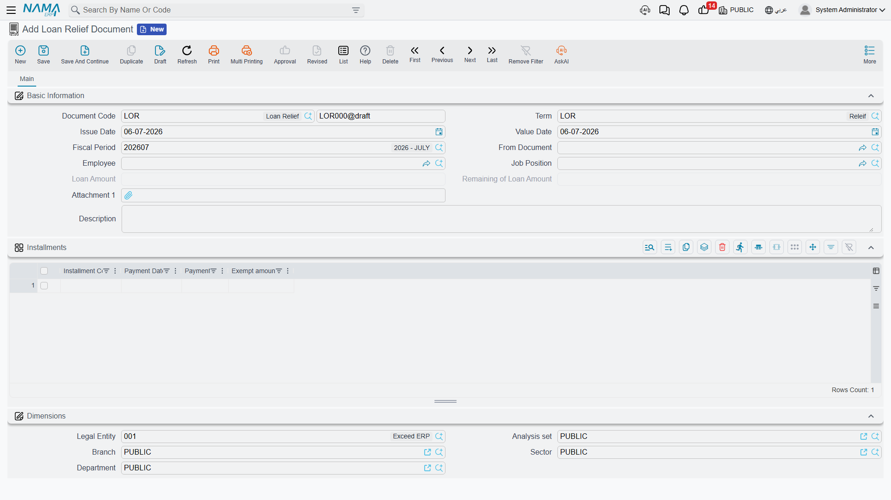
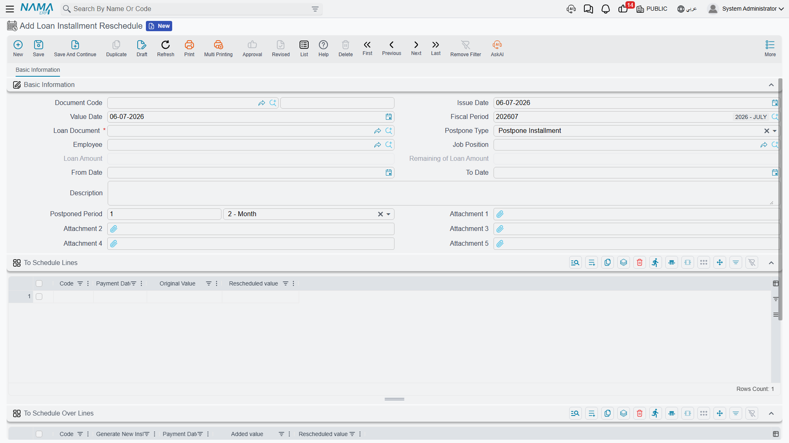

# Loan Adjustments

Once a [Loan Document](hr-loan-documents.md) is running, three separate screens change it without touching the original disbursement: writing part of the balance off, moving installments around in time, and pausing (or resuming) the whole loan. All three point back at the Loan Document they adjust and share its installment schedule.

## Writing off a loan: Loan Relief Document

The **Loan Relief Document** (سند أعفاء سلفة) forgives all or part of an outstanding loan — for example, a hardship write-off, or a final settlement where the remaining balance is cleared instead of collected. It works line-by-line against the loan's own installments, exactly like a payment document, except the amount is relieved rather than paid.

**Where to find it:** Payroll > Loans / Installments > Loan Relief Document.

| Field | Arabic | Notes |
|---|---|---|
| Loan Document | سند سلفة | The loan being relieved. |
| Loan Amount / Remaining Loan Amount | قيمة السلفة / المتبقي من قيمة السلفة | A read-only snapshot of the loan's original amount and what is still outstanding at the moment this document is written. |
| Installment Code (grid) | كود القسط | Which installment line is being relieved. |
| Relief Amount (grid) | الجزء المعفي | How much of that installment is forgiven — can be the full remaining value or only part of it. |

## How it's processed / what it posts

On commit, the Loan Relief Document generates its ledger effect as a background **business request** with a **processing status**, retryable from the **Business Requests** view. Each relieved installment line posts its **Relief Amount** through the debit/credit sides configured on the relief document's own term (التوجيه) — typically debiting a relief/write-off expense account and crediting down the same employee-loans account the original [Loan Document](hr-loan-documents.md) debited, so the receivable is cleared without any further cash movement.

## Rescheduling installments: Loan Installment Reschedule

The **Loan Installment Reschedule** document (سند إعاده جدوله اقساط سلفه) changes *when* — or how — unpaid installments of a loan are collected, without changing the total amount owed or posting anything to the ledger; it is a pure scheduling change. It works in one of two modes, chosen through **Postpone Type** (طريقة جدوله الاقساط):

- **Postpone Installment** (تأجيل) — pick a date range (`From Date`/`To Date`, من تاريخ / إلى تاريخ) and a time period (`Time Period`, الفترة, e.g. one month); every not-yet-paid, not-exempt installment whose payment date falls in that range is simply shifted forward by that period. Nothing about the installment values changes, only their dates.
- **Reschedule Installment** (إعاده جدوله) — pick specific installments to draw value **from** in the **To Schedule Lines** grid (الاقساط المعاد جدولتها) and specific installments to add that value **onto** in the **To Schedule Over Lines** grid (الاقساط الموزع عليها); the two sides must total the same amount. An installment in the second grid can either be one that already exists on the loan, or — by checking **Generate New Installment** (إنشاء قسط جديد) — a brand-new installment line created on the fly with its own payment date.

**Where to find it:** Payroll > Loans / Installments > Loan Installment Reschedule.

::: warning No accounting effect, and irreversible against paid installments
A reschedule only ever touches installments that are still **Not Paid** — it cannot move value into or out of an installment that has already been paid or exempted. Because it changes only dates and the split of remaining value across installments, it never generates a ledger entry; the original loan disbursement entry from the Loan Document is untouched.
:::

## Pausing a loan: Loan Disable Document

The **Loan Disable Document** (سند تعطيل سلفة) pauses (or resumes) automatic and manual recovery of a loan without writing anything off. Checking **Disable Loan** (تعطيل السلفة) marks the loan document and every one of its installments as disabled: the salary engine stops deducting its recovery component, and the loan stops appearing in the picker used to create new [Loan Payment Documents](hr-loan-documents.md#Loan-Payment-Document) against it. Unchecking it (or canceling the document) reverses this and recovery resumes normally.

**Where to find it:** Payroll > Loans / Installments > Loan Disable Document.

| Field | Arabic | Notes |
|---|---|---|
| Loan Document | سند سلفة | The loan being paused or resumed. |
| Disable Loan | تعطيل السلفة | Checked = pause recovery; unchecked = resume it. |
| Loan Amount / Remaining Loan Amount | قيمة السلفة / المتبقي من قيمة السلفة | A read-only snapshot for reference. |

::: tip A loan cannot be paused mid-payment
A loan cannot be disabled if it already has a payment recorded after this document's value date — the pause only makes sense looking forward, not to unwind money already collected. This document generates no accounting entry of its own; it only flips the loan's disabled flag.
:::

## Where this fits

- **[Loan Documents & Payments](hr-loan-documents.md)** — the disbursement and installment schedule every adjustment here works against.
- **[Loan Types](hr-loan-types.md)** — the recovery component and eligibility rules behind the loan being adjusted.
